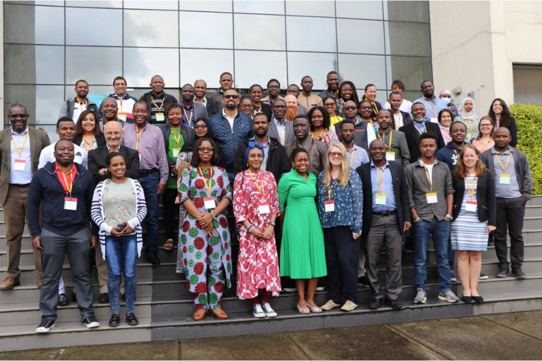

# ESTABLISHING CAPACITY FOR PATHOGEN GENOMICS WORKSHOP

## About the course

This workshop was hosted at the Ethiopian Public Health Insitute in Addis Ababa, Ethiopia and took place on 7-12 May 2023. This in-person workshop consisted of lectures, workshops, knowledge exchange and networking, case studies, world café, individual and group projects and action settings. Over 30 research and healthcare professionals based in 26 African countries attended the workshop. 

The workshop was organised, funded and hosted by COG-Train (a collaboration between Wellcome Connecting Science and Cambridge University),  Africa Centres for Disease Control ([Africa CDC](https://africacdc.org/)) and the Ethiopian Public Health Institute ([EHPI](https://ephi.gov.et/)) and took place in Addis Ababa, Ethiopia on 7-12 May 2023.

This workshop aimed to empower African-based scientists and public health professionals to build capacity for pathogen genomics in research and service delivery in public health. The workshop focused on practical approaches and challenges in establishing genomics capacity, including sequencing and data infrastructure set-up, maintenance and resource management.  An overview of genomics and data analysis pipelines provided participants with a holistic picture from sample collection to interpretation. Participants also benefited from the experience of other experts in the communication of data to enable decision-making in a public health context.  

The tools and strategies developed at this workshop equipped participants with skills to design and develop their own training in pathogen genomics, further strengthening regional capacity, workforce and sustainability. A series of round table and panel discussions enabled participants to share knowledge and strategies for workforce planning, building sustainable models for sequencing and data science, and establishing consortia, networks and mentorship initiatives.

**Target audience**

Research and healthcare professionals based in Africa who are interested in implementing effective strategies for establishing and implementing pathogen genomics and surveillance capacity. Priority will be given to individuals in public health institutions who have started, or are planning to set up, infrastructure and data pipelines for pathogen genomics. Applicants must have some knowledge in genomics, clinical management or public health, and be interested in developing skills to train others.

## Content

_[Workshop booklet](assets/ECPG_Booklet.pdf)_

**Introduction Day**

* [Welcome to the course](assets/ECPG_IntroDay_Slides.pptx.pdf)

**Day 1 - Capacity development overview**
      
* [Session 1 - Developing pathogen genomics capacity](assets/ECPG_D1S1_slides.pptx.pdf)                 
* [Session 2 - Practical approaches: specimen, genomics and data infrastructure](assets/ECPG_D1S2_slides.pptx.pdf)     
* [Session 3 - Practical approaches: translation of genomics into public health intervention](assets/ECPG_D1S3_slides.pptx.pdf)
* [Session 4 - Challenges and opportunities: group action planning](assets/ECPG_D1S4_slides.pptx.pdf)            
* [Session 5 - Design genomics training part 1: training design elements](assets/ECPG_D1S5_slides.pptx.pdf)      
* [Session 6 - Establishing needs for pathogen genomics skills development](assets/ECPG_D1S6_slides.pptx.pdf)       

**Day 2 - Specimen and sequencing**

* [Session 1 - Specimen and data collection and processing](assets/ECPG_D2S1_slides.pptx.pdf)      
* [Session 2 - Molecular microbiology](assets/ECPG_D2S2_slides.pptx.pdf)      
* [Session 3 - Setting up genomic sequencing infrastructure](assets/ECPG_D2S3_slides.pptx.pdf)           
* [Session 4 - Translating to your own context part 1: sample to sequencing](assets/ECPG_D2S4_slides.pptx.pdf)    
      _[Session 4 Toolkit](assets/ECPG_D2_toolkit.xlsx)_        
* [Session 5 - Design genomics training part 2: specimen to sequencing](assets/ECPG_D2S5_slides.pptx.pdf)        

**Day 3 - Data tools and pipelines**

* [Session 1 - Setting up data infrastructure and processes](assets/ECPG_D3S1_slides.pptx.pdf)      
* [Session 2 - Data workflows for analysis and interpretation](assets/ECPG_D3S2_slides.pptx.pdf)      
* [Session 3 - Data science for public health tools](assets/ECPG_D3S3_slides.pptx.pdf)          
* [Session 4 - Translating to your own context - Data](assets/ECPG_D3S4_slides.pptx.pdf)   
      _[Session 4 Toolkit](assets/ECPG_D3_toolkit.xlsx)_        
* [Session 5 - Design genomics training part 3: bioinformatics](assets/ECPG_D3S5_slides.pptx.pdf)            

**Day 4 - Frameworks. guidelines and decision-making**

* [Session 1 - Frameworks and guidelines for pathogen surveillance and genomics](assets/ECPG_D4S1_slides.pptx.pdf)      
* [Session 2 - Ethics for specimen and data sharing](assets/ECPG_D4S2_slides.pptx.pdf)    
* [Session 3 - Building sustainable models](assets/ECPG_D4S3_slides.pptx.pdf)        
* [Session 4 - Communication of genomics data and public health decision-making](assets/ECPG_D4S4_slides.pptx.pdf)                     

**Day 5 - Projects, networks and action plan**

* [Session 1 - Group projects](assets/ECPG_D5S1_slides.pptx.pdf)      
* [Session 2 - Networking and mentorship](assets/ECPG_D5S2_slides.pptx.pdf)      
* [Session 3 - Course wrap-up](assets/ECPG_D5S3_slides.pptx.pdf)        

## Organisers

Abebe Asefa, Ethiopian Public Health Insitute, Ethiopia          
Alice Matimba, Wellcome Connecting Science, United Kingdom        
Harris Onywera, Africa CDC Insitute of Pathogen Genomics, Ethiopia            
Jorge Batista da Rocha, Wellcome Connecting Science, United Kingdom      
Leigh Jackson, University of Exeter, United Kingdom      
Liã Bárbara Arruda, Wellcome Connecting Science, United Kingdom      
Melanie Sharpe, Wellcome Connecting Science, United Kingdom      
Treasa Creavin, Wellcome Connecting Science, United Kingdom   

## Facilitators

Amadou Diallo, Institut Pasteur de Dakar, Senegal               
Aquilla Kanzi, African Society for Laboratory Medicine, Ethiopia                  
Brenda Kwambana, Malawi Liverpool Wellcome Trust, Malawi              
Fatma Guerfali, Institut Pasteur de Tunis, Tunisia         
Fatuma Guleid, Kenya Medical Research Institute, Kenya     
Francis Chikuse, Africa Centre for Disease Control and Prevention, Ethiopia            
George Githinji,  Kenya Medical Research Institute, Kenya            
Harris Onywera, Africa CDC Insitute of Pathogen Genomics, Ethiopia          
John Tembo, HerpeZ, Zambia               
Jonathan Emmanuel Chukwuemeka, Institute of Human Virology, Nigeria          
Kareemah Suleiman, Institute of Human Virology, Nigeria               
Kirsty Lee Garson, University of Cape Town, South Africa           
Linzy Elton, University College London, United Kingdom              
Luria Leslie Founou, CEDBCAM-RI, Cameroon         
Sam Oyola, International Livestock Research Institute, Kenya             
Shavanthi Rajatileka, Wellcome Sanger Insitute, United Kingdom 
Stanford Kwenda, National Institute for Communicable Diseases, South Africa              
Tapfumanei Mashe, National Microbiology Research Laboratory, Zimbabwe              

<! -- ## Guest speakers**

Alan Christofels, Public Health Alliance for Genomic Epidemiology, South Africa               
Dawit Wolday, Ethiopian Public Health Institute, Ethiopia        
Getachew Tollera, Ethiopian Public Health Institute, Ethiopia           
Messay Hailu, Ethiopian Public Health Institute, Ethiopia          
Mohammed Rameto, Ethiopian Public Health Institute, Ethiopia              
Saro Abdella, Ethiopian Public Health Institute, Ethiopia         -->  
  
## Course statistics     
             
**Number of participants:** 30 from 25 African countries         
**Number of facilitators:** 26 from 9 countries      

******
Any reuse of the course materials is encouraged with due acknowledgement.

## License
 This work is licensed under a <a rel="license" href="http://creativecommons.org/licenses/by/4.0/">Creative Commons Attribution 4.0 International License</a>.

<!-- ## How to cite    -->     
