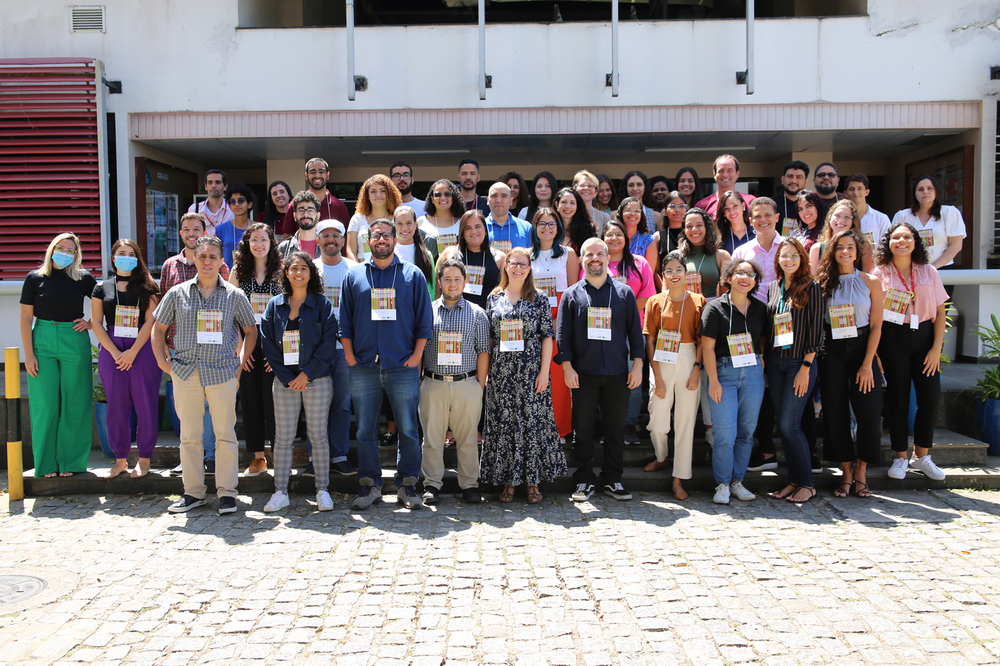

# BIOINFORMÁTICA DECODIFICADA: A JORNADA DO INICIANTE À GENÔMICA DE PATÓGENOS

# About the course

Bioinformatics is an intersection between biology, computer science and statistics. In this course, you will learn the first steps to learning basic bioinformatics.

The importance of statistics in bioinformatics is emphasized throughout the course, preparing students to understand the logic of the programming language and interpret the data obtained. In addition, we will discuss the importance of data quality in achieving meaningful results.

This course emphasizes the importance of critical thinking, encouraging a deeper understanding of command lines and critical thinking in choosing tools for data analysis. We will also discuss troubleshooting techniques, focusing on understanding the "whys" instead of just reproducing methodologies.

The course was taught in Portuguese. A total of 40 participants attended the course between 30 October - 1 November 2023 at the Instituto Gonçalo Moniz, Fiocruz-BA in Salvador, Brazil. 

**Target audience**

This course is targeted at students, researchers and professionals dedicated to pathogen genomics research but who are still beginners in analyses using bioinformatics. Candidates must have a basic knowledge of logic and mathematical equations, biostatistics and, and informatics. In addition, knowledge of molecular biology techniques (sequencing and genomics of pathogens).

**Learning outcomes**

* Identify and describe the essential elements involved in the sample preparation stage for sequencing.              
* Recognize the data that requires bioinformatics processing from the sequencing results.
* Interpret the structure of basic command lines in the application of pathogen genomics analyses.
* Identify the available bioinformatics tools to properly apply them in genomic data analysis.
* Design an analysis pipeline based on available bioinformatics tools including the necessary steps for analysis.

# Course material

The course material is available in Portuguese only

[Course material repository](https://github.com/khourious/IGM-TRAIN)           
[Course lectures - YouTube playlist](https://youtube.com/playlist?list=PL51nPOKxSjqgqaxipmHRNvZwrAxHc_1u7&feature=shared)

# Training team

[Andrêza Alencar](http://lattes.cnpq.br/6060587704569605), Universidade Federal Rural de Pernambuco, Brazil               
[Gabriel Carvalho](https://lattes.cnpq.br/4456457687905570), Fundação Oswaldo Cruz - Instituto Gonçalo Moniz, Brazil                   
[Izabela Jesus](http://lattes.cnpq.br/0672249529836634), Fundação Oswaldo Cruz FIOCRUZ - Instituto Gonçalo Moniz, Brazil               
[Joyce Silva](http://lattes.cnpq.br/0672249529836634), Fundação Oswaldo Cruz - Instituto Gonçalo Moniz, Brazil               
[Laise de Moraes](http://lattes.cnpq.br/7097758558494370), Fundação Oswaldo Cruz - Instituto Gonçalo Moniz, Brazil         
[Luciane Amorim Santos](http://lattes.cnpq.br/5234646852674978), Fundação Oswaldo Cruz - Instituto Gonçalo Moniz, Brazil                
[Maria Santana](http://lattes.cnpq.br/5525773652112511), Fundação Oswaldo Cruz - Instituto Gonçalo Moniz, Brazil               
[Ricardo Khouri](http://lattes.cnpq.br/9908602398727888), Fundação Oswaldo Cruz - Instituto Gonçalo Moniz, Brazil             
[Robson Francisco de Souza](http://lattes.cnpq.br/0008899757720949),Universidade de São Paulo, Instituto de Ciências Biomédicas, Brazil              
[Sara Nunes](http://lattes.cnpq.br/5594266589559004), Fundação Oswaldo Cruz - Instituto Gonçalo Moniz, Brazil                
[Thayná Gonzalez](http://lattes.cnpq.br/9477783971608307), Fundação Oswaldo Cruz - Instituto Gonçalo Moniz, Brazil               
[Túlio Campos](http://lattes.cnpq.br/1367273895160398), Fundação Oswaldo Cruz - Instituto Aggeu Magalhães, Brazil             
 
**Organisers**

[Laise de Moraes](http://lattes.cnpq.br/7097758558494370), Fundação Oswaldo Cruz - Instituto Gonçalo Moniz, Brazil             
[Ricardo Khouri](http://lattes.cnpq.br/9908602398727888), Fundação Oswaldo Cruz - Instituto Gonçalo Moniz, Brazil                
[Liã Bárbara Arruda](http://lattes.cnpq.br/6247495194627118), Wellcome Connecting Science, United Kingdom                     
Jorge Batista da Rocha, Wellcome Connecting Science, United Kingdom               

**Translation**

[Gabriel Carvalho](https://lattes.cnpq.br/4456457687905570), Fundação Oswaldo Cruz - Instituto Gonçalo Moniz, Brazil                    
[Liã Bárbara Arruda](http://lattes.cnpq.br/6247495194627118), Wellcome Connecting Science, United Kingdom               

# Resources

**Bilingual templates**

[Course summary](assets/Course_summary_template.docx)

[Course planner](assets/Course_summary_template.docx)

**Translation procedures**

[POP Tradução de material didático Inglês-Português](assets/POP_PT-BR.pdf)

[SOP Translation educational material Portuguese-English](assets/SOP_EN-GB.pdf)

******
Any reuse of the course materials is encouraged with due acknowledgement.

## License
 This work is licensed under a <a rel="license" href="https://creativecommons.org/licenses/by-nc-sa/4.0/deed.en">Creative Commons Attribution-NonComecial-ShareAlike 4.0 International License</a>.

## How to cite 

de Moraes, L., de Lima Campos, T., de Souza, R. F., Alencar, A., Santos, L. A., Khouri, R., & COG-Train. (2023). Bioinformática Decodificada: A Jornada do Iniciante à Genômica de Patógenos. Zenodo. https://doi.org/10.5281/zenodo.10694144

