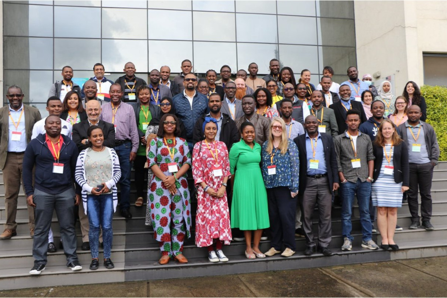

# Establishing Capacity for Pathogen Genomics

**About the course**

This workshop was by the Ethiopian Public Health Insitute in Addis Ababa, Ethiopia and took place on 7-12 May 2023. The in-person workshop consisted of lectures, workshops, knowledge exchange and networking, case studies, world café, individual and group projects and action settings. Over 30 research and healthcare professionals based in 26 African countries attended the workshop. 

**Topics**

This workshop included the following topics:

* Practical approaches to establishing genomics and data infrastructure           
* Data workflows, analysis and interpretation            
* Pathogen genomics application in local and global contexts            
* Data collection, linkage and integration            
* Communication of data and public health decision-making             
* Effective methods, tools, and resources for training others in pathogen genomics            
* Building a sustainable model for sequencing capacity and data science             
* Establishing workforce capacity for pathogen genomics           
* Frameworks for genomic surveillance for research and public health practice skills training             
* Consortium, network establishment and mentorship              

**Training team**

_Instructors and facilitators:_

Amadou Diallo, Institut Pasteur de Dakar, Senegal
Aquilla Kanzi, African Society for Laboratory Medicine, Ethiopia
Brenda Kwambana, Malawi Liverpool Wellcome Trust, Malawi
Fatma Guerfali, Institut Pasteur de Tunis, Tunisia
Fatuma Guleid, Kenya Medical Research Institute, Kenya
Francis Chikuse, Africa Centre for Disease Control and Prevention, Namibia        
George Githinji,  Kenya Medical Research Institute, Kenya            
Harris Onywera, Africa CDC Insitute of Pathogen Genomics, Ethiopia          
John Tembo, HerpeZ, Zambia               
Jonathan Emmanuel Chukwuemeka, Institute of Human Virology, Nigeria          
Kareemah Suleiman, Institute of Human Virology, Nigeria               
Kirsty Lee Garson, University of Cape Town, South Africa           
Linzy Elton, University College London, United Kingdom              
Luria Leslie Founou, CEDBCAM-RI, Cameroon         
Sam Oyola, International Livestock Research Institute, Kenya             
Stanford Kwenda, National Institute for Communicable Diseases, South Africa              
Tapfumanei Mashe, National Microbiology Research Laboratory, Zimbabwe

_Honorable guest speakers:_

Alan Christofels, Public Health Alliance for Genomic Epidemiology, South Africa        
Dawit Wolday, Ethiopian Public Health Institute, Ethiopia      
Getachew Tollera, Ethiopian Public Health Institute, Ethiopia          
Mebratu Messebo, Ethiopian Public Health Institute, Ethiopia          
Messay Hailu, Ethiopian Public Health Institute, Ethiopia          
Mohammed Rameto, Ethiopian Public Health Institute, Ethiopia       
Naod Wendrad, Ministry of Health, Ethiopia         
Saro Abdella, Ethiopian Public Health Institute, Ethiopia           

_Organisers:_

Abebe Asefa, Ethiopian Public Health Insitute, Ethiopia          
Alice Matimba, Wellcome Connecting Science, United Kingdom           
Jorge Batista da Rocha, Wellcome Connecting Science, United Kingdom      
Leigh Jackson, University of Exeter, United Kingdom      
Liã Bárbara Arruda, Wellcome Connecting Science, United Kingdom      
Melanie Sharpe, Wellcome Connecting Science, United Kingdom      
Shavanthi Rajatileka, Wellcome Sanger Insitute, United Kingdom         
Treasa Creavin, Wellcome Connecting Science, United Kingdom      
 

# Bioinformática Decodificada: A Jornada do Iniciante à Genômica de Patógenos

**Decodified Bioinformatics: the beginner’s journey into pathogen genomics**

This is a learning-by-doing bilingual pilot approach in collaboration with Instituto Gonçalo Moniz FIOCRUZ-BA. In this initiative, the hosts and instructors work with the COG-Train education developers to deliver a bioinformatics course for beginners course in Portuguese. 

In this approach, administrative and organisational documentation is provided in both English and Portuguese, while the course is delivered in the native language of the Brazilian audience. 

**Topics**

The course will include the following topics:

* Basic concepts in pathogen genomics       
* Command line logic        
* Basic concepts of statistics for bioinformatics         
* How to obtain high-quality data and why it is important          
* Applications of bioinformatics in pathogen genomics           
* Critical assessment of available analysis tools and resources            

**Training team**

_Instructors and facilitators_

Andrêza Leite, Universidade Federal de Pernambuco, Brazil
Laise de Moraes, Instituto Gonçalo Moniz, Fundação Oswaldo Cruz, Brazil
Luciane Amorim, Instituto Gonçalo Moniz, Fundação Oswaldo Cruz e Escola Bahiana de Medicina e Saúde Pública, Brazil
Ricardo Khouri, Instituto Gonçalo Moniz, Fundação Oswaldo Cruz, Brazil
Robson de Souza, Universidade de São Paulo, Brazil
Túlio Campos, Instituto Aggeu Magalhães, Fundação Oswaldo Cruz, Brazil

_Education developers and advisers_

Liã Bárbara Arruda, Wellcome Connecting Science, United Kingdom          
Jorge Batista da Rocha, Wellcome Connecting Science, United Kingdom         

