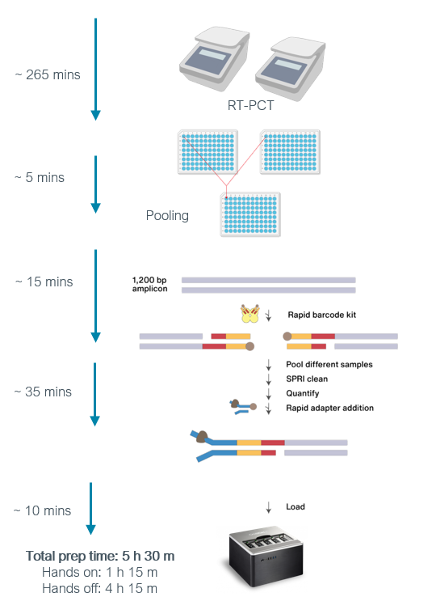
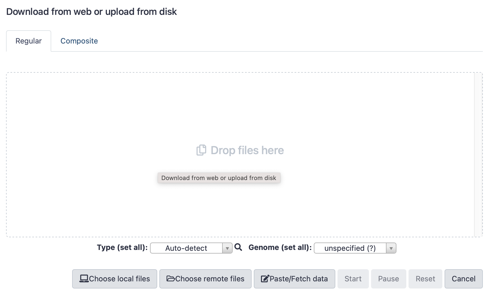

<!-- external link | images  | youtube link (width="840" height="472") | assets-->

# INTRODUCTION TO VIRAL GENOMICS

        
@Canva

# Glossary
<!-- 1-4 -->       

* **Adaptors:** a short chemically synthesised single or double-strand DNA (oligonucleotide) used in some sequencing methodologies that allow the addition of a DNA barcode or other oligonucleotides downstream of an unknown or amplified DNA strand.            
* **Amplicon:** a DNA fragment that has been amplified using polymerase chain reaction (PCR) or a method that results in the generation of multiple copies of that fragment.             
* **A-tailing:** an enzymatic reaction to add a sequence of adenines at the 3’-terminus of a DNA fragment for sequencing purposes.     
* **BAM:** Binary version of a SAM file format.    
* **Barcoding:** addition of a tag of known DNA sequence (barcode) to an amplified DNA strand that permits sequencing multiple samples in parallel, and stratifying sample data informatically post/during sequencing.         
* **cDNA:** complementary DNA, a DNA molecule synthesised from an RNA molecule.             
* **COVID-19:** coronavirus disease 2019.         
* **DNA:** deoxyribonucleic acid is an information molecule forming the “base code” for a living organism.          
* **Enzyme:** a protein able to catalyse, i.e. accelerate chemical reactions.                      
* **Exome:** part of genome composed of exons, i.e. the sequences that will be transcribed and translated into proteins.  
* **FASTA:** text-based format for representing nucleotide or peptide sequences, with base pairs or amino acids represented by single-letter codes.
* **PCR:** polymerase chain reaction (PCR) is a laboratory technique for rapidly making (amplifying) millions to billions of copies of a given section of DNA, which may then be analysed further.          
* **Primer:** a short chain of oligonucleotides used to target and ‘prime’ the initiation of DNA replication.           
* **Protein translation:** is the process of synthesising proteins from a transcript.        
* **NGS:** next-generation sequencing, a high throughput sequencing methodology.        
* **Nucleotides:** the individual subunits that form DNA and RNA molecules.         
* **RNA:** ribonucleic acid, an information molecule, can be the “base code” for viruses.       
* **SAM:** sequence alignment/map format. It is a TAB-delimited text format that holds information from sequence alignment. 
* **SARS-CoV-2:** severe acute respiratory syndrome coronavirus 2.        
* **SNP:** single-nucleotide polymorphism is a nucleotide substitution in a specific position of the genome. It is identified when compared to a reference sequence.          
* **Sonication:** is a technique that applies sound energy to a sample at a specific amplitude. In molecular biology, it is commonly used for fragment DNA fragmentation.       
* **Transcription:** is the process of copying a segment of DNA into RNA.       
* **Trimming:** in bioinformatics, it is the process of removing the ends of the reads, leaving only a region of high-quality bases and those relating to the sample, not the sequencing chemistry or DNA barcoding.           
* **VCF:** variant call format, is the plain text file format that holds gene sequence variations.  
* **Viral replication:** is the mechanism in how viruses propagate during the infection cycle, it is the process of virus multiplication.          
* **Viral genome variant:** a virus that has one or more mutations in its genome.                    
* **Whole-genome sequencing (WGS):**  is the method of determining the entirety, or almost the entirety, of an organism's genomic DNA sequence all at once. This entails sequencing all of an organism's chromosomal DNA, as well as, DNA found in mitochondria and, in plants, chloroplasts.            

[Download the PDF here](assets/OC3_glossary.pdf)

# Frequently asked questions
<!-- 1-5 -->    

**Galaxy questions**            

_Question 1: I cannot change the name of my history in Galaxy._             
Please make sure that you are logged in. If you click on the “User” tab at the top, you should see “Logged in as [your_username]”           

_Question 2: I cannot find the tool you are referring to in Galaxy._                   
Please make sure that you are logged in to the correct Galaxy instance. There are many Galaxy instances such as: [https://usegalaxy.eu/](https://usegalaxy.eu/), [https://usegalaxy.org/](https://usegalaxy.org/), [https://africa.usegalaxy.eu](https://africa.usegalaxy.eu,), and they do not all have the same tools.            

**Mapping**

_Question 1: Is mapping and aligning to a reference genome the same?_                     
They are often used interchangeably because they are often used for the same purpose. But with mapping, we are trying to find the approximate origin/location of a sequence. With alignment, we aim to find the exact differences between two sequences. 

_Question 2: What is a read?_                      
After sending your DNA/RNA sample to the sequencing facility, your sample gets fragmented into many small fragments so that the sequencing machine can handle it. These fragments are then copied and a camera takes an image of each nucleotide, producing a stretch of letters ACGT. This stretch of letters represents the nucleotides that were present in your fragmented piece of DNA. This is also called a read.

**Variant calling**

_Question 1: Is there a difference between variant calling and variant annotation?_                  
Variant calling is simply calling the position where a nucleotide(s) differs from a reference genome. It also tells us how it is different, by telling us which nucleotide was present in the reference genome and how your sample differs. With variant annotation, we show the potential downstream effect of that mutation. For example, if it was an SNP, was it synonymous/non-synonymous. Did a mutation lead to a stop-loss, a frame-shift etc?

[Download the PDF here](assets/OC3_1-5_FAQ.pdf)

# SARS-CoV-2 replication cycle
<!-- 1-7 -->     

<!-- YT https://youtu.be/6M6zItfVLkE -->      
<iframe width="840" height="472" src="https://www.youtube.com/embed/6M6zItfVLkE" title="YouTube video player" frameborder="0" allow="accelerometer; autoplay; clipboard-write; encrypted-media; gyroscope; picture-in-picture; web-share" allowfullscreen></iframe>

[Download the transcript here](assets/OC3_1-7_transcript.pdf)

[Download the presentation slides here](assets/OC3_1-7_slides.pdf)

In this video, you will be guided through the SARS-CoV-2 replication cycle. You will learn how the [virus enters the cells and cause disease](https://pubmed.ncbi.nlm.nih.gov/34987123/) and details of [how the virus makes copies of itself to infect other cells](https://doi.org/10.1038/s41579-020-00468-6).

# SARS-CoV-2 genomic landscape
<!-- 1-8 -->      

All of us have been impacted in some way by SARS-CoV-2 (severe acute respiratory syndrome coronavirus 2). You are likely to be familiar with a city in China that you never heard of before the pandemic, Wuhan - [where this virus was isolated in 2019](https://doi.org/10.1016/j.rceng.2020.03.001).

[SARS-CoV-2 is a single-stranded RNA virus of ~30 Kb (positive sense)](https://doi.org/10.3389/fmicb.2020.01818) (Figure 1).  Despite being incredibly small, compared to the human genome, which is approximately [6 Gbp](https://www.nature.com/articles/s41587-020-0719-5), SARS-CoV-2 is the [largest known RNA virus](https://www.ncbi.nlm.nih.gov/books/NBK554776/). SARS-CoV-2 has a crown-like shape which contains four main structural proteins, namely the: spike (S), envelope (E) glycoprotein, nucleocapsid (N), membrane (M) protein, along with 16 nonstructural proteins, and 5-8 accessory proteins. 

We are interested in the structure of a virus/organism because it gives us information about how the virus is able to shed, spread, infect and subsequently [cause disease (pathogenesis)](https://www.ncbi.nlm.nih.gov/books/NBK554776/).
 

_Source: [Frontiers](https://doi.org/10.3389/fmicb.2020.01818)_

[Click here to enlarge the image](images/OC3_1-8_Fig1.jpeg)

[Download Figure 1 alt-text here](images/OC3_W1_Fig1-2_alt-text.pdf)

The [accessory proteins](https://doi.org/10.2174/1566524021666210223143243) participate in the viral replication, assembly and in virus-host interactions.

The [non-structural proteins](https://doi.org/10.2174/1566524021666210223143243) are like maintenance workers which act as enzymes, coenzymes, and binding proteins to facilitate the replication, transcription, and translation of the virus.

Finally, the [structural proteins](https://doi.org/10.2174/1566524021666210223143243) are essential for the host cells' binding and invasion. The 3D shape of a spike protein is shown in Figure 2 below. This protein allows the virus to enter human cells by [binding to human ACE receptors](https://doi.org/10.2174/1566524021666210223143243) in the respiratory epithelium. [This article](https://www.ncbi.nlm.nih.gov/pmc/articles/PMC5457962/) provides a detailed explanation of this process.

_Source:  [StatPearls Publishing LLC](https://www.ncbi.nlm.nih.gov/books/NBK554776/figure/article-52171.image.f5/)_

[Click here to enlarge the image](images/OC3_1-8_Fig2.jpeg)

[Download Figure 2 alt-text here](images/OC3_W1_Fig1-2_alt-text.pdf)
       

The spike proteins are also frequently the site of mutations, resulting in [diverse new variants](https://www.ncbi.nlm.nih.gov/books/NBK554776/).  [Mutations are natural random events](https://doi.org/10.1016/j.yamp.2021.06.006) which occur in viruses during replication. A variant has one or more mutations that may allow it to be distinct in its transmissibility, virulence, pathogenicity or response to vaccines. Currently, variants have been grouped into four different categories which are: a [Variant of Interest (VOI), a Variant Being Monitored (VBM), a Variant of High Consequence (VOHC) and a Variant of Concern (VOC)](https://www.cdc.gov/coronavirus/2019-ncov/variants/variant-classifications.html). [This article](https://doi.org/10.1146/annurev-virology-110615-042301) provides a detailed explanation of this process and you can read more about these proteins in [here](https://doi.org/10.3390/cells10040821)

A [VOC usually contributes to outbreaks](https://doi.org/10.1128/jvi.02077-21) due to its increased transmission fitness and/or immune evasion ability. The most notable VOCs are currently called [Alpha, Beta, Gamma and Delta](https://doi.org/10.1016/j.yamp.2021.06.006); firstly described in the United Kingdom, South Africa, Brazil and India, respectively. The latest and most transmissible variant has been labelled Omicron, which was also first reported in [South Africa](https://doi.org/10.1128/jvi.02077-21). The location of where variants are first described is highly linked to the amount and quality of genomic surveillance occurring in a particular country. We can only find variants if we are looking for them at a genomic level.

[The CDC’s website](https://www.cdc.gov/coronavirus/2019-ncov/variants/variant-classifications.html) has up-to-date information to keep you abreast of the range of variants.

Mutations may also lead to the formation of new [lineages](https://www.bioserendipity.com/defining-a-new-strain-of-a-virus/). Lineages are described as being a genetically closely related group of viral variants which are derived from a common ancestor. Tracking lineages informs us of outbreaks and of the spread of a virus in a community or within populations.

[Zoonotic coronaviruses](https://www.nature.com/articles/nm.3985) have caused several outbreaks over the last two decades and many of the coronaviruses present in other mammals have the potential to infect humans. Therefore our continuous efforts to understand [the origins and evolution of SARS-CoV-2](https://doi.org/10.1038/s12276-021-00604-z) will remain critical.

**Further reading**

[Features, Evaluation, and Treatment of Coronavirus (COVID-19)](https://www.ncbi.nlm.nih.gov/books/NBK554776/)

[CDC Coronavirus Disease 2019 (COVID-19)](https://www.cdc.gov/coronavirus/2019-ncov/variants/variant-classifications.html)

[Defining a New Strain of a Virus](https://www.bioserendipity.com/defining-a-new-strain-of-a-virus/)

[Omicron: What Makes the Latest SARS-CoV-2 Variant of Concern So Concerning?](https://doi.org/10.1128/jvi.02077-21)

[The Genomic Landscape of Severe Acute Respiratory Syndrome Coronavirus 2](https://doi.org/10.1016/j.yamp.2021.06.006)

[SARS-CoV-2 Proteins: Are They Useful as Targets for COVID-19 Drugs and Vaccines?](https://doi.org/10.2174/1566524021666210223143243)

[Public Health Responses to COVID-19 Outbreaks on Cruise Ships — Worldwide, February–March 2020](https://doi.org/10.15585/mmwr.mm6912e3)

[COVID-19, a worldwide public health emergency](https://doi.org/10.1016/j.rceng.2020.03.001)

[Antivirals Against Coronaviruses: Candidate Drugs for SARS-CoV-2 Treatment?](https://doi.org/10.3389/fmicb.2020.01818) 

[On the origin and evolution of SARS-CoV-2](https://doi.org/10.1038/s12276-021-00604-z)

[Aerosol and Surface Stability of SARS-CoV-2 as Compared with SARS-CoV-1](https://doi.org/10.1056/NEJMc2004973)

[Relationship between the ABO Blood Group and the COVID-19 Susceptibility](https://doi.org/10.1101/2020.03.11.20031096)

# Overview of genomic, sub-genomic and anti-genomic sequences
<!-- 1-9 -->     

During the lifecycle of SARS-CoV-2, varying genomic sequences contribute toward the creation of new virions. These virions (small, membrane-bound particles containing viral RNA) are formed within the infected host cell machinery, leading to a persisting infection whereby it is not cleared by the immune system and enables further host-cell entry. These genomic sequences can be categorised for simplicity into three key groups: genomic sequences, sub-genomic sequences and anti-genomic sequences.

**Genomic sequences**

Genomic sequences, known as gRNA, consist of all of the genetic information needed to encode SARS-CoV-2 and its associated proteins. The organisation of this information varies between different viruses to generate different ‘classes’. SARS-CoV-2 is classed as a positive-sense single-stranded RNA virus, similar to that of common cold viruses where the genome is organised as a single contiguous RNA genome. This class of viruses produces unique sub-genomic RNA sequences as part of their life cycle (discussed below). The SARS-CoV-2 genome is 5′-capped and has 29,870 bases and a 3′ poly(A) tail of variable length. It encodes at least 13 recognised open reading frames (ORFs), each of which contains regions with specific functions key to the virus’ transcription, translation and replication. [The coding elements of gRNA are hugged by a 5′ untranslated region (UTR) (265 nucleotides) and a 3′ UTR (337 nucleotides)](https://doi.org/10.1038/s41580-021-00432-z).

When a host cell is infected, [gRNA synthesis](https://doi.org/10.3390/cells9051267) occurs in double membrane-bound organelles (replicative organelles) within the cell. Utilising the original gRNA from the entered virion, the replicative-transcription complex (RTC) creates more gRNA sequences. This is achieved through anti-genomic sequences. These are complementary to the original viral genome and are created by the RTC to act as a minus-strand template. The minus-strand template then utilises complementary base pairing to form new positive-strand RNA sequences for new gRNA.

**Anti-genomic sequences**

Before new gRNA synthesis occurs, the anti-genome is created in these new replicative organelles – these are virally-induced membranes. The anti-genome is a full-length complement to the original gRNA and acts as the template for synthesis of the [new gRNAs](https://doi.org/10.1038/s41580-021-00432-z). After ‘transcription’ using the anti-genomic sequences, new gRNA can take one of three paths. The first could lead to the new gRNA being used to create new enzymes and accessory proteins key to viral replication within the cell. The second path is creating more new gRNAs. The third is that the gRNA could acquire a nucleocapsid shell, then a lipid bilayer membrane to form a new virion before [leaving the cell](https://doi.org/10.1038/s41580-021-00432-z) (Figure 3).

_Source: [Nature](https://doi.org/10.1038/s41580-021-00432-z)_

[Click here to enlarge the image](images/OC3_1-9_Fig1.png)

[Download Figure 3 alt-text here](images/OC3_1-9_Fig3_alt-text.pdf)

**Sub-genomic sequences**

[Sub-genomic RNA sequences](https://doi.org/10.1038%2Fsj.emboj.7601931) are a unique feature of positive-sense RNA viruses. These are produced by the discontinuous transcription of virion structural genes during active replication and result in the formation of rearranged template sequences that are not found in juxtaposition in the native RNA genome of the virus. The gRNA sequences found for these proteins are what is looked for in COVID-19 tests.

Whilst the anti-genome is being generated in replicative organelles, these smaller, minus-strand sgRNAs are also produced. These then originate a nested group of sg-mRNAs which are fundamental in the synthesis of structural proteins necessary for virion packaging, consisting of the membrane, spike, nucleocapsid and envelope proteins. The nucleocapsid protein in particular is acquired by newly formed gRNAs before being able to [form a new virion](https://doi.org/10.1038/s41580-021-00432-z) (Figure 3).

These sub-genomic sequences provide unique opportunities for the virus, mainly by enabling greater functionality out of a smaller original genomic sequence. They also present opportunities for tackling the pandemic. Sub-genomic RNAs are [only present for virion formation](https://doi.org/10.1016/j.ijid.2021.12.312) during an active infection. As such, [evidence from the University of Exeter](https://doi.org/10.1038/s41586-020-2196-x) showed they can be used to better track the infectivity and disease duration with SARS-CoV-2 infection, compared to the current wide-scale testing approaches. 

# Introduction to sequencing methods 
<!-- 1-10 -->     

The genomic era was propelled forward by DNA sequencing techniques pioneered by numerous scientists in the 1970s. Fredrick Sanger developed the "chain-termination method", now known as the “Sanger method”, in 1977. 

This method is based on a polymerase chain reaction (PCR) using labelled modified nucleotides (ddNTPs) that lead to a premature termination of the DNA chain extention. The result of chain-termination PCR is a considerable number of oligonucleotide copies of the DNA sequence of interest, terminated at random lengths by ddNTPs to be ordered in size using gel electrophoresis. The shortest fragment must terminate at the first nucleotide from the 5' end, the second-shortest fragment must terminate at the second nucleotide from the 5' end, and so on. As a result, by interpreting the gel bands from smallest to largest, the original DNA strand 5' to 3' sequence can be determined. The Sanger method recognizes up to 1000 bp DNA sequences in less than 2 hours. These findings epitomise what we now know as first-generation sequencing technologies. Watch the following video for details of the Sanger sequencing method. 

<!-- YT https://www.youtube.com/watch?v=dVRB4CaLizc -->    
<iframe width="840" height="472" src="https://www.youtube.com/embed/dVRB4CaLizc" title="YouTube video player" frameborder="0" allow="accelerometer; autoplay; clipboard-write; encrypted-media; gyroscope; picture-in-picture; web-share" allowfullscreen></iframe>

This video is hosted by a third party

The next-generation methods used highly parallel sequencing approaches that were faster and cheaper (per base) with the ability to sequence hundreds of thousands to billions of DNA fragments per run. This may not always be the most efficient option however and will depend on what is being sequenced. Below we will describe the most commonly used Next-Generation Sequencing (NGS) technologies available.

**Illumina Sequencing**

After DNA is isolated, it is fragmented generally with physical (sonication) or enzymatic (Endonuclease-based) methods. A single adenine base is added to form an overhang via an A-tailing reaction onto the 3’ end. This allows adapters containing a single thymine-overhanging base to pair with the DNA fragments. The adapters are complementary to primers that are surface-bound to nano wells that help space out the genomic fragments and prevent overcrowding. Such primers act as anchors for the DNA fragments on both ends, forming a “bridge”. Bridge amplification is done by the polymerase generating  two-stranded bridges. The two strands are separated, leaving a cluster of single-strand fragments. Fluorescently-labelled NTPs (dNTPs) are added to the single strands by the polymerase causing the elongation, the fluorophore blocks the synthesis preventing any other dNTP to bind. Every time a dNTP is bound to the strand, the computer records the colour of the fluorophore, and then the fluorophore is removed to allow synthesis to continue. The process is repeated until the sequence of the DNA fragment is obtained. 

**Ion Torrent**

The Ion torrent technology is similar to Illumina but it differs in the way that fragments are added to microbeads and instead of recording a fluorophore, the addition of NTPs is identified with a voltage change in the cell measuring the pH change. Illumina and Ion torrent both have short read lengths (75-300bp with Illumina and 200-400bp with IonTorrent), but IonTorrent runs for only 2 hours compared to up to 56 hours with Illumina and has cheaper equipment. Illumina, on the other hand, has a lower error rate and a lower cost per base.

**PacBio**

This technology works with single-molecule real-time sequencing and uses nanocontainers with only one DNA molecule per hollow cylindrical well of 20 nm.  The DNA molecule has to be prepared in a way that hairpin adapters are added to it to allow continuous circular sequencing. Once in the nanowell, dNTPs are incorporated one by one and the computer records the change of colour of each well. This technology yields long-read sequencing of more than 10 Kb with few systematic errors. It is ideal for de-novo assembly or long-range genomic structures. On the other hand, it also has a high single-pass error rate, to address this, coverage needs to be increased, resulting in an increase in cost and time, though even this extended time is still comparable to Illumina. 

**Oxford Nanopore Technology**

Oxford Nanopore Technology (ONT) utilises nanopores through which a single-stranded DNA will pass. The nanopores are embedded in a membrane and a change of voltage is registered for each nucleotide in the strand that goes through the pore. It has unique features, like the ability to use a portable sequencer to bring to places that are hard to access; this makes it attractive since it facilitates viral genomic surveillance. Real-time sequencing also allows laboratories to stop when there is sufficient data. Using shorter amplicons and high mapping help to reduce the single pass error rate.

**Further reading**

[Sanger Sequencing protocol](https://www.sigmaaldrich.com/MX/es/technical-documents/protocol/genomics/sequencing/sanger-sequencing)                    
  
[DNA sequencing](https://www.khanacademy.org/science/ap-biology/gene-expression-and-regulation/biotechnology/a/dna-sequencing)                         

[WHO Guideline on SARS-CoV-2 genome sequencing](https://www.who.int/publications/i/item/9789240018440)
  

# How is SARS-CoV-2 sequencing done?
<!-- 1-11 -->     

There are many sequencing technologies used for SARS-CoV-2 (Figure 4). Below, we will approach a broadly used protocol based on viral whole-genome sequencing (WGS). The method consists of viral RNA isolation, Library preparation, Sequencing run and Analysis. 

![Methods for SARS-CoV-2 genome sequencing. a) In Illumina’s Nextera DNA Flex Enrichment protocol cDNA is tagmented and made into barcoded sequencing libraries, which are then enriched using sequence capture with a respiratory virus panel containing probes against SARS-CoV-2. b) In the ARTIC protocol, first-strand cDNA is enriched by amplifying with two pools of primers to generate amplicons tiling the SARS-CoV-2 genome. These amplicons are then subjected to either Illumina or Oxford Nanopore library preparation, using methods that either directly add adapters to the ends of the amplicons or to fragment them to enable sequencing on a wider variety of Illumina instruments. c) The tailed amplicon approach, developed here, enriches first-strand cDNA using ARTIC v3 primers containing adapter tails. This allows functional sequencing libraries to be created through a second indexing PCR reaction that adds sample-specific barcodes and flow cell adapters](images/OC3_1-11_Fig1.png) 

_Source: [BMC Genomics](https://bmcgenomics.biomedcentral.com/articles/10.1186/s12864-020-07283-6#Fig1)_

[Click here to enlarge the image](images/OC3_1-11_Fig1.png)

[Download Figure 4 alt-text here](images/OC3_1-11_Fig4_alt-text.pdf)

**Viral RNA Isolation**

_1. Viral inactivation_
  
Sequencing of SARS-CoV-2 first requires inactivation of live virus either by heat or inactivating buffer so that the laboratory worker can handle the sample without putting themselves at risk. This procedure is carried out at various Biosafety Levels (BSL) worldwide. In the UK, prior to the current pandemic, this viral isolation would have been carried out at BSL3 facilities, but in early 2020, Public Health England issued a directive allowing this work to be completed at BSL2+. 

_2. Extraction of nucleic acid_
  
The sample requires extraction of the nucleic acid so there is nothing else in the sample which could inhibit the sequencing. Extraction is normally performed by lysing (breaking down) the virus. Extraction can be performed using commercial kits or using magnetic beads to separate the nucleic acids from other materials in the sample. A range of buffers and alcohol suspensions are used to elute the nucleic acid into a final solution which is usually molecular-grade water. 

**Library preparation**

_1. Complementary DNA synthesis (not used for all technologies)_
  
RNA extracts must be converted to cDNA because amplification methods, such as PCR, require DNA molecules as a template. A reverse transcriptase enzyme is used to synthesise the cDNA. 

_2. PCR Set-up and Amplification (not used for all technologies)_
  
The cDNA is then added to a reaction mix including PCR reagents and SARS-CoV-2 specific primers, each targeting small regions of the viral genome. A specific primer targeting strategy is used to ensure that the entire genome is covered by these small regions. Samples are placed in a thermocycler, where amplification takes place. At the end of the process, millions of viral DNA fragments are generated.

_3. Index PCR Set-up_
  
NGS technologies allow multiplexing ie. pooling several different samples in a single sequencing run. In this process oligonucleotide indexes are added to each individual sample, ‘barcoding’ them, using a PCR procedure. This allows the individual samples to be separated computationally after sequencing. 

_4. Sample Pooling_
  
The concentration of the DNA of the barcoded samples is measured and equal amounts of DNA of each sample are pooled in a single tube. 

_5. Clean-Up_
  
NGS methodologies are highly sensitive. Inhibitors and reagent residues must be removed through DNA purification. It is strongly recommended to use magnetic beads purification protocols for the clean-up step. 

**Sequencing run**

Depending on the technology used, the samples are loaded onto a flow cell and run on a sequencer that will generate fluorescent reads which can be captured by a camera or one which passes the entire molecule through a Nanopore and captures the sequence in real-time.  

**Analysis**

Sequencing data is demultiplexed and the viral genome is assembled (similar to an alignment) using bioinformatics tools. There are many analysis pipelines, most commonly using command line, but there are also graphic interface tools. 

**SARS-CoV-2 ARTIC Protocols**     
There are specific ARTIC Network-derived protocols available for both [Illumina](https://www.protocols.io/view/ncov-2019-sequencing-protocol-for-illumina-b2msqc6e) and [Oxford Nanopore Technologies](https://www.protocols.io/view/ncov-2019-sequencing-protocol-v3-locost-bh42j8ye) platforms.

If you are interested in seeing a sequencing workflow in a laboratory, see this video (note, the video is silent) :

<!-- YT: https://youtu.be/0iok-W3N_Iw -->     
<iframe width="840" height="472" src="https://www.youtube.com/embed/0iok-W3N_Iw" title="YouTube video player" frameborder="0" allow="accelerometer; autoplay; clipboard-write; encrypted-media; gyroscope; picture-in-picture; web-share" allowfullscreen></iframe>

This video is hosted by a third party

[Downlod video transcript here](assets/OC3_1-11-transcript.pdf)

# Amplicon-based sequencing
<!-- 1-12  -->     

**Introduction**

Amplicon sequencing is a highly targeted approach that enables researchers to analyse genetic variation in specific genomic regions. The ultra-deep sequencing of PCR products (amplicons) allows efficient variant identification and characterisation. This method uses oligonucleotide probes designed to target and capture regions of interest, followed by next-generation sequencing (NGS). SARS-CoV-2 whole-genome sequencing (WGS) requires a viral RNA isolation from the clinical samples for sequencing library construction, and there can be orders-of-magnitude differences in viral load across different subjects. A large proportion of clinical samples contain extremely low viral copy number, which may impact the quality of WGS (Figure 5). 

_Source: [MDPI](https://www.mdpi.com/genes/genes-11-00949/article_deploy/html/images/genes-11-00949-g001.png)_

[Click here to enlarge the image](images/OC3_1-12_Fig1.png)

[Download Figure 5 alt-text here](images/OC3_1-12_Fig5-6-7_alt-text.pdf)

The RNA viral genome is relatively small (~ 30 Kb) and highly heterogeneous.  Due to these factors, the copy number of the viral genome is low and many errors can be introduced while sequencing after PCR enrichment. To overcome these hurdles, amplicon-based sequencing is utilised. In this method, the viral genome is amplified using primers which are complementary to known sequences. The amplicon enriched samples are then subjected to sequencing in platforms such as Nanopore or Illumina.  

**[ARTIC protocol](https://artic.network/)**

The ARTIC protocol is based on a method that enriches the cDNA generated through reverse transcription of the SARS-CoV-2 genome, using a tiled PCR amplification using two primer pools. A total of 196 primers (98 pairs) were designed to tile the entire SARS-CoV-2 genome. An amplicon size of ~400 bp per target is obtained that then moves to the  specific library preparation either for Illumina or Oxford Nanopore [sequencing](https://doi.org/10.1186/s12864-020-07283-6) (Figure 6).

_Source: [BMC Genomics](https://doi.org/10.1186/s12864-020-07283-6)_

[Click here to enlarge the image](images/OC3_1-12_Fig2.png)

[Download Figure 6 alt-text here](images/OC3_1-12_Fig5-6-7_alt-text.pdf)

**[Midnight protocol](https://www.protocols.io/view/sars-cov2-genome-sequencing-protocol-1200bp-amplic-rm7vz8q64vx1/v5?version_warning=no)**

The Midnight protocol approach uses 1200 base pair (bp) tiled amplicons produced by the multiplex PCR. Briefly, two PCR reactions are performed for each SARS-CoV-2 sample which includes two sets of [primers](https://genome.ucsc.edu/cgi-bin/hgTrackUi?db=wuhCor1&g=rapid). The first set (Pool 1) has thirty primers that generate the odd-numbered amplicons, while the second PCR reaction has twenty-eight primers that generate the even-numbered amplicons (Pool 2). After PCR, the two amplicon pools are combined which can be further processed for sequencing using either Oxford Nanopore or Illumina platforms (Figure 7).

_Source: [Oxford Nanopore Technologies](https://nanoporetech.com/sites/default/files/s3/applications/Midnight%20workflow%2024%20samples%20GridION.PNG)_

[Click here to enlarge the image](images/OC3_1-12_Fig3.png)

[Download Figure 7 alt-text here](images/OC3_1-12_Fig5-6-7_alt-text.pdf)

**Considerations for amplicon-based sequencing**

* Enables researchers to efficiently discover, validate, and screen genetic variants using a highly targeted approach
* Supports multiplexing of hundreds to thousands of amplicons per reaction so that it can achieve high coverage
* Delivers highly targeted resequencing, even in difficult-to-sequence areas, such as GC-rich regions
* Allows flexibility for a wide range of experimental designs
* Reduces sequencing costs and turnaround time compared to broader approaches such as whole-genome sequencing
* Since primers cannot capture the very ends of the viral genome, amplicon approaches have the [drawback](https://doi.org/10.1186/s12864-020-07283-6) of slightly less complete genome coverage, and mutations in primer binding sites have the potential to disrupt the amplification of the associated amplicon.

**Further reading**

[Clinical and biological insights from viral genome sequencing](https://doi.org/10.1038/nrmicro.2016.182)
 
[Amplicon-Based, Next-Generation Sequencing Approaches to Characterize Single Nucleotide Polymorphisms of Orthohantavirus Species](https://doi.org/10.3389/fcimb.2020.565591)

# Overview of different data formats  
<!-- 1-13 -->        

Sequencing data can be saved in specific formats to make it easier to collect, store, analyse, and disseminate information. Each format will specify the manner in which each level of the genetic analysis is employed as it encodes the obtained information from each step of the pipeline, going from the sequencer data output, the alignment and all the way to the variant calling. The majority of data formats are text-based and can be explored using a simple text editor (apart from FAST5, which is specific to Oxford Nanopore Technologies and BCL files used in Illumina pipelines). Several technologies are attached to their own data formats, but there are several that are widely used in NGS data analysis. The data format flow in a typical NGS data analysis pipeline is generally composed of: FASTQ, BAM/SAM and VCF. 

**FASTQ**         

The format for sequencing data files known as FASTQ is based on text and may hold both raw sequence data as well as quality scores. A FASTQ file normally uses four lines per sequence: the first line begins with a ‘@’ character, the sequence identifier and an optional description; the second line has the raw sequence in letters; the third line, begins with a ‘+’ and has the same sequence ID and any description; and line 4 encodes the quality values for the sequence in line two.

**BAM/SAM**           

After alignment, the file format that holds information on how our target sequence aligns to a reference is called SAM, which stands for  Sequence Alignment/Map format. A BAM file is a binary compressed version of the SAM format, thus we refer to both formats as SAM/BAM. It is a TAB-delimited text format with an optional header section and an alignment section. Header lines begin with an '@,' whereas alignment lines do not. Each tab acts as a separator between columns. A SAM file has 11 mandatory columns that hold information on each alignment, they hold information as follows: 1. Query template NAME, 2. bitwise FLAG, 3. Reference sequence NAME, 4. 1-based leftmost mapping POSition, 5. MAPping Quality, 6. CIGAR string, 7. Reference name of the mate/next read, 8. Position of the mate/next read, 9. observed Template LENgth, 10. segment SEQuence and 11. ASCII of Phred-scaled base QUALity+33. The optional fields must follow TAG:TYPE:VALUE, for them to be explicit and the information accessible for further analysis.  After alignment comes variant calling. 

**VCF**       

The file format that holds variant calls information is called the variant call format or VCF. A single VCF file can hold many millions of variants. A VCF format is also a text-based, tab-delimited file. It contains meta-information lines that start with the characters ‘##’, a header that starts with only one ‘#’ and then data lines each containing information about a position in the genome. The format also has the ability to contain genotype information on samples for each position. It consists of 8 mandatory columns named in the header. These columns are as follows: 1. #CHROM: chromosome number, 2. POS: position, 3. ID: identifier of the variant, 4. REF: the reference allele, 5. ALT: the alternative allele, 6. QUAL: Phred-scaled quality score,  7. FILTER: filter status and,  8. INFO: additional information. The VCF can have more rows and columns, depending on how many samples are being analysed. One column is added for each sample, and one row is added for each variant or genotype that is found.

**Further reading**

[Sequence Alignment/Map Format Specification](https://samtools.github.io/hts-specs/SAMv1.pdf)

[The Variant Call Format (VCF)](https://samtools.github.io/hts-specs/VCFv4.2.pdf)

[Bioinformatics at COMAV](https://bioinf.comav.upv.es/courses/sequence_analysis/sequence_file_formats.html#:~:text=The%20most%20common%20file%20formats,world%20are%3A%20fastq%20and%20sff) 

# What is bioinformatics?
<!--1-15 -->     

Paulien Hogeweg and Ben Hesper described for the first time the term bioinformatics as [“the study of informatics processes in biotic systems”](https://www.ebi.ac.uk/training/online/courses/bioinformatics-terrified/what-bioinformatics/). 

In a very simplistic way, [bioinformatics](https://doi.org/10.1038/35042090) could be defined as a field where computational science and biology meet. This subdiscipline uses interdisciplinary knowledge from [computational science, mathematics, statistics, biology and genomics](https://www.genome.gov/genetics-glossary/Bioinformatics) to analyse large amounts of biological data and to obtain knowledge from diseases, biological processes, evolutionary events, or any other question in life science. [Computational biology](https://www.northeastern.edu/graduate/blog/computational-biology-vs-bioinformatics/) is a similar term and refers to applying computational methods to solve biological problems (are they the same... the answer will change depending on who you are asking). What is crucial is that computational tools are key to biology and have shaped our understanding of doing [biological research](https://doi.org/10.1371/journal.pbio.2002050).

Computational methods have sped up the advances in biology by applying techniques developed in the past (e.g. hidden Markov models, principal component analysis), and creating new ones. Moreover, algorithms can be iterated and applied (like Bayesian inference, bootstrap) to large-scale experiments at different molecular levels (e.g. proteomics, epigenomics, metagenomics, any -omic), which can be used to shed light on specific biological questions. Computational techniques have been used to study mutational processes and led to the identification of mutational signatures related to cigarette smoke and UV light, as part of a [large cancer study.](https://doi.org/10.1038/s41586-020-1943-3) They can also be used to organise information on the functions of genes (e.g. the [GO ontology](http://www.geneontology.org/)). Combining large collections of gene expression data into a cell atlas (e.g.  collecting gene expression data of thousands of cells in different tissues at different stages of development in one database) enables identification of new cell types, a better understanding of how cells communicate and the pathology of disease.

Computational methods are useful when generating hypotheses, which is circular and iterative process.. Ideas can be [tested _in-silico_](http://dx.doi.org/10.1007/978-1-0716-2257-5_25), then hypotheses can be proven experimentally and new ideas may become apparent. Some researchers go further and [model biological systems](https://doi.org/10.1016/j.cels.2019.08.010) to make predictions in a way to understand the biological process and combine mathematical models, computational approaches, and biology knowledge. 

Bioinformatics can be used for different and diverse applications. For example, analysing the regulatory mechanisms of [gene expression and drug development](https://doi.org/10.1093/nar/gks1201); analysing ancient DNA of [bacteria](https://doi.org/10.1098/rstb.2019.0580) and [viruses](https://doi.org/10.7554/eLife.68612) to infer co-evolutionary relationships and diet, and analysing ancient DNA to understand migration or inferring evolutionary history by [modelling population bottlenecks](https://doi.org/10.1371/journal.pgen.1004016) with polymorphisms. 

In fact, the field has evolved; it is more than just analysis, it requires integration of different data (multi-omics) to create inferences, and constant interdisciplinary development to learn and apply new knowledge and methods from outside of our field - leading to the emergence of data science. 

Data science involves the following ideas: 

1) Systems: which includes cloud environments, workflows, benchmarking, cybersecurity; 

2) Design: how to communicate between computers and humans e.g. input data, visualisation of results; 

3) Analysis: interrogating the data with different techniques for example deep learning, data mining, and statistical methods ([be careful not to torture the data in doing so](https://en.wiktionary.org/wiki/if_you_torture_the_data_long_enough,_it_will_confess_to_anything). 

4) Value: the desired step of gaining knowledge. In the end, as Bourne, P. E also said [“it really doesn’t matter what you call it. Just do it”](https://doi.org/10.1371/journal.pbio.3001165). Others argue that “computational biologists are just biologists using different tools” and we should remove this label for avoiding segregation and bringing the community closer to solving biological questions. 

# Overview of web-based bioinformatics analyses using Galaxy
<!-- 1-16 -->      

<!-- YT https://youtu.be/uYwoERdLT0s --> 
<iframe width="840" height="472" src="https://www.youtube.com/embed/uYwoERdLT0s" title="YouTube video player" frameborder="0" allow="accelerometer; autoplay; clipboard-write; encrypted-media; gyroscope; picture-in-picture; web-share" allowfullscreen></iframe>

[Download the transcript here](assets/OC3_1-16_transcript.pdf)

[Donwload the presentation slides here](assets/OC3_1-16_slides.pdf)
This is a [short introduction video](https://training.galaxyproject.org/training-material/videos/watch.html?v=introduction/tutorials/galaxy-intro-short/slides) explaining Galaxy servers and the tools available to do the bioinformatics analysis.

# Importing data onto Galaxy
<!-- 1-17 -->  

<!-- YT https://youtu.be/DRgbhpBwHg8 -->     
<iframe width="840" height="472" src="https://www.youtube.com/embed/DRgbhpBwHg8" title="YouTube video player" frameborder="0" allow="accelerometer; autoplay; clipboard-write; encrypted-media; gyroscope; picture-in-picture; web-share" allowfullscreen></iframe>

[Download the transcript here](assets/OC3_1-17_transcript.pdf)

In this tutorial, you are going to learn how to access the [Australian Galaxy server](https://usegalaxy.org.au/) and upload data onto your account.

If you would like to try and test this tutorial on your own, you can use the example dataset available for download below. These are the raw reads of SARS-CoV-2 obtained by performing sequencing on Oxford Nanopore MinION using amplicon-based Midnight protocol primers.

You will find all the datasets for this course, including the one for this tutorial at the [Zenodo repository](https://zenodo.org/record/6652215#.YrB8D-zML0u). 

**Additional resources**
              
[Getting data into Galaxy](https://training.galaxyproject.org/training-material/topics/galaxy-interface/tutorials/get-data/slides-plain.html)

# Processing data on Galaxy
<!-- 1-18 -->        

<!-- YT https://youtu.be/qLpan9ZfM9Q -->     
<iframe width="840" height="472" src="https://www.youtube.com/embed/qLpan9ZfM9Q" title="YouTube video player" frameborder="0" allow="accelerometer; autoplay; clipboard-write; encrypted-media; gyroscope; picture-in-picture; web-share" allowfullscreen></iframe>

[Download the transcript here](assets/OC3_1-18_transcript.pdf)

In this video, you will learn how to process your data on Galaxy using NanoPlot to assess the quality of the FASTQ files. 

You will find all the datasets for this course, including the one for this tutorial at the [Zenodo repository](https://zenodo.org/record/6652215#.YrB8D-zML0u). 

# Building a workflow on Galaxy
<!-- 1-19 -->    

By now, you are becoming familiar with the concepts of loading up an
input file into Galaxy, performing a task with that file, and saving 
the output of this task. You will generally use one input file when learning
about input file types and expected outputs. Once you are familiar with
the flow of your system, you will need to introduce techniques to
increase the "throughput" of your activities.

Throughput is a measurement of how many units of information a system
can process in a given amount of time. A person selecting each subsequent
step or operation will always have limited throughput. Computers,
however, are excellent at repeating steps once these are configured. It
is possible to scale up to massive computer clusters and data centres
that can process terabytes of information in minutes.

Many data science tasks require the same processing or operations to
happen to different input files. We will explore the "workflow"
technique to explore the path of input and outputs of a series of tasks.

Galaxy has a [workflow
tutorial](https://usegalaxy.org.au/training-material/topics/galaxy-interface/tutorials/workflow-editor/tutorial.html) 
for building a workflow on the platform, and this was used to formulate
the basis of this article. For more information,  please explore the following resources:       

[Creating, Editing and Importing Galaxy Workflows (Galaxy Training Materials)](https://training.galaxyproject.org/training-material/topics/galaxy-interface/tutorials/workflow-editor/tutorial.html)

[Community-Driven Data Analysis Training for Biology Cell Systems](https://doi.org/10.1016/j.cels.2018.05.012)

To create a workflow, click on "Workflow" on the top panel in the [Galaxy homepage](https://usegalaxy.org/), then see the "Create and
Import" buttons on the top right, and click "Create". Give your workflow
a name - something memorable related to the task you wish to perform is
best.

[Click here to enlarge the image](images/OC3_1-19_Fig1.png)

[Download Figure 8 alt-text here](iimages/OC3_1-19_fig8-16_alt-text.pdf)

In this example, we'll make a workflow to flip a "digital burger"

~~~ bash
Bread

Onions

Cheese

Burger Patty

Bread
~~~

[Click here to enlarge the image](images/OC3_1-19_Fig2.png)

[Download Figure 9 alt-text here](images/OC3_1-19_fig8-16_alt-text.pdf)

After creating your workflow, you will see a blank canvas

[Click here to enlarge the image](images/OC3_1-19_Fig3.png)

[Download Figure 10 alt-text here](images/OC3_1-19_fig8-16_alt-text.pdf)

You can add some annotations on the right-hand side panel to describe
what this workflow does

On the left-hand side panel, click "Input Dataset", and you will see a marker for
this task on your canvas. Then you will be able to click on this to add
some annotation data on the right-hand side panel

[Click here to enlarge the image](images/OC3_1-19_Fig4.png)

[Download Figure 11 alt-text here](images/OC3_1-19_fig8-16_alt-text.pdf)

Then add the tool "tac reverse a file" by searching for it on the left
hand side panel

[Click here to enlarge the image](images/OC3_1-19_Fig5.png)

[Download Figure 12 alt-text here](images/OC3_1-19_fig8-16_alt-text.pdf)

You can add annotations for this too. Now link the two steps by dragging
the small arrow "\>" on the load burger step onto the arrow on the tac
step (labelled flip burger).

Now click on the triangle in the top right corner to "run workflow". You
will see a page with the workflow name and an upload space for loading
the "burger data" Click the vertical arrow on the right-hand side to initiate a
file upload.

[Click here to enlarge the image](images/OC3_1-19_Fig6.png)

[Download Figure 13 alt-text here](images/OC3_1-19_fig8-16_alt-text.pdf)

[Click here to enlarge the image](images/OC3_1-19_Fig7.png)

[Download Figure 14 alt-text here](images/OC3_1-19_fig8-16_alt-text.pdf)

Select “Paste/fetch data”, then fill in the details - see examples below.
You must add the name of the file, and the type (text file is format
txt), then paste the lines of the "digital burger" as shown above. Once
filled, click "Start".

[Click here to enlarge the image](images/OC3_1-19_Fig8.png)

[Download Figure 15 alt-text here](images/OC3_1-19_fig8-16_alt-text.pdf)

You can then hit, “Start workflow”, and make sure the input file specified is
the burger file you made (select it from the dropdown menu). Once the job is complete, you will see the
output available via the history panel on the right.

[Click here to enlarge the image](images/OC3_1-19_Fig9.png)

[Download Figure 16 alt-text here](images/OC3_1-19_fig8-16_alt-text.pdf)

Our burger has been flipped! So now the order is:

~~~ bash
Bread

Burger Patty

Cheese

Onions

Bread
~~~

Congratulations on making your first workflow! Now try to expand that
workflow by trying to restore the order of the "burger", add some ingredients into your input file, or try another tool to disassemble it! 

**Futher information**

[Galaxy
tutorial](https://usegalaxy.org.au/training-material/topics/galaxy-interface/tutorials/workflow-editor/tutorial.html)

# Using existing workflows on Galaxy
<!-- 1-20 -->     

<!-- YT https://youtu.be/mDuH0-X86WU -->     
<iframe width="840" height="472" src="https://www.youtube.com/embed/mDuH0-X86WU" title="YouTube video player" frameborder="0" allow="accelerometer; autoplay; clipboard-write; encrypted-media; gyroscope; picture-in-picture; web-share" allowfullscreen></iframe>

[Download the transcript here](assets/OC3_1-20_transcript.pdf)

In this tutorial, you are going to learn how to import publicly available Galaxy workflows and execute them.

This workflow was edited from the [original workflow available on Galaxy](https://usegalaxy.org.au/u/varunshamanna/w/copy-of-imported-covid-19-variation-analysis-of-artic-ont-data) to include Nextstrain and Pangolin to assign lineage and clades. The  workflow will run a series of tools to generate outputs such as:
Consensus FASTA (SARS-CoV-2 assembled genome)       
MultiQC Report          
Clades and Lineages report            
Variant file (SNPs)               

Here we used the COVID-19 ARTIC analysis protocol to analyse the FASTQ files available at the [Zenodo repository](https://zenodo.org/record/6652215#.YrB8D-zML0u). To execute the workflow it is also required the BED file which contains the coordinates of the primers and the SARS-CoV-2 reference genome. 

[Download the BED file here](assets/OC3_1-20_dataset.zip)

        

