# EXPLORING THE PIPELINES AVAILABLE

                                  
@Canva

# Garbage in/Garbage out: importance of generating good data and cleaning up
<!-- 2-2 -->  

Taking data and proceeding with analysis without first cleaning your data (also known as data wrangling) or without doing the necessary quality control can lead to inaccurate or even totally misleading conclusions.

[Data wrangling](https://doi.org/10.3390/data5020050) includes correcting incomplete, inaccurate, irrelevant, corrupt or incorrectly formatted data, and finally organising the data before the core analysis begins.

Ask most data analysts/scientists and they will tell you that data wrangling can take up about 80% of their work. [Why spend so much time on just this one task?](https://doi.org/10.13140/RG.2.2.13981.03047) Well, because your output is only as good as your input data – which is where the acronym [“garbage in, garbage out” (GIGO)](https://www.researchgate.net/profile/Nelson-Hendler/publication/360182023_Inherent_GIGO_Problems_with_Medical_AI/links/62670273ee24725b3ec613d5/Inherent-GIGO-Problems-with-Medical-AI.pdf) comes from.

Take a look at Figures 1 and 2 below at what happens when you [don’t consider the consequence of missing values in your data](https://chance.amstat.org/2020/02/data-cleaning/) - often encoded as “99” in your data set. In the top image, missing values were not removed. In the bottom image, removing these values results in a graph which demonstrates more clearly the correlation between education and annual income.

_Source: [Chance](https://chance.amstat.org/2020/02/data-cleaning/)._

[Click here to enlarge the image](images/OC3_2-2_Fig1.jpeg)

[Download Figure 1 alt-text here](images/OC3_2-2_Fig1-2_alt-text.pdf)

     
_Source: [Chance](https://chance.amstat.org/2020/02/data-cleaning/)._

[Click here to enlarge the image](images/OC3_2-2_Fig2.png)

[Download Figure 2 alt-text here](images/OC3_2-2_Fig1-2_alt-text.pdf)

Besides handling missing data, some other data cleaning steps may include filtering unwanted outliers (data values that are very different to the rest of the values). The general rule is to look at your data with and without outliers and to make sure that the outliers do not take the focus away from the main results or that you use a robust method that can [handle outliers](https://doi.org/10.3390/data5020050).

[Standardising your data may also significantly improve your data](https://towardsdatascience.com/the-art-of-cleaning-your-data-b713dbd49726). For example, if you are comparing SARS-CoV-2 outbreaks on a per-country level, and you are looking at the data from the USA, you would want to include city or state-level data like Chicago and New York under the USA. Similarly, different variations of the country name USA, like America and the US, or misspellings of the country’s name, or even something as simple as matching the case of the word (“usa” versus “USA”), would all need to be fixed.

Other data cleaning efforts include handling low-quality, duplicate and incomplete data and getting rid of unwanted/insecure data. With sequenced data, this may mean removing sequenced reads that are of low quality (Bernasconi, 2021). Removing unwanted data may be similar to a filtering step. For example, you may want to only look at data based on nose swabs, so you would remove data collected from throat swabs. You should also check for insecure data, which may identify a user or an organisation and therefore breaches their privacy.

Sometimes you will just have plain [incorrect data due to human error](https://doi.org/10.1016/B978-0-12-809633-8.20458-5). The person may have just completely misread what was asked for and entered something that does not make sense. For example, they may enter a date in the geographical coordinates field, because they never looked at the column heading, but just saw existing values which looked similar to dates. 

Ultimately data cleaning, quality control and curation allow us to more easily explore and understand our models/graphs. And most importantly, it allows us to make more accurate conclusions when observing the outcomes/results.

# Data cleaning and quality control
<!-- 2-4 -->      

Machines may be less error-prone than humans, but even machines can make mistakes. Or at the very least, they are only as good as the person/team who programmed them.

The garbage in; garbage out (GIGO) concept therefore also applies to Bioinformatics, or in our case, sequenced data.
 
**What is sequenced biological data?**

After the extraction of your biological sample (RNA and/or DNA), the sample is sent for sequencing, [which returns a human and machine-readable FASTQ file](https://doi.org/10.1093/bioinformatics/bty654). From this file, you will be able to obtain information about the lengths of the reads (the stretches of nucleotides that were sequenced), as well as the actual nucleotide bases within that genome and the [quality score](https://doi.org/10.1093/bioinformatics/bty560) assigned to each nucleotide.  

The quality control and preprocessing of these FASTQ files are essential because they impact the accuracy of all downstream analyses. For example, you may want to know which variants are present in your SARS-CoV-2 sample. After running a variant calling tool, how would you know if the variant you are seeing is a true variant and not a result of adapter contamination, biases in the nucleotide bases, overrepresented sequences or errors caused by the library preparation?

Fortunately, you don’t have to write any code to carry out the necessary quality control and data cleaning yourself. FastQC for example is a tool which outputs a summary file which tells you the quality of your bases in the form of a table and graphs. It also tells you whether you have adapter sequencing which may need to be trimmed and various additional metrics related to your reads.

Figure 3 is an example of good quality data, where the yellow bars representing the average base qualities are above 20 (called Q20) (top image). Q20 is called a  PHRED quality score. It represents a logarithmic property which tells us how confident we are that the base was called correctly. A score of Q20 means that the probability that the base is called incorrectly is 1 in 100, or that it has a 99% accuracy. You may [read more about PHRED scores on this resource website](https://www.illumina.com/documents/products/technotes/technote_Q-Scores.pdf).    Figure 3 also shows that each nucleotide represents about 25% of the total sequenced reads (bottom image). Except for certain genomes which may have a higher GC- or AT content, such as Mycobacterium tuberculosis and many insects, respectively, you would ideally want each nucleotide to have an equal representation (25% each). 
 

[Click here to enlarge the image](images/OC3_2-4_Fig1.png)

[Download Figure 3 alt-text here](images/OC3_2-4_Fig3-4_alt-text.pdf)

Similarly, after aligning your FASTQ files to your reference genome, you will produce an aligned file called a BAM file. To ascertain the quality of the alignment (also called mapping), a tool called [QualiMap BAMQC](https://doi.org/10.1093/bioinformatics/bts503) was developed to help us observe the percentages of reads that were correctly mapped to the reference genome and additional quality metrics to help us make informed decisions. The aligned reads in Figure 3 show an average mapping quality of 60 – which is a very good score.

[Click here to enlarge the image](images/OC3_2-4_Fig2.png)

[Download Figure 4 alt-text here](images/OC3_2-4_Fig3-4_alt-text.pdf)

You can learn more about FastQC report in the video below.

<!-- YT https://youtu.be/GnWSXwQeJ_U -->
<iframe width="840" height="472" src="https://www.youtube.com/embed/GnWSXwQeJ_U" title="YouTube video player" frameborder="0" allow="accelerometer; autoplay; clipboard-write; encrypted-media; gyroscope; picture-in-picture; web-share" allowfullscreen></iframe>

This video is hosted by a third party
 
Using the FastQC and BAMQC reports, one can determine which bad bases can be removed or whether that data should even be used at all. 

Finally, whether your final step is variant calling or generating a phylogenetic tree, you will be doing quality control and data cleaning along the way. Sticking to best practices for doing these analyses is always advised to prevent us from missing important steps that may produce false positives or other spurious results.
 
**Further reading**
 
[Qualimap: evaluating next-generation sequencing alignment data](https://doi.org/10.1093/bioinformatics/bts503)

[QualiMap resources](http://qualimap.conesalab.org/doc_html/analysis.html)

[FastQC A Quality Control tool for High Throughput Sequence Data](https://www.bioinformatics.babraham.ac.uk/projects/fastqc/)

[Fastp: an ultra-fast all-in-one FASTQ preprocessor](https://doi.org/10.1093/bioinformatics/bty560)

[MinIONQC: fast and simple quality control for MinION sequencing data](https://doi.org/10.1093/bioinformatics/bty654)

[Humans vs machines: Who’s winning?](https://cmte.ieee.org/futuredirections/2018/09/06/humans-vs-machines-whos-winning-ii/)

# FastQC and MultiQC tools
<!-- 2-5 -->       

**FastQC**

In order to analyse the quality of the raw data generated from next-generation high throughput sequencers, quality control (QC) reports need to be generated. FastQC is a popular tool that provides such a report, with an overview of basic QC metrics and by spotting any problems that originate from the sequencer or the starting library material.

FastQC is available on the Galaxy hub and can be run for the immediate analysis of a small number of FASTQ files using an interactive mode. A non-interactive mode is used for the systematic processing of a large number of files in an analysis pipeline.

**Evaluating results**

This tool imports data in BAM, SAM, FASTQ or Fastq.gz file formats and runs different QC analyses called modules. The output is a permanent report in an HTML file format that can be viewed in your browser.

The report is presented as graphical or list data, and each result section represents a FastQC module that was run. In addition, there are flag assignments of "Passed" (green tick), "Warn" (orange exclamation mark) or "Fail" (red cross) to the modules, which should be interpreted with caution. The thresholds for flag assignment are based on what type of sequence data was imported and are specifically tuned for good quality whole-genome shotgun DNA sequencing, while less reliable for other types e.g. mRNA-Seq; targeted amplicon sequencing. Thus, when receiving a "Warn" or "Fail" flag, researchers should consider what the results mean in the context of the particular sample and the type of sequencing that was run, using the evaluation as pointers to where you should concentrate.

**Analysis modules of a standard report**

* _Basic Statistics_ - this module provides a simple overview of the input file: the file name; file type; encoding; total sequences; filtered sequences; sequence length. This module never flags a warning or failure.

* _Per Base Sequence Quality_ - a BoxWhisker plot is generated that shows an overview of the range of quality values across all bases at each position of the input file. FastQC attempts to automatically determine which encoding method was used and the title of the graph describes this method. Warnings and failures can be raised for this module for specific unmet thresholds. The quality values represented in this graph and those proceeding are known as “Phred Quality Scores”. Phred quality scores, observed on the y-axis plots as shown in the previous module, are used to indicate the measure of base quality in sequencing. Greater values of Phred indicate the high consistency of a sequenced base. A Phred score of 30 indicates the likelihood of finding 1 incorrect base call among 1000 bases. In other words, the precision of the base call is 99.9% and further interpretation can be seen in the table below:

| Phred quality score | Probability of incorrect base call | Base call accuracy
| ------- | ------- | ------- |
| 10 | 1 in 10 | 90% |
| 20 | 1 in 100 | 99% |
| 30 | 1 in 1,000 | 99.9% |
| 40 | 1 in 10,000 | 99.99% |
| 50 | 1 in 100,000 | 99.999% |
| 60 | 1 in 1,000,000 | 99.9999% |

_Table 1 - The probability values of a Phred quality score and the interpretation of their base-calling accuracy._

* _Per Sequence Quality Scores_ - this module is presented as a line graph and shows whether a subset of your sequences has low-quality values universally. If an overall low quality is detected for a significant proportion of the sequences, this may indicate a systematic problem. This is indicated by warnings and failures being raised for specific unmet thresholds.

* _Per Base Sequence Content_ - this module displays a line graph plotting the proportion of each base position from the input file, for which each of the four normal DNA bases (GATC) has been called. In general, there is little to no difference expected between the bases and they should run parallel to each other. Warnings and failures can be raised for this module when specific thresholds are not met, whereby biases for single bases can indicate contaminating overrepresented sequences or systematic errors during sequencing.

* _Per Base GC Content_ - this module plots a line graph of the C content of each base position from the input file. This line is expected to run horizontally, reflecting the overall GC content of the underlying genome being investigated. However, warnings and failures are raised when specific thresholds are not met and can indicate similar biases stated above.

* _Per Sequence GC Content_ - this module displays the measure of GC content across each sequence from the input file in comparison to a modelled normal distribution. A normal GC content distribution is generally expected with the central peak corresponding to the underlying genome. Unusual shapes or shifted peaks can indicate contamination or systematic bias which may be reflected by warnings and failure flags.

* _Per Base N Content_ - this module functions by substituting a conventional base call with low confidence to an N and plots the percentage of base calls at each position for which N was called. Warnings and failure flags raised can infer that the analysis was unable to interpret the data to make valid base calls.

* _Sequence Length Distribution_ - in general, high throughput sequencers generate fragments of uniform length, but some may have reads of varying lengths. This module displays a graph which plots this distribution of fragment sizes, whereby warnings and failures are raised for different or zero lengths.

* _Duplicated Sequences_ - Low levels of duplication can indicate high levels of coverage of targeted sequences, whilst high levels of duplication can indicate enrichment biases. This module counts and plots the relative degree of duplication for every sequence. Warnings and failure flags are raised for this module when non-unique sequences are over-represented according to specific thresholds.

* _Overrepresented Sequences_ - Diverse sets of sequences are generally expected with a single occurrence observed. However, overrepresented sequences can indicate high biological significance, library contamination, or low diversity. This module lists all sequences making up 0.1% of the total, but only from the analysis of the first 200,000 sequences due to computational memory conservation requirements. In addition, the best hits to a database of common contaminants are reported. Warnings and failure flags are raised for specific thresholds of this module.

* _Overrepresented K-mers_ - K-mers refers to all of a sequence's subsequences of length. This module counts the enrichment of every 5-mer within the sequence library and calculates the expected level at this k-mer should be observed. This is based on the entire base content of the library, which is plotted as the observed/expected ratio for the top six hits of enrichment across the reads. Warnings and failure flags for these modules are based on a three-, five- or ten-fold threshold of enrichment at any individual base position.

**MultiQC**

Due to the nature of FastQC producing reports on a per-sample basis, tools were needed to address the time-consuming and complex process of compiling QC results. MultiQC is a tool that was developed to scan the individual QC reports, creating a single summary report to visualise the combined results across all samples. This tool enables the fast and easy analysis of key statistics as presented in Figure 1 below.

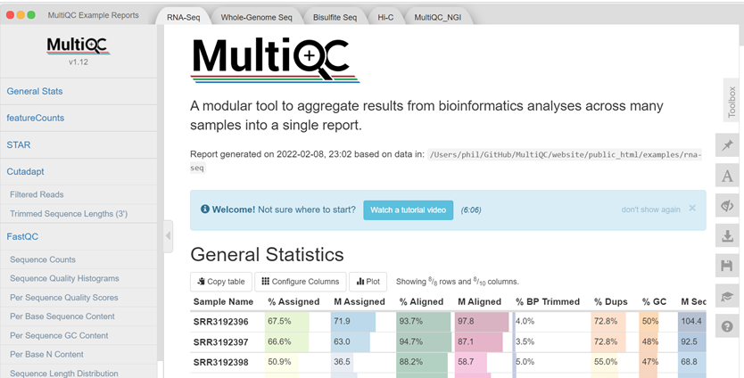

[Click here to enlarge the image](images/OC3_2-5_Fig1.png)

[Download Figure 5 alt-text here](images/OC3_2-5_Fig5_alt-text.pdf)

MultiQC is also available on the Galaxy hub enabling the aggregation of the FastQC logs generated from your analysis into a single self-contained HTML report, which can be visualised in any modern web browser. With this report, researchers will be able to make accurate comparisons between their samples, minimise the risk of confounding factors through detecting batch effects and, improve the quality of QC and reporting.

**Futher reading**

[MultiQC: summarize analysis results for multiple tools and samples in a single report](https://doi.org/10.1093/bioinformatics/btw354)

[FastQC Manual](https://dnacore.missouri.edu/PDF/FastQC_Manual.pdf)

[FastQC for quality assessment](https://hbctraining.github.io/Intro-to-ChIPseq/lessons/02_QC_FASTQC.html) 

[FastQC Tutorial and FAQ](https://rtsf.natsci.msu.edu/sites/_rtsf/assets/File/FastQC_TutorialAndFAQ_080717.pdf)

# Assess quality with FastQC
<!-- 2-6 -->      

Let’s inspect a Per Base Sequence Quality Plot generated from FastQC and interpret the results.

Upon running FastQC on Galaxy with the “Raw read data from your current history” parameter, an HTML file will be generated for your inspection. For now, try looking at the example plot in Figure 6 to make sure you understand how to read this kind of output:

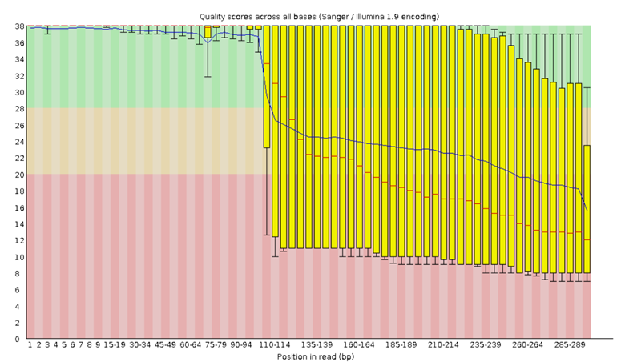

[Click here to enlarge the image](images/OC3_2-6_fig1.png)

[Download Figure 6 alt-text here](images/OC3_2-6_Fig6_alt-text.pdf)

The x-axis on the plot shows the base position in the read. For each position, a BoxWhisker plot is drawn with:

* The median value, represented by the central red line        
* The interquartile range (25-75%), represented by the yellow box        
* The 10% and 90% values in the upper and lower whiskers         
* The mean quality, represented by the blue line         

The y-axis shows the quality scores. The higher the score, the better the base call, whereby a range from very good quality scores (green), scores of reasonable quality (orange), and reads of poor quality (red) can be observed.
A detailed tutorial on the use of FastQC on short and long reads and the interpretation of the results can be found on the [Galaxy hub](https://training.galaxyproject.org/training-material/topics/sequence-analysis/tutorials/quality-control/tutorial.html). 

# Assembly of SARS-CoV-2 genome and sequence alignment
<!-- 2-7 -->     

Did you ever ask someone what a new delicacy tastes like, and they respond with: “It tastes like chicken.”?

The truth is, that we use references all the time. It gives us a place to start. A “reference” point to narrow things down to. When you ask for directions, the person giving you directions will first check whether you are familiar with certain landmarks. We do the same when it comes to sequencing reads. 

**De novo versus reference genome assembly**        

When your reads are obtained from the sequencing machine, here are [two methods of assembling your reads](https://doi.org/10.1371/journal.pcbi.1002821). As shown in Figure 7, we can align the reads from scratch (de novo assembly); usually by way of overlapping the reads until they form a continuous long read called a contig. The contigs are then overlapped in the same way until they eventually become a full genome. Either the reads are aligned by overlapping all the reads, until contigs and eventually, a complete reference genome is created. Alternatively, a reference genome may already exist. We would then just align the newly sequenced reads by comparing them to the reference genome. Usually, this method is used to compare the reads, to find variations which exist in our sample compared to the reference genome.
 
 

_Source: [PLoS Computational Biology](https://doi.org/10.1371/journal.pcbi.1002821)._

[Click here to enlarge the image](images/OC3_2-7_Fig1.png)

[Download Figure 7 alt-text here](images/OC3_2-7_Fig7-8_alt-text.pdf)

A reference genome of a species is therefore a genome that was constructed in this way, by [using the sequenced reads of a member of that species](https://www.hudsonalpha.org/sequencing-from-scratch-reference-genomes-and-de-novo-sequence-assembly/). This is normally stored in a FASTA file.

The second method involves using an already available reference genome as a guide, to align the reads of our sample more accurately [(resequencing)](https://doi.org/10.1371/journal.pcbi.1002821). But the ultimate aim of resequencing is to compare our reads to the reference genome and to find variations. 

In Figure 8, the reference genome shows that there is a nucleotide “T” at a particular position. However, the aligned read from your sample shows a “C”. This is a possible mutation. But this is definitely not a process that you would want to complete manually if you have thousands or billions of reads. 

_Source: adapted from [Your Genome](https://www.yourgenome.org/facts/how-do-you-find-out-the-significance-of-a-genome-after-sequencing)._

[Click here to enlarge the image](images/OC3_2-7_Fig2.png)

[Download Figure 8 alt-text here](images/OC3_2-7_Fig7-8_alt-text.pdf)

Fortunately, the tools required for doing alignments already exist. For short reads (< 300 bp long) produced by a sequencer such as Illumina, we can align the reads to the reference genome using an aligner called [BWA-MEM](https://doi.org/10.1093/bioinformatics/btp324). For longer reads (> 10kb long)  produced by a sequencer like Oxford Nanopore, we could align using [minimap2](https://doi.org/10.1093/bioinformatics/bty191).

For resequencing, these tools always require a reference genome (FASTA file) and the FASTQ files containing your reads. You may also need to submit files containing the locations of the primer and adapter sequences that your tool needs to take into consideration when doing the alignment, or which you can use to do prior trimming of your reads before you start the alignment/mapping process.

**Further reading**

[Difference between Nanopore and Illumina sequencing article](https://www.differencebetween.com/difference-between-nanopore-and-illumina-sequencing/).

# Assembly tutorial
<!-- 2-8 -->        

Two of the most common lengths of sequenced reads are:

1)  _short reads_ less than 400bp       
2)  _long reads_ greater than 400bp         

You may recall that when your raw reads (FASTQ files) are returned from the sequencing facility, you will need to perform quality control and data cleaning before starting your analysis.

Some of this may include running a tool to remove human reads from your samples, checking the quality of the bases and, finally, trimming off adapter sequences and bad-quality bases.
 
At this stage, we will assume that you are familiar with uploading your datasets to Galaxy and that you are familiar with the processing steps like FASTP/FASTQC. We will also assume that you are now left with trimmed and cleaned FASTQ files. 
 
To do any alignment/mapping, you need your sample reads (fastQ files) and the reference genome (fastA file).
 
**Tutorial**

As an example, we will show you how to upload a pair of raw RNA-seq reads and the reference file to Galaxy. These files were taken from [another Galaxy SARS-CoV2 variant calling tutorial](https://training.galaxyproject.org/training-material/topics/variant-analysis/tutorials/sars-cov-2-variant-discovery/tutorial.html).
 
1) NB! If you are following this tutorial on your own, please do not forget to log on first to [Galaxy](https://usegalaxy.eu/)

[Click here to enlarge the image](images/OC3_2-8_fig1.png)

[Download Figure 9-26 alt-text here](images/OC3_2-8_fig9-26_alt-text.pdf)

2) You may choose to **Rename** the **History** to anything appropriate.
 
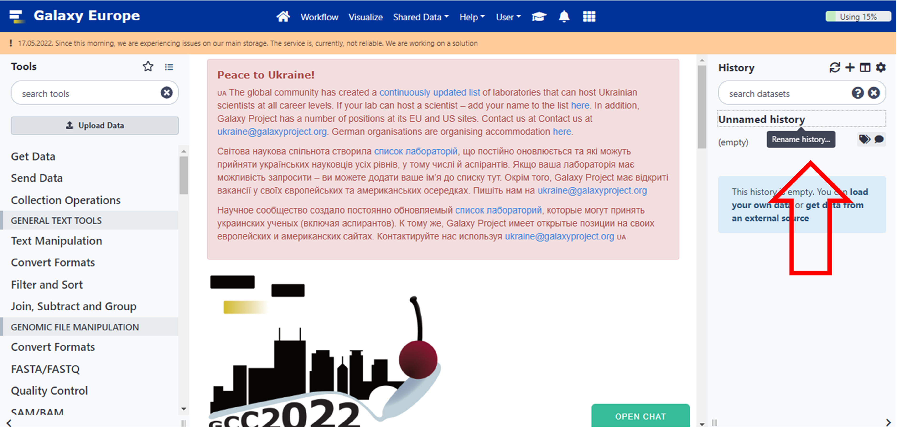
 
[Click here to enlarge the image](images/OC3_2-8_Fig2.png)
 
3) If you would like to try this tutorial, you can find testing data in our [Zenodo resources](https://zenodo.org/record/6652215#.YrTjB-zMKre). On Galaxy click on **Upload Data**.
 
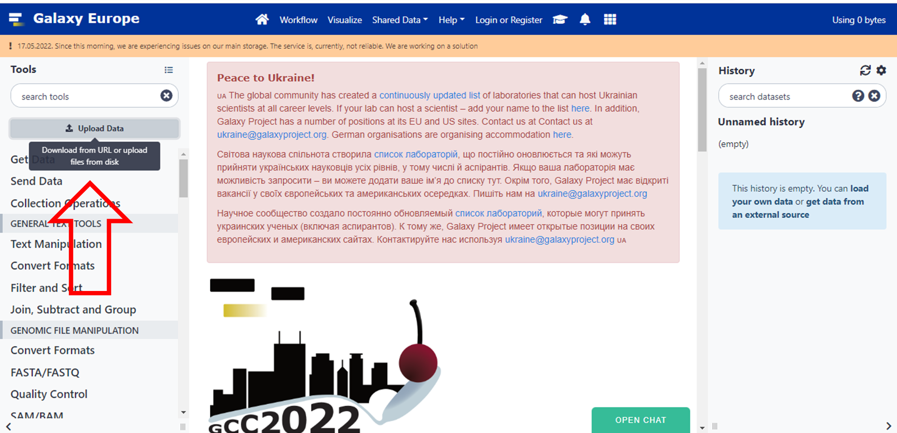

[Click here to enlarge the image](images/Oc3_2-8_fig3.png)

4) Then click on **Paste/Fetch data** button or drop your files in the indicated box.

[Click here to enlarge the image](images/Oc3_2-8_fig4.png)

5) Upload your files in the window and click **Start**

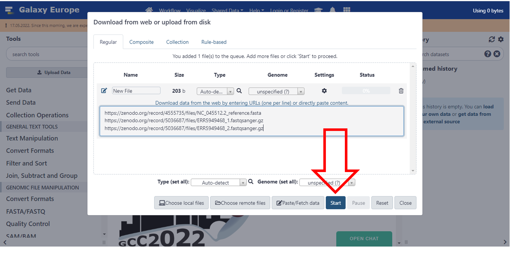

[Click here to enlarge the image](images/OC3_2-8_fig5.png)

6) Close this screen once it’s done
 
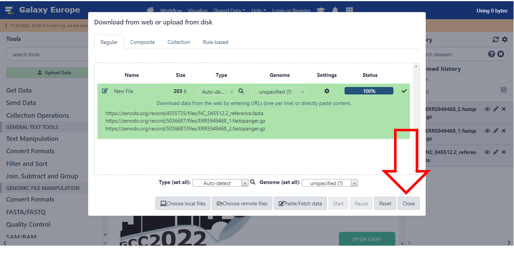

[Click here to enlarge the image](images/OC3_2-8_Fig6.png)

It may take a while for the files to process and be available in Galaxy. As it’s processing, it will turn **yellow** and then **green** once it is done. Make sure that your datasets are in the correct **fastsanger.gz** format. This is usually done automatically, but you may want to consult your previous Galaxy tutorials to choose the correct file **datatype**.

[Click here to enlarge the image](images/OC3_2-8_Fig7.png)

[Click here to enlarge the image](images/Oc3_2-8_Fig8.png)

7) Now to make running the tools easier, let's pair up the data. **Unclick** the **Operations on multiple datasets** box, and you will see boxes next to each file. You can now select your datasets.

[Click here to enlarge the image](images/Oc3_2-8_fig9.png)
 
8) Select **only** your **FASTQ** files
 
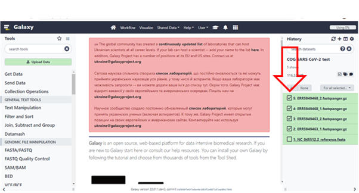

[Click here to enlarge the image](images/OC3_2-8_Fig10.png)

9) Then click on the **“For all Selected”** drop-down and select the option to **“Build List of Dataset Pairs”**
 

[Click here to enlarge the image](images/Oc3_2-8_fig11.png)
 
10) You will see that it already determined a pattern it can use to group the pairs because the forward files have a “_1” in them and the reverse files have a “_2” in them.

Give the selection a **name** and click on **“Create collection”**

[Click here to enlarge the image](images/OC3_2-8_fig12.png)

11) **Click** on the square box which you originally clicked to create the collection and the boxes to the left of the names will disappear

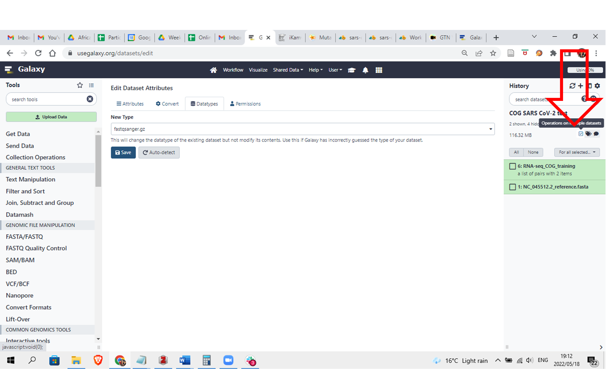

[Click here to enlarge the image](images/OC3_2-8_fig13.png)

12) Now let’s do our alignment. Search for **“bwa-mem”** under **Tools** and choose **“Map with BWA-MEM”**
 

[Click here to enlarge the image](images/OC3_2-8_fig14.png)

13) Once again. We are going to assume that we have already cleaned and trimmed these FASTQ files and we are just going to do the alignment.

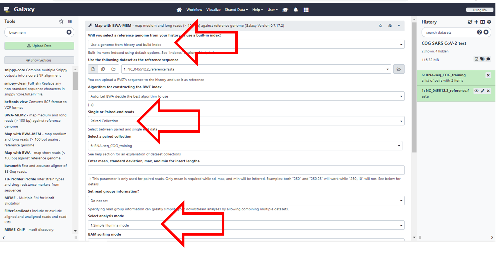

[Click here to enlarge the image](images/OC3_2-8_fig15.png)

**Choose the following parameters of the Tool.**

_Will you select a reference genome from your history or use a built-in index?_ **Use a genome from history and build index**       
You will see that it will automatically select your FASTA file.
 
_Single or Paired-end reads._ Change it to **Paired collection**             
It will once again automatically select the collection you created
 
_Select analysis mode:_ **Simple Illumina mode**                 
Since this is the most common, it’s already there as a default
 
Leave the rest as the default options.
 
Click **Execute** at the bottom. It may take a while to run.
(You may need to scroll down or zoom out if you cannot see this button) 

14) The output of this execution should be two BAM files. You can explore them by clicking on the finished results and then selecting “the eye icon”. 

For further information on how to interpret all the output check the following resources: 

[Sequence Alignment/Map Format Specification](https://samtools.github.io/hts-specs/SAMv1.pdf)           
[Understanding BAM files; part 1](http://www.cpwardell.com/2015/02/24/understanding-bam-files-part-1/)            
[Understanding BAM files; part 2](http://www.cpwardell.com/2015/02/24/understanding-bam-files-part-2/)           
[Wikipedia entry for SAM (file format)](https://en.wikipedia.org/wiki/SAM_(file_format))        
 
But for now, we will focus on some of the output columns that are important.
 
**Results and Discussion**

These are some of the results that you will see if you click on the eye icon for file **ERR5949463** under the batch called **“Map with BWA-MEM on collection…..”**

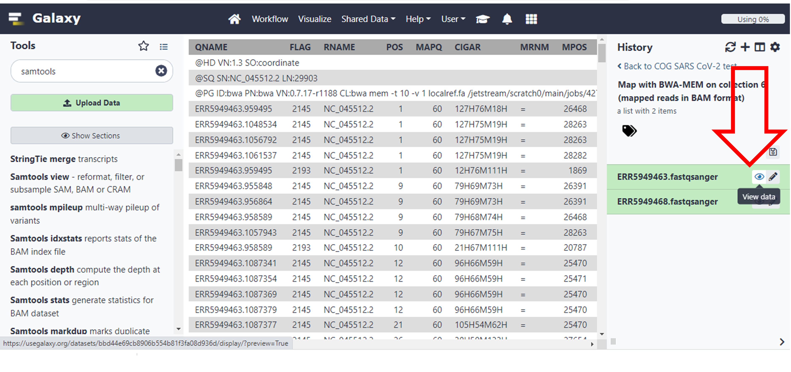

[Click here to enlarge the image](images/OC3_2-8_Fig16.png)

These are some of the meanings of the columns as taken from the resources provided above, which you will use to answer the questions which follow.

_1) QNAME: the name of the query sequence e.g. a read name like HWI-ST886:247:D2G2MACXX:3:2102:4127:4699._
 
_2) FLAG: a bitwise flag.  You’ll want to read Understanding BAM files; part 2 for an explanation._
 
_3) RNAME: the name of the reference contig the sequence is aligned to, e.g. 1 (chromosome 1)._
 
_4) POS: the position on the reference contig that the alignment starts at, e.g. 123456 (in this case, the 123,456th base of chromosome 1)._
 
_5) MAPQ: the mapping quality of the read; maximum value is usually 60.  This number is Phred scaled, meaning that they’re logarithmically scaled.  For example:_
 
_a) MAPQ of 10 means a 1/10 chance that the mapping is wrong._
 
_b) MAPQ of 20 means a 1/100 chance that the mapping is wrong._
 
_c) MAPQ of 60 means a 1/1,000,000 chance that the mapping is wrong._
 
_6) CIGAR: this string tells us how to match the query sequence to the reference sequence.  In the simplest case, such as if the read is 100 bases along and matches perfectly, CIGAR would be 100M.  However, you can encode mismatches, insertions and deletions, and it quickly becomes very complicated._
 
_7) RNEXT: the name of the reference contig that the other read in the pair aligns to.  If identical to this read, an equals sign (“=”) is used._
 
_8) PNEXT: the position on the reference contig that the other read in the pair aligns to.  This depends on the size of the DNA fragments in the sequencing library and will usually be a few hundred base pairs away (see TLEN, below)._
 
_9) TLEN: the length of the template fragment.  This is the distance from the leftmost base of the first read to the rightmost base of the second read of a pair.  This value is signed (+/-), so you can infer the orientation of the reads, too._
 
_10) SEQ: the DNA sequence of the query sequence.  This will be identical to the sequence in the FASTQ file that was aligned to the reference genome._
 
_11) QUAL: the corresponding base quality scores of the SEQ.  This will be identical to the scores in the original FASTQ file.  Note that it’s encoded as ASCII+33, so all the letters and punctuation symbols actually correspond to regular integers._

In the [Wikipedia entry](https://en.wikipedia.org/wiki/SAM_(file_format)) you will find the following information: 

The FLAG attributes are summed to get the final value, e.g. a SAM row resulting from an Illumina paired-end FASTQ record having the FLAG value 2145 would indicate:
 
| Flag value | Meaning | Flag sum |
| ------ | ------- | ------- | 
| 1 | read is paired | 1 |
| 32 | read2 was reverse complemented | 33 |
| 64 | read1 | 97 |
| 2048 | Supplementary alignment | 2145 |
 

[Click here to enlarge the image](images/OC3_2-8_fig17.jpeg)

[Click here to enlarge the image](images/OC3_2-8_fig18.jpeg)

# Variant calling and annotation
<!-- 2-9 -->     
 
**Introduction**

Identifying genomic variants can play an important role in scientific discovery as exemplified by the ongoing SARS-CoV-2 global surveillance. Variant calling involves identifying single nucleotide polymorphisms (SNPs), and small (< 50 bp) insertions and deletions (indels) from various input data e.g. whole-genome sequence data. Herein, SNPs and indels are collectively referred to as small nucleotide variations (SNVs). 

Since NGS-generated reads aligned to the reference genome can be visualised using tools such as the [Integrative Genomics Viewer (IGV)](https://igv.org/app/), it is possible to visually inspect sites that have potential variants as shown in Figure 27. However, visual inspection of variants would be intractable for the whole genome, hence the need for variant calling tools. 

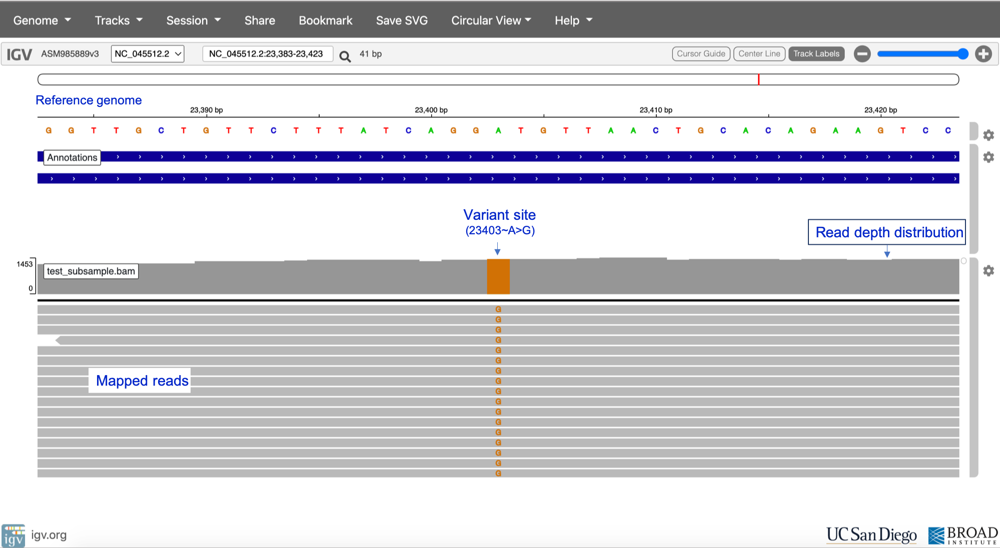

_Reference sequence [NC_045512.2](https://www.ncbi.nlm.nih.gov/nuccore/NC_045512.2?report=genbank)_

[Click here to enlarge the image](images/OC3_2-9_fig1.png)

[Download Figure 27-30 alt-text here](images/OC3_2-9_Fig27-30_at-text.pdf)

Commonly used variant calling tools include the following;

* [BCFtools](http://www.htslib.org/download/)           
* [Genomic Analysis Toolkit (GATK) HaplotypeCaller](https://gatk.broadinstitute.org)     
* [DeepVariant](https://github.com/google/deepvariant)     
* [Strelka2](https://github.com/Illumina/strelka)      
* [SAMtools](http://www.htslib.org/download/)      
* [GraphTyper](https://github.com/DecodeGenetics/graphtyper)     
* [Nanopolish](https://github.com/jts/nanopolish)       

Major computational steps in variant calling are outlined in Figure 28. For variant calling from short-read data (e.g. Illumina), we recommend using GATK HaplotypeCaller, DeepVariant or GraphTyper. DeepVariant has also been validated as highly accurate when using PacBio (long-read) data as input. Nanopolish is the recommended tool for Oxford Nanopore data. For an in-depth benchmark of some of the variant callers above, please see the paper by [Barbitoff and colleagues](https://doi.org/10.1186/s12864-022-08365-3).

[Click here to enlarge the image](images/OC3_2-9_fig2.png)

It is important to note that different variant callers have different underlying algorithms for detecting and genotyping variants, as well as different approaches for variant quality control and filtering. 

**Joint discovery vs single sample variant calling**

During variant calling, it might be necessary to perform joint discovery rather than single-sample variant calling. In single sample calling, sample BAM files are analysed individually, and individual variant call-sets are combined in downstream steps. However, during joint calling, SNVs are called simultaneously across all sample BAMs, thus generating a merged call-set for the entire cohort. Joint variant calling provides advantages such as facilitating filtering out false positive SNV calls, greater sensitivity for low-frequency variants and enhancing the distinction between homozygous reference sites and sites with missing data. For more insight into the advantages of joint variant calling, please see the [GATK article](https://gatk.broadinstitute.org/hc/en-us/articles/360035890431-The-logic-of-joint-calling-for-germline-short-variants). Although joint variant discovery offers these advantages, there is still a lot of value in performing single sample variant calling – however, the accuracy of the variant calls would depend on multiple factors e.g. the quality of the input data, alignment tool used and the variant caller. 

**The Variant Call Format**

A summary of key components in the Variant Call Format can be found at [this resource page](http://vcftools.sourceforge.net/VCF-poster.pdf). More detailed format descriptions are discussed by [Danecek and colleagues](https://doi.org/10.1093/bioinformatics/btr330) and in at [SAM tools resources](https://samtools.github.io/hts-specs/VCFv4.2.pdf). Figure 29 shows a screenshot of an example VCF for a SARS-CoV-2 sample. 

[Click here to enlarge the image](images/OC3_2-9_fig3.png)

**Variant annotation**

Variant annotation is the process of assigning additional information to mutations called from sequence data – this information could include the effect of a variant on protein structure and function, frequency of the variant (if existing) in well-studied populations, variant identifiers or position of the variant in the context of possible transcripts, proteins, overlapping genes etc. ( Figure 30).

[Click here to enlarge the image](images/OC3_2-9_fig4.png)

The Ensembl [Variant Effect  Predictor (VEP)](https://www.ensembl.org) and [snpEff](http://pcingola.github.io/SnpEff) are the most popular tools used for variant annotation. Both VEP and snpEff are commonly used for annotating variants in the human genome, but they have been adapted to facilitate the annotation of SARS-CoV-2 mutations since the start of the COVID-19 pandemic. There is a dedicated Ensembl [VEP for SARS-CoV-2](https://covid-19.ensembl.org/info/docs/tools/vep/index.html), while the snpEff version(s) for SARS-CoV-2 can be run via the Galaxy web platform.

# Variant calling tutorial
<!-- 2-10 -->     

<!-- YT https://youtu.be/Lz0l2_SMTF8 -->     
<iframe width="840" height="472" src="https://www.youtube.com/embed/Lz0l2_SMTF8" title="YouTube video player" frameborder="0" allow="accelerometer; autoplay; clipboard-write; encrypted-media; gyroscope; picture-in-picture; web-share" allowfullscreen></iframe>

[Download the transcript here](assets/OC3_2-10_transcript.pdf)

In this tutorial, you will be using DeepVariant on the [Galaxy platform](https://usegalaxy.eu/) for calling SNVs in a SARS-CoV-2 genomic sample followed by variant annotation using snpEff. 

The test dataset for this exercise was obtained by downsampling SARS-CoV-2 sequence data from [ENA browser](https://www.ebi.ac.uk/ena/browser/view/PRJNA794330?show=reads). You can download the downsampled BAM file (and its index) and the NC_045512.2 reference sequence (and its index) below. 

[Donwload the dataset here](assets/OC3_2-10_dataset.zip)

# Using and interpreting Nextclade
<!-- 2-11 -->      

<!-- YT https://youtu.be/-bnYO55FHdw -->      
<iframe width="840" height="472" src="https://www.youtube.com/embed/-bnYO55FHdw" title="YouTube video player" frameborder="0" allow="accelerometer; autoplay; clipboard-write; encrypted-media; gyroscope; picture-in-picture; web-share" allowfullscreen></iframe>

[Download the transcript here](assets/OC3_2-11_transcript.pdf)

In this tutorial, you will learn how to assign clade and lineage to the assembled SARS-CoV-2 genomes. 

You can download this dataset if you would like to try and test the tutorial. If you prefer, you can just watch the video to learn how to assign SARS-CoV-2 clades using [Nextclade](https://clades.nextstrain.org/)

[Donwload the dataset here](assets/OC3_2-11_dataset.zip)

# Signatures of co-infection, recombination and contamination
<!-- 2-12 -->       

A number of free and open-source platforms are available to assist with SARS-CoV-2 bioinformatic analysis. One of the most commonly used is Pangolin, which was developed by the COVID-19 Genomics UK (COG-UK) Consortium team at the University of Edinburgh. Pangolin has emerged as the standard tool for lineage assignment of SARS-CoV-2 genomes and is available both as [standalone code](https://github.com/cov-lineages/pangolin) and as a [web server](https://pangolin.cog-uk.io/).           

1) This tutorial describes how to use [Pangolin](https://pangolin.cog-uk.io) (Figure 31).

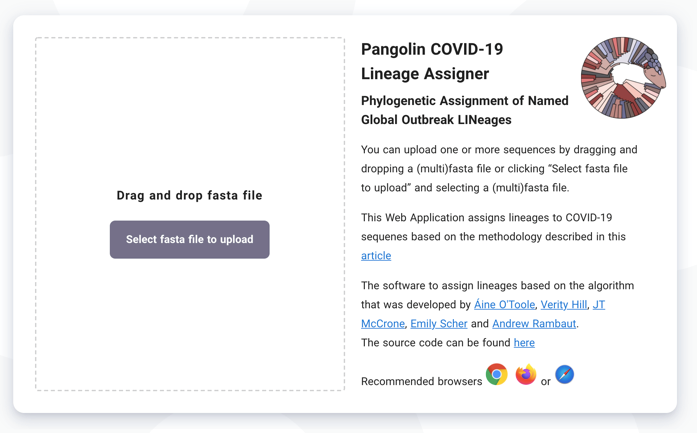

[Click here to enlarge the image](images/OC3_2-12_fig1.png) 

[Download Figures 31-33 alt-text here](images/OC3_2-2_Fig1-2_alt-text.pdf)

2) The dataset used for this tutorial is available for download. The first step is to upload the consensus sequence Signatures_consensus.fa. Note: A FASTA file has the file extension .fa or .fasta This file contains a single string of nucleotides that encodes the most common viral genome within your specimen. The SARS-CoV-2 genome is approximately 30,000 nucleotides in length.

[Donwload the dataset here](assets/OC3_2-12_dataset.zip)

3) Once uploaded press **Start Analysis** (top left of screen):

4) Record the SARS-CoV-2 lineage obtained for the consensus sequence.

5) Explore the geographical distribution of the lineage by clicking on the UK map icon, the world map icon and the information icon.

6) Navigate to the [IGV webpage](https://igv.org/app/), select the reference genome SARS-CoV-2 and upload the mapping file (Signatures.bam) and the corresponding index file (Signatures.bam.bai). 

7) In IGV, explore the lineage-defining mutation positions for the lineage you detected in Step 4 above. 
You can find lineage-defining positions in the [constellations table](https://cov-lineages.org/constellations.html) provided by Pangolin curators.

Hint 1: Mutations are given either as nucleotide coordinates (from 1 to 29,903, the length of the SARS-CoV-2 genome) or as amino acid positions within each protein. For example, **S:E484Q** denotes a mutation in Spike (S), affecting the amino acid at position 484, which is changed from E (glutamic acid) in the reference genome to Q (glutamine) in the variant strain.

Hint 2: If you are having difficulty identifying lineage-defining positions, consider looking at the regions shown below (Figures 32 and 33):

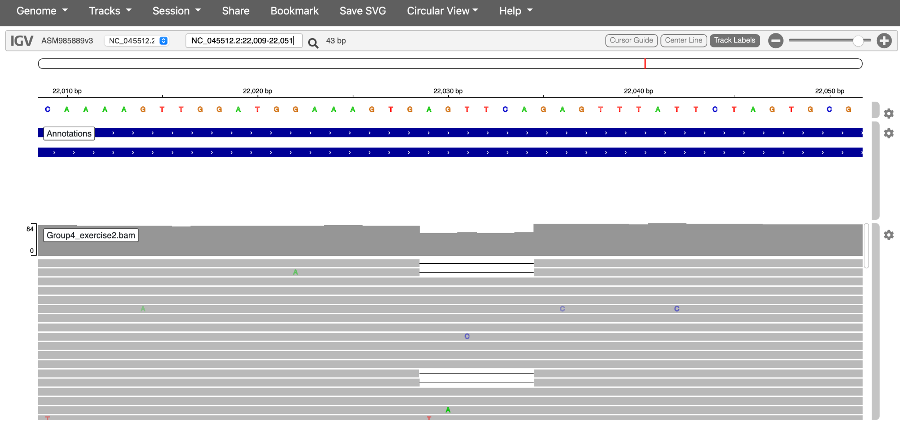

[Click here to enlarge the image](images/OC3_2-12_Fig3.png)

[Click here to enlarge the image](images/OC3_2-12_Fig4.png)

**Additional resources**

[WHO South-East Asia Region confirms first few cases of Omicron, countries urged to step up COVID-19 response measures](https://www.who.int/southeastasia/news/detail/03-12-2021-who-south-east-asia-region-confirms-first-few-cases-of-omicron-countries-urged-to-step-up-covid-19-response-measures)
 
[First Australian cases of Omicron COVID-19 strain confirmed in Sydney travellers from southern Africa, NSW Health says - ABC News](https://www.abc.net.au/news/2021-11-28/travellers-test-positive-to-omicron-covid-sydney/100657076)

# What are clades, lineages and variants?
<!-- 2-13 -->    

 
Pathogen genomics helps us to track the spread of an outbreak and to identify significant changes in the genome of a pathogen. This, in turn, [helps us to identify the emergence of new variants or lineages](https://doi.org/10.1093/ve/veab064), both nationally and internationally.
 
Phylogenetics using web interfaces like [Pangolin](https://cov-lineages.org/resources/pangolin.html) and [Nextstrain](https://nextstrain.org/ncov/open/global/6m) to help us with genomic surveillance has been extremely important during the pandemic period. We use it to differentiate one transmission chain from another (e.g. local nosocomial versus school outbreaks). However, in order to do this, we needed to create categories into which we could classify the diversity. This was done by [dividing the groups into clades and lineages](https://doi.org/10.1038/s41564-020-0770-5).
 
**What are clades, lineages and variants?**

A clade is a very broad way of grouping SARS-CoV-2 isolates. Hence, it gives us a sense of the diversity patterns over the years. The samples also need to have a minimum size and persistence.

The [lineage rules for SARS-CoV-2](https://doi.org/10.1038/s41564-020-0770-5) were proposed to help us to describe the diversity we are observing while the pandemic is happening and attempts to describe a significant epidemiological event. For example, a new lineage may be assigned if that specific group shows an increase in transmission compared to another group. There are no criteria for minimum size and persistence. Hence a lineage may contain a small number of isolates or a very large number. For example, there are over [1,000 Pango lineages](https://doi.org/10.1093/ve/veab064), compared to less than 20 clades.

Lastly, a [virus variant](https://doi.org/10.1016/j.yamp.2021.06.006) has mutations that have a biological significance (for example, it is associated with a virulence factor).  The most significant variants are currently called [Alpha, Beta, Gamma, Delta and Omicron](https://doi.org/10.1128/jvi.02077-21).
 

# Prediction of minor variants and drug resistance 
<!-- 2-14 -->    

Several therapeutic agents have been identified that have some activity against SARS-CoV-2. These include monoclonal antibodies (mAbs), which bind the spike protein to prevent cellular infection and specific antivirals that interfere with viral replication. By convention, the names of therapeutics indicate their mode of action: antibodies end with ‘-ab’, while antiviral drugs end in ‘-vir’. As the virus continues to evolve, immune escape by new variants is likely to reduce the effectiveness of some existing therapeutics. Recently, the FDA and several other regulators withdrew authorisation for sotrovimab use due to [lack of effectiveness against the BA.2 Omicron variant](https://www.fda.gov/drugs/drug-safety-and-availability/fda-updates-sotrovimab-emergency-use-authorization) 

The following tutorial explains how to identify genomic polymorphisms conferring resistance to antiviral agents.

1) Navigate to the [IGV webpage](https://igv.org/app/). If you would like to try and test the tutorial, you can use the available dataset below which contains the mapping file (Prediction.bam) and the corresponding index file (Prediction.bam.bai) in course resources.

[Download the dataset here](assets/OC3_2-14_dataset.zip)

2)  In the drop-down menu Genome select the reference genome SARS-CoV-2
(ASM985889v3)

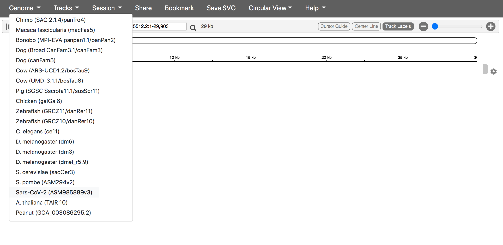

[Click here to enlarge the image](images/OC3_2-14_fig1.png)

[Download Figures 34 - 39 alt-text here](images/OC3_2-14_Fig34-39_alt-text.pdf)

3) Your annotated reference should look like this:

[Click here to enlarge the image](images/OC3_2-14_fig2.png)

Note: the blue annotations depict the open reading frames (ORF), coding DNA sequence
(CDS) and genes that make up the SARS-CoV-2 genome.

4) Using the Tracks dropdown menu, upload the reference-based mapping file and its index. These files have the file extensions .bam and .bam.bai
Note: BOTH files must be uploaded at the same time.

5) The genome and reference-based mapping should look like this:

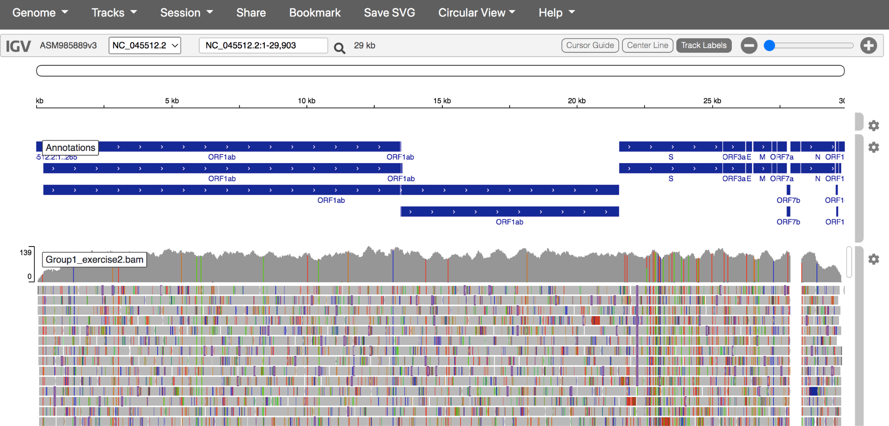

[Click here to enlarge the image](images/Oc3_2-14_fig3.png)

6) Zoom in to investigate the reads that support individual mutations. Left-click on the coloured mutations to see a breakdown of the number of reads and nucleotides encoding each mutation. If you are finding it difficult to replicate, zoom in to 21840bp

[Click here to enlarge the image](images/OC3_2-14_fig4.png)

7)  Using the Settings wheel icon to the right of the reference genomic, turn on Three-frame translation of the reference genome.

[Click here to enlarge the image](images/Oc3_2-14_fig5.png)
 
You should now see the amino acid sequence below the reference, in all three possible reading frames (only one of these will be appropriate for each gene). 

8) You can investigate the read populations and mutations in the S
sotrovimab binding epitope to determine if this patient’s viral population contains mutations that confer sotrovimab resistance.

Hint 1: Sotrovimab-conferring mutations may occur at nucleotide positions 22580-22582 (amino acid position 340 in the spike protein sequence). The reduction in sotrovimab activity is 10 to 297-fold, depending on the non-synonymous mutation encoded:

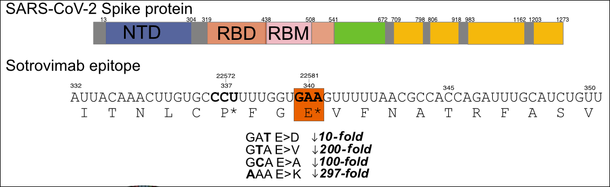

[Click here to enlarge the image](images/OC3_2-14_fig6.png) 

NB: Non-terminal domain (NTD), Receptor binding domain (RBD), Receptor binding motif
(RBM)

When mutations affect the majority of sequence reads this is known as a consensus mutation, and when it affects only a minority of reads it can be called sub-consensus mutations, minority frequency mutations, or intrahost single-nucleotide variants (iSNVs). If the mutation is advantageous to virus survival in a host, positive selection will act to increase its frequency over time. If the mutation becomes the dominant population it is said to become ‘fixed’ as the consensus.

# Identification of recombinants
<!-- 2-15 -->    

Recombination, the process of exchanging fragments of RNA, is a common phenomenon among many viruses, including the coronavirus family, and it has recently been detected in SARS-CoV-2. Recombination occurs when two different viral variants co-infect the same cell, and the polymerase enzyme responsible for copying viral RNA “hops” from one variant’s genome to the other’s, in a process called template [switching](https://www.nature.com/articles/s42003-021-02858-9). In order to detect recombination, the two “parent” genomes need to have sufficient lineage-defining mutations to make them easily distinguishable from one another. Because SARS-CoV-2 is a recently emerged virus, it has only recently accumulated enough genetic diversity to make recombinants between distinct variants (lineages) identifiable.

In this tutorial, you will learn how to identify a circulating recombinant lineage of SARS-CoV-2 from consensus genetic data. If you would like to try out the tutorial for yourself, there is an example dataset available for download.

1) Please navigate to [Pangolin](https://pangolin.cog-uk.io) to upload the FASTA  file [Recombinants_consensus.fa]. Run the analysis using the ”Start Analysis” button to determine the lineage for this sample. 

[Download the dataset here](assets/OC3_2-15_dataset.zip)

2) Navigate to the [IGV webpage](https://igv.org/app/), select the reference genome SARS-CoV-2 and upload the mapping file (Recombinants.bam) and the corresponding index file (Recombinants.bam.bai) in course resources. 

3) In IGV, explore the sequence of your sample at the lineage-defining mutation positions for omicron variants BA.1 and BA.2. Recall that you can find lineage-defining positions in the [constellations table](https://cov-lineages.org/constellations.html).

Hint: Try looking at some of the positions Pangolin lists as defining XE: 
nuc:C3241T, nuc:T5386G, nuc:C14599T, nuc:C12880T, nuc:A29510C, nuc:C14599T

4) A recombination breakpoint is the inferred position of the template switch event, where the sequence of one parental lineage swaps over to the sequence of the other lineage (in this case, BA.1 and BA.2).

Hint: find the lineage-defining mutations for BA.1 and BA.2. The breakpoint is defined as the region between two mutations that match different lineages. 

_Source: [United Kingdom Health Security Agency](https://assets.publishing.service.gov.uk/government/uploads/system/uploads/attachment_data/file/1063424/Tech-Briefing-39-25March2022_FINAL.pdf)_

[Click here to enlarge the image](images/OC3_2-15_fig1.png)

[Download Figure 40 alt-text here](images/OC3_2-15_Fig40-alt-text.pdf)

# Introduction to phylogenetics: tools and models
<!-- 2-16 -->     

Within the first year of the coronavirus disease 2019 (COVID-19) pandemic, almost 400,000 whole or partial severe acute respiratory syndrome coronavirus 2 (SARS-CoV-2) genomes were generated and shared openly, marking an unprecedented worldwide response in pathogen genome sequencing. 

Phylogenetic tools have proven increasingly important in the public health management of a variety of viral epidemics, but the COVID-19 pandemic is the first global health emergency in which large-scale, real-time genomic sequencing and analysis have guided public health decisions. SARS-CoV-2 has been evolving at an estimated nucleotide substitution rate ranging between [10e−3 and 10e−4 substitutions per site and per year](https://doi.org/10.1093/molbev/msaa314). The global epidemiological and virological situation changed constantly during the pandemic, and genomic sequence analysis was crucial in [tracking the changing scenario](https://doi.org/10.1038/s41576-022-00483-8) (Figure 41).

_Source: [Nature Reviews Genetics](https://doi.org/10.1038/s41576-022-00483-8)_

[Click here to enlarge the image](images/OC3_2-16_fig1.png)

[Download Figures 41-42 alt-text here](images/OC3_2-16_Fig41-42_alt-text.pdf)

Phylogenetic tools like [Pangolin](https://cov-lineages.org/resources/pangolin.html) and  [Nextclade](https://clades.nextstrain.org/) can unlock information from sampled genomes combined with epidemiological data like:

* Quantifying international virus spread         
* Identifying outbreaks and transmission chains in specific settings         
* Estimating growth rates and reproduction numbers       
* Identifying and tracking mutations of interest                
* Discovering and analysing variants of concern            
* Investigating intra-host virus evolution        

Different approaches to building the phylogenetic tree:

Parsimony approach - [Maximum Parsimony](https://doi.org/10.1186/1748-7188-7-9) is a character-based approach that infers a phylogenetic tree by minimising the total number of evolutionary steps required to explain a given set of data assigned on the leaves. Tools that use parsimony include [IQTREE](http://iqtree.cibiv.univie.ac.at/) though it should be noted this is a tool to generate ML trees and [USHER](https://genome.ucsc.edu/cgi-bin/hgPhyloPlace).

Maximum likelihood approach- [Maximum Likelihood (ML)](http://scholarship.claremont.edu/scripps_theses/46) is a method for the inference of phylogeny. It evaluates a hypothesis about evolutionary history in terms of the probability that the proposed model and the hypothesised history would give rise to the observed data set. The supposition is that history with a higher probability of reaching the observed state is preferred to history with a lower probability. The method searches for the tree with the highest probability or likelihood. ML is implemented on [FasTree](http://www.microbesonline.org/fasttree/), [RAxML](https://raxml-ng.vital-it.ch/#/).

**How to read a phylogenetic tree:**

There are 2 parts to the phylogenetic tree. The nodes and the branches (Figure 42). The nodes on the tip of the tree represent the cases having some ancestry that existed as a putative virus in an individual. And the internal nodes between the branches make up the ancestor cases that are carrying the mutations from which further diversion was possible. The branches represent the transmission chains, which are a combination of numerous transmission events taking place and is represented by the branch length.

[Click here to enlarge the image](images/OC3_2-16_Fig2.png)

Bootstrapping: Bootstrap values in a phylogenetic tree indicate that out of 100, how many times the same branch is observed when repeating the generation of a phylogenetic tree on a resampled set of data. If we get this observation 100 times out of 100, then this supports our result.

# Transmission detection: travel-associated, hospital and community transmission
<!-- 2-17 -->     

The clinical spectrum of coronavirus disease 2019 (COVID-19) infection is wide, ranging from asymptomatic infection to severe viral pneumonia leading to death. SARS-CoV-2 is highly transmissible by droplet and indirect contact. Viral load in asymptomatic patients may be similar to those who are symptomatic.

Healthcare workers (HCWs) may be a source of infection for patients and colleagues via asymptomatic carriage and transmissibility prior to the onset of symptoms. Studies describing the risk and events of SARS-CoV-2 intra-hospital transmission are discrepant.

During an epidemic, when there is frequent viral transmission in the community, it is not always clear whether the patients are infected due to local transmission or through the HCWs. As the pandemic is constantly evolving, a new awareness of specific variants has soared from fear of strains more transmissible, pathogenic and likely to evade immunisation efforts. As outbreak definitions vary and outbreak reports mainly depend on epidemiological data with SARS-CoV-2 test results, the true transmission patterns remain uncertain. An aggregation of infected HCWs in a ward over some days or weeks does not necessarily imply intra-hospital transmission or a local outbreak.

[A study](https://doi.org/10.1093/infdis/jiab483) showed how they were able to detect how the intra-hospital transmission of COVID-19 infections occurred. They subjected all samples from patients as well as staff to reverse-transcription polymerase chain reaction (RT-PCR). Samples with a positive RT-PCR result (with a cycle threshold of < 35) and suggestive epidemiological linkage were subjected to whole-genome sequencing. The SNP analysis of these samples revealed that there were multiple outbreaks which occurred during the study period (Figure 43). They could differentiate the outbreaks by identifying the uniqueness of the samples such as common lineage detection, unique mutations, timeline analysis etc.

_Source: [The Journal of Infectious Diseases](https://doi.org/10.1093/infdis/jiab483)_

[Click here to enlarge the image](images/OC3_2-17_fig2.png)

[Download Figure 43 alt-text here](images/OC3_2-17_Fig 43_alt-text.pdf)

A similar kind of study can be conducted with cases having a history of travel. It is very evident throughout that there is a direct link between infection and travel history. Phylogenetic studies can help us identify the route of transmission so that as far as possible appropriate travel restrictions and quarantine measures can be adopted to control the virus spread. 

**Further reading**

[Rapid SARS-CoV-2 whole-genome sequencing and analysis for informed public health decision-making in the Netherlands](https://doi.org/10.1038/s41591-020-0997-y) 

# Tutorial on phylogenetics
<!-- 2-18 -->

<!-- YT https://youtu.be/yY0Z5NJ11h8 --> 
<iframe width="840" height="472" src="https://www.youtube.com/embed/yY0Z5NJ11h8" title="YouTube video player" frameborder="0" allow="accelerometer; autoplay; clipboard-write; encrypted-media; gyroscope; picture-in-picture; web-share" allowfullscreen></iframe>

[Download the transcript here](assets/OC3_2-18_transcript.pdf)

The first step to reconstruct a phylogenetic tree of SARS-CoV-2 genomes is generating a multiple sequence alignment using [MAFFT](https://mafft.cbrc.jp/alignment/server/). Then we will reconstruct a tree using [IQtree webserver](http://iqtree.cibiv.univie.ac.at/). Further, you will be visualising the phylogeny and the metadata provided on [Microreact.org](https://microreact.org/upload).

Sometimes when you align a large number of sequences using MAFFT it may introduce large sequences of gaps and a visual inspection is recommended. The alignment can be assessed using a genomic viewer like [IGV](https://software.broadinstitute.org/software/igv/) or [NCBI Multiple Sequence Alignment Viewer](https://www.ncbi.nlm.nih.gov/projects/msaviewer/). Inaccurate gaps must be manually removed before the phylogenetic tree reconstruction. 

If you would like to test this tutorial, there is a multi-FASTA file containing the SARS-CoV-2 genomes and the metadata file containing epidemiological data related to it available for download. In this tutorial, we have provided high-quality data and no gaps must be removed from the alignments, but you can still upload it on [NCBI Multiple Sequence Alignment Viewer](https://www.ncbi.nlm.nih.gov/projects/msaviewer/) to inspect it. 

[Download the dataset here](assets/OC3_2-18_dataset.zip)

# Quality control in phylogenetics
<!-- 2-19 --> 

Even though there are different quality control (QC) steps followed before performing the phylogeny, there are several factors that influence the SARS-CoV-2 phylogenies and will be a bottleneck to interpreting them.

Some of the challenges in interpreting the SARS-CoV-2 trees with a huge number of samples are:

* It is difficult to infer a reliable phylogeny due to a large number of sequences in conjunction with the low number of mutations.      
* Rooting the inferred phylogeny with confidence by applying novel computational methods to the ingroup phylogeny may not be credible.         
* Phylogeny can be numerically challenging because of the large number of highly similar sequences and lead to a low phylogenetic signal.

To overcome these shortcomings there are some QC steps that you can perform to generate high-quality phylogenies:

1) Mid-point root the tree before taking it for further analysis.       
2) Remove the sequences which are relatively highly divergent from the rest of the cluster.           
3) Remove sequences in which the divergence is substantially greater or less than expected.            
4) Examine the methods used or reiterate the bioinformatics steps when a divergent sequence is predicted.           
5) Use tools like  [IQ-TREE 2](https://doi.org/10.1093/molbev/msaa015), and [UShER](https://genome.ucsc.edu/cgi-bin/hgPhyloPlace) that have been developed to handle SARS-CoV-2 genomes and build phylogenies considering homoplasies, convergent evolution, and potential recombination events.          

[Click here to enlarge the image](images/OC3_2-19_fig1.png)

[Download Figure 44 alt-text here](images/OC3_2-19_Fig44_alt-text.pdf)

**Further reading**

[Phylogenetic Analysis of SARS-CoV-2 Data Is Difficult](https://doi.org/10.1093/molbev/msaa314)

[Genomic sequencing of SARS-CoV-2: a guide to implementation for maximum impact on public health](https://apps.who.int/iris/handle/10665/338480) 

