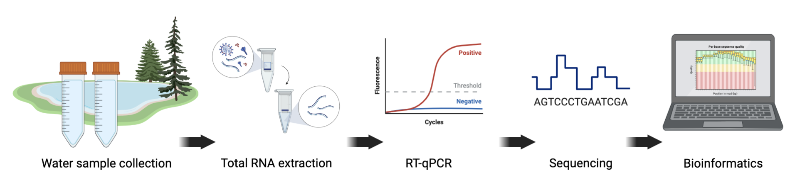

# PATHOGEN GENOMICS FOR GLOBAL HEALTH

        
@Canva

# What is One Health?
<!-- 2-2 -->    

One Health is an approach to public health which recognises that people's health is closely connected to the health of animals and the environment. It was developed in response to evidence of [zoonotic diseases](https://www.who.int/news-room/fact-sheets/detail/zoonoses) spreading between species. This is caused by humans and animals, and their respective pathogens, coming into closer contact with each other as humans encroach on animal habitats. It’s an effective way to focus on health issues at the human-animal-environment interface.  

For example, a One Health approach can be applied to emerging, re-emerging, and endemic diseases, neglected tropical diseases, vector-borne diseases, and antimicrobial resistance. It involves a holistic approach with many disciples working together. In the public health arena, for example, it would include a coordinated approach among public health scientists, physicians, nurses, veterinarians, ecologists, and policymakers to ensure effective communication, collaboration and data sharing.

A One Health approach to genomic surveillance can help in preparing for future pandemics. A combination of surveillance for known infectious diseases in human and animal metagenomics with surveillance of other pathogens in livestock or humans (e.g. in abattoirs and urban sewage), alongside other environmental samples from the wildlife of other vectors, could identify the emergence and spread of new infections (Figure 1).
 

 _Source: [Plos Pathogens](https://doi.org/10.1371/journal.ppat.1010537)_

[Click here to enlarge the image](images/OC5_2-2_fig1.png) 

[Download Figure 1 alt-text here](images/OC5_2-2_Alt-text.pdf)
 
More broadly a One Health approach can:

* Prevent outbreaks of zoonotic disease in animals and people.

* Reduce antimicrobial-resistant infections, thereby improving human and animal health.

* Protect biodiversity and conservation.

* Improve food safety and security.

* Contribute to future pandemic preparedness and response.
 
**Further reading**

[CDC One Health](https://www.cdc.gov/onehealth/basics/index.html)

[Pandemics– One Health preparedness for the next](https://doi.org/10.1016/j.lanepe.2021.100210)

[Towards One Health: Reflections and practices on the different fields of One Health in China](https://doi.org/10.1016/j.bsheal.2021.12.004)

# Genomics surveillance in One Health 
<!-- 2-3 -->   

As we have seen in the previous step, a One Health approach involves connecting several disciplines and sectors, acknowledging that health is connected: the health of people is closely connected to the health of animals and to the environment. Here we will focus on some examples from Colombia to show genomic surveillance using a One Health approach.
 
In the past decade, a pilot of the programme ‘Integrated Surveillance of Antimicrobial Resistance’ in Colombia monitored Antimicrobial resistance (AMR) in the poultry chain. Traditional microbiology tools have shown that _Salmonella spp_. and _E. coli_ isolates had a remarkably high antimicrobial resistance to ampicillin, cephalosporins and ciprofloxacin. Subsequent whole-genome sequencing (WGS) of _Salmonella_ isolates from broilers and layers allowed _in silico_ prediction of serovars using [SISTR](https://doi.org/10.1371/journal.pone.0147101) (a bioinformatics platform used for performing analyses on draft _Salmonella_ genome assemblies). WGS enabled the detection of AMR genes in different families of antibiotics as aminoglycosides, β-Lactamics, quinolones, streptothricin, sulfonamides and tetracyclines 80% of the isolates were predicted to have multidrug resistance.  In line with the widespread presence of resistance to quinolones (ciprofloxacin), genotypic analysis of ciprofloxacin-resistant isolates identified [21 harbouring various resistance genes](https://wmf2021-asm.ipostersessions.com/?s=34-DF-A0-DA-05-DE-2A-8C-78-DD-1B-3F-C1-E1-8B-65).

_Klebsiella pneumoniae_ is a pathogen that causes community and hospital-acquired infections. Carbapenem-resistant _K.pneumoniae_ (CRKP) causes untreatable infections and high mortality. In Colombia, _K. pneumoniae_ is the most frequent pathogen found in intensive care units, with resistance to carbapenems reported in up to 15.6% of isolates. The CRKP clones associated with KPC-type carbapenemases most commonly reported in Colombia are CG258, CG307, and CG14/15. Colombia’s National Reference Laboratory explored CRKP epidemiology by sequencing 425 CRKP isolates from the [21 most-populated departments in the country](https://wmf2021-asm.ipostersessions.com/?s=34-DF-A0-DA-05-DE-2A-8C-78-DD-1B-3F-C1-E1-8B-65). From the sequenced isolates, 91.5% were carbapenemase-producing strains (carrying _blaKPC-3_, _blaKPC-2_, _NDM-1_, _blaNDM-9_, _blaVIM-2_, _blaVIM-4_, and _blaVIM-24_ encoding carbapenemase genes). These data support a recent expansion and the endemicity of CRKP with the circulation of 7 high-risk clones, the most frequent being CG258 (48.39% of isolates). 

Genomic surveillance outlines the complex epidemiology of CRKP in Colombia. CG258 expanded clonally and carries specific carbapenemases in specific [mobile genetic elements](https://doi.org/10.1038/nrmicro1235), while the other previously identified high-risk clones (CG147, CG307, and CG152) present a more diverse complement of carbapenemases. This example stresses the importance of WGS-based surveillance to monitor evolutionary trends of sequence types, mobile genetic elements, and resistance and virulence genes.

There is an increasing occurrence of multidrug-resistant bacteria with extended-spectrum β-lactamases (ESBLs) and/or plasmid-encoded AmpC (pAmpC) β-lactamases in clinical and environmental settings across the world. Samples from broiler farms, slaughterhouses, and retail stores were analysed to determine the prevalence and resistant profiles of _Salmonella enterica_ in the Colombian poultry chain. WGS of these strains enabled the diversity of ESBL/pAmpC genes in extended-spectrum cephalosporin-resistant _Salmonella enterica_ genes to be determined and the phylogeny of [ESBL/pAmpC-carrying _Salmonella_ to be constructed](https://www.frontiersin.org/articles/10.3389/fmicb.2018.02431/full). 

WGS enabled _Salmonella_ isolates to be compared locally, focusing on the resistance mechanisms involved in cephalosporin resistance and the genetic relatedness between the poultry chain production stages. Also, the WGS data generated allowed researchers to compare local data with global _Salmonella_ genomic data to understand the regional dissemination of this pathogen (Figure 2). The resistance was mainly encoded by _blaCMY−2_ and _blaCTX−M−165_ genes on IncI1/ST12 and IncQ1 plasmids. The clonal expansion of ESBL/pAmpC mechanisms on IncI1 plasmids in two sub-clusters across the poultry chain supply showed there is a high diversity in Colombia. The long evolutionary distance with _Salmonella_ from other countries suggests there was local dissemination of the extended-spectrum cephalosporin-resistant _Salmonella enterica_ in Colombia. These findings alerted the Colombian food safety systems and the government.

[Click here to enlarge the image](images/OC5_2-3_fig1.png)

_Source: [Frontiers in Microbiology](https://doi.org/10.3389/fmicb.2018.02431)_ 

[Download Figure 2 alt-text here](images/OC5_2-3_Alt-text.pdf)
  
In summary, WGS approaches in Colombia:

* Improved the understanding of the dissemination risks of AMR bacteria in the One Health Continuum.

* Enabled the identification of genes that are predictive of resistance to multiple families of antibiotics in a single analysis. At the same time, detecting several virulence factors facilitated the study of the pathogenesis of different infections. 

* Advanced massive characterization complements the approaches required in surveillance and epidemiologic AMR investigations.

* Are essential tools for outbreak investigation. However, efforts must be coordinated nationally to achieve a more significant impact.
 
Furthermore, metagenomic technologies using short and long-read next-generation sequencing data analyses help determine the local AMR gene diversity, abundance, and variations of bacterial pathogens. These monitoring tools could be strategic in AMR surveillance and investigation under the One Health approach. The results could be the basis for creating new policies. 

# Genomics for antimicrobial resistance surveillance
<!-- 2-5 -->   

Antimicrobial resistance (AMR), which occurs when changes in bacteria cause the drugs used to treat infections to become less effective, has been largely driven by the misuse of antibiotics. The spread of AMR threatens many advances in modern medicine, for example impairing our ability to treat common infectious diseases, such as pneumonia and tuberculosis, and increasing the risks associated with organ transplantation, complex surgery, and cancer chemotherapy. It is a significant problem: in 2019 1.27 million deaths were directly attributed to AMR, with 4.9 million deaths indirectly attributed to AMR. Low-and-middle-income countries have a greater burden of AMR. The SARS-CoV-2 pandemic has demonstrated the potential and capacity for genomic surveillance to monitor and help combat AMR.   

Whole genome sequencing (WGS) can be used to monitor resistance against multiple microbes in parallel, help differentiate AMR evolution versus spread; and improve data sharing and create adaptable infrastructure for future [pandemic responses](https://doi.org/10.1186/s13073-022-01020-2).

_Table 1 - A summary of use cases for WGS in mitigating the public health impact of antimicrobial resistance (AMR). Source: [Genome Medicine](https://genomemedicine.biomedcentral.com/articles/10.1186/s13073-022-01020-2/tables/1)_

_Enhancing the national surveillance of antimicrobial resistance in the Philippines_
            
| Trigger | Uses of WGS/workflow | Main finding | Advantages of using WGS |
| National laboratory-based surveillance had shown increasing AMR prevalence over the previous 10 years, but the understanding of the epidemiology and drivers of AMR was lacking. | WGS capability was introduced to the existing surveillance programme. Retrospective sequencing of multi-drug-resistant (MDR) Gram-negative bacteria (GNB) obtained prior to the introduction was undertaken and analysed with phenotypic and epidemiological data to provide baseline data and inform control measures. | Drivers of carbapenem resistance at different levels of the healthcare system were identified, including a localised outbreak of plasmid-driven CR-Kp affecting a specific hospital, through the detection of the introduction and country-wide spread of a high-risk epidemic clone, _E. coli_ ST410. | Detailed understanding of the epidemiology and drivers of AMR enabled the introduction of effective infection control measures. Data were contributed to international AMR surveillance efforts, improving global coverage. |           

_Investigating an MRSA outbreak in a neonatal unit_      
           
| Trigger | Uses of WGS/workflow | Main finding | Advantages of using WGS |
| Phenotypically similar MRSA isolates were identified from patients on a neonatal unit over a 6-month period but could not be linked temporally or geographically, suggesting that the full extent of the outbreak had not been identified. | All MRSA isolates obtained from patients on the neonatal unit over a 6-month period underwent WGS regardless of phenotypic characteristics. MRSA isolates with antibiograms similar to the outbreak strain, identified from the community, and screening samples taken elsewhere in the hospital were also sequenced. | Two previously excluded isolates were identified as being part of the outbreak by phylogenetic analysis, allowing temporal links between cases to be established. A wide transmission network beyond the neonatal unit was identified. | WGS allowed a large number of isolates to be tested and related strains to be accurately identified, thereby enabling full outbreak reconstruction. Combining WGS data with clinical and epidemiological data enabled the identification of outbreak sources and the successful instigation of infection control measures. |           

_Identifying the drivers of AMR in atypical enteropathogenic E. coli (aEPEC) strains isolated from children < 5 years in four sub-Saharan African countries and three South Asian countries_
          
| Trigger | Uses of WGS/workflow | Main finding | Advantages of using WGS |
| The frequency, mechanisms, and drivers of AMR in intestinal isolates of E. coli in children in the community in many countries worldwide were unknown. | Phenotypic susceptibility and WGS of isolates were analysed and correlated with antimicrobial use, disease status (symptomatic/asymptomatic), phylogenetic lineage, and geographic location. | High rates of AMR were shown, with 65% of isolates resistant to at least 3 antimicrobial drug classes. A diverse range of genetic mechanisms of AMR was shown, with geographic location and the associated antimicrobial use pattern being the strongest predictors of AMR. | WGS was used to provide a detailed analysis of AMR across a large geographical area, providing insights into AMR epidemiology, spread, and drivers. |              

_Investigating colistin resistance detected in commensal E. coli in food stock animals in China_
       
| Trigger | Uses of WGS/workflow | Main finding | Advantages of using WGS |
| Routine surveillance had detected a sharp increase in the rates of colistin resistance in colonising bacteria from pigs in China, but the mechanism of this resistance was not known. | Conjugation experiments were undertaken to confirm the presence of plasmid-associated, transmissible colistin resistance. WGS of the plasmids was used to identify the gene responsible. | The sequence of the plasmid-associated colistin resistance gene was identified and designated _mcr-1_. | The genetic basis of a new, AMR mechanism was identified and described, allowing ongoing surveillance, as well as informing investigation and detection of this emerging threat in other settings. |               

The [SEDRIC](https://sedric.org.uk/) genomics working group has made several policy recommendations on how genomics can be harnessed for AMR surveillance:   

**Increasing detection and control by Health Laboratories**

* Build capacity – including hub and spoke models to overcome differential sequencing costs in different geographical regions

* Develop new training competencies to develop a new workforce and upskill current staff

* Invest in AMR genomic surveillance innovations, especially research required to address uncharacterized associations with health outcomes.

**Public Health Networks**

* Harmonise and standardise surveillance - by agreeing on a list of bug/drug combinations informed by local needs, develop clinical standards and support pathogen-specific expert review groups for interpretation guidelines.

* Agree on equitable data sharing and governance - maximise the benefits of open immediate data sharing, taking due consideration around stigmatisation and inequitable data contribution and use.

* Improve stakeholder interactions and relationships - improved trust and communications and partnerships among stakeholders are important. Policymakers need to define the key questions and researchers and health deliverers should consolidate and advocate clear use cases.
 
**Recommend actions for policymakers and industry**

* Guide implementation

* Define goals and key outcomes

* Build key stakeholder relationships
 
**Further reading**

[WHO Antibiotic resistance](https://www.who.int/news-room/fact-sheets/detail/antibiotic-resistance)
 
[The overlooked pandemic of antimicrobial resistance](https://www.thelancet.com/journals/lancet/article/PIIS0140-6736(22)00087-3/fulltext)
 
[Exploiting genomics to mitigate the public health impact of antimicrobial resistance](https://genomemedicine.biomedcentral.com/articles/10.1186/s13073-022-01020-2)

[Global burden of bacterial antimicrobial resistance in 2019: a systematic analysis](https://www.sciencedirect.com/science/article/pii/S0140673621027240?via%3Dihub)

# National genome surveillance for antimicrobial resistance
<!-- 2-6 -->   
<!-- YT https://youtu.be/_GoALMckpd8   --> 
<iframe width="840" height="472" src="https://www.youtube.com/embed/_GoALMckpd8" title="YouTube video player" frameborder="0" allow="accelerometer; autoplay; clipboard-write; encrypted-media; gyroscope; picture-in-picture; web-share" allowfullscreen></iframe>

[Download the transcript here](assets/OC5_2-6_transcript.pdf)

In this video, Prof Iruka Okeke from the University of Ibadan, Nigeria recounts how genomic AMR surveillance was set up in her country. 

# Regional health organisations and antimicrobial resistance
<!-- 2-7 --> 
<!-- YT https://youtu.be/V4tPcYLbkFU -->  
<iframe width="840" height="472" src="https://www.youtube.com/embed/V4tPcYLbkFU" title="YouTube video player" frameborder="0" allow="accelerometer; autoplay; clipboard-write; encrypted-media; gyroscope; picture-in-picture; web-share" allowfullscreen></iframe>

[Download the transcript here](assets/OC5_2-7_transcript.pdf)

In this video, Prof Marcelo Galas and Dr Marcelo Melano from [PAHO (Pan-American Health Organisation)](https://www.paho.org/en) discuss the importance of an integrated regional network to monitor and control the spread of antimicrobial resistance. 

# How is the influenza vaccine developed each year?
<!-- 2-8 -->

Seasonal influenza (flu) vaccines are designed each year to protect against the virus types most likely to spread and cause illness during the upcoming season. The components of the vaccine are selected based on:

* Which flu viruses are making people sick prior to the upcoming season and the extent to which they are spreading

* The ability of potential vaccine viruses to provide cross-protection against a range of related flu viruses 

* How well the previous vaccines worked

There are over 140 National Influenza Centres in more than 110 countries conducting year-round surveillance for flu viruses. These centres receive and test thousands of flu virus samples as part of the World Health Organization (WHO) Global Influenza Surveillance and Response System [(GISRS)](https://www.who.int/initiatives/global-influenza-surveillance-and-response-system). 

A subset (10-20%) of all viruses received are selected for genetic sequencing and more detailed analysis. This sample includes viruses from particularly severe or fatal cases, those with potential antigenic variants and a general subset of circulating viruses.

Genetic analyses are carried out to identify the emergence of new virus groups, the degree to which they vary from related viruses and how the currently circulating viruses are evolving. Genetic mutations, leading to different amino acids at key sites on the virus may impact how the virus behaves, whether it makes people sick and how it reacts to vaccines. Collecting lots of data on these mutations makes it easier to predict in future which changes will be important to consider for vaccine development. Finding these patterns also helps with general surveillance efforts and monitoring variants. 
 
Genomic analyses are also used to monitor whether viruses acquire mutations whilst being grown in the environments used to develop vaccines. This will also influence which components will be used in vaccine design. Updates sequence data are shared within GISRS and made publicly available via the GISAID EpiFlu database. Whole genome sequencing is particularly helpful in identifying animal viruses causing human infection as well as detecting reassortment events between co-circulating human or animal viruses. 
 
The WHO vaccine composition committee presents global flu data and recommends specific vaccine viruses for trivalent (three-virus component) and quadrivalent (four-virus component) flu vaccines. Each country then makes its own decision on the viruses that will be included in flu vaccines they licence.

The current WHO recommendations for **quadrivalent vaccines** for use in the 2023 southern hemisphere influenza season contain the following (Figure 3): 

**Egg-based vaccines**

* An A/Sydney/5/2021 (H1N1)pdm09-like virus;

* An A/Darwin/9/2021 (H3N2)-like virus;

* A B/Austria/1359417/2021 (B/Victoria lineage)-like virus; and

* A B/Phuket/3073/2013 (B/Yamagata lineage)-like virus.

**Cell culture- or recombinant-based vaccines**

* An A/Sydney/5/2021 (H1N1)pdm09-like virus;

* An A/Darwin/6/2021 (H3N2)-like virus;

* A B/Austria/1359417/2021 (B/Victoria lineage)-like virus; and

* A B/Phuket/3073/2013 (B/Yamagata lineage)-like virus.

WHO recommends that **trivalent vaccines** for use in the 2023 southern hemisphere influenza season contain the following:  

**Egg-based vaccines**

* An A/Sydney/5/2021 (H1N1)pdm09-like virus;

* An A/Darwin/9/2021 (H3N2)-like virus; and

* A B/Austria/1359417/2021 (B/Victoria lineage)-like virus.

**Cell culture- or recombinant-based vaccines**

* An A/Sydney/5/2021 (H1N1)pdm09-like virus;

* An A/Darwin/6/2021 (H3N2)-like virus; and

* A B/Austria/1359417/2021 (B/Victoria lineage)-like virus
 
![Diagram of the individual steps in the selection of candidate vaccine viruses and development of standardizing reagents for seasonal influenza and for a potential H5N1 influenza pandemic. For seasonal vaccines, the timelines are: Steps 1–4: the collection, isolation and thorough antigenic and genetic characterization of recent virus isolates continues throughout the year; Step 4a: comparisons of the recognition of representative recent viruses by vaccine-induced antibodies in human sera are conducted 2–3 weeks before the biannual WHO vaccine consultation meetings; Steps 5, 6a and 7a: candidate viruses for vaccine use are reviewed and selected, and high-growth reassortants prepared and characterized following identification of (potential) antigenic variants– these steps are not solely dictated by the recommendations of the WHO biannual vaccine virus consultations. Step 8: Evaluation of their growth properties is conducted in a timely manner around the time of the WHO vaccine virus consultations and prior to authorization of vaccine composition by national authorities. Step 9a: Preparation of the standardizing reagents for new vaccine components is initiated once the particular vaccine virus has been selected following the WHO recommendation](images/OC5_2-8_fig1.png)

[Click here to enlarge the image](images/OC5_2-8_fig1.png)

_Source: [Influenza](https://doi.org/10.1111/j.1750-2659.2011.00277.x)_

[Downlad Figure 3 alt-text  here](images/OC5_2-8_Alt-text.pdf)

Learn more about the Influenza vaccine in this WHO Science in 5 podcast episode

<!-- YT https://youtu.be/IaNHt5kX864 --> 
<iframe width="840" height="472" src="https://www.youtube.com/embed/IaNHt5kX864" title="YouTube video player" frameborder="0" allow="accelerometer; autoplay; clipboard-write; encrypted-media; gyroscope; picture-in-picture; web-share" allowfullscreen></iframe>

This video is hosted by a third party

**Further reading** 

[Selecting Viruses for the Seasonal Influenza Vaccine](https://www.cdc.gov/flu/prevent/vaccine-selection.htm)

[Improving influenza vaccine virus selectionReport of a WHO informal consultation held at WHO headquarters, Geneva, Switzerland, 14–16 June 2010](https://doi.org/10.1111/j.1750-2659.2011.00277.x)

[New recommendations for the composition of influenza vaccines in 2023 for the southern hemisphere](https://www.who.int/news/item/23-09-2022-new-recommendations-for-the-composition-of-influenza-vaccines-in-2023-for-the-southern-hemisphere)

# Genomics in tuberculosis drug-resistance
<!-- 2-9 -->   

<audio controls>
  <source src="assets/OC5_2-9_audio.mp3" type="audio/ogg">
 </audio>

[Donwload the transcript here](assets/OC5_2-9_transcript.pdf)

Listen to Dr Linzy Elton explaining how genomics approaches can identify drug-resistant mutations in tuberculosis bacteria (_Mycobaterium tuberculosis_) and how it can help to tailor better treatment. 

Visit her [blog](https://linzyelton628749128.wordpress.com/) and [podcast](https://anchor.fm/linzy-elton/ [anchor.fm]) for more interesting facts about microbiology and global health.

**Further reading**

[Basic TB Facts](https://www.cdc.gov/tb/topic/basics/default.htm)

[WHO Tuberculosis](https://www.who.int/news-room/fact-sheets/detail/tuberculosis)  

[Direct Whole-Genome Sequencing of Sputum Accurately Identifies Drug-Resistant Mycobacterium tuberculosis Faster than MGIT Culture Sequencing](https://doi.org/10.1128/jcm.00666-18)

[Comparison of metagenomic next-generation sequencing technology, culture and GeneXpert MTB/RIF assay in the diagnosis of tuberculosis](https://doi.org/10.21037/jtd-20-1232)

[Investigating resistance in clinical _Mycbacterium tuberculosis_ complex isolates with genomic and phenotypic antimicrobial susceptibility testing: a multicentre observational study](https://doi.org/10.1016/S2666-5247(22)00116-1)

# Genomics for tuberculosis: impact and challenges
<!-- 2-10 --> 
<!-- YT https://youtu.be/8M54e25n5PQ    --> 
<iframe width="840" height="472" src="https://www.youtube.com/embed/8M54e25n5PQ" title="YouTube video player" frameborder="0" allow="accelerometer; autoplay; clipboard-write; encrypted-media; gyroscope; picture-in-picture; web-share" allowfullscreen></iframe>

[Download the transcript here](assets/OC5_2-10_transcript.pdf)

In this video, Dr Andrea Cabibbe from IRCCS San Raffaele Scientific Institute in Italy discusses the advantages and challenges of implementing tuberculosis genomics worldwide. 

# Primer to malaria genomic surveillance 
<!-- 2-11 --> 

**Why is it important?** 

Malaria, a vector-borne parasitic disease, is a major health and economic burden in several developing countries. Genomic surveillance has played an important role in the control of malaria parasites and their mosquito vectors. At present, there are five species commonly known to infect humans namely, _Plasmodium falciparum_, _Plasmodium vivax_, _Plasmodium malariae_, _Plasmodium ovale_ and _Plasmodium knowlesi_. The first two species cause health problems on a population scale. 
 
**What is the challenge?** 

Even though malaria elimination has been the focus of several global health initiatives for more than a decade, success is still elusive. The key challenge is the need to clear the pool of parasites from infected individuals, which is limited by drug resistance, access to health care and treatment adherence. An intensive elimination programme can significantly reduce the case number, but the pool of parasites that are capable of evading detection and treatment often returns when control measures are lacking. Hence, the genomic surveillance data is critical for the control and eventual elimination of malaria in each country. The genomic data, if collected systemically and analysed comprehensively, can track drug resistance and can determine the origin of the recalcitrant cohort.
 
**What makes a surveillance project successful?** 

The genome of malaria parasites is relatively big. For example, the genome of _Plasmodium falciparum_ is around 22 Megabases or roughly one thousand-fold the size of the SARS-CoV-2 genome. It also contains a lot of repetitive sequences. An easy yet useful approach to surveillance is targeted sequencing, which amplifies and sequences portions of the genome to track genetic markers for drug resistance and population movement. However, the genomic data can become powerful, when it is matched with the data from patients and cultivated parasites. It is equally important to have whole-genome references representing actively spreading parasites to ascertain the reliability of surveillance markers. 

[MalariaGEN](https://www.malariagen.net/) is one of the initiatives for creating genetic resources to support the control and elimination of malaria. They curate a worldwide [open database](https://www.malariagen.net/apps/pf7/) of _Plasmodium falciparum_ genomes aiming to strengthen malaria surveillance and decision-making management.
 
**How to maximize the benefit?** 

The obvious and immediate outcome of an effective surveillance strategy is the ability to determine which antimalarial drugs are still effective against circulating malaria parasites, based on mutations associated with reduced treatment effectiveness. Genomic data can help track the movements of drug-resistant parasites between regions and countries. In addition, it can reveal whether the control measure leads to elimination or the locations where different parasite populations are spreading. However, these types of analyses require appropriate experience with genomic datasets; therefore, it is important to build the local talent pool.  The investment in sequencing equipment and other building initiatives could be futile without a long-term effort to train local scientists.

**What is the caveat?** 

The presence of a drug-resistant marker does not necessarily mean that a particular drug is no longer effective. The selection of resistant markers could be an associating factor for reduced effectiveness, but its presence does not directly lead to treatment failure.  
 
**How to prepare for the future?**

Malaria genomic surveillance has been ongoing in many countries producing helpful information for malaria control. The next obvious step is to integrate it with the hosts namely, humans and mosquitoes. Human genetic information can be very helpful in developing a malaria treatment regimen because there is solid evidence linking genetic variations at the human _g6pd_ gene to the side effect of Primaquine and Tafenoquine, two vital drugs needed for malaria elimination. The genetic variation in a human drug metabolising gene was also associated with treatment effectiveness. 

Genomic data from the mosquito is a powerful tool to follow resistance to insecticides used by national control programmes. Climate change and environmental deterioration have led to the movement of mosquitoes from their natural habitats or the modification of their feeding behaviour,  leading to new pools of mosquitoes that can amplify existing vector-borne diseases or even bring emerging diseases with them. Considering the environmental crisis facing humanity, a comprehensive mosquito genomic surveillance programme is a matter of ‘when’, not ‘if’.

 **Further reading**

[Plasmodium falciparum genomic surveillance reveals spatial and temporal trends, association of genetic and physical distance, and household clustering](https://doi.org/10.1038/s41598-021-04572-2)

[Leveraging genome editing to functionally evaluate _Plasmodium_ diversity](https://doi.org/10.1016/j.pt.2022.03.005)

[Resolving drug selection and migration in an inbred South American _Plasmodium falciparum_ population with identity-by-descent analysis](https://doi.org/10.1371/journal.ppat.1010993)

[Major subpopulations of _Plasmodium falciparum_ in sub-Saharan Africa](https://doi.org/10.1126/science.aav5427)

[Evolution and expansion of multidrug-resistant malaria in southeast Asia: a genomic epidemiology study](https://doi.org/10.1016/S1473-3099(19)30392-5)

[_Plasmodium_ Genomics and Genetics: New Insights into Malaria Pathogenesis, Drug Resistance, Epidemiology, and Evolution](https://doi.org/10.1128/CMR.00019-19)

[Malaria](https://doi.org/10.1016/S0140-6736(13)60024-0)

# Disease X and future pandemics in the age of climate crisis
<!-- 2-12 -->

**What is Disease X?**
 
Disease X is the concept promoting preparedness for future pandemic events by stipulating potential pathogens capable of causing outbreaks on a large scale. The causative agent, which could be any microbe, is designated 'Pathogen X'.
 
**Why is it important?**
 
The concept of Disease X allows the global community to know what to look for in microbes capable of causing major pandemics, and, most important of all, to prepare the necessary resources to control emerging infectious diseases.
 
In fact, COVID-19 did fit this concept. Members of the Coronavirus family have always been considered potential threats since the inception of the Disease X concept because they were the causal agents of SARS and MERS. When the news of the emerging SARS-like Coronavirus, later designated SARS-CoV-2, became known at the end of 2019, the public health networks in several countries immediately started to monitor the outbreak situation and set up control measures.
 
**What could be Pathogen X?**
 
In principle, Pathogen X might come from any kind of microbes including viruses, bacteria, fungi and parasites. They could also be new strains of known disease-causing pathogens. Therefore, it is important to regularly monitor circulating microbes from the environment, wildlife and vector samples, making genomic surveillance a necessity.
 
**How to monitor the unknown?**
 
The key is regularly monitoring microbes in circulation to capture changes in microbial dynamics that may develop over time. The collection programmes should explore samples from the environment, wastewater, animal reservoir and vector insects. The state of technology now allows us to decode genetic materials without the need to fully cultivate microbes. Millions of sequencing reads can be deciphered to match existing genomes to determine the species, and even be used to identify unknown pathogens. Most importantly, the collection of sequencing data can eventually lead to the development of detection, prevention and treatment tools.
 
**Risk amplification by climate and environmental crises**
 
A major detrimental factor exacerbating the risk for emerging diseases is the ongoing climate and environmental crises. For example, bats forced out of their natural habitats need to move closer to humans and domestic animals for resources. This event led to the spillover of zoonotic viruses. Similar scenarios have become more common in recent years, which makes active investigations of microbial pools a priority.
 
**Major caveats**

Having the data showing the genomic repertoires of circulating microbes is vital for risk estimation. However, this alone does not lead to risk reduction. The development of methods and tools for prevention, diagnosis and treatment must be explored simultaneously to take full advantage of the genomic data. This means that the genomic data must be shared between countries; however, poorer nations are disadvantaged for a variety of reasons. This disparity will dissuade developing countries, often located in geographical areas prone to disease outbreaks, from open data sharing. Hence, global mechanisms to reward data transparency and data sharing must be considered.
 
Another major concern is the safety issue associated with laboratory handling. Samples collected for genomic surveillance might contain novel microbes that can harm laboratory workers and communities nearby. Safety measures based on local laws and regulations must always be taken into account. 
 
**Further reading**
 
[Disease X: accelerating the development of medical countermeasures for the next pandemic](https://doi.org/10.1016/S1473-3099(20)30123-7)      
 
[Pathogen spillover driven by rapid changes in bat ecology](https://doi.org/10.1038/s41586-022-05506-2)  
 
[Diversity and evolution of the animal virome](https://doi.org/10.1038/s41579-021-00665-x)
 

# Legionellosis in Argentina: evolution of the laboratory diagnosis strategy
<!-- 2-13 -->  

Legionnaires’ disease (LD) is severe acute pneumonia that occurs in sporadic or epidemic form and generally requires hospitalization. The bacterium _L. pneumophila_ was first identified in 1977 as the cause of an outbreak of severe pneumonia in a convention centre in the USA in 1976. It has since been associated with outbreaks linked to poorly maintained artificial [water systems](https://www.who.int/news-room/fact-sheets/detail/legionellosis). _Legionella pneumophila_ serogroup 1 is the principal etiological agent responsible for the most prevalent and virulent legionellosis disease.

In August 2022, a cluster of six cases of bilateral pneumonia with no etiological cause was identified in San Miguel de Tucumán city, Tucuman Province, [Argentina and notified to WHO ](https://www.who.int/emergencies/disease-outbreak-news/item/2022-DON407). One private health facility linked all the cases and there was a very tight period covering symptom onset. In addition to bilateral pneumonia, all cases presented with fever, and muscle and abdominal pain. By early September, 11 cases had been identified, and four of them had died.  Three of the four deaths were among healthcare workers. Ten of these cases (including the four who died) had underlying conditions and/or risk factors for severe disease.

The local public health laboratory returned negative tests on samples from these individuals for respiratory viruses, and other viral, bacterial, and fungal agents. Samples from the initial cases were sent to the National Reference Laboratory - Administración Nacional de Laboratorios e Institutos de Salud  (ANLIS) for [additional testing](https://www.argentina.gob.ar/noticias/anlis-malbran-analiza-las-muestras-de-los-casos-de-neumonia-de-causa-desconocida-en-tucuman). The results were negative for COVID-19 (RT-PCR), Influenza, detection of antibodies for _Coxiella_, urinary antigen for _Legionella_ spp., panel of 12 respiratory viruses, hantavirus (Elisa IgM), histoplasma (RT-PCR), _Yersinia pestis_ (PCR) and micro agglutination for leptospirosis. 

A metagenomics approach, which involved a highly sensitive total DNA sequencing approach on two bronchoalveolar lavage samples, found readings compatible with _Legionella_ spp. ANLIS subsequently reported that their results were compatible with _Legionella pneumophila_ (after amplifying 16S ribosomal gene products from the samples and using multiple bioinformatics approaches).
In summary, despite neither urinary antigen nor validated syndromic PCR panels returning positive results in all the patients in the Tucuman outbreak, targeted metagenomics allowed the rapid identification of _Legionella_ sp. in clinical samples, leading to a prompt environmental risk assessment and intervention.
 
[Culture-independent metagenomics](https://doi.org/10.1128/jcm.02916-20) and [targeted metagenomics](https://doi.org/10.1038/nbt.3935) detection of microbial species has the potential to provide rapid and precise real-time diagnostics results. However, it has limitations, including sequencing and taxonomic classification errors and lack of quality standards. Therefore is critical before using [clinical metagenomics](https://doi.org/10.1038/s41576-019-0113-7)  as a response to a potential outbreak or public health emergency to demonstrate the test validation, reproducibility, and quality assurance.

# Using wastewater to monitor COVID-19
<!-- 2-14 ​​-->  

Tracking of wastewater has historically played an important role in the development of early warning systems (EWS) for various pathogens. Monitoring wastewater involves the collection and analysis of a pooled community sample and can provide information on community-level health risks. Unlike individual testing, wastewater surveillance is independent of health-seeking behaviour. To date, wastewater surveillance is recognised as an important complementary public health tool which can support clinical testing. 

Since March 2020, over 50 countries have successfully applied wastewater-based epidemiology (WBE) to track the spread of COVID-19. In many cases, [SARS-CoV-2 wastewater surveillance programmes](https://www.who.int/publications/i/item/WHO-HEP-ECH-WSH-2022.1) have also been used to monitor variants, including known variants of interest or concern, and in certain settings new and emerging variants. Sequencing the genomes of viruses is crucial to understand the evolution of several pathogens in relation to public health interventions. Scientists can now successfully study the evolution of the SARS-CoV-2 genome by continuously sequencing the order of nucleotides that make up its genetic code, not only within humans but also from an environmental source like [wastewater](https://doi.org/10.1038/s41586-022-05049-6).

Two main methods are used for tracking variants in wastewater: reverse transcriptase quantitative polymerase chain reaction (RT-qPCR) and next-generation sequencing (NGS), both have [advantages and limitations](https://doi.org/10.1038/s41591-022-01940-x). Advanced NGS technologies have enabled scientists to sequence [long-](https://doi.org/10.3390/w13182503) and [short-read](https://doi.org/10.1128/mBio.02703-20) SARS-CoV-2 fragments. Prior to sequencing the 30 Kb genome of the virus in the wastewater sample, scientists extract total RNA, run RT-PCR testing with SARS-CoV-2 primers and perform quantity and quality checks (Figure 4). 

[Click here to enlarge the image](images/OC5_2-14_fig1.png)

[Download Figure 4 and 5 alt-text here](images/OC5_2-14_Alt-text.pdf)

Sequencing the whole genome of SARS-CoV-2 enables scientists to closely monitor the changing order of nucleotides through base mutations that constitute the characteristics seen in variants of concern (VOCs). Phenotypic mutations may lead to aberrant changes in [virus biology](https://doi.org/10.1038/s41579-021-00573-0), which include transmissibility, infectivity, pathogenicity and antigenicity. Sequencing of viral genomes is thus a crucial aspect in the epidemiology and aetiology of SARS-CoV-2 VOCs survival. Once samples have been sequenced, the data needs to be processed, assessed for quality, and analysed to identify VOCs.

It should be noted that compared to clinical samples, the identification of [SARS-CoV-2 VOCs](https://www.who.int/activities/tracking-SARS-CoV-2-variants/) through wastewater sequencing has its limitations. The most challenging is that the amplicons generated during sequencing are from viruses shed from thousands of individuals and it is therefore unlikely that mutations in different amplicons can reliably be associated with a single genome. One can however still detect signature mutations associated with specific VOCs. The schematic representation shown in Figure 5 gives an overview of a standard data analysis pipeline with examples of some of the frequently used tools. 

[Click to enlarge the image](images/OC5_2-14_fig2.png)

**Further reading**

[Wastewater sequencing - an innovative method for variant monitoring of SARS-CoV-2 in populations](https://doi.org/10.3390/ijerph19159749)

[Wastewater surveillance of pathogens can inform public health responses](https://doi.org/10.1038/s41591-022-01940-x)

[Pathogen surveillance through monitoring of sewer systems](https://www.ncbi.nlm.nih.gov/pmc/articles/pmc7112011/)

# Wasterwater monitoring for SARS-CoV-2 in India
<!-- 2-15 -->    

<!-- YT https://youtu.be/2jYuPXxHdmU --> 
<iframe width="840" height="472" src="https://www.youtube.com/embed/2jYuPXxHdmU" title="YouTube video player" frameborder="0" allow="accelerometer; autoplay; clipboard-write; encrypted-media; gyroscope; picture-in-picture; web-share" allowfullscreen></iframe>

[Download the transcript here](assets/OC5_2-15_transcript.pdf)

[Download the PDF slides here](assets/OC5_2-15_slides.pdf)

In this video, Dr Farah Ishtiaq from the Tata Institute for Genetics and Society, India shares her experience using wastewater sampling to investigate the diversity and distribution of pathogens which have relevance to public health. 

If you are interested in learning more from her research, you can also watch this TEDx talk. 

<!-- YT https://youtu.be/FcNZx7YxE1c -->  
<iframe width="840" height="472" src="https://www.youtube.com/embed/FcNZx7YxE1c" title="YouTube video player" frameborder="0" allow="accelerometer; autoplay; clipboard-write; encrypted-media; gyroscope; picture-in-picture; web-share" allowfullscreen></iframe>

This video is hosted by a third party

**Further reading**

[India must scale up wastewater analysis for health surveillance](https://www.nature.com/articles/d44151-022-00130-5)

[SARS-CoV-2 infection dynamics and genomic surveillance to detect variants in wastewater – a longitudinal study in Bengaluru, India](https://doi.org/10.1016/j.lansea.2023.100151)

# Establishing genomics surveillance 
<!-- 2-16 --> 
<!-- YT https://youtu.be/Y8N-sHv2cuE --> 
<iframe width="840" height="472" src="https://www.youtube.com/embed/Y8N-sHv2cuE" title="YouTube video player" frameborder="0" allow="accelerometer; autoplay; clipboard-write; encrypted-media; gyroscope; picture-in-picture; web-share" allowfullscreen></iframe>

[Donwload the transcript here](assets/OC5_2-16_transcript.pdf)

In this video, Prof Christine Carrington, Dr Richard Orton and Dr Thanat Chookajorn look back to discuss the challenges that they faced at the beginning of the COVID-19 pandemic to establish sequencing and bioinformatics protocols to investigate SARS-CoV-2. 

# Genomic surveillance of cholera in South America
<!-- 2-18 --> 

The COVID-19 pandemic has brought pathogen genomics into sharp relief, and the language of “variants”, “lineages”, and “mutations” has entered common parlance. The public is now very much aware of the power of genome sequencing to track pathogen spread and evolution, to identify lineages of potential concern, and to monitor changing dynamics of micro-organisms. Genomics has substantially refined our understanding of the current global cholera pandemic and of _Vibrio cholerae_ (the organism which causes this diarrhoeal disease). This is an excellent example of how genomics is entering the context of global health, not least because modern epidemiology has its roots in historical studies of cholera, as exemplified by the seminal work of John Snow to map and control a [cholera outbreak in London in the 1850s](https://www.ncbi.nlm.nih.gov/pmc/articles/PMC7150208/#:~:text=John%20Snow%20conducted%20pioneering%20investigations,key%20source%20of%20the%20epidemics). 

Genomic data have recently shown that the [ongoing seventh cholera pandemic](https://www.ncbi.nlm.nih.gov/pmc/articles/PMC3736323/) has been caused by a specific lineage of serogroup O1 _V. cholerae_, now dubbed “7PET” (the sixth pandemic, and possibly other historical pandemics, were caused by [“Classical” lineage _V. cholerae_](https://doi.org/10.1371/journal.pone.0004053). The 7PET lineage has been transmitted around the world in several waves and has been repeatedly introduced into [Africa](https://doi.org/10.1371%2Fjournal.pntd.0006379) and [Latin America](https://www.ncbi.nlm.nih.gov/pmc/articles/PMC7530988/) over recent years. Importantly from a global health perspective, genomics can be used to distinguish between 7PET and other “non-7PET” lineages of _V. cholerae_. The importance of these distinctions is illustrated by a comparison of the cholera epidemics in Latin America. 

Prior to 1991, Latin America had been [cholera-free](https://iris.paho.org/handle/10665.2/38019) for nearly 100 years. However, in early 1991, a [large cholera epidemic began in Peru](https://www.ncbi.nlm.nih.gov/pmc/articles/PMC7360044/) and spread rapidly across the region. Cholera outbreaks and epidemics continued to be reported across Latin America and the Caribbean, until subsiding in the late 1990s, before resurging in [Haiti during 2010](https://www.cdc.gov/mmwr/preview/mmwrhtml/mm5943a4.htm). Genomic analyses have shown that two independent introductions of 7PET into Latin America occurred in the early 1990s; one sub-lineage was introduced into Peru, and a second discrete sub-lineage was [introduced into Mexico](https://www.ncbi.nlm.nih.gov/pmc/articles/PMC4807371/). Both sub-lineages were toxigenic and associated with cholera cases, but their origins were distinct. [The Haiti outbreak in 2010](https://www.ncbi.nlm.nih.gov/pmc/articles/PMC3705451/) was caused by a third independently-introduced sub-lineage of 7PET, rather than being caused by a “resurgence” of either of the previous introductions. 

As well as the substantial disease burden caused by 7PET, other “non-7PET” _V. cholerae_ have been identified. These bacteria were often isolated from clinical cases of diarrhoea and were members of the _V. cholerae_ species, and could be toxigenic. However, they were not members of the 7PET lineage and – crucially – did not have the same burden of disease as 7PET. Multiple patterns of disease associated with different lineages of _V. cholerae_ [have been described](https://www.ncbi.nlm.nih.gov/pmc/articles/PMC7530988/), and just like how [SARS-CoV-2 variants and lineages](https://doi.org/10.1038/s41564-020-0770-5) can behave differently, it is clear that different _V. cholerae_ lineages have different abilities to cause outbreaks, epidemics, and pandemics. These observations could be made in Latin America because the enhanced surveillance for cholera in the region increased the number of non-pandemic _V. cholerae_, samples of which were [isolated, stored, and available for sequencing](https://doi.org/10.1038/s41467-020-18647-7) (Figure 6).

_Source: [Nature Communications](https://doi.org/10.1038/s41467-020-18647-7)._

[Click to enlarge the image](images/OC5_2-18_fig1.png)

[Donwload Figure 6 alt-text here](images/OC5_2-18_Alt-text.pdf)

Cholera presents a major threat to public health, and its incidence is on the rise, with outbreaks reported in [29 countries in 2021](https://www.who.int/emergencies/disease-outbreak-news/item/2022-DON426). It has been estimated that there are [~2.9 million cases of cholera _per annum_](https://doi.org/10.1371/journal.pntd.0003832), but these figures are believed to be an underestimate. From a global health perspective, understanding the dynamics of _V. cholerae_ lineages can provide useful information. For instance, [Argentina now uses genomic definitions](https://doi.org/10.1038/s41467-020-18647-7) in its declaration of a cholera alert if _V. cholerae_ is isolated from a patient. This is done by using whole-genome sequencing to examine whether or not a _V. cholerae_ isolate is a member of a pandemic lineage. Continued genomic study of _V. cholerae_ will be important in the future, both for continuing to research current pandemic and non-pandemic lineages, and for monitoring for potential new lineages which might display a different pattern of disease.

**Further reading**

[Comparative genomics reveals mechanism for short-term and long-term clonal transitions in pandemic _Vibrio cholerae_](https://doi.org/10.1073/pnas.0907787106)

[Genomic Epidemiology of the Haitian Cholera Outbreak: a Single Introduction Followed by Rapid, Extensive, and Continued Spread Characterized the Onset of the Epidemic](https://www.ncbi.nlm.nih.gov/pmc/articles/PMC4222100/) 

[Population Genetics of _Vibrio cholerae_ from Nepal in 2010: Evidence on the Origin of the Haitian Outbreak](https://www.ncbi.nlm.nih.gov/pmc/articles/PMC3163938/) 

# Cholera in Yemen
<!-- 2-19 --> 

The cholera outbreak in Yemen is considered one of the largest in proportion and most protracted in duration ever recorded in recent history. The number of cases reported in the country since the outbreak started in 2016 has now surpassed [2.5 million cases and over 4,000 deaths](https://www.emro.who.int/health-topics/cholera-outbreak/cholera-outbreaks.html).

When the disease first appeared in October 2016, there was interest in knowing where the disease originated from before it first set a foothold in the country. At that time, outbreaks of cholera were reported in Iraq and other countries in the East Mediterranean region while small-scale outbreaks in East African countries such as Kenya, Tanzania, and Uganda were also being reported. 

Genomic epidemiology was identified as the most relevant tool to address this important public health question.  As Yemen did not have genomic sequencing capacity, _Vibrio cholerae_ isolates from Yemen and their genomic DNA extracts were sent to collaborating partners including the [Pasteur Institute of Paris](https://www.pasteur.fr/en) and the [Wellcome Sanger Institute](https://www.sanger.ac.uk/) for sequencing and genomic analysis.

This analysis established that the sub-lineage of _Vibrio cholerae_ that caused the outbreak in Yemen is closely related to sub-lineages responsible for [outbreaks of cholera in East African countries](https://doi.org/10.1038/s41586-018-0818-3) such as Kenya, Tanzania, and Uganda. Even though genomic data did not present enough evidence for a precise route of transmission, it indicated that population movement may have been the route by which the disease arrived in Yemen. From there, it spread in large proportions within the country owing to the scarcity of clean water and the breakdown of [water, sanitation and hygiene (WASH)](https://www.who.int/health-topics/water-sanitation-and-hygiene-wash#tab=tab_1) infrastructure, including the sewage systems, as a direct consequence of the war.

As the outbreak continued, in late 2018, the bacteriology laboratories in Yemen reported _Vibrio cholerae_ isolates that were becoming resistant to key antibiotics used for the treatment of the disease. Antibiotic therapy is not the mainstay for the treatment of cholera. However, antibiotics reduce the duration of illness and volumes of stool - both of which are important determinants in the transmission of the disease. There was a need to know whether the multidrug resistance pattern reported from the bacteriology laboratories was present at the genome level and to understand the molecular basis driving the rapid spread of the multidrug resistance clones in a short period of time.

A total of 260 _Vibrio Cholerae_ isolates collected from Yemen in 2018/19 were successfully sequenced in partner institutions. Genomic analysis revealed the timelines and the mechanism behind the spread of multidrug-resistant strains. It was shown that a minority clone of _Vibrio cholerae_ - present in 6/89 (6.7%) of the sequenced isolates first emerged in late 2018. This clone had acquired an IncC-type plasmid carrying a multi-drug resistance (MDR) transposon that could confer resistance to a number of antibiotics useful for the treatment of cholera. By 2019, this minority clone rose to dominance and was present in 151/151 (100%) of sequenced isolates from 2019. Isolates carrying this plasmid were essentially resistant to key antibiotics that were being used for treatment in Yemen. After this report, the clinical guidelines for treatment with antibiotics were revised and antibiotics such as azithromycin and trimethoprim-sulfamethoxazole were no longer prescribed for patient treatment. Instead, doxycycline was then used to treat all cholera patients in Yemen. This work is reported in an article currently under peer review and a [preprint](https://www.biorxiv.org/content/10.1101/2022.08.24.504966v1) is already accessible.

Genomic surveillance was also crucial in confirming phenotypic characteristics of the strains, describing the spatiotemporal distribution of the strain causing annual successive waves of cases, and revealing genomic variation of _V. cholerae_ strains within Yemen. This showed that the epidemic strain that spread globally co-occurred with diverse endemic strains, and exchanged genetic material with them, which is the likely mechanism for the emergence of the MDR strain.

In summary, the experience of cholera and other infectious disease outbreaks, such as COVID-19 in Yemen, has shown that genomic surveillance/epidemiology is an indispensable tool in tackling disease outbreaks and in getting better outcomes from all the public health interventions, such as diagnostics, therapeutics, and control/prevention tools, aimed at tackling disease outbreaks.

