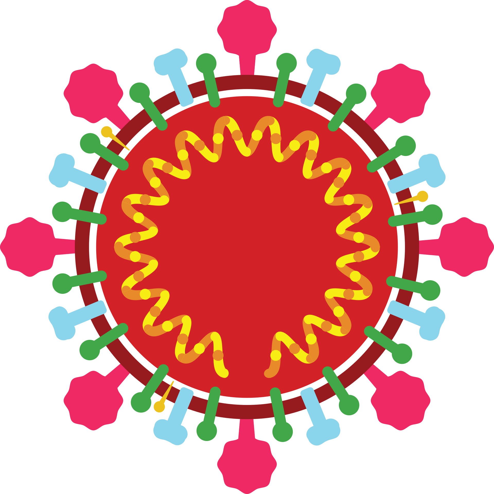

# PANDEMICS AND THEIR ORIGINS

# Glossary 
<!-- 1-6 -->

* **Amino acids:** the subunit molecules that form proteins
* **Antibody:** a protein produced by the host immune system that recognises an antigen and triggers an immune response       
* **Antigen:** a molecule or particle that can trigger an immune response          
* **COVID-19:** coronavirus disease 2019      
* **cDNA:** complementary DNA, a DNA molecule synthesised from an RNA template molecule      
* **CDC:** Centers for Disease Control and Prevention, based in the United States      
* **Cladogram:** it is a graphic representation of the ancestry relationship between organisms                 
* **Codon:** a group of three nucleotides that encode an amino acid       
* **DNA:** deoxyribonucleic acid, an information molecule forming the “base code” for a living organism       
* **ECDC:** European Centre for Diseases Prevention Control       
* **Endemic:** it refers to a disease that is prevalent in or restricted to a particular location, region, or population    
* **Epidemic:** it is an increase in the expected number of cases of a disease in a particular population and area  
* **Immune response:** a reaction from the organism to defend itself against a threat    
* **mRNA:** messenger RNA, the template for protein production         
* **NGS:** next-generation sequencing, a high throughput sequencing methodology       
* **Nucleotides:** the subunit molecules that form DNA and RNA molecules       
* **Outbreak:** it is a sudden increase in the expected number of cases of a disease in a limited area     
* **Pandemic:** it refers to an epidemic that has spread over several countries or continents, usually affecting a large number of people   
* **Pathogen:** a microorganism or infectious agent that can cause disease e.g virus, bacterium, protozoan, prion or fungus        
* **PCR:** Polymerase Chain Reaction, a technique to amplify DNA molecules      
* **Phylogenetic tree:** is a graphic representation of ancestry relationships, like a cladogram, but taking into account inferences on the genetic code similarities between the organism involved in the analysis         
* **PPE:** personal protective equipment, devices used to protect a person against risks to their health          
* **Polymer:** a chain of molecules or a large molecule composed of many repeating subunits     
* **Replication:** viral replication is the mechanism to generate new viruses during the infection, it is the process of virus multiplication           
* **Real-time PCR:** A PCR method that uses fluorescent dye labels to detect and quantify copies of DNA during the amplification process.    
* **Reverse transcription:** the process of synthesising a cDNA molecule from a template RNA using the enzyme reverse transcriptase.  
* **RNA:** ribonucleic acid, an information molecule, can be the “base code” for viruses.     
* **RT-qPCR:** Reverse Transcriptase Quantitative PCR, also known as reverse transcriptase real-time PCR. A PCR method to quantify RNA copies present in a sample; includes a step to synthesise cDNA from the template RNA before the PCR amplification.      
* **SARS-CoV-2:** Severe acute respiratory syndrome coronavirus 2      
* **Sequencing:** the process of “reading” genomic material such as DNA or RNA           
* **Taxon (plural taxa):** in biology, is a unit that represents one organism, a group of organisms or a population that shares similar characteristics    
* **Tagmented/Tagmentation:** A method of fragmenting DNA while adding a "tag" of nucleotides that can be tracked in the analysis    
* **Viral variant:** a virus that has one or more mutations in its genome     
* **VOC:** variant of concern, according to [WHO](https://www.who.int/en/activities/tracking-SARS-CoV-2-variants/) it is a SARS-CoV-2 variant which meets the definition of a VOI and that has been demonstrated to be associated with one or more of the following changes at a degree of global public health significance: a) increase in transmissibility or detrimental change in COVID-19 epidemiology; or b) increase in virulence or change in clinical disease presentation; or c) decrease in the effectiveness of public health and social measures or available diagnostics, vaccines and therapeutics        
* **VOI:** variant of interest, according to [WHO](https://www.who.int/en/activities/tracking-SARS-CoV-2-variants/) it is a SARS-CoV-2 variant a) with genetic changes that are predicted or known to affect virus characteristics such as transmissibility, disease severity, immune escape, diagnostic or therapeutic escape; and b) identified to cause significant community transmission or multiple COVID-19 clusters, in multiple countries with increasing relative prevalence alongside an increasing number of cases over time, or other apparent epidemiological impacts to suggest an emerging risk to global public health           
* **WGS:** Whole-genome sequencing       
* **WHO:** World Health Organisation

[Download the PDF here](assets/OC1_glossary.pdf)

# Hypotheses of where COVID-19 came from
<!-- 1-8 -->

**Wuhan, wildlife and ‘wet markets’**

On the 31st December 2019, the Wuhan Municipal Health Commission (China) reported a [cluster of cases of pneumonia of unknown cause](https://www.who.int/csr/don/05-january-2020-pneumonia-of-unkown-cause-china/en/) Many of these cases could be linked to a wet market nearby that sold a variety of wild animals for their meat. Though the exact origins of the virus remain hotly debated, many scientists believe that the Huanan Seafood Market represents a crucial location in the narrative history of SARS-CoV-2 (the virus which causes COVID-19 disease), as the site of significant transmission events.

The viral ancestor of SARS-CoV-2 is thought to have spread between animals. Evidence suggests that SARS-CoV-2 is a ‘zoonotic’ virus – meaning that it is a virus that has jumped from an animal to a human and causes disease. This is not surprising given that other coronaviruses are known to cause the common cold in humans and the SARS and MERS epidemics (which occurred earlier this century) were caused by related viruses of zoonotic origin. Such viruses might be widespread and of minor impact in their original animal population, but when they jump to humans they can cause symptomatic disease which, because of no prior exposure and therefore a lack of immunity to infection, may be severe in some people. Scientists were able to link SARS-CoV-2 to viruses in [horseshoe bats](https://www.nature.com/articles/nm.3985) by comparing their genetic codes. Viral genome analyses revealed a striking similarity between SARS-CoV-2 and bat coronaviruses, suggesting that the virus causing human disease might have evolved from a virus that was previously present in bats. In fact, it is suggested that the lineage responsible for giving rise to SARS-CoV-2 has been circulating unnoticed for decades in bats. 

However, bats were not available for sale at the Huanan market; therefore this virus might have [first emerged in another location](https://www.nature.com/articles/s41419-020-02995-9). However, it remains possible that the market was the site of a ‘super spreader’ event, where one individual infected many others. 

**The Evolution of SARS-CoV-2**    

Making the leap from one species to another is a rare event, and it represents a key turning point in the evolution of SARS-CoV-2 (Figure 1). In 2007, coronavirus scientists compared the prevalence of similar viruses in horseshoe bats to [“a time bomb” that “should not be ignored”](https://journals.asm.org/doi/10.1128/cmr.00023-07?permanently=true) – only 12 years later, SARS-CoV-2 - the evolutionary product of the predecessors these and other scientists warned of - emerged. 

<!-- Figure 1 --> 
{width=50%}

New coronaviruses evolve when subtle changes occur in their genetic code. These genetic changes (also known as ‘mutations’) can sometimes confer advantages to the virus, increasing its infectivity, and transmissibility, or even enabling it to cross the species barrier. The SARS-CoV-2 virus has continued to evolve and mutate, as seen in the Omicron variant which has around 50 mutations compared to the original Wuhan virus, around 30 of these in the Spike protein that we will learn about next week. The virus is likely to continue to find new ways to evade the immune system and transmit with higher efficiency. This process of evolution has occurred as part of the natural history of every infectious disease including the [Great Flu of 1918](https://www.cdc.gov/flu/pandemic-resources/1918-commemoration/1918-pandemic-history.htm), and the first [SARS outbreak of 2003](https://www.who.int/health-topics/severe-acute-respiratory-syndrome#tab=tab_1). 

**Sequencing the virus’ genetic code**

Reading the genetic code of the virus has enabled scientists to explore its origin. Genomic sequencing (the method by which the virus’ genetic code is ‘read’) continues to play a vital role in global public health and policymaking. In this course, you will learn about the fundamentals of SARS-CoV-2 genetics, the process of viral genome sequencing and how SARS-CoV-2 genome data can be used by clinicians, public health bodies and policymakers in the global fight against COVID-19.

**Further reading**

[The proximal origin of SARS-CoV-2](https://www.nature.com/articles/s41591-020-0820-9?fbclid=IwAR3QtKR9Z6C5wyVclIetOkzHggkgS_H10Sk-_y8CDoTINs10NXQo4QQEU1Q)

# What is a Virus?
<!-- 1-9 -->

Viruses are sub-microscopic infectious agents - much smaller than most bacteria - which infect cells, multiply by using the host's normal replicative functions and become released from the cell they have infected. Viruses can’t reproduce on their own – they need the host’s genetic machinery in order to replicate their own genetic code.

The virus core contains its genetic content – this can be DNA or RNA. The genetic material is then covered by a protective protein coat called a ‘capsid’, and some viruses have an additional 'envelope' layer (Figure 2). This may give the virus [a greater range between hosts (the ability to survive outside a host for longer and travel further) and aid in immune escape](https://www.ncbi.nlm.nih.gov/books/NBK8174/). The type of genetic material and its conformation are used to classify viruses according to the [Baltimore classification](https://viralzone.expasy.org/254).

<!-- Figure 2 -->

_Source: [Nature Reviews Biotechnology](https://www.nature.com/articles/s41579-021-00535-6)_

Even though viruses are simple structures, they exist in a variety of shapes and sizes. Some viruses, like SARS-CoV-2, are relatively large – measuring around 100th of a millimetre in diameter. Others like the rhinovirus (which causes the common cold) are much smaller – around one-third of the size of SARS-CoV-2. Some viral capsids are covered by a spiky protein envelope (such as SARS-CoV-1 and SARS-CoV-2), whereas others have no envelope at all (such as Poliovirus). Some viruses exist in more complex shapes – resembling a lunar lander, or a spider (such as the Bacteriophage depicted in Figure 2). [Some people debate whether they’re a true form of life](https://www.sciencedirect.com/science/article/pii/S1369848616300103?via%3Dihub)

Viruses infect all known species of life and they require an actively growing cell to replicate. They are usually specific to one type of cell, which ranges from a single free-living cell such as amoebae, up to a cell that forms part of a bigger multi-cellular organism like us.
Viruses have a reputation for being the cause of disease – but not all of them do! [The World needs viruses to function](https://www.bbc.com/future/article/20200617-what-if-all-viruses-disappeared) – and can even prove useful as [vital tools for scientific research](https://blog.addgene.org/using-virus-in-your-research-a-primer-for-beginners).

# The SARS-CoV-2 virus
<!-- 1-10 -->

SARS-CoV-2 is an RNA virus. RNA can be either single or double-stranded and the SARS-CoV-2 genome is composed of single-stranded RNA of just under 30,000 bases. 

To enter a cell, the virus must recognise and bind to a receptor. SARS-CoV-2 Spike uses as receptors two specific cell-surface proteins [(ACE2 and TMPRSS2)](https://www.sciencedirect.com/science/article/pii/S0092867420302294), most frequently found on cells in the upper and lower respiratory system. TMPRSS2 is found in higher quantities in the lungs than in the upper respiratory tract whereas the opposite is true for ACE2. It has been suggested that Omicron requires [more ACE2 receptors to enter the cell and is less efficient at using the TMPRSS pathway](https://www.nature.com/articles/d41586-022-00292-3), perhaps explaining the observed preference for upper respiratory tract infections with this variant. After entering host cells, the SARS-CoV-2 genome uses the cell machinery to produce copies of itself. In this process, called replication, the virus multiplies its RNA genetic code and generates its proteins. Two large proteins (ORF1a and ORF1b) are generated and will be broken down into the non-structural viral proteins (nps1-16). The [genome also encodes the structural proteins Spike (S), Envelope (E), Membrane (M) and Nucleoprotein (N)](https://www.sciencedirect.com/science/article/pii/S0888754320308764) and a few other proteins that interact with the cell function (Figure 3).  

<!-- Figure 3 -->
 

_Source: [RCSB PDB](https://pdb101.rcsb.org/learn/flyers-posters-and-other-resources/flyer/sars-cov-2-genome-and-proteins)_

All these pieces are then assembled into new viral particles and released from the cell to infect new cells. Some viruses may enter the bloodstream and find their way to organs other than the lungs such as the heart, brain and kidney. This may cause additional damage and wide-ranging symptoms. 

Figure 4 shows a schematic of SARS-CoV-2 replication within the host cell as well as the route from the lungs to secondary organs. Also shown are components of the host immune system which act to destroy the virus. Learn more about the different [components of the immune system.](https://www.ncbi.nlm.nih.gov/books/NBK27092/)

<!-- Figure 4 -->   
![The SARS-CoV-2 replication and pathogenesis. (a) SARS-CoV-2 infects the upper and lower respiratory tract. (b) The virus replication from 1 to 12 has been described as: (1-2) The virus identifies the ACE-2 receptor. (2) The Spike (S) protein of SARS-CoV-2 binds to the ACE-2 receptor. (3, 4) The virus-receptor internalization occurs and a membrane fusion is carried out followed by the release of the viral genome inside the cell. (5–7) Replication of viral genetic code and generation of viral proteins. (8–10) Assembly of new viral particles. (11–12) Budding of recently formed viral particles from the infected cell. (c) The virus disseminates to the other part of the body through blood affecting the brain, heart, liver spleen, large intestine and kidneys](images/OC1_1-10_Fig2_infection_scheme.png)

_Source: [Respiratory Research](https://doi.org/10.1186/s12931-020-01581-z)_

# What is the difference between pandemic, epidemic, and outbreak?
<!-- 1-11 -->

<!-- YT: https://youtu.be/uhu7fQ5PEoY -->   
<iframe width="560" height="315" src="https://www.youtube.com/embed/uhu7fQ5PEoY" title="YouTube video player" frameborder="0" allow="accelerometer; autoplay; clipboard-write; encrypted-media; gyroscope; picture-in-picture; web-share" allowfullscreen></iframe>

[Download the transcript here](assets/Pandemic_epidemic_etc_with_audio_7_1_22.pdf)

In this recorded lecture, Dr Teresa Cutiño-Moguel from Barts Health, United Kingdom explains the differences between the terms: pandemic, epidemic, endemic and outbreak. Each is related to the spread and presence of a disease, but all have different meanings. 

Do you recognise the diseases mentioned in the video? Are there other diseases causing epidemics in your country? Please share in the comments below! 

_Erratum: After the video editing we noticed a mistake. At 3:00 Teresa says: "Well, **epidemic** is the baseline level of a disease". She meant to say "**endemic** is the baseline level of a disease."_

# Transmission of respiratory viruses
<!-- 1-12 -->

Viral transmission is the process through which viruses spread between hosts and includes the spread to members of the same host species or different species.

**Transmissibility**

Transmissibility is how easily a disease-causing pathogen can spread from an infected person to a susceptible person. It is determined by the infectivity of the pathogen, the susceptibility of the exposed individual, the contagiousness of the infected individual, the amount of contact between these two and other environmental factors such as air movement during the transmission event. To estimate transmissibility in the population, mathematical models are used with the aid of surveillance data. The basic reproduction number (R0) or secondary attack rate (SAR) is used as a measure of transmissibility. 

**Modes of transmission**

[Respiratory viruses are transmitted](https://www.nature.com/articles/s41579-021-00535-6) through the release of a viral particle from the respiratory tract of an infected person and transferred to the respiratory tract of a susceptible one. There are different modes through which this can happen. All of them can be modified by the environment and many modes are generally involved during transmission including direct and indirect contact (fomites - any object or surface that can facilitate transmission), droplets and aerosols. Early studies of pulmonary tuberculosis calculated that particles of less than 5 μm would deposit in the lungs, whereas larger ones (over 5 μm) would only reach the nasal cavity. More recently, it has been suggested that particles between 30-100 μm can produce aerosols, which are a suspension of solid and liquid particles in the air. By contrast, droplets are larger liquid particles that cannot remain suspended and fall to the ground in a shorter time and over a shorter distance. The surrounding and exhaled air also have an effect on the propulsion of particles (composition, humidity, airflow, temperature) thus allowing “larger” particles to travel further than would be expected based on their size only (Figure 5).

Due to its ability to replicate in the upper gastrointestinal tract, SARS-CoV-2, like some other beta-coronaviruses, also has been shown to transmit via a faecal-oral route.

<!-- Figure 5 -->   
![During an acute respiratory virus infection, an infected individual (infector; red) may shed the virus in exhaled breath droplets and aerosols, and may also contaminate their immediate bodily surfaces (for example, skin and clothes) or surrounding objects and surfaces (for example, tables) with their respiratory secretions. In general, if a susceptible individual (infectee; grey) is close to the infector, the short-range transmission may occur when the infectee breathes in the virus-laden droplets or aerosols released by the infector, during direct (physical) contact with the infector or during physical contact with objects or surfaces contaminated (fomite) by the infector. If the infected are at a distance from the infector, the long-range transmission may occur when the infectee breathes in the virus-laden aerosols released by the infector or during physical contact with a fomite. However, the terminology and the defining features of each mode of respiratory virus transmission, especially regarding redefining the particle size threshold between droplets and aerosols, is under active discussion (see the section Terminology and defining features of modes of transmission)](images/OC1_1-12_Fig_1.png) 

_Source: [Nature Reviews Microbiology](https://www.nature.com/articles/s41579-021-00535-6)_

**Determinants of transmission**

Viral, host and environmental factors determine the success of a transmission event. The structure of a virus (i.e. envelope vs non–enveloped, RNA vs DNA genome) will determine how stable it is in the environment. Viral proteins (such as the spike protein in SARS-CoV-2) determine the affinity of the virus for host cellular receptors.  The environment can facilitate transmission by allowing the survival of the virus on fomites or suspended as aerosols, or it can affect the behaviour of the host. Factors that can affect survival include temperature, salinity, pH, humidity, the material of contaminated objects or surfaces and ventilation. Host determinants in both the transmitter and the recipient of the virus are important: pre-existing immunity due to vaccination or natural immunity can modulate the propensity to transmit or to acquire a viral infection. Another key factor in the current pandemic is the impact of asymptomatic carriage, whereby individuals can carry and transmit the virus with no obvious symptoms.  

# Genomic technologies for tracking COVID-19
<!-- 1-13 -->

As the SARS-CoV-2 virus spread around the world, and more suspected cases of COVID-19 were emerging, there was a significant need for a diagnostic test with high accuracy.

Genomic technologies like sequencing and polymerase chain reaction (PCR) are used to study and identify an organism's “genetic signature”. You will learn more about these in the next activity. Sequencing was used to determine the genome of SARS-CoV-2. Once this genome sequence was available, a test could be developed to look for the presence of SARS-CoV-2 in a given sample. The PCR test uses a specific probe (primer) that will only give a positive result in the presence of the SARS-CoV-2 genome. 

Figure 6 depicts the timeline of the early outbreak response to the new respiratory infection that emerged in 2019. The pathogen was identified as a virus within a week, tests were developed and deployed that would have been simply impossible without the power of genomic technologies. Once the first sequences of the new virus nCoV (later classified as SARS-CoV-2) became publicly available in early January 2020, it was possible to quickly design the primers for the first PCR tests.

<!-- Figure 6 -->   

With accurate diagnostic tests, scientists were able to define the reproduction number (R)  of SARS-CoV-2. The R number is the average number of additional individuals infected (secondary infections) produced by a single infected individual. An R-value of “1” indicates that one infected individual will infect another person. At an R-value of “2”, one infected individual will infect two more individuals. Values lower than “1” indicate that infections are slowing - an R-value of “0.5” indicates that for every two infected individuals only one additional infection occurs. 

The infection growth rate shows how quickly numbers are changing by the day. It is an approximate percentage change in the number of newly infected individuals. If the growth rate is bigger than 0, the outbreak or epidemic is growing, and if the growth rate is less than 0, the epidemic is shrinking. 

Both R values and growth rates are useful for the definition of outbreak, epidemic and pandemic. 
Comment below your thoughts on what the definitions for COVID-19 may have been like without genomic technology, or if the technology took longer to develop. 

# The Great Influenza Pandemic of 1918
<!-- 1-14 -->

Whilst the current situation we are facing during this pandemic may feel unprecedented, it is important to remember that the World has faced a number of previous outbreaks of different viruses. One of the most notable previous pandemics was that of the 1918 Great Influenza outbreak, estimated to have killed more than 20 million people. 

Despite being over 100 years ago, many of the responses to influenza in 1918 can be recognised in how governments have reacted during the current pandemic. It was recognised early that transmission was through the air and the [British Medical Journal in October 1918](https://www.bmj.com/content/bmj/2/3016/439.full.pdf) reported that health officials believed the best measures for prevention were good ventilation, fresh air and the avoidance of crowded meetings. Responses varied internationally, with the United States taking measures to restrict non-essential meetings; bars and cinemas were closed and public funerals stopped. Some countries closed schools whilst others heavily resisted this. Influenza wards were created, sick people in the community were quarantined and mask-wearing was encouraged (though the effectiveness of this was hotly debated in different settings).

So what is different now? Crucially, in 1918, the pathogen causing the outbreak was not characterised at the time. It was initially believed to be of bacterial origin, in keeping with the prevailing thought that _Bacillus influenzae_ (now known as _Haemophilus influenzae_) was the causative agent of influenza. This assumption was challenged during the 1918 pandemic. Whilst many groups advocated for the use of vaccines and trials in susceptible individuals, the [Journal of the American Medical Association in December 1918 published](https://jamanetwork.com/journals/jama/article-abstract/219877) a conclusion from the American Public health Association that because of the unknown cause of influenza, an effective vaccine had no scientific basis. In the current pandemic, the [causative virus was identified quickly](https://www.nejm.org/doi/full/10.1056/nejmoa2001017) using a PCR screen for 22 known pathogens and an unbiased sequencing approach to detect novel agents, allowing the development of both diagnostic tests and rapid vaccine development. This was enabled by the use of the genomic technologies discussed in this course. 

To learn more about the 1918 pandemic and lessons learned for the future, watch this video:

<!-- YT: https://youtu.be/3x1aLAw_xkY --> 
<iframe width="560" height="315" src="https://www.youtube.com/embed/3x1aLAw_xkY" title="YouTube video player" frameborder="0" allow="accelerometer; autoplay; clipboard-write; encrypted-media; gyroscope; picture-in-picture; web-share" allowfullscreen></iframe> 

This video is hosted by a third party

This video is also available on the [University of Cambridge website](https://www.cam.ac.uk/research/news/spanish-flu-a-warning-from-history) 

# DNA, RNA and PCR
<!--1-15 -->

<!-- YT: https://youtu.be/6Zmv76CFzMw -->   
<iframe width="560" height="315" src="https://www.youtube.com/embed/6Zmv76CFzMw" title="YouTube video player" frameborder="0" allow="accelerometer; autoplay; clipboard-write; encrypted-media; gyroscope; picture-in-picture; web-share" allowfullscreen></iframe>

In this video, Dr Sophie Prosolek discusses the importance of genomics for sequencing and PCR methodologies. 

[Download the transcript here](assets/OC1_1-15_transcript.pdf)

Deoxyribonucleic acid (DNA) and ribonucleic acid (RNA) are amongst the most important molecules for life on earth – they’re responsible for the storage and translation of the genetic code. DNA and RNA are both linear polymers (chains of molecules) – they consist of sugars, phosphates, and bases, linked together in a chain (Figure 7).

<!-- Figure 7 -->     
{width=50%}

DNA is a double-stranded molecule comprising four nitrogenous ‘bases’, each strung together along a carbon backbone - these bases are known as adenine (A), thiamine (T), cytosine (C) and guanine (G).

The sequence in which DNA bases occur provides the genetic code within human cells. Some viruses, such as SARS-CoV-2, use RNA rather than DNA as their genetic material.

RNA is usually a single-stranded molecule, and it also comprises four nitrogenous bases. Like DNA, RNA contains adenine (A), cytosine (C), and guanine (G) - instead of containing thiamine (T) RNA’s fourth base is uracil (U). Although RNA is presented as single-stranded molecules for most of its biological functions, it can form double-strands to compose the genome of certain viruses or bend in double-helix to form transport RNA (tRNA), for instance.

The subtle differences between DNA and RNA have implications for viral sequencing. To read the genetic code of SARS-CoV-2, its RNA must first be converted to DNA – allowing it to be ‘read’ by the sequencing machine (Figure 8).

<!-- Figure 8 -->    
{width=50%}

[Download the table PDF file here](assets/OC1_1-15_DNA_RNA_table.pdf)

**Polymerase chain reaction** (PCR) was first developed by Kary Mullis & team in the [mid-1980s](https://www.sciencedirect.com/science/article/abs/pii/0076687987550236), revolutionising the way that clinical samples are tested. The development of PCR has enabled other techniques to be established, including sequencing, cloning and genetic engineering. This wider suite of genomic technologies has enabled clinicians and virologists to understand the characteristics of an active infection, interactions between the host and organisms, and the effectiveness of treatment regimens. Throughout the current pandemic, PCR has been used to diagnose COVID-19 and to provide a template for genomic sequencing, to characterise the specific virus within an infected individual.

PCR targets and amplifies a specific region of single or double-stranded DNA. The following components are required to conduct a PCR: two oligonucleotide primers that flank the DNA sequence being amplified, thermostable polymerase; nucleotides, buffer (including Mg2+, to create an optimal pH) and water.

PCR has 3 crucial steps:

1) **Denaturation** (about 95°C)- this is the separation of the strands of DNA by melting the double-strand templates apart. The melting temperature depends on the length and the sequence of the template in addition to the duration of the melting

2) **Annealing** (55-60°C)- this is the attachment of the primers targeting specific sequences. The temperature depends on the primers used. Protocols often use a temperature a few degrees below the melting temperature to enable the stable complexes to be formed with the target sequences and avoid binding with any other sequences.

3) **Elongation** (72°C)- this is the synthesis of new strands of DNA with the help of DNA polymerase, which is used to anneal the primers whilst stabilizing the complex.

These temperatures are regulated with a thermocycler, which can be programmed to change according to the PCR of interest. The experimental conditions are critical to the outcome of the PCR reaction. For example, if the annealing temperature is too high, there might be insufficient primer-template hybridization. If it’s too low, it could result in the creation of non-specific products, which are formed from a large number of base pair mismatches. It is important that the magnesium ion concentration is optimised for each primer being used. There is a balance between providing enough magnesium to provide stability to the polymerase, whereas too much magnesium can mean the primer binding may become non-specific. 

**PCR** is the amplification of nucleic acid which provides genetically identical copies. This amplifies the nucleic acid but it is not possible to quantify the amount of nucleic acid as the amount of product doesn't correlate with the amount of nucleic acid in the original sample. It is a qualitative technique. **End-point** PCR is visualised by the use of gel electrophoresis. 

**Pros:** Sensitive as only one copy of target DNA is sufficient, easy to use and is a rapid technique. **Cons:** There is a risk of false positives if there is cross-contamination; the analysis of the results is not automated, it requires the post-PCR processing to be able to read the results (gel electrophoresis and therefore poor resolution); it is not a quantitative method and therefore it does not provide information on template target DNA. 

[**Real-time PCR**](https://www.sciencedirect.com/science/article/pii/S0098299705000907), also known as **Kinetic PCR**, was developed in 1992 and allows for the semi-quantification of the amount of nucleic acid present. Measuring fluorescent dyes or probes enabled the proportional comparison of the amount of product made from amplification and the number of cycles required to form a threshold amount of amplified DNA. This approach has been used for [many years in virology](https://academic.oup.com/nar/article/30/6/1292/1115130) and has been utilised in the current pandemic to prioritise samples that are more likely to generate a good quality sequence. The PCR efficiency has to be calculated when considering this; usually, this represents a doubling of the amount of cloned nucleic acid per cycle of amplification. With this in mind, the amount of DNA molecules originally present in the sample can be measured. 

# What is Genome Sequencing?
<!-- 1-16 -->

Sequencing may appear to be a very challenging in-depth technology, but here we will break it down into steps and discuss the application of each step.

All living things have a unique code which is made up of RNA or DNA containing nucleotide bases. Sequencing is a technique that helps us to determine this unique code. 

Sanger sequencing was the first technique discovered by Frederick Sanger in the 1970s. This technique used radiolabelled partially digested fragments to discover the unique bases and was known as the chain termination method. However, this method was time-consuming and very expensive to determine small fragments of DNA.

The Human Genome Project (HGP) has led to changes that have dramatically changed our approach to disease diagnosis, and together with the development of sequencing-by-synthesis techniques (otherwise known as next-generation sequencing or NGS technologies) the cost and time to sequence have decreased considerably. The HGP enabled clinicians to find mutations within the DNA code which we now use to test for genetic disorders and personalised medicine. Today, we can sequence the whole genome of a human in 1-2 days and it is expected that this will continue to decrease in time and cost. 

<!-- YT: https://youtu.be/fCd6B5HRaZ8 -->   
<iframe width="560" height="315" src="https://www.youtube.com/embed/fCd6B5HRaZ8" title="YouTube video player" frameborder="0" allow="accelerometer; autoplay; clipboard-write; encrypted-media; gyroscope; picture-in-picture; web-share" allowfullscreen></iframe> 

This video is hosted by a third party

At the beginning of the 21st century, NGS methodologies became available and the development and improvement of these methods have been continuous. These are high-throughput sequencing platforms. Nowadays there are multiple NGS platforms available (see the videos explaining the Illumina and Oxford Nanopore Technologies, two examples used extensively within the early COG-UK consortium, although there are many others such as PacBio and Ion Torrent), and a variety of techniques and sequencing strategies. We will address the details of NGS later in our course series.

Since the COVID-19 pandemic began, the COG-UK Consortium has used NGS and viral Whole Genome Sequencing (WGS) technologies to find the unique code of the SARS-CoV-2 RNA genomes. Although different sequencing methods can be used, WGS has helped us to understand many different aspects of the virus in rapid time: its epidemiology and transmission, how the interventions and treatment are working and the biological understanding of the virus. Sequencing the human DNA from a large cohort of people who have been infected with the virus has allowed us to determine the genetic changes over time and understand how this translates into patient health and the genetic evolution of the virus during the pandemic. 

<!-- YT: https://youtu.be/qzusVw4Dp8w -->   
<iframe width="560" height="315" src="https://www.youtube.com/embed/qzusVw4Dp8w" title="YouTube video player" frameborder="0" allow="accelerometer; autoplay; clipboard-write; encrypted-media; gyroscope; picture-in-picture; web-share" allowfullscreen></iframe>

This video is hosted by a third party

# Tracking and reacting to outbreaks with genomic knowledge
<!-- 1-17 -->

<!-- YT: https://youtu.be/mlbVYNzVejE -->   
<iframe width="560" height="315" src="https://www.youtube.com/embed/mlbVYNzVejE" title="YouTube video player" frameborder="0" allow="accelerometer; autoplay; clipboard-write; encrypted-media; gyroscope; picture-in-picture; web-share" allowfullscreen></iframe> 

[Download the transcript here](assets/Tapfumanei_Talk_outbreaks_zim.pdf)

[Download the slides here](assets/Zimbabwe_AMR_StoryT_Mashe_wAlt_Text.pdf)

Watch Dr Tapfumanei Mashe from the Ministry of Health and Child Care, Zimbabwe explains how genomics was used to track and respond to cholera outbreaks in his country. 

Cholera is caused by bacteria, specifically the species: _Vibrio cholerae_, however many of the approaches used in surveillance are similar to those used for viruses.

Bacteria can carry DNA external to their genomes in transmissible elements called "plasmids". 

Tapfumanei explains that resistance genes carried on plasmids can give _Vibrio cholerae_ the ability to resist certain treatments (Figure 9).

<!-- Figure 9 -->    

_Source: [NEJM](https://www.nejm.org/doi/full/10.1056/NEJMc2004773)_

He also gives the example of discovering that Typhoid, caused by _Salmonella typhi_, also carried genetic material conferring resistance to ciprofloxacin (a commonly used antibiotic). 

By sequencing samples from Typhoid cases, researchers could show where resistance was spreading, and health teams were able to respond by increasing vaccination in those areas.

# How is SARS-CoV-2 sequencing done?
<!-- 1-18 -->

There are many sequencing technologies used for SARS-CoV-2 (Figure 10). Here we will approach a broadly used protocol based on viral WGS. The method consists of viral RNA isolation, Library preparation, Sequencing run and Analysis. 

<!-- Figure 10 -->    
![Methods for SARS-CoV-2 genome sequencing. **a.)** In Illumina’s Nextera DNA Flex Enrichment protocol cDNA is tagmented and made into barcoded sequencing libraries, which are then enriched using sequence capture with a respiratory virus panel containing probes against SARS-CoV-2. **b.)** In the ARTIC protocol, first-strand cDNA is enriched by amplifying with two pools of primers to generate amplicons tiling the SARS-CoV-2 genome. These amplicons are then subjected to either Illumina or Oxford Nanopore library preparation, using methods that either directly add adapters to the ends of the amplicons or fragment them to enable sequencing on a wider variety of Illumina instruments. **c.)** The tailed amplicon approach, developed here, enriches first-strand cDNA using ARTIC v3 primers containing adapter tails. This allows functional sequencing libraries to be created through a second indexing PCR reaction that adds sample-specific barcodes and flow cell adapters](images/OC1_1-18_fig_1.png 

_Source: [BMC Genomics](https://bmcgenomics.biomedcentral.com/articles/10.1186/s12864-020-07283-6#Fig1)_

**Viral RNA Isolation**

_1. Viral inactivation_  
Sequencing of SARS-CoV-2 first requires the inactivation of live virus either by heat or inactivating buffer so that the laboratory worker can handle the sample without putting themselves at risk. This procedure is carried out at various Biosafety Levels (BSL) worldwide. In the UK, prior to the current pandemic, this viral isolation would have been carried out at BSL3 facilities, but in early 2020, Public Health England issued a directive allowing this work to be completed at BSL2+. At which BSL is SARS-CoV-2 inactivation carried out in your country? Comment below. 

_2. Extraction of nucleic acid_  
The sample requires extraction of the nucleic acid so there is nothing else in the sample which could inhibit the sequencing. Extraction is normally performed by lysing (breaking down) the virus. It can be performed using commercial kits or using magnetic beads to separate the nucleic acids from other materials in the sample. A range of buffers and alcohol suspensions are used to elute the nucleic acid into a final solution which is usually molecular-grade water. 

**Library preparation**

_1. complementary DNA synthesis (not used for all technologies)_     
RNA extracts must be converted to cDNA because amplification methods, such as PCR, require DNA molecules as a template. A reverse transcriptase enzyme is used to synthesize the cDNA. 

_2. PCR Set-up and Amplification (not used for all technologies)_  
The cDNA is then added to a reaction mix including PCR reagents and SARS-CoV-2 specific primers, each targeting small regions of the viral genome. A specific primer targeting strategy is used to ensure that the entire genome is covered by these small regions. Samples are placed in a thermocycler, where amplification takes place. At the end of the process, millions of viral DNA fragments are generated.

_3. Index PCR Set-up_  
NGS technologies allow multiplexing, ie. pooling several different samples in a single sequencing run. In this process oligonucleotide indexes are added to each individual sample, ‘barcoding’ them, using a PCR procedure. This allows the individual samples to be separated computationally after sequencing. 

**4. Sample Pooling**  
The concentration of the DNA of the barcoded samples is measured and equal amounts of DNA from each sample are pooled in a single tube. 

**5. Clean-Up**  
NGS methodologies are highly sensitive. Inhibitors and reagent residues must be removed through DNA purification. It is strongly recommended to use magnetic beads purification protocols for the clean-up step. 

**Sequencing run**

Depending on the technology used, the samples are loaded onto a flow cell and run on a sequencer that will generate fluorescent reads which can be captured by a camera or one which passes the entire molecule through a Nanopore and captures the sequence in real time.  

**Analysis**

Sequencing data is demultiplexed and the viral genome is assembled (similar to an alignment) using bioinformatics tools. There are many analysis pipelines, most commonly using command-line, but there are also graphic interface tools. 

**SARS-CoV-2 ARTIC Protocols**     
There are specific ARTIC Network-derived protocols available for both [Illumina](https://www.protocols.io/view/ncov-2019-sequencing-protocol-for-illumina-b2msqc6e) and [Oxford Nanopore Technologies](https://www.protocols.io/view/ncov-2019-sequencing-protocol-v3-locost-bh42j8ye) platforms.

If you are interested in seeing a sequencing workflow in a laboratory, see this video (note, the video is silent) :

<!-- YT: https://youtu.be/0iok-W3N_Iw -->     
<iframe width="560" height="315" src="https://www.youtube.com/embed/0iok-W3N_Iw" title="YouTube video player" frameborder="0" allow="accelerometer; autoplay; clipboard-write; encrypted-media; gyroscope; picture-in-picture; web-share" allowfullscreen></iframe>

This video is hosted by a third party

