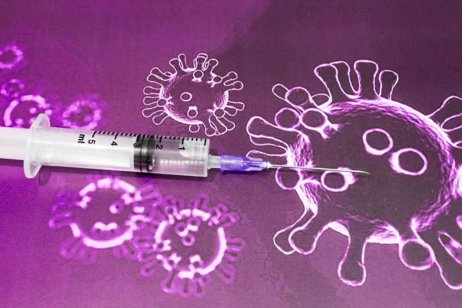

# VIRUSES, VARIANTS AND VACCINES

        
@Canva

# What came before? Comparison with other coronaviruses (MERS/SARS)
<!-- 2-2 --> 

As you will almost certainly have been aware before this course, the current pandemic is caused by a coronavirus, but this is not the first coronavirus outbreak in recent times. Severe acute respiratory syndrome (SARS) and Middle East respiratory syndrome (MERS) were discovered in the first and second decades of this century, respectively. 

The first reported cases of SARS were in Foshan, China in November 2002. By February 2003, more than 300 cases had been reported with over a third of those in healthcare workers. By April 2003 WHO-led efforts had identified SARS-CoV as the causative agent of the disease. Due to the infection control measures, no further cases were identified after July 2003. Overall the pandemic ended with 8096 reported cases and 774 deaths across 27 countries.

MERS was first identified in June 2012, following the death of a man in Saudi Arabia from acute pneumonia and renal failure. In contrast to the SARS timeline, MERS-CoV was isolated from the sputum of this index case, demonstrating the advances in pathogen genomics during the intervening years. There was a cluster of travel-related cases in the UK in September 2012 and in 2015 a hospital-related (nosocomial) outbreak in South Korea involving 16 hospitals and 186 patients, but the overwhelming majority of cases were observed in Saudi Arabia. As of January 2020, there had been 2,494 laboratory-confirmed cases notified to WHO across 27 countries and resulting in 858 deaths. 

Similarities between these two coronavirus outbreaks include the likely zoonotic origin (potentially from [civets in a wet market for SARS](https://urldefense.proofpoint.com/v2/url?u=https-3A__www.science.org_doi_10.1126_science.300.5624.1351a&d=DwMGaQ&c=D7ByGjS34AllFgecYw0iC6Zq7qlm8uclZFI0SqQnqBo&r=BIi1VwYifOhJ7pwUPr5jXze5qiUo9NNI0oV0eYcgVb8fohvdGgKCJjPD64xrL_e1&m=0-AqYgT50QMsDh2aKDLwk1tSxhZDZHsbXgdgY4ro5WsnL8cnCtWSYn9lQywbEHdf&s=ADliXScEB6f1hO6opgubeJ3t732LT1KB7HABq2uD_Do&e=) and [dromedary camels for MERS](https://urldefense.proofpoint.com/v2/url?u=https-3A__pubmed.ncbi.nlm.nih.gov_25248734_&d=DwMGaQ&c=D7ByGjS34AllFgecYw0iC6Zq7qlm8uclZFI0SqQnqBo&r=BIi1VwYifOhJ7pwUPr5jXze5qiUo9NNI0oV0eYcgVb8fohvdGgKCJjPD64xrL_e1&m=0-AqYgT50QMsDh2aKDLwk1tSxhZDZHsbXgdgY4ro5WsnL8cnCtWSYn9lQywbEHdf&s=gLd4Svn9wWsoed7NsH3av9jB1NKsyd_JWVQ3OHJRR2U&e=)), and the high percentage of nosocomial cases involving both patients and healthcare personnel. This is likely due to the late peak viral shedding observed around 10 days after the onset of infection, at which time individuals had already been hospitalised. 

However, the case fatality rate differed in both pandemics - ~10% for SARS and ~36% for MERS. In the current pandemic, the unprecedented amount of testing, surveillance and tracing has led to a far greater ascertainment of cases. Despite the recent case fatality rate being significantly lower than that of SARS and MERS, the absolute number of deaths is much higher, due to the global spread of SARS-CoV-2.  

These previous coronavirus pandemics provided both genomic and clinical guidance in the early stages of the current pandemic. 

In Figure 1, you can observe a timeline of previous pandemics and public health emergencies in history. The death toll of SARS-CoV-2 is significantly higher than the previous coronavirus epidemics of SARS-CoV-1 and MERS. Learn more about the history of pandemics in [this article from Visual Capitalist](https://www.visualcapitalist.com/history-of-pandemics-deadliest/).

 

_Source: [Visual Capitalis](https://www.visualcapitalist.com/history-of-pandemics-deadliest/)_

[Click here to enlarge the image](images/OC1_2-1_Fig1.jpeg)

[Download Figure 1 alt-text here](images/OC1_2-2_Fig1_alt-text.pdf)

# The disappearance of SARS
<!-- 2-3 -->    

<!-- YT: https://youtu.be/Q4BsQ3YSVDQ -->  
<iframe width="840" height="472" src="https://www.youtube.com/embed/Q4BsQ3YSVDQ" title="YouTube video player" frameborder="0" allow="accelerometer; autoplay; clipboard-write; encrypted-media; gyroscope; picture-in-picture; web-share" allowfullscreen></iframe>

[Download the transcript here](assets/OC1_2-3_transcript.pdf)

In this video, Sophie Prosolek explains what happened in the previous SARS epidemic and why SARS-CoV-2 is different.

# The mechanism of viral replication
<!-- 2-4 -->  

Viruses multiply within host cells – they require the host’s genetic replication machinery to express their own genetic code. Outside the host, viruses can’t multiply – but they can remain dangerous even on their own.  Viruses can live for hours or even days, in water droplets in the air or on hard surfaces in the home – that’s why maintaining good ventilation and washing your hands regularly can help keep an infection at bay.

In order to complete their replication cycle, viruses must enter a host cell, hijack its genetic replication machinery, and reassemble - exiting the host as new viral particles (Figure 2).

[Click here to enlarge the image](images/OC1_2-4_Fig2.png)

[Download Figure 2 alt-text here](images/OC1_2-4_Fig2_alt-text.pdf)

SARS-CoV-2 reaches human cells through the upper airway tract – entering the body through the mouth or nose. Spike proteins on the surface of SARS-CoV-2 help it attach to the human host cells. It can then inject its own genetic material. SARS-CoV-2 hijacks the host's genetic replication machinery, ensuring that its own structural proteins are transcribed. Once the virus has replicated everything it needs - it re-assembles into new and complete virus particles. The new, complete viruses then prepare for ejection from the host cell – a process called ‘budding’.

Finally, the virus undergoes one last modification - a cleavage of its Spike protein by a host cell enzyme. This cleavage primes the virus to go on and infect more host cells. Some variants have a higher proportion of the snipped Spike protein – this is why it’s so important to understand variant profiles alongside the mechanism of viral infection.

**Further reading**

[COVID-19/SARS-CoV-2 Pandemic](https://www.fpm.org.uk/blog/covid-19-sars-cov-2-pandemic/)

# The Coronavirus Spike Protein
<!-- 2-5 -->     

The spike protein is a defining characteristic of coronaviruses. Coronaviruses were named after "corona" the Latin word for crown, due to the spikes on the virus's surface. The spike protein binds to cell surface proteins allowing the virus to gain entry. Spike proteins are found all over the virus surface. 

In Figure 3 you can see a graphical representation of the SARS-CoV-2 spike protein. There are antibodies bound to the spike in this representation. The image represents the amino acids that form spike and antibody proteins, shown in magenta and yellow, respectively. The image was adapted from the [Protein Data Bank](https://www.rcsb.org)'s [molecule of the month series](https://pdb101.rcsb.org/motm/256). Feel free to explore that page for additional information. 

 

_Source: [RCSB PDB 101](https://pdb101.rcsb.org/motm/256)_

[Click here to enlarge the image](images/OC1_2-5_Fig3.png)

[Download Figure 3 alt-text here](images/OC1_2-5_Fig3_alt-text.pdf)

**Further reading**

[New coronavirus variant: what is the spike protein and why are mutations on it important?](https://theconversation.com/new-coronavirus-variant-what-is-the-spike-protein-and-why-are-mutations-on-it-important-152463)

[Explatiner: what is a spike protein?](https://www.snexplores.org/article/explainer-what-is-a-spike-protein)

[Structural and functional properties of SARS-CoV-2 spike protein: potential antivirus drug development for COVID-19](https://doi.org/10.1038/s41401-020-0485-4)

# What is a vaccine?
<!-- 2-7 -->    

<!-- YT:https://youtu.be/-muIoWofsCE --> 
<iframe width="840" height="472" src="https://www.youtube.com/embed/-muIoWofsCE" title="YouTube video player" frameborder="0" allow="accelerometer; autoplay; clipboard-write; encrypted-media; gyroscope; picture-in-picture; web-share" allowfullscreen></iframe>

[Downlod the transcript here](assets/OC1_2-7_transcript.pdf)

This video explains how vaccines help our bodies to recognise and fight diseases. You can learn more at the [Vaccine Knowledge Project website](https://vk.ovg.ox.ac.uk/vk/how-do-vaccines-work):

**How do vaccines work?**

A vaccine is a preparation that is used to stimulate the body’s immune response against diseases.
 
Live vaccines are active vaccines such as attenuated strains that replicate in a host. The pathogen, such as a virus or bacterium, has been weakened to reduce virulence to cause none or very mild disease in healthy people, which acts like a natural infection. Live vaccines stimulate the closest response to actual infection and therefore elicit good, strong, long-lasting immune responses.
 
A non-live vaccine does not have any live biological material and can’t cause the disease it is protecting. An adjuvant (a substance used to increase the immune response to the vaccine) is required, and several doses of inactivated vaccines may be required to evoke a sufficient immune response. 

Some examples of these are highlighted below:

* **Inactivated vaccines:** suspensions of whole intact killed pathogens e.g. whole-cell pertussis (bacteria), inactivated poliovirus  
* **Sub-unit vaccines:** contain one or a few components (sub-units) of the pathogen which is important in protection e.g. hepatitis B vaccine which uses only surface proteins of the virus  
* **Conjugate vaccines:** These conjugate a poorly immunogenic antigen and a protein carrier that is highly immunogenic, providing a lasting immune response e.g. _Haemophilus influenzae B_ (Hib) vaccine uses bacterial polysaccharides combined with its capsule proteins 
* **Toxoid vaccines:** based on the toxin produced by bacteria that evades the bloodstream and causes most of the disease symptoms e.g. Tetanus and diphtheria vaccines  
* **mRNA vaccine:** Messenger RNA (mRNA) vaccines give information to cells on how to make a protein that will trigger an immune response e.g. SARS-CoV-2 vaccine

# Some vaccine approaches used for COVID-19
<!-- 2-9 -->  

<!-- YT: https://youtu.be/cxAbEZ4jrmw -->   
<iframe width="840" height="472" src="https://www.youtube.com/embed/cxAbEZ4jrmw" title="YouTube video player" frameborder="0" allow="accelerometer; autoplay; clipboard-write; encrypted-media; gyroscope; picture-in-picture; web-share" allowfullscreen></iframe>

This video is hosted by a third party

[Download the transcript here](assets/OC1_2-9_transcript.pdf)

This video explains the various types of vaccines used for SARS-CoV-2 virus and COVID-19 disease. The cell is compared to a factory, and this example is used to explain the various kinds of vaccines and how these interact with a cell. 

# Up next - sequencing for vaccine development
<!-- 2-10 -->   

<!-- YT: https://youtu.be/R8ieQ2r6VTI  -->
<iframe width="840" height="472" src="https://www.youtube.com/embed/R8ieQ2r6VTI" title="YouTube video player" frameborder="0" allow="accelerometer; autoplay; clipboard-write; encrypted-media; gyroscope; picture-in-picture; web-share" allowfullscreen></iframe>

[Download the transcript here](assets/OC1_2-10_transcript.pdf)

In this video, Sophie Prosolek explains why sequencing is important for vaccine development.

# The importance of sequencing in vaccine trials
<!-- 2-11-->     

**Introduction**

Viruses replicate and evolve constantly. These changes may alter how effective a vaccine is against the currently circulating viruses. The best way of detecting these alterations is by genomic sequencing.

When a virus or bacterium enters a host, such as humans, the host has an innate (nonspecific) immune defence and an adaptive (specific) immune response.  The innate response includes cell membranes, mucus, enzymes, cytokines, Toll-like receptors, and macrophage cells. The adaptive immune response includes antibodies, B- and T- lymphocyte cells (part of the ‘white blood cells).

A vaccine aims to stimulate the adaptive immune response so that it ‘remembers’ and will more quickly recognise and protect against future infections by the targeted pathogen. 

Figure 4 shows how antibodies (produced by the adaptive immune system’s B-cells) can attach to the surface of the virus or bacterium. These attached antibodies can prevent the virus from attaching to and entering the cell by blocking the binding site at the tip of the virus spikes. They can also activate a complement cascade, and flag to immune cells, such as macrophages to engulf (phagocytose) the virus.

 

_Source: [NIH](https://www.nih.gov/news-events/news-releases/clinical-trials-monoclonal-antibodies-prevent-covid-19-now-enrolling)_

[Click here to enlarge the image](images/OC1_2-11_fig1.png)

[Download Figure 4 alt-text here](images/OC1_Fig4-5_alt-text.pdf)

A vaccine can also stimulate the development of a T-cell response, for example, CD4 T-cells can increase the antibody response, and CD8 T-cells identify and remove host cells that have been infected by the virus.

**Vaccine development**

Before COVID-19, developing and testing a new vaccine could take 10 to 15 years due to the time to identify and test targets, run clinical trials, the time the regulatory agencies take to evaluate the data presented and other factors related to vaccine development. However, vaccine technology has evolved over the years:

* Attenuated (weakened, eg. heat-treated) live vaccines were the first vaccines used (eg. Anthrax, BCG);  
* Recombinant DNA inserted into yeast was later used to synthesise a surface protein from a virus or bacteria (eg. Hepatitis B surface antigen).  
* More recently [mRNA enclosed in lipid droplets or inside another viral vector](https://www.nature.com/articles/s41541-021-00292-w), can be used so the host body’s cells synthesize a part of the viral protein (eg. the SARS-CoV-2 Spike protein).

The unprecedented speedy development of COVID-19 vaccines was a result of available state-of-the-art vaccine technologies united to the parallelisation of clinical trial phases. Additionally, in response to this public health emergency, regulatory agencies processed COVID-19 vaccines as a top priority. 

In vaccine development, ‘Original Antigenic Sin (OAS)’ is an important phenomenon where “the [development of immunity against pathogens/antigens is shaped by the first exposure to a related pathogen/antigen.”](https://doi.org/10.4049/jimmunol.1801149). For example, if someone is first vaccinated using the Spike protein, then the body remembers the immune response it produced (eg. antibodies from B-cells, and T-cell response). If they are later exposed to the actual complete virus or even a different viral variant, the immune system will tend to respond in a similar way as it had to the Spike protein vaccination.

Different antibodies are produced in response to the COVID-19 vaccine (and to the virus itself), which bind to several positions on Spike. Knowledge of the RNA sequence and resulting protein structure and shape can help understand how antibodies to the existing vaccine spike protein would interact with the evolving virus. Figure 5 illustrates how different classes of antibodies bind to the receptor-binding domain (RBD) on the Spike protein. [Tong et al (2021)](https://www.cell.com/cell/fulltext/S0092-8674(21)00884-9) explain that “seven major epitopic regions of SARS-CoV-2 spike are consistently targeted by human antibodies”.

 

_Source: [C&EN](https://cen.acs.org/analytical-chemistry/structural-biology/Characterizing-SARS-CoV-2-antibodies/98/i40)_

[Click here to enlarge the image](images/OC1_2-11_Fig2.png)

[Download Figure 5 alt-text here](images/OC1_Fig4-5_alt-text.pdf)

**Vaccines Trials**

In developing a new vaccine, it is very important to determine, as early as possible, [how safe and effective the new vaccine is, and how long its effectiveness will last](https://www.jnj.com/innovation/the-5-stages-of-covid-19-vaccine-development-what-you-need-to-know-about-how-a-clinical-trial-works). Clinical trials of a new vaccine have four phases:

* Phase 1: the first time the vaccine is tested in humans, using a small group of healthy adults, to assess safety (recording side-effects) and immune response.  
* Phase 2a/2b: determines the most effective dose and generates more safety experience. It is tested on more people.  
* Phase 3: determines how effective the vaccine is. Volunteers are given either the vaccine or a placebo, observed for side effects, and followed up to see who subsequently develops an infection, and its severity. This is tested on hundreds or thousands of volunteers, as using a large number of people gives greater statistical power to the study. The results are submitted for approval to one of the international regulators (eg. MHRA/EMA/FDA).  
* Phase 4: monitors if the approved/licensed vaccine stays safe and effective when it is rolled out to the public.  

In phase 3, ideally, a fixed number of weeks after receiving the vaccine or placebo, each volunteer would be given a similar dose of identical strains of the pathogen, to compare the effectiveness of the vaccine versus the placebo. However, the severe, potentially fatal, effect of the SARS-CoV-2 in some volunteers, means that intentionally infecting participants could pose ethical challenges.

**Sequencing of Virus variants**

Some types of viruses and bacteria have fairly stable genomes over time, whereas others change (drift or evolve) to become more infectious and/or evade or suppress immunity in the host population or generate different symptoms that can be more or less severe. For example, the initial Wuhan SARS-CoV-2 lineage, replaced by Alpha, then later Delta, led to the emergence of a Delta+ (AY.4.2) variant, and [recently replaced by Omicron](https://covid19.sanger.ac.uk/lineages/raw) varied in terms of rates of infection and severity of symptoms. Not all variants or lineages will spread Worldwide and these events are random and scattered geographically. 

The current COVID-19 vaccines are mostly based on the original Wuhan variant, so these vaccines would be expected to be most effective against virus variants with a Spike protein most similar to Wuhan, and potentially less effective against variants with Spike proteins that differ significantly. Recent trials have looked at the benefits of updated vaccines focussed on Omicron sequences, however [caution is required when predicting which is the best vaccine to use](https://www.nature.com/articles/d41586-022-01771-3) in an ever-changing viral landscape. 

Sequencing of the virus variants can [benefit vaccine research](https://doi.org/10.2478/jvetres-2021-0029), including during the phase 3 and 4 trials. 

In Phase 3, sequencing enables comparison of the viral variants that subsequently infect people in the placebo with those in vaccinated groups, and between different age/risk groups. Thus, for example, an increased proportion of a particular viral variant in the vaccinated group (relative to the placebo group and relative to the current strains circulating in the population) could indicate that the vaccine is less effective against that variant. If some viral variants are associated with more severe symptoms than others, identifying the variant could help to determine whether there is an association between a particular variant and the severity of symptoms.  

The developing COVID-19 pandemic necessitated fast development and trials of vaccines, with the subsequent application for ‘emergency-use’ authorisation (EUA) from regulatory authorities to enable faster roll-out of vaccination programmes, to reduce the number of deaths. However, concerns have been raised that this speed resulted in data integrity issues in [Pfizer phase 3 COVID-19 vaccine trials](https://doi.org/10.1136/bmj.n2635). The shorter than typical phase 3 trials (median 2-month follow-up for EUA rather than the more usual FDA median of 1-4 years) mean that phase 4 has increased importance.

Virus sequencing can also be of benefit in Phase 4, especially in identifying the viral variants in ‘break-through’ infections - ie. in people who have been partially or fully vaccinated. Sequencing can also identify how the emerging variants in the general population are changing over time and any correlation between symptom severity and new variants. Genomic data can also inform decision-making on booster vaccinations, and whether the vaccine should be modified to use mRNA sequenced in more recent viral variants.

COVID-19 has become endemic: it can re-infect people who have been vaccinated or have had COVID-19. As such, similar to influenza vaccinations, annual or 6-monthly booster vaccinations may be needed for those at risk for many years, at least until a very effective treatment is developed to treat those at most risk. Thus, long-term sequencing of the virus will be needed to guide future development and trials of improved vaccines. 

**Summary**

Vaccines are an effective way to limit infection and spread of infectious diseases, and reduce the severity of symptoms. The ongoing COVID-19 pandemic has hastened the development and trials of several vaccines. Sequencing of the virus variants assists in vaccine development, and in phase 3 and 4 vaccine trials, and guides booster vaccine improvements for possible new viral variants for which existing vaccines may be less effective.

**Further reading** 

[Innate vs adaptive immunity](https://www.technologynetworks.com/immunology/articles/innate-vs-adaptive-immunity-335116) 

# How has genomics guided therapeutic design? 
<!-- 2-12 -->    

Therapeutics are required for individuals who become sick following COVID-19 infection, especially those who experience severe disease and are hospitalised. The severity of the disease can depend on several factors: previous COVID-19 vaccination, the strength of the immune system and factors yet to be discovered. As information evolves, the World Health Organisation has provided [living guidelines](https://www.who.int/publications/i/item/WHO-2019-nCoV-therapeutics-2021.3) about therapeutics, which are updated by experts as studies emerge and new drugs are brought to the market. Genomics can help us monitor the effectiveness of therapeutics as the pandemic progresses.

By using genomics, we can detect whether there are [changes in the viral genome](https://www.thelancet.com/journals/lanmic/article/PIIS2666-5247(21)00121-X/fulltext) that can influence how the virus behaves in a human body. There may be certain variants which can impact human health, increasing the severity of disease or the likelihood of someone being infected. Genomics can help us to understand why some medications may work better in some people than others and how we can we make therapeutics more effective.

The use of genomics has provided a database of information that can be used to improve and monitor therapeutic use. Openly shared international databases such as [GISAID](https://www.gisaid.org/phylodynamics/global/nextstrain/) provide information on viral genomes across the world. This shared data has enabled the design and manufacture of therapeutics that target regions of the SARS-CoV-2 viral genome. Most of them target the Spike protein, the region in the virus associated with entry into cells. The databases are regularly updated so that researchers and healthcare professionals across the world can be informed if variants emerge that can alter the effectiveness of a therapeutic option. 

Once therapeutics are available to treat patients, we can use genetic sequencing to detect mutations in the SARS-CoV-2 genome in the individual sequences which may alter therapeutic effectiveness. Treatment of individual patients with medications can be paired with genomic testing, and this information updates researchers to allow for therapeutic options to be updated.

Genomic sequencing can detect variations in the human genome which can affect how the immune system works to fight off COVID-19 infection. Because all humans have a genetic code that is unique to them, a particular therapy might be more effective in one person compared to another. Studies such as [The Genetics Of Mortality in Critical Care (GENOMICC)](https://genomicc.org/results/) have identified genes involved in antiviral immunity and lung inflammation that can make people susceptible to life-threatening COVID-19. This study identified mechanisms that are amenable to [targeted treatment with existing drugs](https://www.nature.com/articles/s41586-020-03065-y).

The [COG-UK mutation explorer](https://sars2.cvr.gla.ac.uk/cog-uk/) platform can be used to identify important changes in the SARS-CoV-2 genome and provides information on mutations of potential or known importance (Figure 6). This can enable studies that recognise the impact of the immune system on therapeutics.

_Source: [COG-UK/Mutation Explorer](https://sars2.cvr.gla.ac.uk/cog-uk/)_

[Click here to enlarge the image](images/OC1_2-12_Fig6.png)

[Download Figure 6 alt-text here](images/OC1_2-12_fig6_alt-text.pdf)

Monoclonal antibodies (mAb) are proteins produced in a laboratory that use similar processes to the human immune system to combat pathogens including viruses. [Ronapreve](https://www.ema.europa.eu/en/medicines/human/EPAR/ronapreve) is a combination of two human antibodies (casirivimab and imdevimab) which bind to the SARS-CoV-2 spike protein, preventing entry into human cells. The [COG-UK mutation explorer](https://sars2.cvr.gla.ac.uk/cog-uk/) has presented genomic pairing with monoclonal antibody performance, outlining the frequency of SARS-CoV-2 mutations emerging which affect the Ronapreve monoclonal antibody response.

It is essential that we increase the level of rapid international genomic surveillance to keep therapeutic options available and successful as the SARS-CoV-2 virus mutates and new variants emerge. International collaboration is crucial for future therapeutic design.  

# Variants Explained: Mutation, Variant, VOC
<!-- 2-13 -->    

<!-- YT https://youtu.be/md7r9cDhCkY -->           
<iframe width="840" height="472" src="https://www.youtube.com/embed/md7r9cDhCkY" title="YouTube video player" frameborder="0" allow="accelerometer; autoplay; clipboard-write; encrypted-media; gyroscope; picture-in-picture; web-share" allowfullscreen></iframe>

[Download the transcript here](assets/Oc1_2-13_transcript.pdf)

[Terms and Conditions to reproduce the video](https://www.cam.ac.uk/about-this-site/terms-and-conditions)

In the video, the Variant Hunters, part of a team of scientists working in the UK's sequencing effort to combat COVID-19 discuss their work tracking SARS-CoV-2 variants. 

The SARS-CoV-2 virus has genetically changed gradually over time from the original Wuhan-1 strain at beginning of the pandemic. This has led to multiple variants of the virus circulating globally. Some of these variants, based on the mutations in the genome, have been classified as VOCs and VUIs as they carry an increased risk to global public health. This could be in the form of increased transmissibility, increased virulence or decreased effectiveness of public health measures for VOCs. Variants are classified as VUIs if they carry predicted genetic changes that could increase transmissibility, severity or immune escape and have been shown to cause community transmission in multiple countries alongside the increasing number of cases over time. 

Classification of these variants and associated lineages is primarily done by three large working groups [Pango](https://cov-lineages.org/index.html), [NextStrain](https://nextstrain.org/) and [GISAID](https://www.gisaid.org/). The VOC/VUI nomenclature for variants is primarily used in the UK. The [WHO](https://www.who.int/en/activities/tracking-SARS-CoV-2-variants/) classifies variants as VOC, Variants of Interest (VOI) and Variants under Monitoring (VUM). [ECDC](https://www.ecdc.europa.eu/en/covid-19/variants-concern) primarily follows the WHO classification but also has an additional category of De-escalated Variants. The [CDC](https://www.cdc.gov/coronavirus/2019-ncov/variants/variant-info.html) nomenclature includes Variant Being Monitored (VBM), VOI, VOC, and Variant of High Consequence (VOHC). 

Although some of the terms used in the classification overlap between these organisations, the list of variants defined within each group differs slightly between each organization. In the steps ahead you will see a table of VOC/VUI defined by UK Health Security Agency along with variants that are being monitored. Relevant classification from other organizations is also provided.

# Tracking across a nation
<!-- 2-14 --> 

<!-- YT https://youtu.be/HsM5OtvT8cI -->       
<iframe width="840" height="472" src="https://www.youtube.com/embed/HsM5OtvT8cI" title="YouTube video player" frameborder="0" allow="accelerometer; autoplay; clipboard-write; encrypted-media; gyroscope; picture-in-picture; web-share" allowfullscreen></iframe>

[Download the transcript here](assets/OC1_2-14_transcript.pdf)

[Download the presentation slides here](assets/OC1_2-14_slides.pdf)

Being able to track viruses across a nation requires an entire network of scientists and health workers. In this recorded lecture you will hear from Dr Mariana Viegas, from the [Proyecto Argentino Interinstitucional de genómica de SARS-CoV-2 (PAIS)](http://pais.qb.fcen.uba.ar/) on how this network was used for genomic surveillance and tracking of coronaviruses in Argentina. 

# SARS-CoV-2 Variants
<!-- 2-15 -->     

The World Health Organisation (WHO) [classifies variants](https://www.who.int/en/activities/tracking-SARS-CoV-2-variants/) according to criteria which include the variant make-up and the spread of the variant virus.

Pango is short for [PANGOLIN](https://cov-lineages.org/resources/pangolin.html) classification. PANGOLIN stands for Phylogenetic Assignment of Named Global Outbreak Lineages. This is a tool that allows a user to classify a coronavirus based on its genetic relatedness to others. Genetic relatedness is rooted in its genetic lineage (the virus strain which came before it). Phylogenetics is the study of the genetic evolutionary lineage of an organism.

Other largely used systems to classify and name SARS-CoV-2 variants are [Nextstrain clade](https://nextstrain.org/blog/2021-01-06-updated-SARS-CoV-2-clade-naming) and [GISAID clade](https://www.gisaid.org/resources/statements-clarifications/clade-and-lineage-nomenclature-aids-in-genomic-epidemiology-of-active-hcov-19-viruses/)

**Variants of concern (VOC)**

To be considered a VOC, a VOI must meet one or more of the following criteria, at a level that has a significant effect on public health:

* Increase in transmissibility or detrimental change in COVID-19 epidemiology; OR

* Increase in virulence or change in clinical disease presentation; OR

* Decrease in the effectiveness of public health and social measures or available diagnostics, vaccines or therapeutics.  

_Table 1 - SARS-CoV-2 variants of concern. In June 2022 only Omicron is considered a variant of concern (VOC). Alpha, Beta, Gamma and Delta are previously circulating VOCs._

| WHO Label | Pango lineage | GISAID clade | Nextstrain clade | Earliest documented samples | 
| ------- | ------- | ------- | ------- | ------- |
| Alpha | B.1.1.7 | GRY | 20I (V1) | United Kingdom Sep-2020 |
| Beta | B.1.351 | GH/501Y.V2 | 20H (V2) | South Africa May-2020 |
| Gamma | P1 | GR/501Y.V3 | 20J (V3) | Brazil Nov-2020|
| Delta | B.1.617.2 | G/478K.V1 | 21A, 21I, 21J | India Oct-2020 |
| **Omicron**| **B.1.1.529** | **GR/484A** | **21K, 21L, 21M, 22A, 22B, 22C** | **Multiple countries Nov-2002** |

NB: Omicron lineage includes BA.1, BA.2, BA.3, BA.4, BA.5 and descendent lineages. 

_Source: [WHO](https://www.who.int/en/activities/tracking-SARS-CoV-2-variants/)._  

**Variants of concern under monitoring (VOC-LUM)**

Since its emergency Omicron has already displaced other co-circulating SARS-CoV-2 variants. Thus, WHO has added a new category termed VOC-LUM to identify VOC lineages that may require prioritised attention and monitoring. 

A VOC-LUM is:

* A variant that, according to phylogenetic analysis, belongs to a currently circulating VOC; AND

* Shows signals of transmission advantage compared to other circulating VOC; AND

* Has additional amino acid changes that are known or suspected to confer the observed change in epidemiology and fitness advantage as compared to other circulating variants. 

#Variants of interest (VOI)#

There is no current circulating VOI. To be considered at VOI, a SARS-CoV-2 variant must meet these two criteria:

* With genetic changes that are predicted or known to affect virus characteristics such as transmissibility, disease severity, immune escape, diagnostic or therapeutic escape; 

* Identified to cause significant community transmission or multiple COVID-19 clusters, in multiple countries with increasing relative prevalence alongside an increasing number of cases over time, or other apparent epidemiological impacts to suggest an emerging risk to global public health.  

# Variants arising all over the world
<!-- 2-16 -->    

<!-- YT https://youtu.be/KEfs8LB7ETM -->     
<iframe width="840" height="472" src="https://www.youtube.com/embed/KEfs8LB7ETM" title="YouTube video player" frameborder="0" allow="accelerometer; autoplay; clipboard-write; encrypted-media; gyroscope; picture-in-picture; web-share" allowfullscreen></iframe>

[Download the transcript here](assets/OC1_2-16_transcript.pdf)

With genomic surveillance networks hard at work within their own countries, the world is able to unite its data so that global movements in the pandemic can be understood. 

In this video, you will see variants tracked from the beginning of the pandemic until the end of December 2021. This video was made using [Nextstrain](https://nextstrain.org) - an open-source project to harness the scientific and public health potential of pathogen genome data. NextStrain uses data aggregated by GISAID. [GISAID](https://www.gisaid.org) is a non-profit organisation that encourages rapid data sharing for influenza and coronaviruses. GISAID was [formed](https://www.gisaid.org/about-us/history/) in response to the influenza outbreaks in 2006, and years later has proven to be critical for responding to coronaviruses causing COVID-19. 

