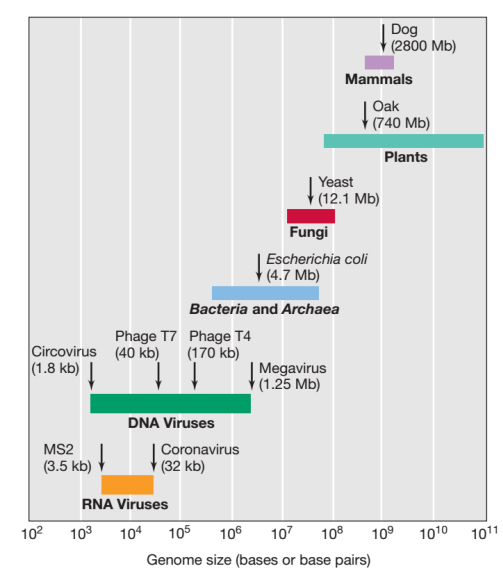
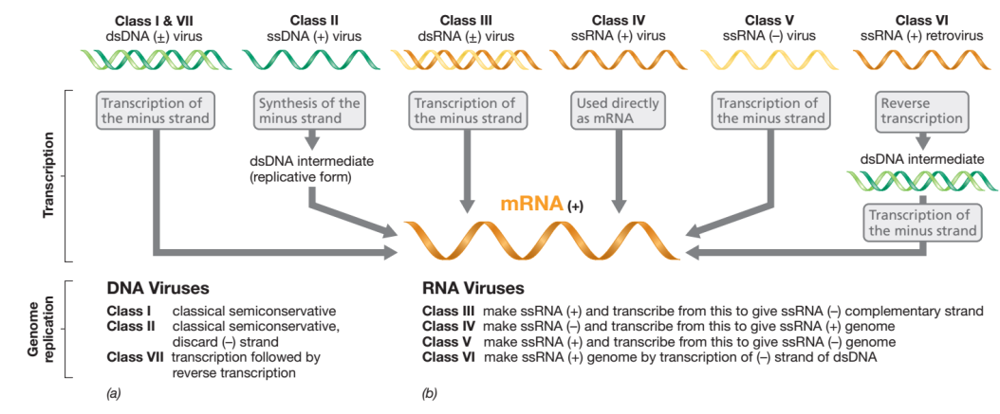
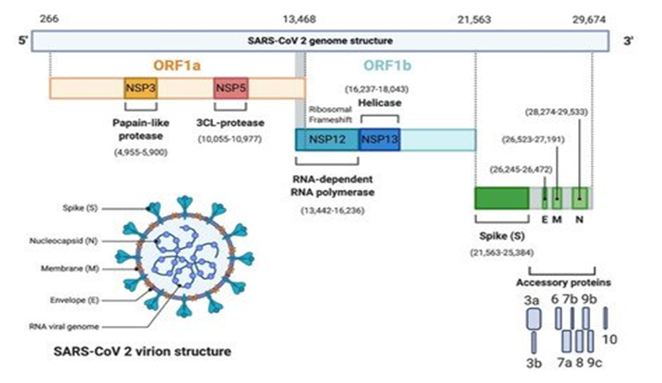
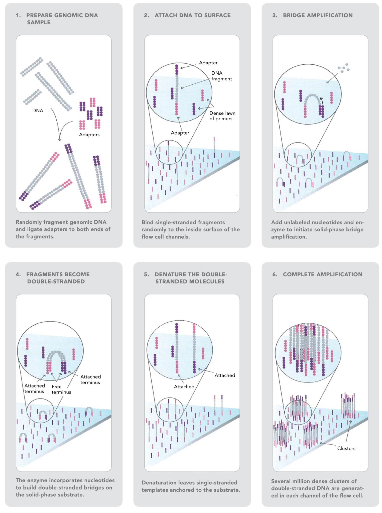
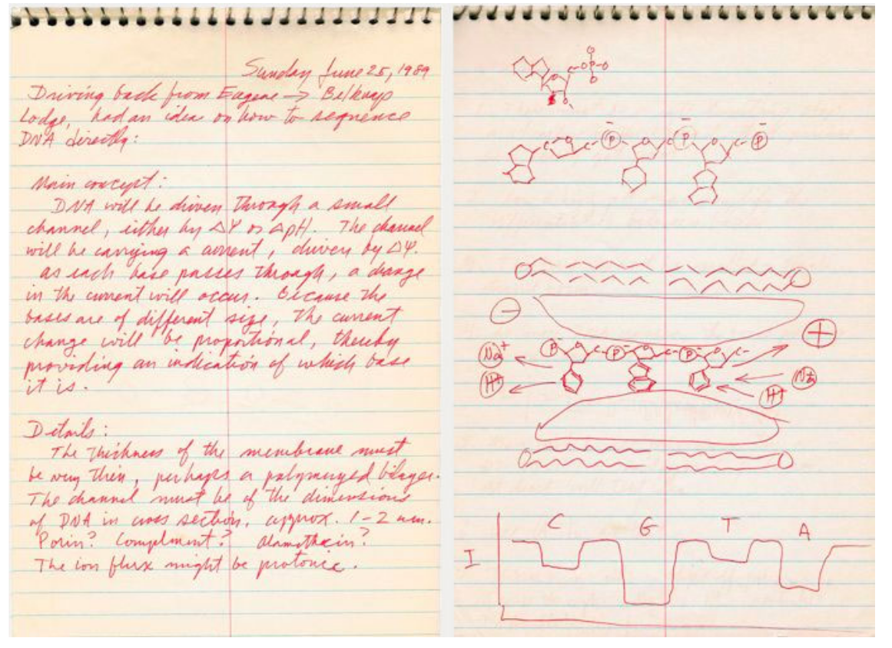
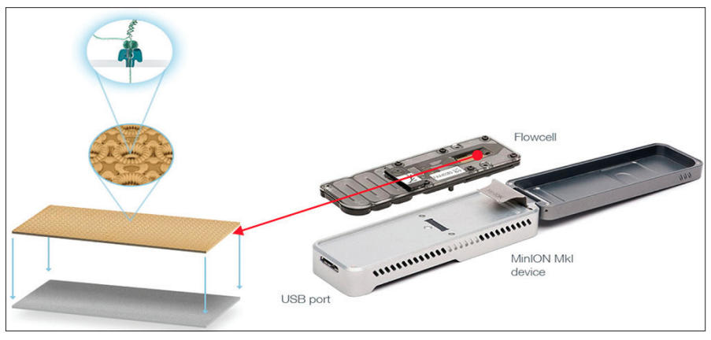
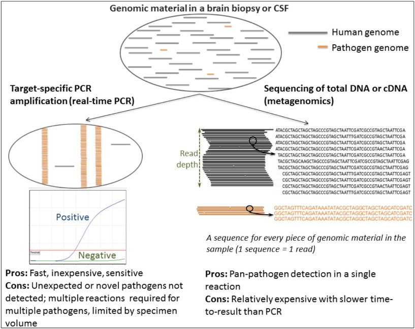
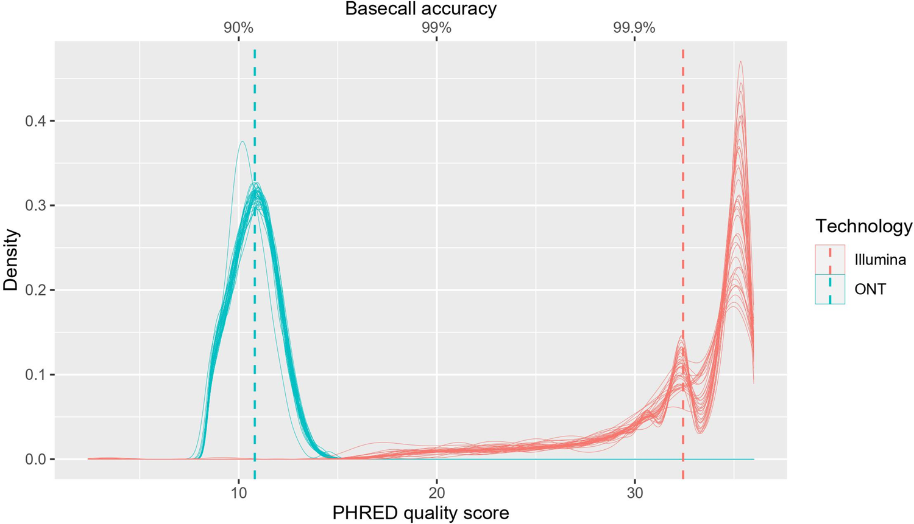
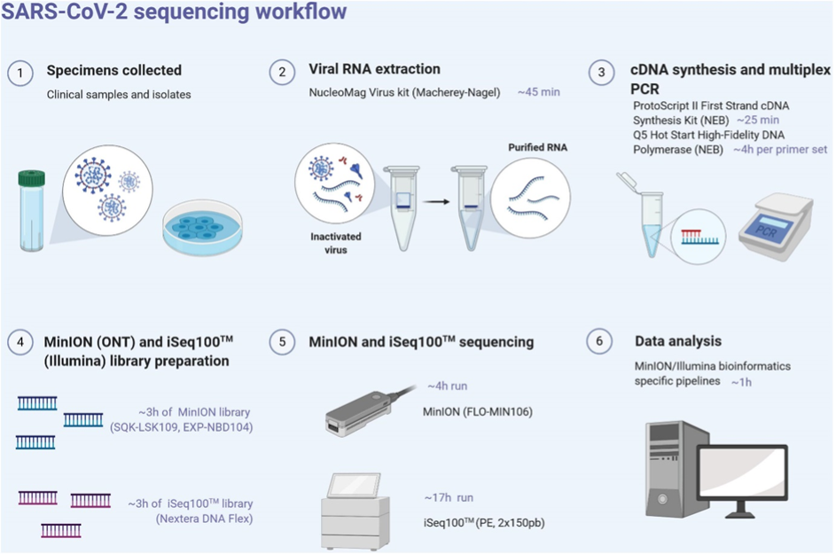
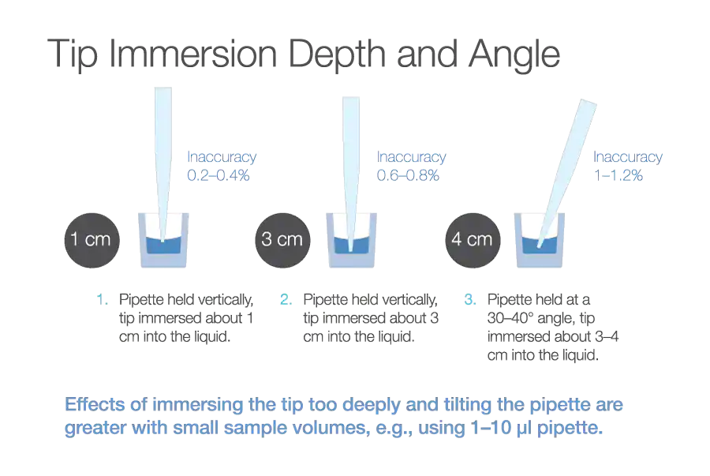

# FUNDAMENTALS OF VIRAL SEQUENCING

        
@Canva

# Glossary
<!-- 1-4 --> 

* **Adaptors:** a short chemically synthesised single or double-strand DNA (oligonucleotide) used in some sequencing methodologies that allow the addition of a DNA barcode or other oligonucleotides downstream of an unknown or amplified DNA strand.                       
* **Amplicon:** a DNA fragment that has been amplified using polymerase chain reaction (PCR) or a method that results in the generation of multiple copies of that fragment.                 
* **A-tailing:** an enzymatic reaction to add a sequence of adenines at the 3’-terminus of a DNA fragment for sequencing purposes.         
* **Barcoding:** addition of a tag of known DNA sequence (barcode, also called index) to an amplified DNA strand that permits sequencing multiple samples in parallel, and stratifying sample data informatically post/during sequencing.         
* **cDNA:** complementary DNA, a DNA molecule synthesised from an RNA molecule.     
* **Consensus sequence:** a sequence of DNA, RNA or protein generated from a set of aligned sequences. It is calculated based on the most frequent nucleic acids or residues in each position of the alignment.                   
* **COVID-19:** coronavirus disease 2019.         
* **DNA:** deoxyribonucleic acid, which is an information molecule forming the “base code” for a living organism.          
* **Enzyme:** a protein able to catalyse, i.e. accelerate chemical reactions.     
* **Library:** in the sequencing context is a pool of DNA fragments attached to adaptors and/or other oligonucleotides used during sequencing preparation procedures.                 
* **ONT:** Oxford Nanopore Technologies, a sequencing technology company. Their sequencing platform is also referred to as ONT.                        
* **PCR:** Polymerase chain reaction (PCR) is a laboratory technique for rapidly making (amplifying) millions to billions of copies of a given section of DNA, which may then be analysed further.          
* **Primer:** a short chain of oligonucleotides used to target and ‘prime’ the initiation of DNA replication.           
* **Protein translation:** is the process of synthesising proteins from a transcript.        
* **NGS:** next-generation sequencing, a high throughput sequencing methodology.   
* **Nucleotides:** the individual subunits that form DNA and RNA molecules.         
* **RNA:** ribonucleic acid, an information molecule, can be the “base code” for viruses.       
* **SARS-CoV-2:** Severe Acute Respiratory Syndrome Coronavirus 2.        
* **SNP:** single-nucleotide polymorphism is a nucleotide substitution in a specific position of the genome. It is identified when compared to a reference sequence.                
* **Transcription:** is the process of copying a segment of DNA into RNA.       
* **Tagmentation:** is the initial step in library preparation where unfragmented DNA is cleaved and tagged for analysis.                      
* **Trimming:** in bioinformatics, it is the process of removing the ends of the reads, leaving only a region of high-quality bases and those relating to the sample, not the sequencing chemistry or DNA barcoding.           
* **Viral replication:** is the mechanism in how viruses propagate during the infection cycle, it is the process of virus multiplication.          
* **Viral genome variant:** a virus that has one or more mutations in its genome.                    
* **Whole-genome sequencing (WGS):**  is the method of determining the entirety, or almost the entirety, of an organism's genomic DNA sequence all at once. This entails sequencing all of an organism's chromosomal DNA, and DNA found in mitochondria and, in plants, chloroplasts.           

[Download the PDF here](assets/OC4_1-4_glossary.pdf)

# Introduction to viral genomes
<!-- 1-6 -->        

**Size and structure of viral genomes**

The size of viral genomes varies nearly a thousandfold from the smallest to the largest. There are DNA viruses along the entire gradient, starting with the small circovirus, whose 1.75 Kilobases single-stranded genome is dwarfed by Megavirus' 1.25 megabase-pair double-stranded genome (Figure 1). 

_Source [Pearson Education](https://slideplayer.com/slide/12253566/)_

[Click to enlarge the image](images/OC4_1-6_Fig1.png)

[Download Figure 1 and 2 alt-text here](images/OC4_1-6_Alt-text.pdf)

Single-stranded or double-stranded RNA genomes are often smaller than DNA virus genomes. Prokaryotic (organisms lacking a nucleus) genomes are typically much larger than viral genomes, and eukaryotic (organisms with a nucleus) genomes are significantly larger than prokaryotic genomes (Figure 1).

Regardless of the size of the viral genome, transcription (reading of the code and generation of RNA from it) of the genes must take place and new copies of the genome must be made once the virus has infected the host. Viral assembly can be initiated only after viral proteins are synthesised as a result of the translation (conversion of the generated RNA code into a sequence of amino acids) of viral transcripts. For some RNA viruses, the genome also serves as the mRNA. However, for most viruses, viral mRNA must first be produced from the DNA or RNA genome via transcription.

**The Baltimore Scheme for Viral Classification**

David Baltimore, a virologist who shared the Nobel Prize in Physiology or Medicine in 1975 with Howard Temin and Renato Dulbecco for discovering retroviruses and reverse transcriptase, established a virus classification scheme. This system distinguishes seven kinds of viruses based on the connection of the viral genome to its mRNA (Figure 2). By convention, viral mRNA is always considered to be of the positive-strand (+) configuration. To comprehend the biology of a given virus class, one must first understand the nature of the viral genome and the mechanisms necessary to produce complementarity mRNA (Figure 2).

_Source [Pearson Education](https://slideplayer.com/slide/12253566/)_

[Click to enlarge the image](images/OC4_1-6fig2.png)

The Baltimore class I includes viruses with double-stranded DNA. Class I viruses, like the common bacteriophage T4, produce mRNA and replicate their genomes using the same method as the host cell. Positive-strand viruses, also known as "positive-strand viruses," or negative-strand viruses, sometimes known as "minus-strand viruses," can both have single-stranded genomes. 

The DNA genomes of class II viruses are single-stranded positive-strand. If such a genome were transcribed, it would result in a message that is negative-sense in nature. Therefore, a complementary DNA strand must first be created to form a double-stranded DNA intermediate, also known as the replicative form, before class II viruses can make mRNA. This intermediate serves as a source for additional genome copies and for transcription, with the positive strand becoming the genome and the negative strand being discarded (Figure 2). All single-stranded DNA viruses are positive-strand viruses, with only one known exception, the *Anelloviridae*. 

DNA viruses and RNA viruses produce messenger RNA (mRNA) in different ways. Host RNA polymerases require a DNA template, and do not catalyse the synthesis of RNA from an RNA template. As a result, depending on the virus, RNA viruses must either carry or encode in their genomes an RNA-dependent RNA polymerase known as RNA replicase. In class IV viruses, which have a positive strand of RNA, the genome is also mRNA. However, for negative-strand RNA viruses (class V), RNA replicase must generate a positive strand of RNA from the negative-strand template, which is subsequently employed as mRNA. This mRNA serves as a template to create additional negative-strand genomes (Figure 2). Similar issues arise for class III RNA viruses, but they begin with double-stranded (+/-) RNA rather than just a positive or negative strand. 

Retroviruses are animal viruses that replicate through a double-stranded DNA intermediary but have single-stranded RNA genomes with a positive-strand structure (class VI). The process of transcribing information from RNA into DNA is known as reverse transcription, and it is catalysed by an enzyme known as reverse transcriptase. 

Finally, class VII viruses are extremely rare viruses with double-stranded DNA genomes that replicate via an RNA intermediary. This class of viruses also use reverse transcriptase.

**Further reading**

[ViralZone](https://viralzone.expasy.org/)

# Learning more about SARS-CoV-2 genome
<!-- 1-7 -->

Coronaviruses (CoVs) are a group of enveloped viruses that have a positive single-stranded RNA genome. 

The genome size ranges between 27–32 Kbp, and is one of the largest known RNA viruses. The genomic structure of CoVs contains at least six open reading frames (ORFs). The genome encodes two large genes ORF1a (yellow), ORF1b (blue), which encode 16 non-structural proteins (NSP1– NSP16), shown in Figure 3. These NSPs are processed to form a replication–transcription complex (RTC) that is involved in genome transcription and replication. For example, NSP3 and NSP5 encode for Papain-like protease (PLP) and 3CL-protease, respectively. Both proteins function in polypeptides cleaving and block the host's innate immune response. NSP12 encodes for RNA-dependent RNA polymerase (RdRp). NSP15 encodes for RNA helicase. The structural genes encode the structural proteins, spike (S), envelope (E), membrane (M), and nucleocapsid (N), highlighted in green. The accessory proteins (shades of grey) are unique to SARS-CoV-2 in terms of number, genomic organisation, sequence, and function. 

_Source: [Frontiers](https://doi.org/10.3389/fcimb.2022.794264)

[Click to enlarge the image](images/OC4_1-7_fig1.png)

[Download Figure 3 alt-text here](images/OC4_1-7_Alt-text.pdf)

# Why viral genome sequencing is important
<!-- 1-8 -->

Viruses are the most abundant biological entities on Earth, and they significantly impact living organisms by causing diseases and shaping their immune systems. The study of viral infectious diseases in terms of etiopathogenesis and the development of new therapeutics is undergoing rapid changes.

The year 2020 was a turning point in history and in global health. The COVID-19 pandemic, as well as being an enormous human tragedy costing millions of lives, has opened great scientific opportunities and capitalised on them. A technological revolution, building over the past decade, has enabled new ways to respond to a pandemic: genomic sequencing of pathogens and rapid development of vaccines. The genome sequencing of SARS-CoV-2 has been established as a powerful supplementary tool to diagnostics.

A genome – an organism’s genetic material – is essentially its instruction manual, which contains all the information needed to make and maintain it. Coronaviruses are RNA viruses, and therefore have a single RNA strand that is 30,000 letters long. These letters can be ‘read’ one by one, using a technique called sequencing. Although certain technologies now allow for the direct sequencing of RNA, most require the generation of cDNA first, before the code can be read. Virus genomes constantly alter (mutate), changing a few letters at a time as they divide and spread by infecting more people. These changes can be exploited to track the spread of the virus by sequencing, recording and analysing genomes. 

 We all have heard about COVID-19 sequencing in many ways and through many sources. Most people know that COVID-19 genome sequencing is ongoing in their countries. In this article, we will focus on why genome sequencing of SARS-CoV-2 is important.

**Why is viral genome sequencing important?**
 
These sequences have valuable information that scientists use to:
 
1) Characterise the genome of the virus.        
2) Estimate a particular variant’s prevalence in a population.        
3) Evaluate how effective medical treatments, such as monoclonal antibodies, are against variants.         
4) Investigate the spread of a virus in outbreaks.         
5) Genome sequences play a critical role in our understanding of viral evolution, disease epidemiology, surveillance, diagnosis, and countermeasure development. They, therefore, represent valuable resources which must be properly documented and curated to ensure future utility.        
 
**WGS informs mitigation strategies**          
 
Whole-genome sequencing provides the most high-resolution data and allows for the efficient relatedness analysis that is instrumental to outbreak investigations at all levels, ranging from within a small community to intercontinental spread during a pandemic. Investigators have been able to determine relatedness between different SARS-CoV-2 virus sequences from various patients, concluding that pre-symptomatic patients most likely contributed to transmission. This information also helps us to understand how a pathogen spreads in a certain geographical area, for example between countries or across continents.
 
**Tweaking COVID-19 diagnostics and developing therapeutics with WGS data**

SARS-CoV-2 sequence data allow scientists to develop new targets for molecular assays and track the trends of mutations that may lead to reduced sensitivity of existing assays. The availability of SARS-CoV-2 sequence data allows researchers to identify potential therapeutic targets and provides a basis for epitope mapping and modelling, along with the prediction of immune response to the virus, all of which could help guide therapeutics and vaccine development.
 
**WGS Uncovers Fundamental Virus Biology:**
 
In order to understand the pathogenesis and immune response in COVID-19, scientists may analyse SARS-CoV-2 genome sequence data in an effort to explain the mechanism behind their observations.
 
SARS-CoV-2 genome sequencing may also help in the diagnosis of COVID-19 when the nature of infection is unique or complicated. This is well-demonstrated by the use of WGS to determine whether individuals who got sick twice within a short period of time had relapsed or been reinfected with a different strain of SARS-CoV-2. Evidence suggesting that reinfection is possible has been reported in several countries including Hong Kong, the United States, India and the Netherlands.
 
In summary, WGS data for SARS-CoV-2 are invaluable to our disease control and prevention efforts. As we learn more about the biology and transmission dynamics of the virus, we come closer to finding sustainable and effective strategies to put a stop to this pandemic.

**Further reading**

[How does virus genome sequencing help the response to COVID-19?](https://coronavirusexplained.ukri.org/en/article/und0001/)             

[What is Genomic Surveillance?
](https://www.cdc.gov/coronavirus/2019-ncov/variants/genomic-surveillance.html#:~:text=Genomic%20Sequencing%3A%20Scientists%20use%20a,changes%20may%20affect%20public%20health)                

[Genomic sequencing of SARS-CoV-2: a guide to implementation for maximum impact on public health
](https://www.who.int/publications/i/item/9789240018440)

[How COVID-19 transformed genomics and changed the handling of disease outbreaks forever](https://theconversation.com/how-covid-19-transformed-genomics-and-changed-the-handling-of-disease-outbreaks-forever-173299)

# How to sequence using Illumina technology
<!-- 1-9 -->

Illumina dye sequencing is a molecular technique for determining the base pair sequence in DNA. 

It was developed by Cambridge University's Shankar Balasubramanian and David Klenerman, who later founded Solexa, which was acquired by Illumina. This method of sequencing is based on a technique known as "bridge amplification," in which DNA molecules of approximately 500 bp are used as substrates for repeated amplification synthesis reactions on a solid support (i.e., the flow cell) containing oligonucleotide sequences complementary to a ligated adapter. The oligonucleotides on the surface are arranged in such a way that after several rounds of replication, the DNA forms clonal "clusters" of around 1000 copies of each oligonucleotide fragment. Millions of parallel cluster reactions can be accommodated on the flow cell. During the synthesis procedure, patented modified nucleotides corresponding to each of the four bases are added and then detected using a different fluorescent label. The nucleotides also function as reaction terminators, which are unblocked after detection to enable the next round of synthesis. This sequence of reactions is then repeated 300 times or more.

The sequencing workflow consists of four major steps (sample preparation, cluster formation, sequencing, and data analysis), which can be further subdivided as follows (Figures 4 and 5): 

_Source: [Illumina Inc.](https://www.illumina.com/content/dam/illumina-marketing/documents/products/illumina_sequencing_introduction.pdf)_

[Click to enlarge the image](images/OC4_1-9_fig1.png)

[Download Figure 4 and 5 alt-text here](images/OC4_Fig4-5_alt-text.pdf)

1) The first step is to fragment the DNA into more manageable 200-600 base pair segments.

2) Short DNA sequences known as adaptors are ligated to the DNA fragments. 
The adaptor-ligated DNA fragments are converted into single-stranded forms using sodium hydroxide. 

3) The DNA libraries are loaded onto the flow cell. The adaptor DNA binds to complementary sequences on the flow cell's surface, and unbound DNA is washed away. 

4) The DNA bound to the flow cell is then replicated to generate small clusters of DNA. 

5) When these molecules are sequenced, they emit a signal powerful enough to be detected by a camera. 

6) Unlabeled nucleotides and DNA polymerase are then introduced to the flow cell to extend and link the DNA strands. This results in the formation of 'bridges' of double-stranded DNA between the primers on the flow cell surface. 

_Source: [Illumina Inc.](https://www.illumina.com/content/dam/illumina-marketing/documents/products/illumina_sequencing_introduction.pdf)_

[Click to enlarge the image](images/OC4_1-9_Fig2.png)

7) Using heat, the double-stranded DNA is broken down into single-stranded DNA, resulting in many million dense clusters of identical DNA sequences. 

8) Primers and fluorescently labelled terminators (a type of nucleotide base that stops DNA synthesis) are added to the flow cell. 

9) The primer binds to the DNA that is being sequenced. 

10) After binding to the primer, the DNA polymerase adds the first fluorescently-labelled terminator to the newly synthesised DNA strand. Once a base is added to the strand of DNA, no additional bases can be added until the terminator base is removed. 
Lasers are used to activate the fluorescent label on the nucleotide base of the flow cell. A camera detects the fluorescence and records it on a computer. Each terminator base (A, C, G, and T) emits a distinct fluorescent signal.

11) The fluorescently-labelled terminator group is then removed from the first base, and the second fluorescently-labelled terminator base is inserted next to it. This cycle is repeated until millions of clusters have been sequenced. 

12) Base-by-base analysis of the DNA fragment occurs during sequencing, making it very accurate. The resulting sequence can then be compared to a reference sequence to look for matches or differences in the sequenced DNA.

Various methodologies are supported by Illumina sequencing, including whole-genome, exome, and targeted sequencing, metagenomics; RNA-seq; CHIP-seq; and methylome approaches. Throughput varies for each sequencer model, including the MiniSeq, MiSeq, NextSeq, HiSeq, and NovaSeq lines. The MiniSeq can store 7.5 Gb of data and generate 25 million reads per run in segments of 2 x 150bp reads. The MiSeq has a capacity of 15 Gb and can generate 2 x 300bp reads. The NextSeq can provide 120Gb with 400 million reads at a read length of 2 x 150bp. Details about each instrument and its capabilities in relation to specific sequencing projects may be found on Illumina’s website.

<!-- YT https://youtu.be/fCd6B5HRaZ8 -->      
<iframe width="840" height="472" src="https://www.youtube.com/embed/fCd6B5HRaZ8" title="YouTube video player" frameborder="0" allow="accelerometer; autoplay; clipboard-write; encrypted-media; gyroscope; picture-in-picture; web-share" allowfullscreen></iframe>

This video is hosted by a third party

# Why was Nanopore sequencing used in the SARS-CoV-2 pandemic?
<!-- 1-10 -->

**How did Nanopore Sequencing start?**

The concept of using a protein nanopore as a method to read DNA was first realised in [1989 by Professor David Deamer](https://www.ncbi.nlm.nih.gov/pmc/articles/PMC6733523/) (Figure 6). Since his original design, the concept of individual nucleic acids passing through a nanopore which was embedded in a bi-lipid membrane was first put into practice, and patented, in 1998.

_Source [Nature Biotechnology](https://doi.org/10.1038/nbt.3423)_

[Click to enlarge the image](images/OC4_1-10_Fig1.png)

[Download Figure 6, 7 and 8 alt-text here](images/OC4_1-10_alt-text.pdf)

The commercialisation of nanopore sequencing, however, wouldn't become available until 2012 with the release of the MinION device. Later variations, such as the [PromethION](https://nanoporetech.com/products/promethion) in 2018, were developed and allowed the parallel sequencing of multiple libraries to be visualised for the first time. Equipped across 48 flow cells, the PromethION can process 7 Tb of sequence data in a single run.

**How does Nanopore sequencing work?**

The flow cell contains a synthetic electro-resistant membrane across a small surface and is embedded with up to 2000 individual holes known as nanopores. Each nanopore is a [nanometre](https://www.youtube.com/watch?v=sv9fFeSd3kE&t=25s) across and contains a helicase enzyme to unwind the double-stranded DNA into its single-strand components upon entry. The [nanopore](https://www.youtube.com/watch?v=qzusVw4Dp8w&t=167s&ab_channel=OxfordNanoporeTechnologies) (Figures 7 and 8) acts as a biological vessel that transports the DNA from one side of the flow cell to the other. The DNA or RNA that passes through the narrow sensor of the reader protein is read and base called. When working at optimum capabilities, the nanopores can produce raw data reads of up to [400 base pairs](https://nanoporetech.com/how-it-works#fullVideo&modal=fullVideo) a second resulting in large quantities of data being produced. 

](images/Oc4_1-10_Fig2.png)

[Click to enlarge the image](images/Oc4_1-10_Fig2.png)

 

_Source: [Surgical Neurology International](https://surgicalneurologyint.com/surgicalint-articles/minion-rapid-sequencing-review-of-potential-applications-in-neurosurgery/)_

[Click to enlarge the image](images/OC4_1-10_Fig3.png)

**Why was Nanopore sequencing used in the SARS-CoV-2 pandemic?**

Conventional sequencing technologies have a high cost of entry and require space in a laboratory. These challenges limit tracking the evolution of viral outbreaks in more remote and low-resource areas. As the MinION is so portable, it was a game-changer for in-field sequencing during viral outbreaks.

The minION was used during the [Ebola](https://www.ncbi.nlm.nih.gov/pmc/articles/PMC4817224/) virus outbreak of 2013-2016 in West Africa, and again during the [Zika](https://www.ncbi.nlm.nih.gov/pmc/articles/PMC5722632/) virus outbreak in Brazil in 2016. The protocols developed during the Ebola and Zika outbreaks were able to be quickly [adapted](https://theconversation.com/how-covid-19-transformed-genomics-and-changed-the-handling-of-disease-outbreaks-forever-173299) by a genomics research group, the [Artic Network](https://artic.network/), for sequencing of SARS-CoV-2. 

Typically the advantage of using Nanopore sequencing is that it is able to sequence long fragments of DNA. This makes it easier to identify overlapping fragments and reduces [ambiguity in genome assembly](https://nanoporetech.com/sites/default/files/s3/white-papers/WGS_Assembly_white_paper.pdf?submissionGuid=40a7546b-9e51-42e7-bde9-b5ddef3c3512#:~:text=The%20longer%20a%20sequencing%20read,the%20puzzle%20(Figure%202)). However, as SARS-CoV-2 undergoes PCR prior to sequencing,  the advantage in this instance is the availability of both portable and high throughput devices. The functionality during this pandemic was to sequence small numbers of viruses, less than 50 per minion flow cell within 16-24 hours. This had massive implications in supporting infection control teams, both clinically and regionally. Being able to scale up lower throughput approaches by using a GridION enables rapid response for smaller investigations. Larger epidemiological studies with big batches of samples can then be run more efficiently and cost-effectively on platforms such as NextSeq. 

The advancements in portable sequencing devices have opened up new possibilities for sequencing organisms in the furthest corners of our planet. The accuracy of genetic sequencing is improving continuously and the future for Nanopore Technology is promising and exciting for all those who are part of the current genetic sequencing revolution.

>“Our goal is to enable the analysis of anything, by anyone, anywhere.”(Oxford Nanopore Technologies)

# Using metagenomics to investigate infections
<!-- 1-11 -->

The gold standard for diagnosis or detection of viral infection is targeted PCR (polymerase chain reaction) to amplify and detect small regions of the DNA or RNA of specific viruses. Real-time PCR is fast, with results in as little as 1–2 hours and inexpensive, starting at only £2 per reaction for laboratory-developed tests (LDTs). PCR assays are designed to target the organism of interest so are highly specific and can detect as little as one target copy per reaction so are very sensitive. In syndromes that are well characterised with infections largely caused by known and expected viruses, PCR is unrivalled.

However, some syndromes such as neurological infections in immunocompromised patients can be caused by hundreds of different pathogens including viruses, bacteria and parasites. In these instances, there is often insufficient specimen available to test for every possible organism, especially since PCR reactions are limited to just a handful of targets per reaction. Consequently, in the majority of cases of encephalitis, the causative agent is not known. In these instances, metagenomics is increasingly being applied to aid in the diagnosis of infection.

Metagenomics is the deep sequencing of all of the genetic material in a specimen. Following depletion of host DNA and RNA, sequencing libraries are prepared from the remaining DNA and RNA. This will include residual human DNA and RNA but also the DNA and/or RNA of any organisms present in the specimen. The sequences generated are compared to a database of known sequences to identify any organisms present.

The main advantage of metagenomics for the diagnosis of infection is it requires no prior assumptions about the organism causing infection. With PCR we have to think of the likely aetiologies and test for them, which may or may not yield an answer. 

Conversely, since metagenomics is untargeted, any organism will be identified so long as there is some similarity to sequences in the analysis database. This means rare, unexpected or novel organisms can be identified. In addition, when an organism is identified, assuming the viral load is high enough, sequence data for that organism will be generated which can inform typing, molecular epidemiology and/or genotypic resistance analysis. This was the approach used to initially determine the SARS-CoV-2 genome sequence.

The primary advantage of using metagenomics to diagnose infection is that it is untargeted. However, it is the untargeted nature of the technique that also leads to its main disadvantage. Despite the depletion of human DNA and RNA prior to sequencing library preparation, the vast majority of data sequenced is of human origin, with as little as 0.000002% of sequences belonging to the causative organism. Identifying this ‘needle in a haystack’ requires a depth of sequencing which comes at a substantial cost compared to PCR and can result in only a small amount of sequences generated for the organism of interest (Figure 9).

_ Source: [Journal of infection](https://doi.org/10.1016/j.jinf.2017.12.014)_

[Click to enlarge the image](images/OC4_1-11_Fig1.png)

[Download Figure 9 alt-text here](images/OC4_1-11_Alt-text.pdf)

**Further reading**
 
[Astrovirus VA1/HMO-C: an increasingly recognised neurotropic pathogen in immunocompromised patients](https://doi.org/10.1093/cid/ciu940)
 
[Norovirus whole genome sequencing by SureSelect target enrichment: a robust and sensitive method](https://doi.org/10.1128/JCM.01052-16)
 
[Encephalitis diagnosis using metagenomics: application of next generation sequencing for undiagnosed cases](https://doi.org/10.1016/j.jinf.2017.12.014)
 
[Beyond viruses: clinical profiles and etiologies associated with encephalitis](https://doi.org/10.1086/509330)
 
[The epidemiology of acute encephalitis](https://doi.org/10.1080/09602010600989620)
 
[Metagenomics for neurological infections – expanding our imagination](https://doi.org/10.1038/s41582-020-0374-y)

[Case definitions, diagnostic algorithms, and priorities in encephalitis: consensus statement of the international encephalitis consortium](https://doi.org/10.1093/cid/cit458)

[A Novel Coronavirus from Patients with Pneumonia in China, 2019](https://doi.org/10.1056/NEJMoa2001017)

[A new coronavirus associated with human respiratory disease in China](https://doi.org/10.1038/s41586-020-2008-3)

# What is viral whole-genome sequencing
<!-- 1-12 --> 

**Targeted approaches for viral WGS and comparison with metagenomics**

Although billions of copies of a pathogen genome may be found in a sample, as viral genomes are substantially smaller than human genomes the proportion of host nucleic acid in an extract massively outweighs the proportion of viral nucleic acid.   

To overcome this, and if the virus of interest is known a priori, targeted sequencing approaches can be used. In targeted approaches, the viral DNA or RNA is selectively amplified or enriched prior to sequencing and the sequence data generated will be specific, with as much as 99% of the sequence generated corresponding to the organism of interest.   This has the advantage of reducing the sequencing costs whilst at the same time giving much more detailed information at a high resolution which allows the identification of genotypes, resistance mutations and transmission data. 

There are two main targeted approaches used for viral WGS – amplicon sequencing and bait or probe capture.

**Amplicon sequencing** 

This is a PCR approach in which the entire pathogen genome is amplified on overlapping PCR fragments before library preparation (Figure 10). This approach can be quicker and cheaper than bait/probe capture and is ideal for sequencing small viral genomes, such as the [~11kb Zika virus](https://doi.org/10.1038/nprot.2017.066) and [~30kb SARS-CoV-2 virus](https://doi.org/10.1186/s13073-021-00839-5). Tools such as [primal scheme](https://doi.org/10.1038/nprot.2017.066) are used to design primers using the target viral genome sequence (or sequences) as the reference.  Depending on the size of the viral genome, multiple multiplex (i.e. more than one primer pair in the reaction) PCR reactions will be used to amplify the genome, which is then pooled for sequencing.  For viruses with RNA genomes, the RNA is converted to single-stranded cDNA before the PCR step. 

![Schematics of pooled libraries. ​​(a) Schematic showing the regions amplified in pools 1 (upper track) and 2 (lower track), and the intended overlap between pools (as determined in Step 1). (b) Products generated by PCR in Step 9 from pools 1 (left tube) and 2 (right tube) for the hypothetical scheme shown in a. (c) In Step 12A(ii), the input amount is normalised based on the number of samples and the scheme length; pool 1 and 2 products can be pooled at this stage (shown) or kept separate if you wish to barcode them individually. In Step 12A(iv), products for each sample are then barcoded by ligation of a unique barcode. In Step 12A(vi), all barcoded products are pooled together before sequencing adaptor ligation, yielding a sequenceable library.](images/OC4_1-12_fig1.png)

_Source [Nature Protocols](https://doi.org/10.1038/nprot.2017.066)_

[Click to enlarge the image](images/OC4_1-12_fig1.png)

[Download Figure 10 and 11 alt-text here](images/OC4_1-12_Alt-text.pdf)

 
**Bait or probe capture**

In the bait/probe capture approach, the sample is enriched for viral nucleic acid during library preparation. After fragmentation and often the first stage of library preparation, the viral nucleic acid is hybridised into small, ~100-120b DNA or RNA fragments (i.e. the probes/baits) which are complementary to the viral genome sequence. The pathogen nucleic acid is then captured on a solid phase, such as streptavidin-coated beads as the probes are labelled with biotin, which is washed to deplete the human or other non-target DNA in the sample.  After a second round of PCR to amplify the targeted sequences, the sample is then sequenced. Although more expensive than amplicon sequencing, the bait capture approach is ideal for poor-quality samples (such as FFPE extracts) as the baits can hybridise into degraded fragments of varying lengths. Additionally, highly diverse viral genomes as the larger capture probes have an increased tolerance for sequence mismatches compared to the PCR primers used in amplicon sequencing.

Deciding the appropriate targeted approach requires consideration of factors including the quality of the nucleic acid, the viral genome diversity, how much virus is within the sample, cost, laboratory expertise, reagent and sequencing platform availability.  There are advantages and disadvantages to using either of the targeted methods or non-target metagenomic sequencing, as summarised in Table 1.  As an example, the usefulness of each of these approaches to [generating full-length hepatitis C virus genomes](https://doi.org/10.1128/jcm.00330-16) has been evaluated and compared (Figure 11). 

![Schematic illustration of viral WCS approaches.Overview of viral WGS approaches. All specimens originally comprise a mix of host (in blue) and pathogen (in red) DNA sequences. For pathogens that have RNA genomes, RNA in the sample is converted into complementary DNA (cDNA) before PCR and library preparation. Direct metagenomic sequencing provides an accurate representation of the sequences in the sample, although at high sequencing and data analysis and storage costs. PCR amplicon sequencing uses many discrete PCR reactions to enrich the viral genome, which increases the workload for large genomes substantially, but decreases the costs. Target enrichment sequencing uses virus-specific nucleotide probes that are bound to a solid phase, such as beads, to enrich the viral genome in a single reaction, which reduces workload, but increases the cost of library preparation compared with PCR](images/OC4_1-12_fig2.png)

_Source [Nature Reviews Microbiology](https://doi.org/10.1038/nrmicro.2016.182)_

[Click to enlarge the image](images/OC4_1-12_fig2.png)

_Table 1 -  Advantages and disadvantages of different viral sequencing methods. Source: [Nature Reviews Microbiology](https://doi.org/10.1038/nrmicro.2016.182)_

| Method | Advantages | Disadvantages |
| ------- | ------- | ------- |
| Metagenomic sequencing | Simple, cost-effective sample preparation; Can sequence novel or poorly characterised genomes; Effective in 'fishing' approaches to identifying a potential underlying pathogen; Lower required number of PCR cycles causes few amplification mutations; Preservation of minor variant frequencies reflects in vivo variation; No primer or probe design required, which enables a rapid response to novel pathogens or sequence variants | High sequencing cost to obtain sufficient data; Relatively low sensitivity to target pathogen; Coverage is proportional to viral load; High proportion of non-pathogen reads increases computational challenges; Incidental sequencing of human and off-target pathogens raises ethical and diagnostic issues | 
| PCR amplification sequencing | Tried and trusted well-established methods and trained staff; Highly specific; most sequencing reads will be pathogen-specific, which decreases sequencing costs; Highly sensitive, with good coverage even at low pathogen load; Relatively straightforward design and application of new primers for novel sequences| Labour-intensive and difficult to scale for large genomes; Iterating standard PCRs across large genomes requires high sample volume; PCR reactions are subject to primer mismatch, particularly in poorly characterised or highly diverse pathogens, or those with novel variants; Limited ability to sequence novel pathogens; High number of PCR cycles may introduce amplification mutations; Uneven amplification of different PCR amplicons may influence minor variant and haplotype reconstruction |
| Target enrichment sequencing | Single tube sample preparation that is suited to high-throughput automation and the sequencing of large genomes; Higher specificity than metagenomics decreases sequencing costs; Overlapping probes increases tolerance for individual primer mismatches; Fewer PCR cycles (than PCR amplification) limits the introduction of amplification mutations; Preservation of minor variant frequencies reflects in vivo variation |High cost and technical expertise for sample preparation; Unable to sequence novel pathogens and requires well-characterised reference genomes for probe design; Sensitivity is comparable to PCR, but coverage is proportional to pathogen load; low pathogen load yields low or incomplete coverage; Cost and time to generate new probe sets limit a rapid response to emerging and novel viruses |    

**Further reading**

[CoronaHiT: high-throughput sequencing of SARS-CoV-2 genomes](https://doi.org/10.1186/s13073-021-00839-5)
 
[Norovirus whole genome sequencing by SureSelect target enrichment: a robust and sensitive method](https://doi.org/10.1128%2FJCM.01052-16)
 
[Clinical and biological insights from viral genome sequencing](https://doi.org/10.1038/nrmicro.2016.182)

[Multiplex PCR method for MinION and Illumina sequencing of Zika and other virus genomes directly from clinical samples](https://doi.org/10.1038/nprot.2017.066)

[Comparison of Next-Generation Sequencing Technologies for Comprehensive Assessment of Full-Length Hepatitis C Viral Genomes](https://doi.org/10.1128/jcm.00330-16)

# Using sequencing to investigate SARS-CoV-2

<!-- 1-13--> 

[Sequencing of SARS-CoV-2](https://www.nature.com/articles/s41586-020-2008-3) allowed for the rapid identification of the virus and the development of diagnostic tests and other tools for a rapid response to the pandemic. 

The sequences were determined using a range of experimental approaches based on metagenomics, sequence capture or enrichment, amplicon pools by deploying short (e.g., Illumina) or long-read (e.g., Pacific Biosciences, Oxford Nanopore Technologies) sequencing platforms. Many sequencing platforms are currently used to sequence the SARS-CoV-2 virus, including Sanger, Illumina, ION torrent, and Oxford Nanopore Technology, which have their advantages and disadvantages. Short-read sequencing technologies (e.g., Illumina) enable accurate sequence determination. However, long-read sequencing devices from companies such as Oxford Nanopore Technologies (ONT) offer an alternative with several advantages. ONT small throughput devices are portable, cheap, require minimal supporting laboratory infrastructure or technical expertise for sample preparation, and can be used to perform rapid sequencing analysis with flexible scalability. However, ramping up to higher throughput using ONT using PromethIon for example, removes the portability advantages and requires similar laboratory infrastructure to generate the required libraries. 

A major challenge with whole-genome sequencing (WGS) is obtaining whole viral genomes from clinical samples promptly. Illumina SARS-CoV-2 sequencing is generally limited by long sequencing times and the high cost and labour associated with library preparation for high-throughput sequencing. Another limitation is their relatively short reads (2 × 300 bp), as genomes generally contain multiple repeated sequences, known as tandem repeats, that may be longer than the NGS reads and may result in gaps and misassemblies. Owing to the large footprint of most sequencers portability can be a challenge, which is unfortunate as there is generally a large distance between sample collection sites and sequencing laboratories.

Nanopore sequencing overcomes these challenges as they sequence in real-time and are long-read sequencing technologies that allow for portability and have a relatively low initial investment on sequencing equipment with the MinION costing $1000. ONT sequencing has, however, traditionally been limited by the high number of single pass false negatives and low sensitivity.

Short-read sequencing technologies are useful for population-level genetic analysis and clinical variant discovery as they provide low-cost, high-accuracy data when done in large batches. Long-read sequencing approaches, however, are well suited for de novo genome assembly, sequencing of genomes with long repetitive regions, copy number alterations, and complex structural variations. However, overwhelmingly during this pandemic, whichever platform has been used, short-read sequencing via an amplicon-based approach has been used to generate viral genome sequences. All ARTIC amplicons are under 500 bases and both ONT and Illumina have kits to deal with this. Longer read options such as the midnight protocol have recently emerged, though, as with all approaches, they are limited by RNA quality, which has been a particular issue due to the variety of lysis buffers deployed globally for diagnostic tests.  

Several studies have compared the sequencing of SARS-CoV-2 between Illumina and ONT platforms and have shown that despite the higher single-pass error rates observed with ONT sequencing, highly-accurate SARS-CoV-2 consensus genomes can be achieved. ONT sequencing, however, failed to [detect short indels identified by Illumina sequencing](https://www.ncbi.nlm.nih.gov/pmc/articles/PMC9026045/). There has also been a lower raw-read accuracy with nanopore sequencing when compared to Illumina sequencing.

A comparison of SARS-CoV-2 WGS genomic coverage and variant detection between Illumina and Nanopore sequencing is necessary as it allows us to determine whether SARS-CoV-2 genomes produced by Nanopore sequencing can be reliably used for genomic surveillance and the development of diagnostic measures (Figure 12).

_Source: [PLoS One](https://doi.org/10.1371/journal.pone.0265220)_

[Click to enlarge the image](images/OC4_1-13_Fig1.png)

[Download Figure 12 alt-text here](images/OC4_1-13_Alt-text.pdf)

_Table 1 - Comparison of Illumina and Nanopore-based sequencing approaches for SARS-CoV-2 sequencing_

| Testing Needs | Illumina – Amplicon sequencing - Illumina iSeq100 | Nanopore – Arctic and Midnight protocol |
| ---------- | ---------- | ---------- | 
| Instrument specification | Miseq, iSeq, Hiseq; 1536 to 3072 results can be processed on the NovaSeq 6000 system in 12 h using; two SP or S4 reagent kits or 384 results in; 12 h using the NextSeq 2000 or the NextSeq 500/550/550Dx (in RUO mode); HO reagent kit | MinION, PromethION, GridION |
| Average read length | 150bp – 400bp | Variable up to 900 Kb |
| Base Error rate | 0.2% | 8.3% |
| Per-base error frequency profiles | Weaker correlation between replicates (substitution R2 = 0.15; indel R2 = 0.42) - indicating that short-read sequencing errors were less systematic than for ONT libraries | Clear correlation between ONT replicates (substitution R2 = 0.67; indel R2 = 0.82) - indicates that ONT sequencing errors are not entirely random but are influenced by local sequence context |
| Consensus-level sequencing accuracy | High across SARS-CoV-2 genome | High across SARS-CoV-2 genome | 
| Median read depth | 4833X | 436X | 
| Genome coverage at reads depth 100X | 96.7% | 94.9% | 
| Limit of detection | <500 copies/mL | 10 copies/reaction |
| Turnaround time | ~ 24hr | ~ 9h |

**Further reading:**

[A rapid, cost-effective tailed amplicon method for sequencing SARS-CoV-2](https://doi.org/10.1186/s12864-020-07283-6)

[Rapid Genomic Characterization of SARS-CoV-2 by Direct Amplicon-Based Sequencing Through Comparison of MinION and Illumina iSeq100TM System](https://doi.org/10.3389/fmicb.2020.571328)

[Nanopore sequencing of SARS-CoV-2: Comparison of short and long PCR-tiling amplicon protocols](https://doi.org/10.1371/journal.pone.0259277)

[Comparison of different sequencing techniques for identification of SARS-CoV-2 variants of concern with multiplex real-time PCR](https://doi.org/10.1371/journal.pone.0265220)

[Analytical validity of nanopore sequencing for rapid SARS-CoV-2 genome analysis](https://doi.org/10.1038/s41467-020-20075-6)

# SARS-CoV-2 sequencing workflow
<!-- 1-15 --> 

Here we outline one potential ARTIC workflow example (Figure 13). It must be noted that many different approaches, kits and methods have been used throughout the pandemic to good effect. Commercial kits provide an off-the-shelf option that can allow labs to start sequencing quickly. However, the lack of visibility around the primer design process increases the risk that all VOCs are not covered, and how quickly new VOCs are included is unclear. COG-UK in particular was able to be so adaptive due to the ongoing work of the ARTIC network and constant primer design activities led by the University of Birmingham.  

[Click to enlarge the image](images/OC4_1-15_Fig1.png)

[Download Figure 13 alt-text here](images/OC4_1-15_Alt-text.pdf)

For each sample, the LunaScript RT Supermix kit (New England Biolabs, NEB, United States) is used to obtain single-strand cDNA from RNA extracts using random hexamers and poly-dT primers, allowing even coverage across the length of the RNA targets. RT was performed at 25°C for 2 min, 55°C for 10min and 95°C for 1 min. Pools of specific primer sets were used to generate amplicons from the cDNA using the Q5 Hot Start High-Fidelity DNA Polymerase (NEB, United States). These multiplex primer sets (divided into two separate pools) were designed using the Primal scheme software on the SARS-CoV-2 reference sequence (Genbank accession number NC_045512) to sequentially amplify either 400bp (ARTIC protocol) or 1200bp (Midnight protocol) using the following PCR conditions: 98°C for 30 s, 40 cycles of 98°C for 15 s, 65°C for 5 min, and ended by 65°C for 5 min. PCR products from both pools are mixed into one tube after successful PCR amplification. 

Clean-up of PCR products was performed with AMPure XP magnetic beads (Beckman Coulter, United States). The quantity of amplicons was measured with the Qubit 2.0 fluorometer using the dsDNA HS Assay Kit (Thermo Fisher Scientific, United States), and the quality was assessed by electrophoresis. The amplicons obtained from the two clinical samples and their corresponding isolates were normalised to equal concentrations, multiplexed (X2), and sequenced using the MinION and Illumina System

**SARS-Cov-2 viral genomes from patient samples:**

_Step 1: Extraction of viral RNA genomes_

The viral RNA genome is typically extracted from various VTM solutions of clinical COVID-19 samples. Samples should be stored at −80°C, thawed on ice, and kept cold to maintain viral genome integrity

_Step 2: Reverse transcription of viral RNA to cDNA_

Following extraction, RNA is converted to cDNA as soon as possible, preferably without a freeze-thaw cycle, to prevent potential RNA degradation. Lunascript RT SuperMix kit (New England Biolabs) is commonly used because of the short reaction time and single master mix containing dye, which accelerates and simplifies the workflow and reduces contamination potential.

_Step 3: qPCR to approximate viral load_

To quantify approximate viral load in each sample, qPCR is performed using cDNA as template using any commercially available or in-house kit

_Step 4: Multiplex ARTIC PCR to amplify viral genome sequences_

Once qPCR is performed, viral genome cDNA is amplified to increase the copy number of viral genomes. Two pools of primers are designed by the ARTIC Network, which are commercially available from IDT as the ARTIC nCoV-2019 V3 primer set. These require two pools of PCR reactions for every sample, with pool 1 containing 55 primer sets and pool 2 containing 54 primer sets. Two primer pools are used to create overlapping amplicons that reduce interference during PCR and prevent short overlapping products from being preferentially produced. Through this tiling amplicon scheme, complete coverage of the genome is achieved. Q5 High-Fidelity DNA Polymerase from New England Biolabs (NEB) is used commonly for PCR reactions

_Step 5: Pooling and purification of ARTIC PCR products_

Before library preparation, pool 1 and pool 2 of ARTIC PCR reactions are combined for every sample and the ~400 base-pair (bp) amplicons are purified from contaminating PCR reactions using SPRI AMPure XP beads (Beckman-Coulter).

_Step 6: Fluorescence-based qubit quantification of pooled and purified ARTIC PCR products_

The purified PCR pools are quantified using a Qubit 2.0 Fluorometer and Qubit dsDNA High Sensitivity (HS) Assay Kit following the manufacturer’s recommended protocol

_Step 7: Preparation of DNA ends for barcoding_

Following the approximation of pooled PCR product concentration by Qubit, 60 ng of pooled and SPRI purified PCR amplicons from SPRI clean-up are added to the end preparation reactions designed to create compatible ends of the DNA amplicons for sample barcoding. These are referred to as end-prep reactions. The DNA is first end-repaired followed by dA-tailing and inactivation of end-repair enzymes. Ultra II End-Prep kit from NEB most widely used following the manufacturer’s recommended protocol. After this step, DNA can be frozen at −20°C but is most often kept at 4°C for all downstream library preparation steps.

_Step 8: DNA library sample barcoding and adapter ligation_

To sequence a full 96-well plate of samples, each sample must be uniquely barcoded and later demultiplexed by allocating reads to samples with the matching barcode. This reduces the overall cost per sample and allows sequencing of up to 96 samples in a single run. To achieve this, Rapid Barcoding Expansion 96 kit (EXP-NBD110) from ONT is widely used for nanopore sequencing and Illumina based CovidSeq kit is used for Illumina platform. After individual barcoding reactions are performed in a 96-well plate, all samples are pooled and cleaned with SPRI beads. After barcoding and clean-up, ONT adapters are then ligated to each amplicon end for the pooled libraries in a single reaction.

_Step 9: Loading and running the MinION/Illumina system_

For optimal performance on a MinION instrument, 20 ng of adapter-ligated library should be loaded onto the flow cell. Overloading the flow cell results in lower throughput. Therefore, a final Qubit quantification is performed. The DNA sequencing library is then prepared using ONT reagents/Illumina reagents following recommended protocols. 

_Step 10: Sequencing, real-time visualisation, and data analysis_

_Step 11: Phylogenetic analysis, variant calling, and database deposition of SARS-CoV-2 genomes_

# Why you should collect metadata
<!-- 1-16 --> 

To ensure that SARS-CoV-2 genomic data are as useful as possible, they should be accompanied by appropriate metadata (Table 1). Curating metadata and sharing them locally or publicly can be time-consuming, but both are an integral part of any sequencing pipeline. The required resources should be allocated when the study is being designed. 

Metadata should include, as an absolute minimum, the date and location of sample collection. However, the release of additional metadata greatly increases the potential applications of a genomic sequence. Where possible, therefore, information on specimen type and how the sequence was obtained in the laboratory should be included (Table 2). Duplicate samples from the same individual or duplicate sequences from the same sample should be clearly identified. Demographic and clinical information, such as age, sex, presence of co-morbidities, disease severity and outcome, and links to other sequences in the database, are encouraged where such information does not risk identifying the patient. 

A global consensus on specific formats for metadata (such as date) would allow genomic sequence data from many different laboratories to be rapidly compiled into larger data sets and reduce ambiguity. Also, care should be taken if using Microsoft Excel to ensure that automatic format changes to date do not occur. Some consensus genome repositories, including GISAID, already place format restrictions on certain fields. If data repositories do not already impose formats, the format restrictions for SARS-CoV-2 shown in Table 2 are suggested. Table 2 also highlights examples of analyses that require the provision of specific metadata.

WHO strongly encourages rapid public sharing of sequences and metadata (section 4). However, it is vital to protect patient anonymity. Laboratories should carefully consider whether patients could be identified if all available metadata are shared together. Where few COVID-19 cases have been observed, there is a greater risk of patient anonymity being compromised and therefore fewer data can typically be shared. Where it is judged inappropriate to share detailed metadata via publicly available repositories, it may nevertheless be appropriate to grant access to a small number of users via secure locally developed platforms.

Where it is not possible to share all metadata without risking patient confidentiality, the data that are most useful for global studies should be preferentially shared. For example, sampling location, date and travel history are more useful for phylodynamic studies than patient age or sex (Table 2).

Some laboratories choose to add jitters (noise) to provided dates to decrease the chance that patients can be identified. This can be achieved by a number of methods, for example, by choosing a false date within 5 days on either side of the date of sample collection, or by using the sequencing date as the sample date. Such practices negatively affect molecular clock-based phylogenetic inference and should ideally be avoided. If, nevertheless, this practice is followed, information on exactly how the new date was selected should be provided as a note. 

_Table 1 - Sample-specific metadata format and use_

| Metadata type | Recommended format if applicable | Analyses for which the metadata are required |
| ------- | ------- | ------- |
| Date of sample collection | YYYY-MM-DD; If the date of sampling is unavailable, date received by testing laboratory could be adopted as an alternative, but this should be clearly indicated | Molecular clock phylogenies (including any models implemented in BEAST or BEAST2). These can provide estimates of dates of introduction, changes in outbreak size over time and evolutionary rate |
| Location  | Continent/country/region/city. For discrete phylogeographical analyses (section 5.4.3), location resolution can be low (e.g. country level information for consideration of movement between countries) but higher resolution data is preferable to allow finer-scale analyses. Continuous phylogeographical approaches typically require relatively high-resolution data (e.g. city or municipality) | Any phylogenetic interpretation of global or regional virus spread (including models in BEAST or BEAST2) |
| Host | For example, human or _Mustela lutreola_ | Host range and virus evolution |
| Patient age | For humans, give age in years (e.g. 65) or age with unit if under 1 year (e.g. 1 month, 7 weeks). For non-human animals, juvenile or adult | Descriptive epidemiology or as a possible trait for discrete phylodynamic inference |
| Patient age | For humans, give age in years (e.g. 65) or age with unit if under 1 year (e.g. 1 month, 7 weeks). For non-human animals, juvenile or adult | Descriptive epidemiology or as a possible trait for discrete phylodynamic inference |
| Sex | Male, female or unknown | Descriptive epidemiology |
| Additional host information | No standard format. For animals, this may include context, such as “domestic - farm”, “domestic - household”, “wild”, etc. | Disease surveillance in human or animal hosts |
| Travel history | No standard format. Travel history in the 14 days preceding symptom onset should be obtained from patients where possible. Deliberate release of travel history only to a low resolution (e.g. country) may be important to protect patient confidentiality | Phylogeographical or phylodynamic analyses directed at estimating transmission rates or routes between regions |
| Cluster or isolate name | No standard format. Appropriate formats may include “Same epidemiological cluster as sample X”, “Same patient as sample X”, or “Sample from patient XYZ” (where XYZ is an anonymized identifier that cannot be traced back to the patient or used to access other patient data that might compromise confidentiality) | Phylogenetic downsampling to ensure the appropriateness of phylodynamic models. Cluster investigation |
| Date of symptom onset | YYYY-MM-DD | Specialist phylodynamic applications that investigate transmission clusters |
| Symptoms | No standard format. Appropriate degree of symptoms; may include "severe”, “mild” and “out of norm” | Descriptive epidemiology |
| Clinical outcome if known | No standard format. Appropriate formats may include “recovered”, “death” and “unknown” | Descriptive epidemiology |
| Comments | No standard format. Appropriate comments may include how samples were selected (e.g. “cluster investigation”, “randomly”), or the storage location of other data files, such as raw read data | Interpretation of data quality or utility |

_Table 2 - Sequence-specific metadata format and use_

| Specimen source, sample type | Recommended format if applicable | Effect of cell tropism |
| ------- | ------- | ------- |
| Passage details, history | No standard format. It is important to indicate that cell culture was conducted (e.g. “Cultured”); ideally, this information should include the type of cells used and the number of passages | Removal of cell-cultured viruses (which may have induced genetic changes) |
| Sequencing technology | No standard format. Ideally, this should include the laboratory approach and sequencing platform (e.g. “Metagenomics on Illumina HiSeq 2500” or “ARTIC PCR primer scheme on ONT MinION”) | Sequencing artefacts | 
| Assembly method, consensus generation method | No standard format | Sequencing artefacts |
| Minimum sequencing depth required to call sites during consensus sequence generation | e.g. 20x | Sequencing artefacts |

Extensive data should be shared as patient anonymity is typically unaffected. However, sharing all of the information listed in this table might compromise patient anonymity. Therefore, an ethical review should be conducted to determine which metadata can be safely shared. It may be appropriate to share less data on public databases than on databases that are held and analysed locally.

[Download an example of metada form here](assets/OC4_1-16_additional_file.pdf)

# How to handle primary samples 

<!-- 1-17 -->

<!-- YT: https://youtu.be/Ucy9nXo5Ejo -->       

<iframe width="840" height="472" src="https://www.youtube.com/embed/Ucy9nXo5Ejo" title="YouTube video player" frameborder="0" allow="accelerometer; autoplay; clipboard-write; encrypted-media; gyroscope; picture-in-picture; web-share" allowfullscreen></iframe>

[Download the transcript here](assets/OC4_1-17_transcript.pdf) 

In this video, laboratory scientists from Parul University demonstrate the collection, preparation and transport of SARS-CoV-2 primary samples. Rules and PPE requirements will differ between countries, states and times in the pandemic. This video was created when healthcare professionals required full PPE for taking swabs, whereas now we may be used to self-swabbing at home. Always check local guidance for each activity.

# Storing high-quality samples

<!-- 1-18 -->

Most of the current knowledge on diseases and the consequent diagnostic and therapeutic possibilities is based on the study of biological samples and the data associated with them. Following the exceptional health emergency caused by the outbreak of the COVID-19 epidemic, unprecedented action is underway to collect biological samples and related personal and health data from the population. These samples and data, collected for diagnostic procedures and the consequent care of the affected people are also pivotal for effective research to defeat COVID-19.

In this context, structuring a coordinated and extensive collection, handling and storage of samples (nasopharyngeal swabs, sputum, blood and its derivatives, broncho-alveolar lavage, post-mortem tissues, etc.) from all the infected and recovered populations takes priority. It is crucial to collect and store the biological materials of the population concerned according to the established international criteria, and in compliance both with ELSI (ethical-legal social) requirements and the rights of the patients involved, in order to make them available over time for collaborative research projects. 

From this perspective, it is recommended to store COVID-19 samples according to prevailing country requirements, and quality standards in a stable and continuous manner for future research and/or diagnosis. Inadequate or inappropriate patient specimen collection, storage, and transport are likely to impact specimen quality and yield false test results. Therefore, training in specimen handling is highly recommended, and there is a critical need for tight environmental uniformity to ensure specimen viability. This article gives a brief overview of collecting, transporting, and storing COVID-19 specimens. 

**Specimen storage**

* In order to ensure accurate results, it is essential to understand and implement the storage and transport conditions mandated by the regulatory bodies. 

* According to the interim guidance provided by WHO, specimens for virus detection should reach the laboratory as soon as possible after collection. 

* In addition, as per official guidelines, specimens that are delivered promptly to the laboratory can be stored and shipped at 2-8°C. 

* However, when there is a higher likelihood of delay in the specimens reaching the laboratory, the use of viral transport medium is strongly recommended. 

* Specimens may be frozen to -20°C or ideally to -70°C and shipped on dry ice if further delays are expected. 

_Table 1 - Specimen Collection and Storage_

| Specimen type | Collection materials | Storage temperature until testing in-country laboratory | Recommended temperature for shipment according to expected shipment time |
| ------------------- | ------------------- | ------------------- | ------------------- |
| Nasopharyngeal and oropharyngeal swab | Dacron or polyester flocked swabs | 2-8 °C | 2-8 °C if ≤5 days; –70 °C (dry ice) if >5 days |
| Bronchoalveolar lavage | Sterile container * | 2-8 °C | 2-8 °C if ≤2 days; –70 °C (dry ice) if >2 days |
| (Endo)tracheal aspirate, nasopharyngeal or nasal wash/aspirate | Sterile container * | 2-8 °C | 2-8 °C if ≤2 days; –70 °C (dry ice) if >2 days |
| Sputum | Sterile container * | 2-8 °C | 2-8 °C if ≤2 days; –70 °C (dry ice) if >2 days |
| Tissue from biopsy or autopsy including from lung | Sterile container with saline or VTM | 2-8 °C | 2-8 °C if ≤24 hours; –70 °C (dry ice) if >24 hours |
| Serum | Serum separator tubes (adults: collect 3-5 ml whole blood) | 2-8 °C | 2-8 °C if ≤5 days; –70 °C (dry ice) if >5 days | 
| Whole blood | Collection tube | 2-8 °C | 2-8 °C if ≤5 days; –70 °C (dry ice) if >5 days | 
| Stool | Stool container | 2-8 °C | 2-8 °C if ≤5 days; –70 °C (dry ice) if >5 days |
| Urine | Urine collection container | 2-8 °C | 2-8 °C if ≤5 days; –70 °C (dry ice) if >5 days |

* For transport of samples for viral detection, use a viral transport medium (VTM) containing antifungal and antibiotic supplements. Avoid repeated freezing and thawing of specimens. If VTM is not available, then sterile saline may be used instead (in which case, duration of sample storage at 2-8 °C may be different from what is indicated above).

Aside from specific collection materials indicated in the table, also assure other materials and equipment are available: transport containers, specimen collection bags and packaging, coolers, cold packs or dry ice, sterile blood-drawing equipment (e.g. needles, syringes and tubes), labels and permanent markers, PPE, materials for decontamination of surfaces, etc.

Before storing samples, you should consider: 

* How long should the samples be stored?

* Should there be a differentiation between positive and negative samples (and non-conform or inconclusive results)? 

* Are there any other guidelines for storing the samples? 

**Reasons for storage of samples**

* Clinical specimens or a subset of the clinical specimens may need to be retained for various purposes such as performing additional tests, for quality control purposes, or for use as control materials to assess newer diagnostic tests. 

* In addition, a laboratory may need to store specimens for projects aimed at studying genomic epidemiology of the SARS-CoV-2 virus across regions and over time 

**Existing guidelines: storage duration**
* The WHO or ECDC do not have guidelines about the duration of storage of COVID-19 PCR samples. 

* In August 2020, the Indian Council of Medical Research (ICMR), Government of India, advised government laboratories to retain all positive COVID-19 samples at ultra-low temperatures for 30 days, then disinfect the samples before disposal. Some respiratory samples will need to be kept even longer — even a year or more — in ultra-low temperature freezers, for future testing and quality control purposes. 

* According to the new ICMR guidelines, all samples in long-term cold storage must be appropriately labelled with laboratory identifiers and collection dates. Positive COVID-19 test samples must be kept in -80 C deep freezers.

* Beyond that, ICMR says many positive COVID-19 samples must be kept in government laboratories for one year. The number of retained samples will vary among laboratories, but ICMR is looking for 50 positive samples at each laboratory, or 1–2% of total monthly samples, or whichever is smaller. 

**Existing guidelines: storage conditions**

* WHO recommends the storage of dacron or polyester flocked swabs with a viral transport medium (VTM) containing antifungal and antibiotic supplements for up to 12 days until analysis at 2-8°C. If phosphate buffered saline is used instead of VTM, it recommends storage for up to 7 days at 4°C. 

* In case other viruses such as influenza should also be tested, the WHO recommends storage of samples for no longer than 5 days at 4-8 °C, counting from the date of sampling until analyses. 

* ECDC recommends that all specimens should be stored at 2-8°C for up to 48 hours after collection. For handling or shipping after 48 hours, storage at -70°C (dry ice) is recommended.

**Storage of Specimens**

* Specimens must be stored in containers with adequate strength, integrity and volume to contain the specimen, leak-proof when the cap or stopper is correctly applied, made of plastic whenever possible, free of any biological material on the outside of the packaging, correctly labelled, marked and recorded to facilitate identification, and made of an appropriate material for the type of storage required.

* Set the temperature for shipment in line with the expected shipment time.

* Avoid repeated freezing and thawing.

* At least two aliquots of VTM should be made before the specimens are stored or shipped. One of two aliquots should be stored at −70°C or −80°C as soon as possible.

**Storage of Nucleic acid extract:**

The RNA from the viral specimen is extracted and stored at -80°C or lower freezer. 

**Storage of cDNA product:**

The amplified cDNA used for SARS-CoV-2 genome amplification is stored at -80°C in a freezer. 

**Specimen handling of SARS-CoV-2 samples**

* Personnel collecting the specimens should wear appropriate PPE (N95, KF94, or equivalent respirators, protective clothing, disposable gloves, etc.) and handle the specimens in a Class II or higher biosafety cabinet (BSC) at a biosafety level 2 (BL2) laboratory. 

* Aerosol-producing procedures should always be performed within the BSC. 

* If the container has to be opened outside of the BSC, PPE, such as an N95, KF94, or a higher-grade respirator (powered air-purifying respirator recommended), should be worn by the personnel and the bench should be disinfected after the procedure.

* Personal hand hygiene: Wash hands thoroughly, preferably with warm running water and soap, after handling biological material and/or animals, before leaving the laboratory and when hands are known or believed to be contaminated.

* All work surfaces and equipment to be disinfected with appropriate disinfectants.

* Controlled ventilation system - A controlled ventilation system maintains inward directional airflow into the laboratory room.

**Further reading**

[China CDC COVID-19: Laboratory Testing Guideline](https://www.chinacdc.cn/en/COVID19/202003/P020200308322036088669.pdf)

[US CDC Interim Guidelines for Collecting and Handling of Clinical Specimens for COVID-19 Testing](https://www.cdc.gov/coronavirus/2019-ncov/lab/guidelines-clinical-specimens.html)

[ICMR India Specimen Collection, Packaging and Transport Guidelines for 2019 novel Coronavirus (2019-nCoV)](https://www.mohfw.gov.in/pdf/5Sample%20collection_packaging%20%202019-nCoV.pdf)

[PHE UK Packaging requirements for COVID-19 samples](https://assets.publishing.service.gov.uk/government/uploads/system/uploads/attachment_data/file/875914/PHE_Packaging_requirements_for_COVID-19_samples_A3_poster.pdf)

[WHO Guidance on regulations for the transport of infectious substances 2019 – 2020](https://www.who.int/publications/i/item/WHO-WHE-CPI-2019.20)

[WHO Laboratory testing for coronavirus disease (‎COVID-19)‎ in suspected human cases: interim guidance, 19 March 2020](https://apps.who.int/iris/handle/10665/331501)

[Advice on storage duration and conditions of human samples collected for COVID-19 PCR analysis - in the context of the national platform BIS](https://covid-19.sciensano.be/sites/default/files/Covid19/20200110_Advice_RAG_storage%20samples%20platform.pdf)

[Guidelines for storage of respiratory specimens collected for COVID-19 diagnosis by RT PCR platforms in Government laboratories](https://www.icmr.gov.in/pdf/covid/labs/Govt_labs_sample_retention_advisory_25062020.pdf)

[WHO Diagnostic testing for SARS-CoV-2: Interim guidance September 2020](https://www.who.int/publications/i/item/diagnostic-testing-for-sars-cov-2)

[ECDC Laboratory support for COVID-19 in the EU/EEA](https://www.ecdc.europa.eu/en/novel-coronavirus/laboratory-support)

[Coronavirus Disease 2019 (COVID-19) Re-infection by a Phylogenetically Distinct Severe Acute Respiratory Syndrome Coronavirus 2 Strain Confirmed by Whole Genome Sequencing](https://doi.org/10.1093/cid/ciaa1275)

# What happens to samples after sequencing

<!-- 1-19 -->  

<!-- YT: https://youtu.be/TXgz-GrQszM –>    
<iframe width="840" height="472" src="https://www.youtube.com/embed/TXgz-GrQszM" title="YouTube video player" frameborder="0" allow="accelerometer; autoplay; clipboard-write; encrypted-media; gyroscope; picture-in-picture; web-share" allowfullscreen></iframe>

[Download the transcript here](assets/OC4_1-19_transcript.pdf)

We invited leading scientists from Bangladesh, Brazil, India and Nigeria to share their knowledge and experiences implementing SARS-CoV-2 sequencing in their institutions. Watch Dr Senjuti Saha, Prof Paola Resende,  Dr Murali Dharan Bashyam and Prof Christian Happi discussing what the final destination of sequenced samples is in their facilities. 

The storage of samples will be guided by local and regional ethical approval and regulation. For example, in the UK, COG-UK consortium laboratories had to destroy all primary viral samples by March 2022 but could retain stored nucleic acids until September 2022 without applying for additional approval. Public Health Agencies will have more flexibility in the length of their sample storage than Academic institutions, however the sheer number of samples generated during this pandemic means that physical storage space is a significant barrier to keeping all samples long-term. Clinical samples should be kept long enough for re-testing of failed or important samples if required and a selection of important samples (different lineages, CT values, priority settings) kept longer term for research and development.

Biobanking of samples has been widely utilised during the pandemic, but with this comes many [ethical considerations](https://www.ncbi.nlm.nih.gov/pmc/articles/PMC8117471/), particularly when considering the interactions between high income countries and other partners to avoid biopiracy.

# How to implement quality management

<!-- 1-20 --> 

To ensure that work is performed accurately and consistently, it is important to put quality management systems in place. This limits error and expedites troubleshooting, thus saving resources on repeating failed experiments. Here are some ideas and suggestions for ensuring high-quality testing of SARS-CoV-2 samples. 

**Single-use aliquots and batch numbers**

Create a reagent spreadsheet. Split your reagents into single-use aliquots and assign a unique batch number. Give each reagent a sequential ID i.e. QA-001, QA-002, and label with the relevant information (e.g. ID, expiry date and volume). Some reagents, such as a large bottle of nuclease-free water, cannot be completely dispensed in one go. To ensure multiple aliquot events from the same bottle are captured, assign each aliquot event with a sequential letter, i.e. QA-001-A, QA-001-B. Without this, it could seem as though a fresh bottle of water had been used for each set of aliquots, which could cause confusion when troubleshooting. 

**Record Keeping** 

The majority of good quality management is record keeping. The more detail you can record when performing your experiment, the easier it is to troubleshoot. 

Assign each library a unique ID, i.e. EXP-001, EXP-002, as this makes it much easier to track experiments. Create a detailed experiment plan. 

Create a way of capturing all the information for each library preparation. One method is to create tick-sheet versions of the protocols (see additional resources) with space included to record all reagent batch numbers, DNA quantifications and calculations. Whenever something does not go to plan, this should be recorded. The tick sheet can be fixed to the outside of the cabinet with a magnet, and each step crossed off as you go, thus reducing the opportunity for error. Paperwork should be checked and counter-signed by another member of staff to capture any errors. 

**Equipment** 

Ensure that equipment is well maintained, calibrated, and that staff have been properly trained in how to use it. Assign equipment unique equipment numbers, i.e. UE-001, UE-002. Record which specific items of equipment you have used throughout your experiment to help expedite troubleshooting.  

**Training** 

To reduce variation in results between operators, give all staff members the same level of training. Ideally, the protocol should be observed first and then performed with supervision until the staff member is able to perform the work without any guidance. 

Consider training staff in pipetting techniques to ensure [consistency and accuracy](https://www.thermofisher.com/uk/en/home/life-science/lab-plasticware-supplies/lab-plasticware-supplies-learning-center/lab-plasticware-supplies-resource-library/fundamentals-of-pipetting/proper-pipetting-techniques/10-steps-to-improve-pipetting-accuracy.html). Holding the tip vertically, having a 1cm immersion depth, and pre-rinsing tips to break surface tension before aspirating can all improve accuracy (Figure 14). For small volumes and repeat pipetting the [reverse pipetting](https://www.mt.com/gb/en/home/library/know-how/rainin-pipettes/how-to-reverse-pipette.html) technique can be useful. 

_Source: [Thermofisher](https://www.thermofisher.com/uk/en/home/life-science/lab-plasticware-supplies/lab-plasticware-supplies-learning-center/lab-plasticware-supplies-resource-library/fundamentals-of-pipetting/proper-pipetting-techniques/10-steps-to-improve-pipetting-accuracy.html)_

[Click to enlarge the image](images/OC4_1-20_fig4.png)

[Download Figure 14 alt-text here](images/OC4_1-20_Alt-text.pdf)

**Quality Control Checks** 

Include negative and positive controls and take them through your whole process from reverse transcription to library preparation. After the PCR step, quantify the negative and positive controls on the Qubit Fluorometer (or equivalent method) and look for irregularities. It is important to also test a couple of samples, including both primer pools. Ensure that both primer pools have similar DNA concentrations. If reagents have not been properly mixed before dispensing this can lead to an imbalance between the primer pools. Controls are essential for quality management and for troubleshooting. 

# Assessing the quality of nucleic acid

<!-- 1-21 -->                                                                                                  

<!-- YT https://youtu.be/ixqoE2USpUc -->      

<iframe width="840" height="472" src="https://www.youtube.com/embed/ixqoE2USpUc" title="YouTube video player" frameborder="0" allow="accelerometer; autoplay; clipboard-write; encrypted-media; gyroscope; picture-in-picture; web-share" allowfullscreen></iframe>

[Download the transcript here](assets/OC4_1-21_transcript.pdf)

The quality of a sample is measured at several checking points throughout the sequencing process. In this video, you will learn with Dr Paola Niola how to use Qubit and TapeStation methods. 

The [BioAnlayser](https://www.agilent.com/en/product/automated-electrophoresis/bioanalyzer-systems/bioanalyzer-instrument/2100-bioanalyzer-instrument-228250) is another fragment analyser which can be used as an alternative to the TapeStation. The main advantage of using the fragBioanalyser over the TapeStation is that it has a lower limit of detection. However, it has a more complicated set-up, is less-throughput, and ‘chips’ cannot be re-used over multiple runs, unlike TapeStation ScreenTapes. 

Have you ever used any of these methods? Use the comments to tell us if you have used other methods too.

[Download the PDF slides about Qubit here](assets/OC4_1-21_slides.pdf)

[Download the PDF slides about Tapestation here](assets/OC4_1-21_slides2.pdf)

