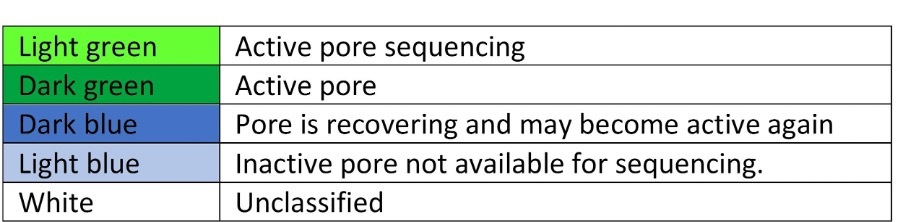
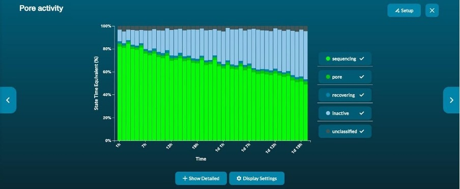
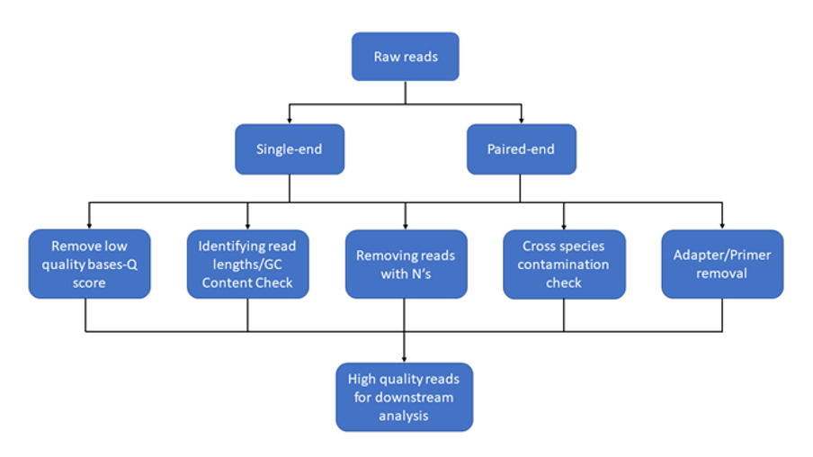
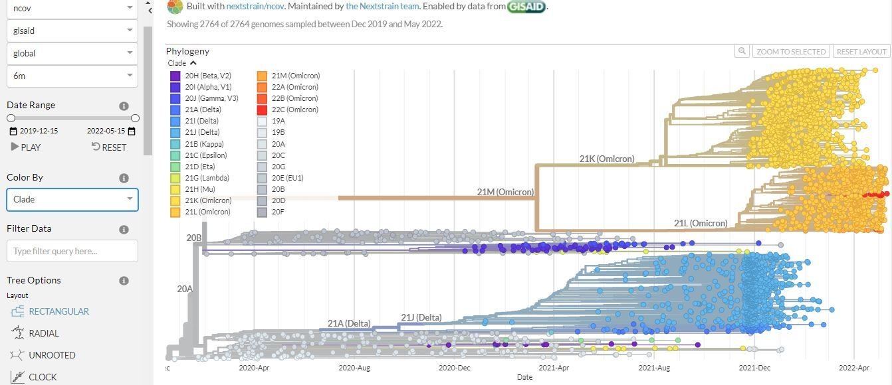
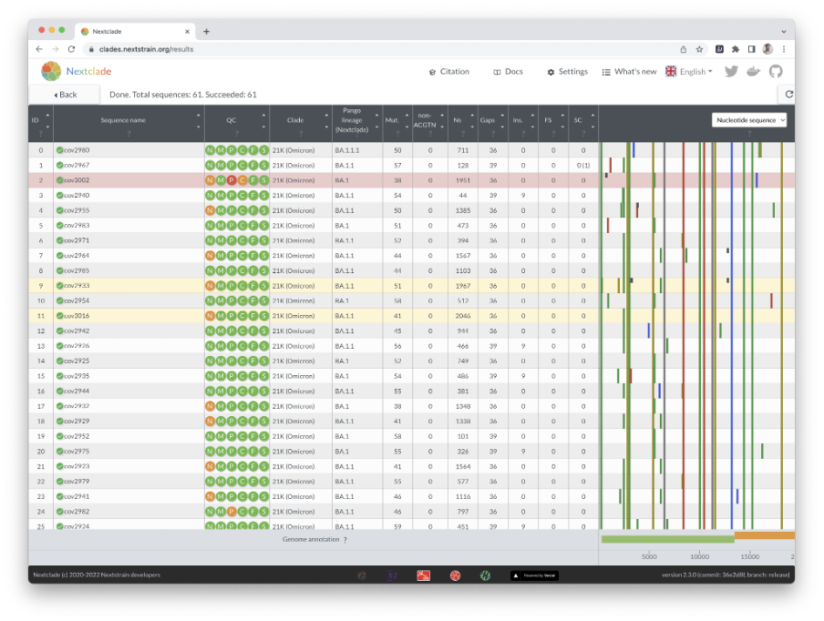
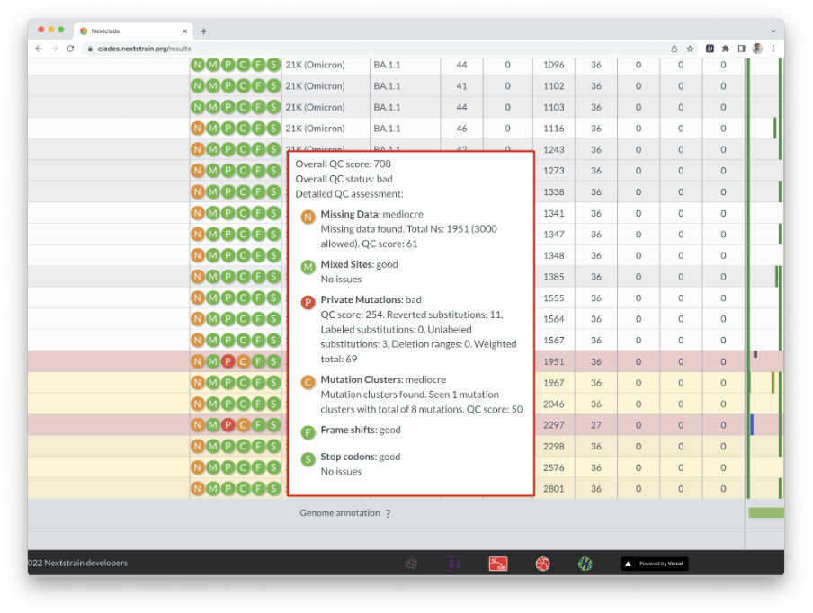
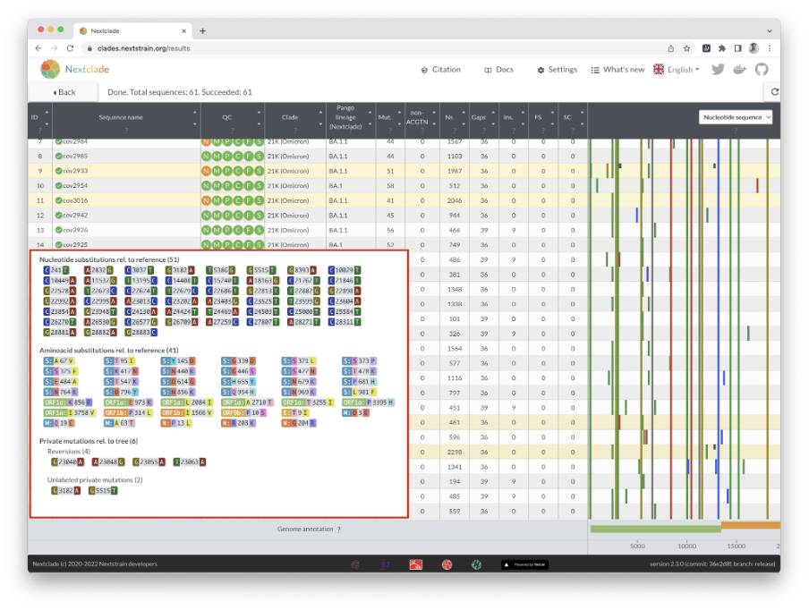
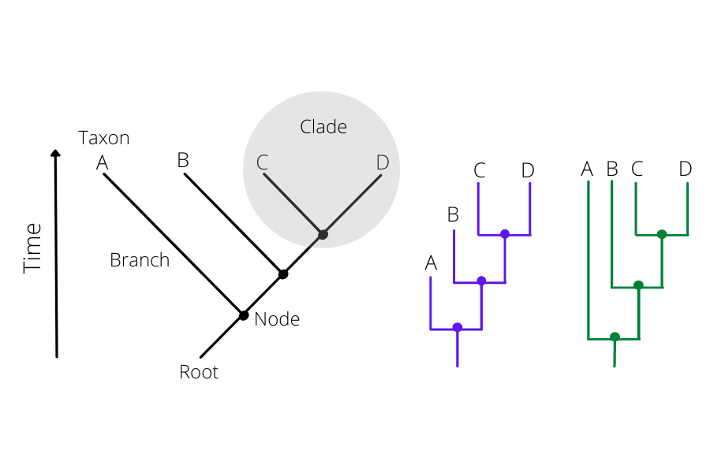
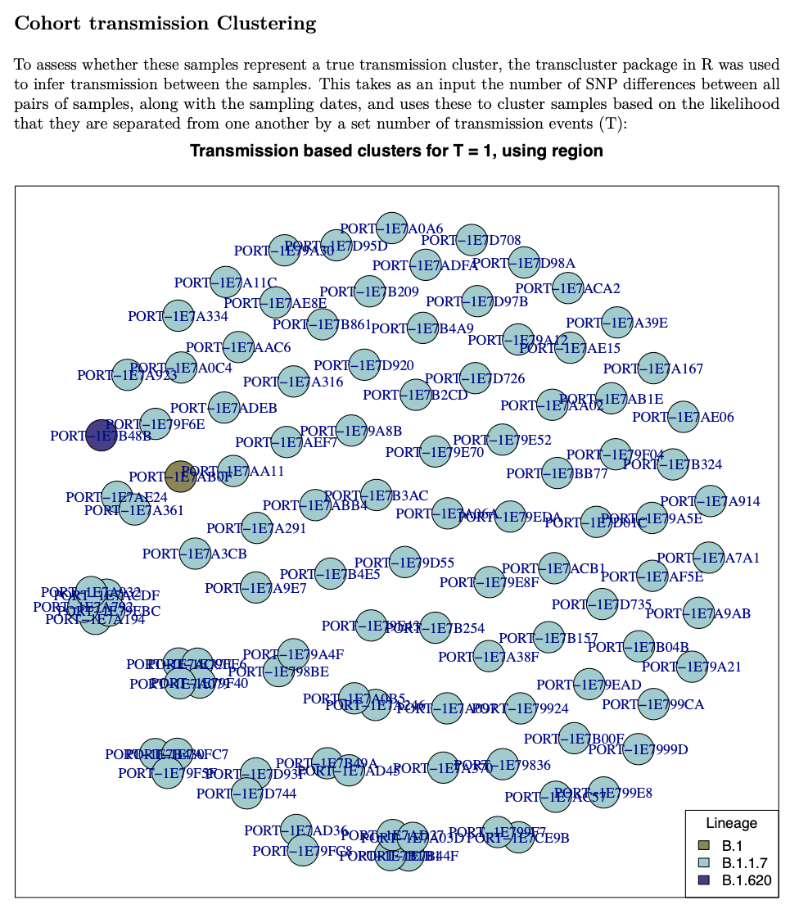

# SEQUENCING ANALYSIS AND INTERPRETATION

                       
<sub>@Canva</sub>

<hr style="height:5px;border-width:0;color:gray;background-color:gray">

# What are sequencing metrics
<!-- 3-2 -->     

**Illumina Sequencing run metrics** 

Run performance for Illumina sequencing can be monitored using the Illumina native programmes: Sequencing Analysis Viewer (SAV) and BaseSpace. Next, we will discuss the key metrics.

_Yield (Gb)_

This shows the number of bases generated in the run (Figure 1). Different sequencers and runs generate different amounts of data over variable amounts of time.


[Click to enlarge the image](images/OC4_3-2_fig1.png)

[Download Figure 1 to 6 alt-text here](images/OC4_3-2_Alt-text.pdf)

_% ≥ Q30_

This is the percentage of bases with a quality score of 30 or higher.  It is evaluated using a Q Score distribution chart that will indicate the % of reads with Q Score ≥ 30 

* Q30 is the probability of incorrect base calling of 1 in 1000 (99.9% accuracy) 
* lllumina runs usually generate > 70-80% Q30 data 
* The Q30 reported is an average across the whole read length 
* The Q30 decreases towards the end of the read 

_Percent Aligned and Error Rate_

Illumina recommends that all runs are spiked with their PhiX control; these metrics are only calculated if PhiX is spiked in.

* The PhiX library provides a quality control for cluster generation, sequencing, and alignment.
* % Aligned is the percentage of clusters in which the first 25 cycles align to the PhiX reference genome.
* Error rate is the rate of mismatches between sequencing data and the PhiX reference genome (usually below 1%). If this was not used then %>=Q30 is your best tool to check base quality.

_Cluster Density (K/mm2)_

This shows the density of clusters on the flow cell and is an important metric to evaluate the quality of the data (Figure 1).  When looking at these data you should also consider the **Percentage Clusters Passing Filter (%PF)**, which is an internal quality filtering procedure. Together these metrics can help you determine if there are problems with your loading concentration. 
 
Cluster density and %PF are inversely related:  typically if there is a high cluster density the %PF will be lower and vice versa:

* Lower %PF may lead to losing coverage on some samples within the run
* If the samples are not inversely related (for example cluster density is within range but %PF is low) consider an instrument or reagent issue

High cluster density:  overloading of the library may cause merging of clusters which increases the cluster density.  This may lead to:

* Poor template generation, which then causes a decrease in the percentage passing filter (%PF)
* Low Q30 scores
* Complete run failure

Low cluster density can be due to:

* Underloading of the library
* Library preparation issues (for example, poor denaturation, etc.)
 
Both high and low cluster densities will have a negative impact on data output.
 
**Oxford Nanopore sequencing metrics**

MinKnow provides real-time information about the sequencing run. It is important to consider flow cell health, pore occupancy and read length. If live base-calling is active, quality score plots and information on the number of reads per barcode can also be followed. A report is then generated at the end of the run.

_Flow cell health and pore occupancy_
The flow cell health graph provides a summary of the status of all the pores in a flow cell. A colour code is used to indicate different pore statuses (Figure 2).



[Click to enlarge the image](images/OC4_3-2_fig3.jpeg)
 
Pore occupancy information is provided in real-time by the channel states panel (Figure 3).  A high proportion of active sequencing channels is an indicator of good library preparation.
 


[Click to enlarge the image](images/OC4_3-2_Fig4.jpeg)

The pore activity graph summarises the channel state of a run over time (Figure 4). In a good run, the proportion of active pores decreases slowly as the run progresses.
 


[Click to enlarge the image](images/OC4_3-2_fig5.jpeg)

_Read length histograms and cumulative plots_

Read length histograms provide cumulative information on the read length (Figure 5). This information is presented either as number of reads, or, estimated bases vs read length.


[Click to enlarge the image](images/OC4_3-2_fig6.jpeg)

Cumulative output graphs show the total number of reads and if they have passed or failed the quality filter (Figure 6). If live base-calling is not active, only the total number of reads will be displayed. If live base-calling is active, cumulative median or modal quality score plots of passed reads are available.
 


[Click to enlarge the image](images/OC4_3-2_fig7.jpeg)

_Barcode stats_

If multiple samples are being sequenced, the barcode read counts graph displays the number of reads that have been basecalled and have passed the quality filter for each barcode.

<hr style="height:5px;border-width:0;color:gray;background-color:gray">

# Accessing and using sequencing data 
<!-- 3-3 -->    
 
**Sequencing platforms**

There are several different sequencing platforms commercially available. Although we focus here on those developed by [Illumina](https://www.illumina.com/) and [Oxford Nanopore Technologies (ONT)](https://nanoporetech.com/), other available platforms include PacBio by [Pacific Biosciences](https://www.pacb.com/) and Ion Torrent by [Thermo Fisher Scientific](https://www.thermofisher.com/uk/en/home/brands/ion-torrent.html)
In high-throughput sequencing (HTS), also known as next-generation sequencing (NGS), sequencers create millions of reads. A single read is a computational DNA sequence created from the sequencing of one piece of DNA in the library that is being sequenced. A sequencing library is a pool of DNA fragments with sequencing adapters and barcodes attached. The library pool can be composed of DNA from multiple samples each with its own unique barcode.

 It should be noted that whilst Illumina sequencers only sequence DNA molecules, RNA transcriptomic sequence analyses can still be conducted by performing a reverse transcription of the sample RNA to DNA before library preparation, whilst Oxford Nanopore sequencers are capable of sequencing either RNA or DNA molecules directly. In the descriptions below, we use DNA as the molecule being sequenced.
 
**Sequence data formats and conversion**

Sequencers create millions of reads, which need gigabytes (GB) of computational storage.

The standard format used to computationally store reads is the FASTQ format (Figure 1), which is a text-based format for storing nucleotide sequences along with their corresponding quality scores. Quality scores are included for each sequenced base which represents the sequencer’s probability estimate that the base was sequenced correctly.
 
](images/OC4_3-3_fig1.png)

[Click to enlarge the image](images/OC4_3-3_fig1.png)

[Download Figure 1 and alt-text here](images/OC4_3-3_Alt-text.pdf) 

Illumina machines output their raw data in binary base call (BCL) format. Some Illumina sequencers (MiniSeq, MiSeq and NextSeq) provide an option to automatically convert the reads from BCL to the FASTQ format. Whilst other Illumina sequencers (NovaSeq) require separate conversions. This can be accomplished manually by using Illumina’s [BCL Convert](https://support.illumina.com/sequencing/sequencing_software/bcl-convert.html) software (a replacement of the older [bcl2fastq](https://emea.support.illumina.com/sequencing/sequencing_software/bcl2fastq-conversion-software.html) software). Alternatively, Illumina has a cloud-based data management and bioinformatics system called BaseSpace (a subscription may be required). Sequencing data is uploaded to BaseSpace which enables real-time monitoring of sequence runs and conversion from BCL to FASTQ formats in the cloud, amongst a host of other functionalities.

All Oxford Nanopore sequencing devices (MinION, GridION, PromethION, etc), use nanopores corresponding to an electrode connected to a channel and sensor chip. The sensor measures the change in the electric current that flows through the nanopore when DNA or RNA molecules pass through. This electric signal data produced from a nanopore read is referred to as a ‘squiggle’ and is stored computationally using the FAST5 format (which is based on the HDF5 format). FAST5 squiggles (electrical reads) can then be converted into the standard FASTQ sequence format by base calling. This can be accomplished using software such as Guppy, which can be run manually post-run or run ‘live’ during the run; live base calling works fastest when the computer connected to the nanopore sequencer has a Graphical Processing Unit (GPU). Alternatively, Oxford Nanopore provides a cloud-based data analysis platform called [EPI2ME](https://epi2me.nanoporetech.com/) (subscription may be required) where FAST5 data can be uploaded during the sequencing run and base calling can be done live, amongst a host of other functionalities.

<hr style="height:5px;border-width:0;color:gray;background-color:gray">

# How to generate a consensus sequence
<!-- 3-4 -->    

**Demultiplexing**

As sequencers create large numbers of reads, the library being sequenced can consist of multiple samples that are pooled together for sequencing. To determine which reads have come from which sample in the pool, unique barcode sequences (one barcode for each sample being sequenced) are added during the library preparation step. When the library is sequenced, each read will contain (at its ends) the unique barcodes that are used to label the samples.

Demultiplexing is the process of sorting sequencing reads based on the unique barcode sequences into different files, with each file representing one of the samples being sequenced. Both Illumina (through BCL convert or BaseSpace) and Oxford Nanopore Technology (ONT) (through guppy or EPI2ME) platforms can demultiplex automatically. However, you must provide the software with a list of sample names and the corresponding barcode sequences used for each sample. It is important to note that demultiplexing is not 100% accurate. For example, sometimes multiple sequencing errors occur within the barcode of a read leading to a read being undetermined or assigned to the wrong sample (misassigned).
 
**Data download**

Although there are some cloud-based systems (such as BaseSpace and EPI2ME) which offer a number of options to analyse your data, it is typical to transfer sequence reads onto your local computer or server for analysis. Read files can be large and are therefore usually compressed to reduce data storage needs and speed up data transfer processes. If you are using BaseSpace or EPI2ME then you can simply download your FASTQ reads through their corresponding web interfaces onto your local machine.

Alternatively, you can utilise file transfer software that can transfer data from one machine (e.g. a sequencer) to another machine (e.g. a computer) over the internet. There are several free tools that can be used to do this, such as [Cyberduck](https://cyberduck.io/) and [FileZilla](https://filezilla-project.org/), which have easy to use graphical interfaces. It is standard to use the Secure File Transfer Protocol (SFTP) option within these tools as this encrypts the data while it is being transferred. Security is especially important when dealing with human sequence data.

It is important to note that your raw sequence data is very valuable, and it is therefore very important to keep adequate backups of your data in case of any data loss disasters.
 
**Data quality control**

We now have our sequence reads demultiplexed into different sample FASTQ files.
The first step in any analysis is quality control (garbage in = garbage out) which typically involves evaluating the number and quality of the reads. Common QC steps are removing any leftover adapter sequences from the ends of reads, removing poor-quality reads, and trimming poor-quality ends from reads (primarily for Illumina reads, as sequenced base quality typically deteriorates along the read length). The overall aim is to remove potentially erroneous reads (or erroneous parts of reads) from the data, which will improve downstream analyses such as reference alignments, consensus and variant calling.

[FASTQC](https://www.bioinformatics.babraham.ac.uk/projects/fastqc/) is one of the most popular tools used for visual inspection of read quality, as is [Trim Galore!](https://www.bioinformatics.babraham.ac.uk/projects/trim_galore/) for adapter and quality trimming of Illumina reads; although there are many alternatives such as [PRINSEQ](http://prinseq.sourceforge.net/), [Trimmomatic](http://www.usadellab.org/cms/index.php?page=trimmomatic), and [Sickle](https://github.com/najoshi/sickle), to name a few.

For ONT data, tools for inspection and summary statistics of reads include [PycoQC](https://github.com/a-slide/pycoQC), [NanoStat](https://github.com/wdecoster/nanostat), [NanoR](https://github.com/davidebolo1993/NanoR), and [NanoQ](https://github.com/esteinig/nanoq).

<hr style="height:5px;border-width:0;color:gray;background-color:gray">

# User-friendly tools for quality control
<!-- 3-5 -->     
**Reference alignment and consensus sequence generation**

There are many analyses that can be done with a sample’s FASTQ reads, but here we will focus on reference alignment. This is typically used when you have a good idea of what biological organism is in the sample and a reference sequence for that organism is used to align all your sequence reads to. 

For example, for a SARS-CoV-2 sample, the SARS-CoV-2 genome sequence from the start of the pandemic (Wuhan-Hu-1) is typically used as a reference sequence. Each of the sequence reads is then taken in turn and aligned to this reference sequence to determine the exact section of the reference genome that the read has come from. It is important to note that it’s likely that not all the reads will be able to align to the reference sequence e.g. some reads may well originate from the host (e.g. human).

There are many tools available to perform reference alignment of reads, a few of the most commonly used aligners are [BWA](http://bio-bwa.sourceforge.net/), [BOWTIE2](http://bowtie-bio.sourceforge.net/bowtie2/), and [Minimap2](https://doi.org/10.1093/bioinformatics/bty191) (which works with both Illumina and Oxford Nanopore (ONT) data); although there are many other aligners available. These tools are all optimised to rapidly align millions of reads to a reference sequence. Each read is aligned to the reference sequence separately, and the alignment results (reference genome position, number of mutations, insertions and deletions) are stored in a results file that is typically outputted in the standard Sequence Alignment Map (SAM) format. SAM files are typically converted into Binary Alignment Map (BAM) format files which are binary compressed versions and therefore use fewer data storage space and are faster to work with for downstream analyses.

SAM/BAM files store the alignment results of every read to the reference genome and enable the creation of a “consensus” sequence for the sample. A consensus sequence can be defined as the most frequent base at each genome position. It is important that insertions and deletions (indels) with respect to the reference sequence are also considered, not just the frequency of the DNA nucleotides A, C, G and T. Consensus callers work by essentially moving along the reference alignment, considering each genome position in turn, evaluating all the reads that are aligned at the position, and determining the most frequent nucleotide (or indel).  The consensus at each genome position is then combined to give a consensus genome sequence for the sample (Figure 2).

![Example read alignment. Each read has been independently aligned to the reference sequence. Mutations within each read and with respect to the reference sequence are highlighted in red. Based on all the read alignments combined we can calculate a consensus sequence – the most frequent base observed at each genome position. As the majority of reads contain the two highlighted mutations, these are incorporated in the consensus sequence. This is an example with a short genome and low coverage with only between one and three reads covering each position](images/OC4_3-5_fig1.png)

[Click to enlarge the image](images/OC4_3-5_fig1.png)

[Download Figure 2 alt-text here](images/OC4_3-5_Alt-text.pdf)
There are several tools available to call a consensus sequence from a SAM/BAM file. Perhaps the most commonly used tools during the SARS-CoV-2 pandemic are [iVar](https://github.com/andersen-lab/ivar) (Illumina data), and the ARTIC bioinformatics protocol (ONT data). One important aspect of consensus calling is the minimum depth needed to reliably call the consensus base at a given genome position. Depth (or coverage) is the number of reads that are aligned at a position. Due to sequencing errors (as well as errors potentially caused during reverse transcription and/or PCR amplification), sufficient data is needed to be sure the consensus base is real and not just a random error observed when coverage is low. For SARS-CoV-2 samples, a coverage threshold of 10 for Illumina data and 20 for ONT data has been commonly used.

Once you have a consensus sequence, you can evaluate the mutations it has with respect to the reference sequence and investigate their functional effect (i.e. where the mutation is, and whether it results in an amino acid change), the sequence can be BLASTed online to identify similar sequences, and added to phylogenetic trees to investigate relationships.

This has been a relatively brief overview of assembly and consensus sequence generation, some additional points to consider are:

* When sharing any data, you want to avoid sharing any human patient reads. One way to accomplish this is by removing any reads that do not match to your target reference genome.
* SARS-CoV-2 genome sequencing has typically been accomplished using ARTIC amplicon sequencing. Amplicons will have primer sequences incorporated at the ends of their reads which need to be removed as they do not come from the sample DNA. This has typically been accomplished post reference alignment (but pre-consensus calling) using iVar for Illumina data, and the ARTIC bioinformatics protocol for Oxford Nanopore data.
* Sequencing controls are important to determine the level (and type) of contamination present in the laboratory. If water is used as a negative control and you are able to create a SARS-CoV-2 consensus genome sequence (due to contamination), can you reliably trust the results of your other samples on the run?
* An alternative to reference alignment is de novo assembly, which is often used when you are not sure what is in your sample or you suspect a significant difference to your reference sequence. _De novo_ attempts to piece your individual reads back together, based on shared sequence overlaps, to re-create any genome sequences in the sample. A commonly used tool for de novo assembly is SPAdes for Illumina data and Canu for Oxford Nanopore data.
* If you are writing a scientific publication that includes analyses of sequence reads, it is standard practice to upload your reads (with any human patient reads removed) into online repositories such as the [NCBI Short Read Archive](https://www.ncbi.nlm.nih.gov/sra) or [European Nucleotide Archive](https://www.ebi.ac.uk/ena/browser). Sequence reads stored on these repositories are publicly available for download onto your computer either via their websites or using command line tools such as the [SRA-Toolkit](https://hpc.nih.gov/apps/sratoolkit.html). 

<hr style="height:5px;border-width:0;color:gray;background-color:gray">

# Why high-quality data is important
<!-- 3-6 -->       

A growing number of biological topics may now be understood, thanks to high-throughput sequencing methods. These technologies have continued to advance, and, most recently, long-read sequencing has expanded its applications in genomics, transcriptomics, and metagenomics by surpassing earlier accuracy constraints.  This means that generating a huge amount of data requires curation before any downstream analysis. Next-generation sequencing's most popular raw data format is identified by the FASTQ file extension. Sequence data and a quality score for each site are included in the data format created by sequencing platforms.  
	
**FASTQ Format**

The FASTQ file contains four lines of information (Figure 2):

1) The header line begins with @ and has information about the unique instrument name, run ID, flow cell ID, flowcell lane, tile number, X and Y coordinates of clusters in the tile, paired(1) or mate-pair(2), status about the read is filtered or not (Y – filtered, N-not), control sample status (0 when none), and index sequence             
2) A, T, G and C of the read              
3) A line with (+) sign             
4) Quality score of each base in ASCII format              

**Quality control**

Quality control generally involves calculating the number of reads, GC content to identify overrepresented sequences, discarding reads with Ns (uncalled bases), removing adaptor sequences, and removing or trimming low-quality bases. These are necessary to lessen the likelihood of bias in variant calling and/or new assembly before any downstream process (Figure 3). 



[Click to enlarge the image](images/OC4_3-6_fig1.png)

[Download Figure 3-5 alt-text here](images/OC4_3-6_Alt-text.pdf)

There are several tools which perform quality checks for the given reads such as FastQC, Scythe and Sickle, but, FastQC is the most commonly used program. This program performs various tests and produces basic statistics indicating pass (green tick), warning (yellow) and failed (red). It produces, per tile, Sequence Quality in which the colour of the tiles indicates the read quality which can be seen in cells. Per-base Sequence Content provides the percentage content of A, T, G and C base within a read. Per base, N content will provide Ns present in a given read. Reads with Ns are normally discarded. Sequence Duplication Levels show the level of duplication, a high level shows bias in the enrichment step. Adapter content will show the presence or absence of adapters.

**Quality Scores**

Sequencing quality scores measure the probability that a base is called incorrectly. With sequencing by synthesis (SBS) technology, each base in a read is assigned a quality score by a phred-like algorithm, similar to that originally developed for Sanger sequencing experiments. 

_Q Score Definition_

The sequencing quality score of a given base, Q, is defined by the following equation:

```
Q = -10log10(e)
```

where e is the estimated probability of the base call being wrong.
 
Higher Q scores indicate a smaller probability of error. Lower Q scores can result in a significant portion of the reads being unusable.

To identify low base quality [Based on the Phred scale(Q)](https://doi.org/10.1101/gr.8.3.186), all quality scores are determined. Each base call has a corresponding base call quality that calculates the likelihood that the base call is inaccurate.

_Table 1 - Relationship between sequencing quality score and base call accuracy_

| Quality score | Probability of incorrect base call | Inferred base call accuracy |
| ------ | ------ | ------ |
| 0 (Q10) | 1 in 10 | 90% |
| 20 (Q20) | 1 in 100 | 99% |
| 30 (Q30) | 1 in 1000 | 99.9% |

The quality scores may become erroneous due to extreme GC biases, specific patterns, or homopolymers. To guarantee that assembly or variant calls are accurate, accurate base characteristics are a crucial component. It is assumed that Illumina data with less than Q20 is not valuable data and should be eliminated as a general rule for Illumina short reads. In case of long reads from Pacbio or Nanopore, it is around Q10, as the error rate is high in these technologies.

**MultiQC**

When analysing multiple samples, checking QC for each one individually is time-consuming. MultiQC offers a solution for this stage. [MultiQC](https://multiqc.info/) aggregates reports from many experiments, including FastQC, and provides a single output (Figure 4 and 5). 


[Click to enlarge the image](images/OC4_3-6_fig2.png)


[Click to enlarge the image](images/OC4_3-6_fig3.png)

**Contamination with other species**

Sampling and DNA extraction errors may cause contaminants in the reads. There are now several tools that swiftly search reads and assign them to specific species or taxonomic groups. Tools like Kraken, Kaiju and Centrifuge are used to identify these contaminants. Kraken analysis provided the top species for each isolate, along with relatedness percentages for any other species.

**Further reading**

[Understanding Illumina Quality Scores](https://www.illumina.com/documents/products/technotes/technote_understanding_quality_scores.pdf)

<hr style="height:5px;border-width:0;color:gray;background-color:gray">

# What are clades, lineages and variants?
<!-- 3-7 -->     

Genomics helps us to track the spread of an infectious disease outbreak and to identify significant changes in the genome of a pathogen, including the [identification of new variants or lineage](https://doi.org/10.1093/ve/veab064).
 
Using web interfaces such as [Pangolin](https://cov-lineages.org/resources/pangolin.html) and [Nextstrain](https://nextstrain.org/ncov/open/global/6m) to perform phylogenetic analysis has helped with genomic surveillance, which has been extremely important during the pandemic period. Pangolin stands for Phylogenetic Assignment of Named Global Outbreak Lineages. This is a tool that allows a user to classify a coronavirus based on its genetic relatedness to others. We use it to differentiate one transmission chain from another (e.g. local nosocomial versus school outbreaks). However, in order to do this, we needed to create categories into which we could classify the diversity. This was done by [dividing the groups into clades and lineages](https://doi.org/10.1038/s41564-020-0770-5).
 
**So, what are clades, lineages and variants?**

A clade is a very broad way of grouping SARS-CoV-2 isolates. Hence, it gives us a sense of the diversity patterns over the years. The samples also need to have a minimum size and persistence.

A lineage is a more specific grouping of SARS-CoV-2 isolates. The lineage rules for SARS-CoV-2 were proposed by [Rambaut and colleagues](https://doi.org/10.1038/s41564-020-0770-5) to help us describe the diversity we are observing while the pandemic is happening and attempts to describe a significant epidemiological event. For example, a new lineage may be assigned if that specific group shows an increase in transmission compared to another group. There are no criteria for minimum size and persistence. Hence a lineage may contain a small number of isolates or a very large number. For example, there are over [1,000 Pango lineages](https://doi.org/10.1093/ve/veab064), compared to less than 20 clades.

Lastly, a [virus variant](https://doi.org/10.1016/j.yamp.2021.06.006) has mutations that have a biological significance (for example, it is associated with a virulence factor).  The most significant variants are currently called [Alpha, Beta, Gamma, Delta and Omicron](https://doi.org/10.1128/jvi.02077-21).
 
Below are two images from [Nextstrain](https://nextstrain.org/ncov/open/global/6m) showing phylogenetic analysis of different variants of SARS-CoV-2 (Figure 6 and 7). This platform is updated often, so the results may look a bit different by the time you view it.
 


[Click here to enlarge the image](images/OC4_3-7_fig1.jpeg)

[Download Figure 6 and 7 alt-text here](images/OC4_3-7_Alt-text.pdf)



[Click here to enlarge the image](images/OC4_3-7_fig2.jpeg)


<hr style="height:5px;border-width:0;color:gray;background-color:gray">

# SARS-CoV-2 Variants
<!-- 3-8 -->     
 
The World Health Organisation (WHO) [classifies variants](https://www.who.int/en/activities/tracking-SARS-CoV-2-variants/) according to criteria which include the variant makeup and the spread of the variant virus.

Pango is short for [Pangolin](https://cov-lineages.org/resources/pangolin.html) classification. Pangolin stands for Phylogenetic Assignment of Named Global Outbreak Lineages. This is a tool that allows a user to classify a coronavirus based on its genetic relatedness to others. Genetic relatedness is rooted in the virus's genetic lineage (the virus strain which came before it). Phylogenetics is the study of the genetic evolutionary lineage of an organism.

Other largely used systems to classify and name SARS-CoV-2 variants are [Nextstrain clade](https://nextstrain.org/blog/2021-01-06-updated-SARS-CoV-2-clade-naming) and [GISAID clade](https://www.gisaid.org/resources/statements-clarifications/clade-and-lineage-nomenclature-aids-in-genomic-epidemiology-of-active-hcov-19-viruses/)

**Variants of interest (VOI)**

There is no current circulating VOI. To be considered at VOI, a SARS-CoV-2 variant must meet these two criteria:

* With genetic changes that are predicted or known to affect virus characteristics such as transmissibility, disease severity, immune escape, diagnostic or therapeutic escape; 

* Identified to cause significant community transmission or multiple COVID-19 clusters, in multiple countries with increasing relative prevalence alongside an increasing number of cases over time, or other apparent epidemiological impacts to suggest an emerging risk to global public health.  

**Variants of concern (VOC)**

To be considered a VOC, a VOI must meet one or more of the following criteria, at a level that has a significant effect on public health:

* Increase in transmissibility or detrimental change in COVID-19 epidemiology; OR

* Increase in virulence or change in clinical disease presentation; OR

* Decrease in the effectiveness of public health and social measures or available diagnostics, vaccines or therapeutics.  

| WHO Label | Pango lineage | GISAID clade | Nextstrain clade | Earliest documented samples | 
| ------- | ------- | ------- | ------- | ------- |
| **Omicron**| **B.1.1.529** | **GR/484A** | **21K, 21L, 21M, 22A, 22B, 22C, 22D** | **Multiple countries Nov-2020** |
| Alpha | B.1.1.7 | GRY | 20I (V1) | United Kingdom Sep-2020 |
| Beta | B.1.351 | GH/501Y.V2 | 20H (V2) | South Africa May-2020 |
| Gamma | P1 | GR/501Y.V3 | 20J (V3) | Brazil Nov-2020|
| Delta | B.1.617.2 | G/478K.V1 | 21A, 21I, 21J | India Oct-2020 |

NB: Omicron lineage includes BA.1, BA.2, BA.3, BA.4, BA.5 and descendent lineages.

_Table 1 - SARS-CoV-2 variants of concern. In September 2022, only Omicron is considered a VOC. Alpha, Beta, Gamma and Delta are previously circulating VOCs. Source: [WHO](https://www.who.int/en/activities/tracking-SARS-CoV-2-variants/)_  

**Variants of concern under monitoring (VOC-LUM)**

Since its emergency, Omicron has already displaced other co-circulating SARS-CoV-2 variants. Thus, WHO has added a new category termed VOC-LUM to identify VOC lineages that may require prioritised attention and monitoring. 

A VOC-LUM is:

* A variant that, according to phylogenetic analysis, belongs to a currently circulating VOC; AND

* Shows signals of transmission advantage compared to other circulating VOC; AND

* Has additional amino acid changes that are known or suspected to confer the observed change in epidemiology and fitness advantage as compared to other circulating variants. 

A full list of Pango lineages is available on the [Pango website](https://cov-lineages.org/lineage_list.html) 

<hr style="height:5px;border-width:0;color:gray;background-color:gray">


# Interpreting Nextclade quality metrics
<!-- 3-9 -->     

Nextclade is a free and open-source tool for viral genome alignment, mutation calling, clade assignment, quality checks, and phylogenetic positioning. It can rapidly assess viral genomes by running a series of simple, but useful, calculations that can be used to inspect and classify your newly sequenced genomes or as a pre-submission check prior to depositing them in public databases like NCBI and GISAID. It is developed by the same team behind [Nextstrain](https://nextstrain.org).

Nextclade is available through a command line or web-based interface available at [Nextclade website](https://clades.nextstrain.org). You can drag and drop a file containing your SC-2 genomes into your browser window, retrieve sequences from a URL, or paste your FASTA sequences into the text field. Nextclade will detect differences between your sequences and a reference sequence [(Wuhan-Hu-1/2019)](https://www.ncbi.nlm.nih.gov/nuccore/MN908947.3), use these differences to classify your sequences into clades/lineages, and flag probable quality issues in your data. All of the analysis takes place entirely within the browser, with no data ever leaving the computer. 

The analytical pipeline includes the following steps:

1) Sequence alignment: Using a custom alignment algorithm, sequences are aligned to the reference genome. 
2) Translations: Nucleotide sequences are translated into amino acid sequences. 
3) Mutation calling: Changes in nucleotides and amino acids are found. 
4) Detection of PCR primer changes in binding sites 
5) Phylogenetic placement: Sequences are placed on a reference tree, and private mutations are examined. 
6) Assignment of Clades: Clades are derived from the tree's parent node. 
7) Quality Control (QC): Metrics for quality control are computed. 

In this example, we examine 61 SC-2 genomes from Peru that were recently sequenced using an Illumina MiSeq instrument. When you press the "run" button, you will immediately see an overview of the results (Figures 8 and 9). 


[Click to enlarge the image](images/OC4_3-9_fig1.png)

[Download Figure 8-13  alt-text here](images/OC4_3-9_Alt-text.pdf)



[Click to enlarge the image](images/OC4_3-9_fig2.png)

Nextclade uses several quality control indicators to quickly identify problems in your sequences. Bad sequences are red, mediocre ones are yellow, and good ones are white. By hovering your cursor over a sequence's QC entry, you can get the results of the QC metrics (Figure 10).



[Click to enlarge the image](images/OC4_3-9_fig3.png)

Nextclade also infers the clade/lineage to which a sequence belongs and displays the result in the table (Figure 11). Hovering over the results displays specific information such as the number of mutations, Ns, gaps, insertions, frameshifts, and so on. 



[Click to enlarge the image](images/OC4_3-9_fig4.png)

The alignment can be seen at the right of the window, with missing data shown in grey. You can readily see how missing data segments are scattered around the genome, whether it's a few large portions clustered in one location or many small missing parts. 

You can zoom in on a gene by clicking on it at the bottom, or by selecting it from the dropdown menu at the top. In sequence view, you can see mutations in a specific gene, which can be shown next to its codon translation (Figure 12).


[Click to enlarge the image](images/OC4_3-9_fig5.png)

When Nextclade is done with its analysis, you can download the results in different formats by clicking the download icon in the upper right corner (Figure 13).


[Click to enlarge the image](images/OC4_3-9_fig6.png)

**Further reading**

[Nextclade: clade assignment, mutation calling and quality control for viral genomes](https://doi.org/10.21105/joss.03773)

[Nextclade tutorial at IDseq](https://chanzuckerberg.zendesk.com/hc/en-us/articles/360052479232-Viewing-samples-in-Nextclade)

[Nextstrain FAQs and documentation](https://docs.nextstrain.org/projects/nextclade/en/stable/)


<hr style="height:5px;border-width:0;color:gray;background-color:gray">

# Lineages classification using Pangolin
<!-- 3-10 -->     

[Pangolin](https://cov-lineages.org/resources/pangolin.html) (Phylogenetic Assignment of Named Global Outbreak Lineages) is a piece of software created by the same team that proposed the [Pango nomenclature scheme](https://www.nature.com/articles/s41564-020-0770-5), which we discussed earlier in the course. It's easy to use and allows labs to quickly assign the most likely Pango lineage to newly sequenced data. 

Installing is simple for users who are familiar with the UNIX environment, as it only requires a Python interpreter to run Pangolin and the Conda system to install dependencies. 

Pangolin is also available as a [web-based application](https://pangolin.cog-uk.io/) for less experienced users. Users can submit SARS-CoV-2 genome sequences in FASTA format by dragging and dropping or selecting from the browser's file browser. The sequences will be analysed using the Pangolin software after they have been uploaded (versions of the software and the underlying data are displayed at the bottom of the page). 

When the processing is complete, the lineage for each sample, as well as the bootstrap support values, are displayed. Links to additional information on the lineage and its visualisation within the [Microreact](https://microreact.org/) platform are also provided. The results are available as a CSV spreadsheet file download. 
Almost three million virus genomes have been uploaded to Pangolin's web application to date, enabling SARS-CoV-2 genomic epidemiology and providing scientists with key information about viral lineage transmission.
Complete instructions for using the Pangolin [web application](https://pangolin.docs.cog-uk.io/) and a tutorial for the [command-line version](https://cov-lineages.org/resources/pangolin/usage.html) are available at [Cov-Lineages website](https://cov-lineages.org/index.html). 

**Further reading**

[A dynamic nomenclature proposal for SARS-CoV-2 lineages to assist genomic epidemiology](https://doi.org/10.1038/s41564-020-0770-5)

[Assignment of epidemiological lineages in an emerging pandemic using the Pangolin tool](https://doi.org/10.1093/ve/veab064)


<hr style="height:5px;border-width:0;color:gray;background-color:gray">


# Introduction to phylogenetics: tools and models
<!-- 3-11 -->    
 
Within the first year of the COVID-19 pandemic, almost 400,000 whole or partial severe acute SARS-CoV-2 genomes were generated and shared openly, marking an unprecedented worldwide response in pathogen genome sequencing. 

Phylogenetic tools have proven increasingly important in the public health management of a variety of viral epidemics, but the COVID-19 pandemic is the first global health emergency in which large-scale, real-time genome sequencing and analysis have guided public health decisions. SARS-CoV-2 has been evolving at an estimated nucleotide substitution rate ranging between [10e−3 and 10e−4 substitutions per site and per year](https://doi.org/10.1093/molbev/msaa314). The global epidemiological and virological situation changed constantly during the pandemic, and genome sequence analysis was crucial in [tracking the changing scenario](https://doi.org/10.1038/s41576-022-00483-8) (Figure 14).


_Source: [Nature Reviews Genetics](https://doi.org/10.1038/s41576-022-00483-8)_

[Click here to enlarge the image](images/OC4_3-11_fig1.png)

[Download Figure 14 and 15 alt-text here](images/OC4_3-11_Alt-text.pdf)

Phylogenetic tools like [Pangolin](https://cov-lineages.org/resources/pangolin.html) and  [Nextclade](https://clades.nextstrain.org/) can unlock information from sampled genomes combined with epidemiological data like:

* Quantifying international virus spread         
* Identifying outbreaks and transmission chains in specific settings         
* Estimating growth rates and reproduction numbers       
* Identifying and tracking mutations of interest                
* Discovering and analysing variants of concern            
* Investigating intra-host virus evolution        

Different approaches to building the phylogenetic tree:

Parsimony approach - [Maximum Parsimony](https://doi.org/10.1186/1748-7188-7-9) is a character-based approach that infers a phylogenetic tree by minimising the total number of evolutionary steps required to explain a given set of data assigned on the leaves. Tools that use parsimony include [IQTREE](http://iqtree.cibiv.univie.ac.at/) though it should be noted this is a tool to generate ML trees and [USHER](https://genome.ucsc.edu/cgi-bin/hgPhyloPlace).

Maximum likelihood approach- [Maximum Likelihood (ML)](http://scholarship.claremont.edu/scripps_theses/46) is a method for the inference of phylogeny. It evaluates a hypothesis about evolutionary history in terms of the probability that the proposed model and the hypothesised history would give rise to the observed data set. The supposition is that history with a higher probability of reaching the observed state is preferred to history with a lower probability. The method searches for the tree with the highest probability or likelihood. ML is implemented on [FasTree](http://www.microbesonline.org/fasttree/), [RAxML](https://raxml-ng.vital-it.ch/#/).

**How to read a phylogenetic tree**

There are two parts to the phylogenetic tree: the nodes and the branches (Figure15). The nodes on the tip of the tree represent the cases having some ancestry that existed as a putative virus in an individual. The internal nodes between the branches make up the ancestor cases that are carrying the mutations from which further diversion was possible. The branches represent the transmission chains, which are a combination of numerous transmission events taking place and are represented by the branch length.



[Click here to enlarge the image](images/OC4_3-11_fig2.png)


Bootstrapping: Bootstrap values in a phylogenetic tree indicate that out of 100, how many times the same branch is observed when repeating the generation of a phylogenetic tree on a resampled set of data. If we get this observation 100 times out of 100, then this supports our result.


<hr style="height:5px;border-width:0;color:gray;background-color:gray">

# How to detect an outbreak
<!-- 3-12 -->      
 
[COG-UK](https://www.cogconsortium.uk/) and similar sequencing-based surveillance responses to the pandemic around the world resulted in millions of genome sequences becoming available. As well as the possibility of understanding the evolution of the virus and its variants via phylogenetics, this wealth of data has presented opportunities to study transmission dynamics at multiple levels, including in [healthcare settings](https://pubmed.ncbi.nlm.nih.gov/32463076/), [universities](https://www.nature.com/articles/s41467-021-27942-w), [social settings](https://jamanetwork.com/journals/jamanetworkopen/article-abstract/2789424), and [wider communities](https://www.mdpi.com/1999-4915/14/3/545).

‘Genomic epidemiology’ refers to the use of genomic data for tracking viral transmission, combined with qualitative location data. Using this method to study transmission dynamics may result in uncovering the origin of an outbreak, routes of transmission and potential super-spreading events. Super-spreading events have been a [significant concern throughout the COVID-19 pandemic](https://elifesciences.org/articles/67308), and they occur when SARS-CoV-2 is transmitted [from one individual to many other individuals](https://pubmed.ncbi.nlm.nih.gov/26468744/). Such events cause rapid spread of the virus, so the ability to monitor them using genomic epidemiology is essential for containing outbreaks and halting transmission chains as much as possible. 

Multiple sequence alignment-based bioinformatic tools can be used to compare SARS-CoV-2 genome sequences and provide an idea of the level of relatedness between cases. Whilst standard phylogenetic approaches provide a general idea of relatedness and outbreak dynamics, they do not enable the identification of directly linked cases, or the direction of transmission events. Several tools have been developed to perform these analyses in detail, with the aim of enabling more precise management of outbreaks in hospital settings where [nosocomial transmission has been a major concern](https://royalsocietypublishing.org/doi/10.1098/rstb.2020.0268).

[Transcluster](https://academic.oup.com/mbe/article/36/3/587/5300248?login=true) is a tool that was developed prior to the COVID-19 pandemic, modelled on Mycobacterium tuberculosis transmission. This model of sequence comparison enables the identification of ‘transmission clusters’ by comparing differences in naturally accumulated single point genome mutations - single nucleotide polymorphisms (SNPs) - within the epidemiological context of positive cases. It incorporates factors such as the time of testing positive and knowledge of the organism’s SNP accumulation process to provide an accurate representation of closely related cases. The tool produces a useful visual of transmission clusters and the dynamics of relatedness between the sequences given to the model (Figure 16). This can provide a clear idea of possible routes of transmission, which is especially useful for managing hospital outbreaks that spread across multiple wards and other locations. 

![Example of Transcluster plot simulating a COVID-19 outbreak that spread to four different locations within a building such as a hospital. Each circle represents an individual case and the colour of the circle represents the location where they tested positive. In this example, all cases belong to the same variant, but only those that lie within the blue oval are part of a transmission cluster based on the parameters of the model. The cases outside the oval were likely acquired outside of the hospital environment. A case that was identified in ‘Location C’ appeared to come into contact with many people in ‘Location A’, transmitting the virus to several people. This individual is classed as a ‘super-spreader’.](images/OC4_3-12_fig1.png)

[Click to enlarge the image](images/OC4_3-12_fig1.png)

[Download Figure 16 alt-text here](images/OC4_3-12_Alt-text.pdf)

Integrating genomic sequence data with epidemiological data provides a detailed picture of outbreak origins and transmission dynamics. The implementation of bioinformatic tools throughout the COVID-19 pandemic resulted in specific transmission routes being uncovered, leading to better real-time and prospective hospital infection control. In the future, applying these tools in a more streamlined way during genomic surveillance of problematic infectious disease agents is likely to enable more rapid and specific outbreak management.


<hr style="height:5px;border-width:0;color:gray;background-color:gray">


# Generating public health reports
<!-- 3-13 -->    

Genomic epidemiology can be used to assist Infection Prevention Control (IPC) teams by linking cases together that may otherwise be missed, or by providing increased resolution to break down outbreaks into distinct subgroups (Figure 17). Such subgroups may more easily point towards sources of infection spread, such as; common treatment regimes, interactions with individuals (e.g. healthcare workers or visitors), or shared locations within the ward.

](images/OC4_3-13_fig1.png)

[Click to enlarge the image](images/OC4_3-13_fig1.png)

[Download Figure 17-19 alt-text here](images/OC4_3-13_Alt-text.pdf)

**Tools for reporting**

A number of freely available tools have been used by members of COG-UK in order to analyse genomic data of SARS-CoV-2 in the context of epidemiological assessment. One simple approach is to plot phylogenetic trees to highlight the genetic distance (e.g. the number of nucleotides that differ) between different samples. Cases of the same variant will cluster on branches together, while other variants will sit on distinct branches in the tree (Figure 18). 


[Click to enlarge the image](images/OC4_3-13_fig2.png)

In addition, tools such as [A2BCovid](https://github.com/chjackson/a2bcovid) and [OutBreaker2](https://github.com/reconhub/outbreaker2) and [TransCluster]( https://github.com/JamesStimson/transcluster) can be used to identify closely linked cases by factoring in the date of sampling, the mutation rate of the virus, and the genomic similarity between two cases. 

The first two tools also allow users to incorporate epidemiological data, such as ward locations of patients over their stay, to allow the most likely disease outbreaks to be reconstructed. Similarly, the [Cluster Investigation and Virus Epidemiology Tool](https://cov-lineages.org/resources/civet.html) (CIVET) was developed by COG-UK to allow researchers to visualise new sequences alongside previous cases from across the UK. 

Such tools rapidly provide essential epidemiological context to new cases and can thus help to better understand outbreaks. However, they require in-depth computational experience and bioinformatics expertise to use, which must be well documented in reports to stakeholders.

**Report writing**

To ensure that complex genomic data are of maximum benefit to IPC teams, succinct reporting must be carried out in order to convey the key information quickly and easily to stakeholders who may be non-experts. 

Reports must be generated rapidly to be of most benefit and provide key information of benefit to IPC teams. This may include information on variants currently circulating or known to have been circulating previously, novel introductions of previously unseen variants, identification of previously identified VOCs, and clustering of cases to highlight potentially linked cases. 

Consistent and regular reporting is important to ensure that IPC teams can respond rapidly to the information. The use of reporting templates, or even programmatically generated reports using tools such as [R Markdown]( https://rmarkdown.rstudio.com/), can help to ensure consistency and are easily updated with additional analyses as requirements develop. An example cluster plot from a weekly report from the University of Portsmouth sequencing team is shown in Figure 19.



[Click to enlarge the image](images/OC4_3-13_fig3.png)

<hr style="height:5px;border-width:0;color:gray;background-color:gray">


# How to prevent sequencing and sampling bias
<!-- 3-14 -->    

<!-- YT https://youtu.be/rpMiDsoWaa4 --> 
<iframe width="840" height="472" src="https://www.youtube.com/embed/rpMiDsoWaa4" title="YouTube video player" frameborder="0" allow="accelerometer; autoplay; clipboard-write; encrypted-media; gyroscope; picture-in-picture; web-share" allowfullscreen></iframe>

[Download the transcript here](assets/OC4_3-14_transcript.pdf)

In this video, Dr Catherine Ludden talks about sampling strategies that can prevent biases which can impact public health actions.

When deciding which samples to sequence, there are many options depending on the capacity of your network, the stage of the pandemic in your country and the most pressing public health questions requiring answers. Figure 20 shows some different categories of samples and one way of thinking about prioritisation. 


 
[Click to enlarge the image](images/OC4_3-14_fig1.png)
 
[Donwload Figure 20 alt-text here](images/OC4_3-14_Alt-text.pdf)
 
Whilst these priorities will be different in each setting, it is almost universally accepted that the most important and primary activity in genomic surveillance is the tracking of different lineages and variants. This is best achieved by taking a random, unbiased and geographically representative sample of cases. This approach will be informative as to the lineages circulating, potentially at low levels depending on the size of the sample. 
 
Sampling in hospitals, intensive care units, suspected imported cases, and care homes can answer very important targeted public health questions but, without being accompanied by general surveillance, risks a bias in the data. 


<hr style="height:5px;border-width:0;color:gray;background-color:gray">


# Using sequencing data to identify outbreaks in a hospital
<!-- 3-15 -->   

<!-- YT https://youtu.be/eg4mJKPjVeY --> 
<iframe width="840" height="472" src="https://www.youtube.com/embed/eg4mJKPjVeY" title="YouTube video player" frameborder="0" allow="accelerometer; autoplay; clipboard-write; encrypted-media; gyroscope; picture-in-picture; web-share" allowfullscreen></iframe>
 
[Donwload the transcript here](assets/OC4_3-15_transcript.pdf)

In this video call, Professor Judy Breuer discussed the application of sequencing to investigate an outbreak in a hospital and its importance to track nosocomial infection. 

<hr style="height:5px;border-width:0;color:gray;background-color:gray">


# The importance of sample and data consent
<!-- 3-16 -->    

The major threat to global public health that SARS-CoV-2 presented led to an unprecedented pace of much-needed research and vaccine development. This accelerated both ethical procedures that inform research and the performance of controversial studies (e.g. controlled human infection studies - CHIS), where healthy people were infected with COVID-19 so its mechanism of infection could be studied. Such research raised concerns about the ethical, legal, social and clinical implications of infecting healthy volunteers, because ‘due process’ in research mandates consideration of the participant’s safety.

In general, genomics research involving human samples raises a number of ethical challenges such as consent, privacy, and the collection, storage and release of genomic data. In order to obtain valid consent from individuals involved in genomics and medical research, including SARS-CoV-2 and COVID-19 research, they must be adequately informed and the research must be understood, undertaken voluntarily, and provided by someone competent to do so.

Challenges exist in the designing and implementation of consent processes in regions with lower literacy levels. The provision of appropriate information in a comprehensible manner in genomics research is a critical challenge, as concepts around "genetics", "genomics" and "data release" are complex to explain. Linking these concepts to more accessible levels of knowledge (e.g. that facial traits are inherited in families) may assist in narrowing this challenge. Nevertheless, ensuring that all aspects of the genomics research are explained in an accessible manner in order to obtain valid consent remains a critical obstacle.

Another ethical issue around sample and data consent is that the information produced from this research may affect additional people other than the participating individual. Privacy protection measures exist where personal identifiers are removed from genomic data, lowering the risk of revealing personal information. Yet, it is still possible for potentially stigmatising information about populations, communities or families to be revealed, which may have direct adverse effects on the individuals that consented to be involved, and indirectly on those with a relation to them. 

These issues need to be addressed when designing consent processes for genomics research, even when faced with periods of emergency like the COVID-19 pandemic. Measures have been developed as guidelines through the collaborative development of informed consent document (ICD) templates. These are developed by and for genomics researchers in consultation with ethics committees, whereby discussions on consent procedures, challenges and best practices with researcher collaboration, participant privacy and safety, samples and data storage etc., take place.

**Ethics review**

Genomics research needs to obtain ethics approval from the relevant committees prior to the commencement of research. The review of genomics research can be challenging as the comprehension of the science may be difficult; the nature of the studies being hypothesis-generating rather than hypothesis-testing is complex. Teams must also consider how to generate a large amount of data that can be analysed numerous times in various ways, and which may also be shared amongst research groups.

These are the main points of consideration that have been raised by ethics committees when assessing genomics studies: 

* Ensuring participants give valid informed consent.
* Justification of exporting samples and procedures pertaining to the return or destruction of samples at the conclusion of the project.
* Ensuring the appropriate recognition of collaborative or local investigators and their contributions.
* Ensuring no harm will be brought to participating individuals or populations.
* Ways to assign benefits to the collaborating researchers or communities involved.

There are additional significant issues to review when obtaining valid consent for genomics research, which involves the importance of privacy protection. All personal identifiers that link an individual to a genomic dataset must be removed in order to reduce the risk of identification and to ensure anonymity. When performing large-scale collaborative research, such as the international efforts in the COVID-19 pandemic, ethics approval from a multitude of global committees is undoubtedly necessary. There are then major challenges in genomics research due to the complexity of issues of consent and privacy, with different continents, countries, states, and even institutions, having varying requirements.

**Further reading**

[SARS- CoV- 2 challenge studies: ethics and risk minimisation](http://dx.doi.org/10.1136/medethics-2020-106504)

[Genomic research data generation, analysis and sharing – challenges in the African setting](https://doi.org/10.5334/dsj-2017-049)

[Ethical implications of the use of whole-genome methods in medical research](https://doi.org/10.1038/ejhg.2009.191)

[Ethical issues in human genomics research in developing countries](https://doi.org/10.1186/1472-6939-12-5)

[Informed Consent in the Genomics Era](https://doi.org/10.1371/journal.pmed.0050192)


<hr style="height:5px;border-width:0;color:gray;background-color:gray">


# Establishing collaborations in a pandemic
<!-- 3-17 --> 

<!-- YT https://youtu.be/6hE-ZxUj2n8 --> 
<iframe width="840" height="472" src="https://www.youtube.com/embed/6hE-ZxUj2n8" title="YouTube video player" frameborder="0" allow="accelerometer; autoplay; clipboard-write; encrypted-media; gyroscope; picture-in-picture; web-share" allowfullscreen></iframe>

[Download the transcript here](assets/OC4_3-17_transcript.pdf)

How to collaborate and establish partnerships during a pandemic. Hear the experiences of experts around the world in this video. 

<hr style="height:5px;border-width:0;color:gray;background-color:gray">


# Challenges and how to overcome them
<!-- 3-18 --> 

<!-- YT https://youtu.be/NkoxGIaoesI --> 
<iframe width="840" height="472" src="https://www.youtube.com/embed/NkoxGIaoesI" title="YouTube video player" frameborder="0" allow="accelerometer; autoplay; clipboard-write; encrypted-media; gyroscope; picture-in-picture; web-share" allowfullscreen></iframe>

[Download the transcript here](assets/Oc4_3-18_transcript.pdf)

In this interview, Paola Resende, Senjuti Saha, Murali Bashyam and Christian Happy talk about the main challenges they faced during the pandemic and how they overcame it. 

<hr style="height:5px;border-width:0;color:gray;background-color:gray">


