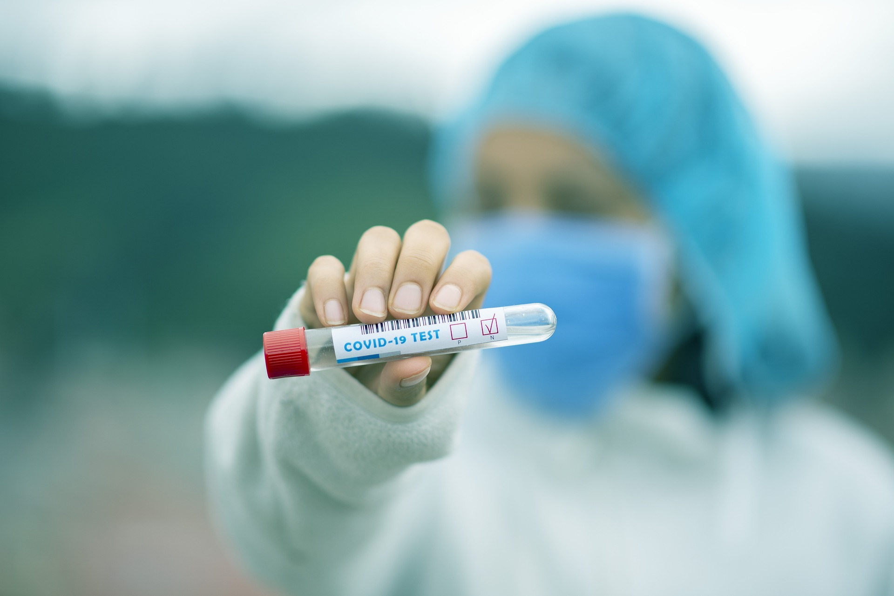

# From swab to server: testing, sequencing and sharing during a pandemic

## About the course

Sampling and testing are key to understanding where a disease is spreading. In the COVID-19 pandemic, the number of samples taken, analysed, tracked and shared have far surpassed any previous pandemic. This course follows the journey of a sample from the swab to the processed data used by experts in pandemic response. It discusses how to share data across teams and internationally, and the ethical and practical implications of using mass data on a pandemic scale.

**Learning outcomes**

* Outline the journey from sample collection, through PCR to sequencing and data linkage         
* Compare the different sample types and how sampling strategy affects test performance
* Explain the importance of linking genomic data to clinical and epidemiological data sets to address public health and scientific questions
* Identify and explore ethical, legal and social implications of data use and sharing

**Target audience**
This course is for researchers, healthcare and public health professionals, diagnostic professionals, or any person involved in testing and analysis of disease samples.

## Content

TBP 

## Collaborators

**Educators**     

Ana Filipe, MRC-University of Glasgow Centre for Virus Research, United Kingdom              
Leigh Jackson, University of Exeter, United Kingdom          
Moses Luutu Nsubuga, Makerere University, Uganda            
Rogers Kamulegeya, Makerere University, Uganda               

**Contributors**

Angela Beckett, University of Portsmouth, United Kingdom          
Camila Romano, Universidade de São Paulo, Brazil              
Collins ​​Otieno, African Society for Laboratory Medicine, Ethiopia                   
Dodge Lim, Research Institute for Tropical Medicine, Philippines          
Emma Thomson, MRC-University of Glasgow Centre for Virus Research, United Kingdom        
Emmanuel Nasinghe, Makerere University, Uganda        
Faith Nakazzi, Makerere University, Uganda             
Gideon Nsubuga, Makerere University, Uganda              
Hanna Pymont, United Kingdom Health Security Agency, United Kingdom              
Harper VanSteenhouse, BioClavis Ltd, United States of America            
Kirstyn Brunker, University of Glasgow, United Kingdom                 
Lei Lanna Dancel, Research Institute for Tropical Medicine, Philippines            
Malebo Malope, Stellenbosch University, South Africa              
Maria Magdalene Namaganda, Makerere University, Uganda                  
Ma. Ricci Gomez, Research Institute for Tropical Medicine, Philippines      
Mark Webber, Quadram Institute, United Kingdom             
Muhammad Yasir, Quadram Institute, United Kingdom                                          
Nathan Moore, Hampshire Hospitals NHS Foundation Trust, United Kingdom          
Newton Lwanga, Makerere University, Uganda                          
Paúl Cárdenas, Universidad San Francisco de Quito, Ecuador                           
Rodrigue Bikangui, Centre de Recherches Médicales de Lambaréné, Gabon                 
Sam Robson, University of Portsmouth, United Kingdom                 
Sarah Mwang, Africa CDC, Ethiopia                                            
Senjuti Saha, Child Health Research Foundation, Bangladesh                 
Sharon Glaysher, University of Portsmouth, United Kingdom                                
Stephanie Hutchings, United Kingdom Health Security Agency, United Kingdom                 
Sunando Roy, University College of London, United Kingdom                            

**Reviewers**

Cassandra Soo, Wellcome Connecting Science, United Kingdom                    
Ricardo Khouri, Universidade Federal da Bahia and FIOCRUZ Bahia, Brazil                      

**Education developer**
  
Liã Bárbara Arruda, Wellcome Connecting Science, United Kingdom        

**COG-UK contributors**

Sharon Peacock, University of Cambridge, United Kingdom              
Alistair Darby, University of Liverpool, United Kingdom             
Catherine Ludden, University of Cambridge, United Kingdom                  
Darren Smith, Northumbria University, United Kingdom            
Ewan Harrison, Wellcome Sanger Institute, United Kingdom            
Anna Markov, University of Cambridge, United Kingdom               
Ellena Brooks, University of Cambridge, United Kingdom                
Kim Smith, University of Cambridge, United Kingdom               
Peter McEwan, University of Cambridge, United Kingdom                

**Wellcome Connecting Science contributors**

Alice Matimba, Wellcome Connecting Science, United Kingdom                 
Dusanka Nikolic, Wellcome Connecting Science, United Kingdom               
Jorge Batista da Rocha, Wellcome Connecting Science, United Kingdom                                          
Rachel Berkson, Wellcome Connecting Science, United Kingdom                    
Treasa Creavin, Wellcome Connecting Science, United Kingdom                 

## Original version

**Original platform:** FutureLearn       
**Original course page:** [Swab to server: testing, sequencing and sharing during a pandemic](https://www.futurelearn.com/courses/from-swab-to-server-testing-sequencing-sharing-during-a-pandemic/1)                           
**Launch of the original version:** 9 May 2022                
**Number of joiners:** 2,156         
**Number of countries reached:** 131         
**Review score:** 4.6/5 (36 reviews)         

******
Any reuse of the course materials is encouraged with due acknowledgement.

## License
 This work is licensed under a <a rel="license" href="http://creativecommons.org/licenses/by/4.0/">Creative Commons Attribution 4.0 International License</a>.

## How to cite 

TBP

