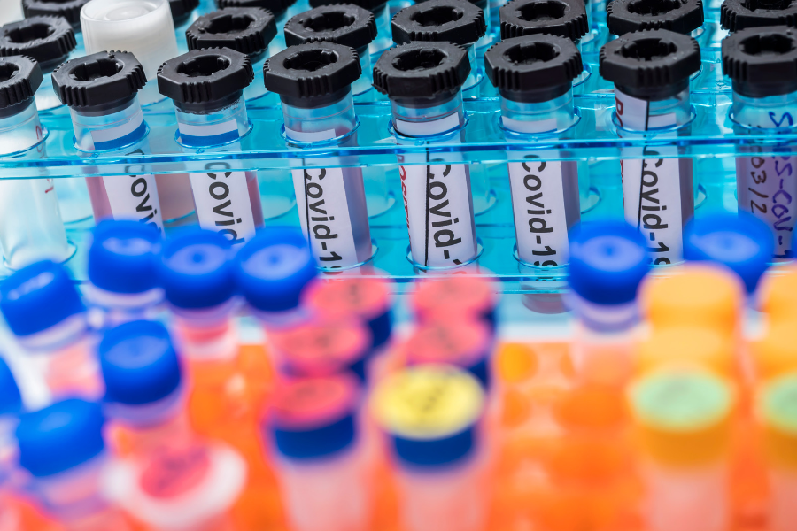
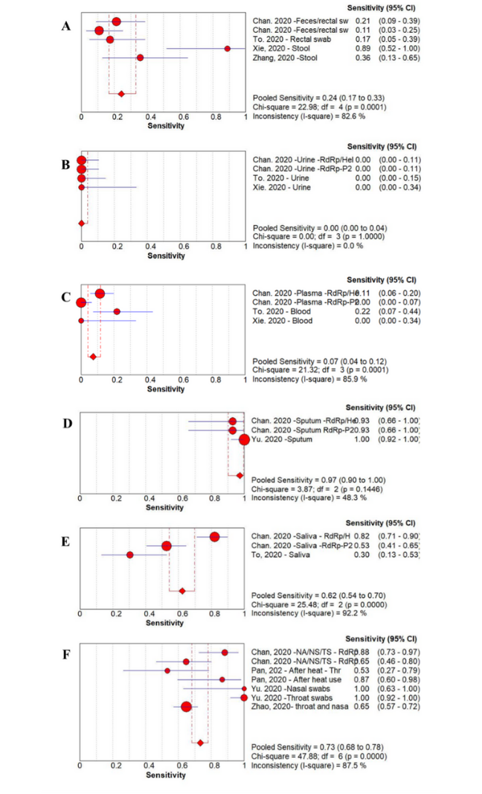

# THE JOURNEY OF A SAMPLE

        
@Canva

# Glossary
<!-- 1-5 -->      

* **Adaptors:** a short chemically synthesised single or double-strand DNA (oligonucleotide) used in some sequencing methodologies to connect an unknown or amplified DNA strand and a DNA barcode or other oligonucleotides.       
* **A-tailing:** an enzymatic reaction to add a sequence of adenines at the 3’-terminal of a DNA fragment for sequencing purposes.                  
* **Barcoding:** addition of a known tag of DNA sequence (barcode) to an amplified DNA strand that permits identifying its original sample.         
* **cDNA:** complementary DNA, a DNA molecule synthesised from a template RNA molecule.      
* **COVID-19:** coronavirus disease 2019.      
* **DNA:** deoxyribonucleic acid, an information molecule forming the “base code” for a living organism.     
* **Enzyme:** a protein able to catalyse, i.e. accelerate chemical reactions.     
* **ICU:** intensive care unit, the department of a hospital that provides intensive medicine.      
* **ISO quality system:** International Organisation of Standardisation. It is a quality management system to ensure that a product or service meets statutory and regulatory requirements.               
* **Liquid handling instrument:** automated instrument that dispenses programmed volume of reagents, buffers, samples or other specified liquids.      
* **NGS:** next-generation sequencing, a high throughput sequencing methodology.     
* **NHS:** National Health Service, the United Kingdom public health system.        
* **Nucleotides:** the subunit molecules that form DNA and RNA molecules.           
* **Pandemic:** an epidemic that has spread over several countries or continents, usually affecting a large number of people.         
* **Pathogen:** a microorganism or infectious agent that can cause disease e.g. virus, bacterium, protozoan, prion or fungus.          
* **PBMCs:** Peripheral blood mononuclear cells, a subset of white blood cells with a round nucleus.                     
* **PCR:** Polymerase Chain Reaction, a technique to amplify DNA molecules.     
* **Real-time PCR:** A PCR method that uses fluorescent dye labels to detect and quantify copies of DNA during the amplification process.    
* **Reverse transcription:** the process of synthesising a cDNA molecule from a template RNA using the enzyme reverse transcriptase.  
* **RNA:** ribonucleic acid, an information molecule, can be the “base code” for viruses.     
* **RT-qPCR:** Reverse Transcriptase Quantitative PCR, also known as reverse transcriptase real-time PCR. A PCR method to quantify RNA copies present in a sample; it includes a step to synthesise cDNA from the template RNA before the PCR amplification.       
* **Outbreak:** a sudden increase in the expected number of cases of a disease in a limited area.    
* **SARS-CoV-2:** Severe acute respiratory syndrome coronavirus 2      
* **Sequencing:** the process of “reading” genomic material such as DNA or RNA
* **SOP:** Standard Operating Procedures. Written descriptions of a procedure, protocol, technique, method, workflow or pipeline.    

[Download the PDF here](assets/OC2_glossary.pdf)

# The testing pathway 
<!-- 1-7 -->    

<!-- YT https://youtu.be/Ivkn3jcpjtA -->   
<iframe width="840" height="472" src="https://www.youtube.com/embed/Ivkn3jcpjtA" title="YouTube video player" frameborder="0" allow="accelerometer; autoplay; clipboard-write; encrypted-media; gyroscope; picture-in-picture; web-share" allowfullscreen></iframe>

[Download the transcript here](assets/OC2_1-7_trancript.pdf)

In this video, Harper VanSteenhouse, Site Director of the Glasgow lighthouse testing laboratory, explains the testing pathway of swab samples in a large testing laboratory.

In summary, this is the testing pathway of a swab from collection to genome data sharing in public databases:

1- Throat and/or nasal swabs are collected by health professionals or by people self-swabbing.

2- Afterwards the swabs are sent to a diagnostic laboratory.
They are labelled with a unique identifier (barcode) so the samples don’t get mixed up. 
The sample information is also uploaded to a Laboratory Information Management System (LIMS) to guarantee traceability.

3- In the laboratory, the samples are initially inactivated and the nucleic acid extracted so it’s safe to handle them in containment level 2 conditions. Finally, they can be tested using molecular diagnostic tests (e.g. RT-qPCR for SARS-CoV-2) and the diagnostic results are sent back to the requester.

4- The journey of many samples does not end here, as many are sent to other laboratories for genome sequencing. The samples then undergo one of several sequencing protocols to determine the genome of the virus.

5 - The data associated with this sample: demographic data, PCR results and sequencing data are then analysed. Following several quality control steps, the sequencing data and essential sample information are uploaded to public databases, so they can be used worldwide.

# Comparing different types of testing 
<!-- 1-8 -->        

SARS-CoV-2 infection can be detected using different diagnostics approaches. The main tests used during the pandemic are covered below:

**Lateral flow immunoassays to detect SARS-CoV-2 antigen**           
The swab is placed in a reagent tube, which contains a lysis buffer that disrupts the cells to expose the nucleocapsid (N) protein. When this solution, containing the specimen and reagent, is added to the testing cassette, the sample moves along a test strip. A colour change occurs when a positive sample reaches the part of the strip where the antibody against the N protein is located. The main advantages of these assays include the low cost, the speed of the assay with results obtained in less than 30 minutes, and their simplicity to perform due partly to not requiring complex equipment. However, the [sensitivity and specificity depend on the brand used](https://www.thelancet.com/journals/eclinm/article/PIIS2589-5370(21)00204-2/fulltext). Also, they are used as screening tests and RT-PCR may be needed to confirm the results.

**Lateral flow immunoassays to detect SARS-CoV-2 antibody**            
The test principle is based on the receptor-binding domain (RBD) of the spike and nucleocapsid proteins (antigens). The cassette has dye pad sections containing Recombinant 2019-novel coronavirus nucleocapsid protein and or Recombinant 2019-novel coronavirus Spike Protein (S1 Subunit). The blood/serum/plasma sample is placed in the testing cassette, the sample moves along a test strip. A colour change occurs when a positive sample (a positive sample is one containing antibodies against the SARS-COV-2 virus) reaches the part of the strip where the SARS-CoV-2 antigen is located. The advantages include the low cost, the speed of the assay with results obtained in less than 30 minutes, and it does not require complex equipment. The disadvantage is that it determines exposure but does not predict the infection. Similarly to the above, the sensitivity and specificity depend on the brand used. The same limitations apply to other forms of antibody tests such as [immunoenzymatic and chemiluminescent assays](https://www.frontiersin.org/articles/10.3389/fimmu.2020.609242/full).  

**Reverse transcriptase real time PCR (RT-PCR)**                
RNA is extracted from the swab usually using a kit-based method. Reverse transcriptase RT-PCR is then performed on the extracted nucleic acids. SARS-CoV-2 gene targets commonly used include the nucleocapsid, envelope protein, RNA-dependent RNA polymerase, and the viral open reading frames. The Taqman, FRET and LAMP chemistries are usually used and automated and manual PCR methods are available. The advantages of this method are the [high specificity and sensitivity](https://ebm.bmj.com/content/27/1/33); it is the gold standard for SARS-CoV-2 testing and therefore it serves as a confirmatory test for other assays. The disadvantages include the requirement of expensive material and equipment, that it requires expertise and training to use, presents a longer turnaround (1-4 hours), and requires a functional laboratory.

The table available for download highlights the main characteristics of the three testing platforms.

[Download the table here](assets/OC2_1-8_Table1.pdf)

# PCR testing in the COVID-19 pandemic
<!-- 1-9 -->      

Testing, isolation and [contact tracing](https://www.who.int/publications/i/item/contact-tracing-in-the-context-of-covid-19) are fundamental measures to limit the transmission of SARS-CoV-2 and reduce global morbidity and mortality. Initially, efforts were largely focused on the detection of infection using RT-PCR assays in symptomatic individuals, those from high-risk areas and individuals from high-risk groups.        

In order to reduce disease transmission it is necessary to identify and isolate those who are infectious, however determining whether someone is infectious or not, needs to be interpreted in a clinical context. This is why: 

* The detection of RNA fragments through RT-PCR assays does not necessarily correlate to infectivity, as RT-PCR tests can remain positive after an individual is no longer infectious, due to the continual shedding of inert viral RNA. Multiple studies have identified that mostly, SARS-CoV-2 viruses [cannot be grown in cell culture after day 10](https://www.ncbi.nlm.nih.gov/pmc/articles/PMC7837230/) following the onset of symptoms.       

* Prolonged infection can occur in those who are immunocompromised and so RT-PCR tests can remain positive over prolonged periods of time and be associated with infectivity.

It is prudently presumed that those who have symptoms consistent with infection are of high enough risk to be requested to isolate, whilst awaiting testing. 

In response to a rapid increase in the global competition for RT-PCR reagents, other nucleic acid amplification technologies, such as [RT-LAMP](https://www.sciencedirect.com/science/article/pii/S266605392030014X?via%3Dihub), were optimised. RT-LAMP  involves reverse transcription and isothermal, strand displacement DNA amplification, to achieve sensitivity and specificity comparable to RT-PCR. However, it has the additional benefits of quicker turn-around time and it is portable. This makes it particularly suited to testing strategies that include asymptomatic or pre-symptomatic individuals, even if it is not restricted to these applications.

In addition to the diagnostic value, the results of the molecular tests form the basis for reporting the number of cases present within a given population. This is then used to calculate the basic or effective reproduction number, [R0 or Rt](https://royalsociety.org/-/media/policy/projects/set-c/set-covid-19-R-estimates.pdf), which is related to the expected number of people one case in a population will infect where all individuals are susceptible, in the case of R0, or if a proportion is immune, in the case of Rt. In turn, reproduction numbers contribute to informing public health policies. 

Certain variants of concern are associated with higher rates of transmission, mortality, morbidity and diminished immune response, induced through infection, immunisation, or antibody therapeutics. For example, the antibody-based medicine Ronapreve has [reduced neutralisation activity against the Omicron variant](https://www.nature.com/articles/s41591-022-01792-5). Therefore, the rapid identification of variants can be important to guide therapeutic decisions. The UK is running a nationwide surveillance programme using genome sequencing which enables the identification of variants for epidemiological surveillance; however, this programme does not provide variant information within a clinically useful timeframe. New RT-PCR assays have been developed that are able to determine whether a few specific single nucleotide variants (SNVs) are present in the viral genome. The pattern of SNVs present in the sample, is indicative of the variant of concern present, meaning that appropriate treatment can be offered to patients in a clinically useful timeframe.

# Sample types for testing
<!-- 1-10 -->        

When deciding what type of sample to use for detecting SARS-CoV-2, there are a number of considerations. Is the test for clinical diagnosis or community surveillance? Do you want to sequence the subsequent sample after detection? How tolerable is the test to the population you are targeting? Thinking about the health question you are trying to answer will guide both the sample type used and the testing technique employed (Figure 1).

_Source [Science](https://www.science.org/doi/10.1126/science.abe9187)_

[Download Figure 1 alt-text here](images/OC2_1-10_Fig1-2_alt-text.pdf)                    

Decisions made at the sampling stage may impact the utility of downstream data. Saliva samples might be easier and less distressing to collect from particular groups (such as children, the elderly and the clinically vulnerable), but may exhibit reduced sensitivity for detection and insufficient RNA for sequencing. Wastewater sampling can provide sufficient RNA for sequencing and variant detection in the community but does not provide individual-level data. 

**Sensitivity, specificity and prior probability**

For each test, there will be a given sensitivity and specificity. Sensitivity is the proportion of true positive results detected by the test. For clinical diagnostic tests, the aim should be to have a very high sensitivity to reduce the number of false-negative missed cases. The specificity is the proportion of true negative results reported as negative by the test. Again, the aim is for this to be as high as possible to reduce false positives, however, the balance for public health benefits might tolerate a slight reduction in specificity to ensure maximal sensitivity. This balance will change depending on the setting and disease (Figure 2). The performance of each test will also be impacted by the prior probability of an individual being infected. For example, a result is less likely to be a false positive in a person with symptoms and known exposure to a possible case as opposed to someone screened at random. To see how these three values impact each other you can alter the values on a [COVID-19 test accuracy calculator](https://www.bmj.com/content/369/bmj.m1808/infographic).

_Source: [American Journal of Infection Control](https://www.ncbi.nlm.nih.gov/pmc/articles/PMC7350782/)_

[Download Figure 2 alt-text here](images/OC2_1-10_Fig1-2_alt-text.pdf)               

**Sample type comparison**
 
The primary consideration if considering a particular sample type for clinical diagnostic testing should be that it delivers the correct result for the individual at the detection stage. This will allow appropriate interventions such as isolation or treatment. Secondary to this are sequencing considerations which provide population health-level data. The best samples will achieve both of these criteria.  
 
Many studies have been conducted to evaluate the merits of different sample types; the results of the sensitivity analysis from a metanalysis conducted early in the pandemic are shown in Figure 2. From this study, we can see that sputum samples give the highest sensitivity for SARS-CoV-2 PCR detection with a pooled sensitivity of 97% (95% confidence interval (CI) 90-100). The worst-performing sample type was urine with a pooled sensitivity of 0% (95% CI 0-4). You can also see that there is significant variation between studies, reinforcing the benefits of a meta-analysis approach when considering implementing change rather than relying on individual trials.  
 
**Additional considerations for sequencing**

Both viral detection and sequencing require a sufficient quantity and quality of RNA to be present. Depending on the sequencing technique used, there may or may not be an amplification step. High-quality sequencing data is more readily achieved from samples with a cycling threshold (Ct) value of less than 30. However, this is not fully quantitative and will vary between diagnostic platforms. Also, some platforms do not deliver a Ct value which makes sample selection for sequencing more challenging. A combination of this lack of Ct value and the instability of the sample buffer means that certain point-of-care diagnostic assays are not well suited to subsequent sample sequencing. 

# Walkthrough of the sequencing process 
<!-- 1-11 -->    

<!-- YT https://youtu.be/XKIBaaoTjQA -->  
<iframe width="840" height="472" src="https://www.youtube.com/embed/XKIBaaoTjQA" title="YouTube video player" frameborder="0" allow="accelerometer; autoplay; clipboard-write; encrypted-media; gyroscope; picture-in-picture; web-share" allowfullscreen></iframe>

[Download the transcript here](assets/OC2_1-11_transcript.pdf) 

This animation briefly introduces the steps for sequencing methodologies currently in use. The first part outlines dye-terminating sequencing, also known as Sanger sequencing. The second part describes a general protocol of the Next-Generation sequencing method. This video was created to showcase the techniques currently being used for SARS-CoV-2 genome sequencing in Uganda and many other countries. The video focuses on Illumina technology. 

The emergence of the genomic era was fueled by DNA sequencing techniques developed by several scientists in the 1970s including Fred Sanger’s influential method, which is still used nowadays in research and diagnostic laboratories. This technique uses a DNA polymerase and chain-terminating nucleotides to identify up to 1000bp DNA sequences in less than 2 hours. It has a high cost per base when compared to other technologies.

A new group of sequencing platforms, known as second-generation sequencing, started emerging in the 2000s, characterised by parallel sequencing of hundreds of thousands to billions of DNA fragments- this made sequencing at a large scale faster and cheaper. Illumina and Ion torrent are two of the current platforms that emerged in 2006 and 2010, respectively. They both require a PCR step, whereby each individual DNA fragment is amplified to generate a cluster of identical sequences. Clusters act as individual sequencing reactions inside the sequencing chip. They both use a polymerase to sequence the DNA fragments but Illumina uses fluorescently labelled nucleotides whereas Ion Torrent measures pH changes. They are both characterised by short read lengths (75-300bp reads with Illumina and 200-400bp reads with IonTorrent) but IonTorrent has shorter running times (2 hours compared to up to 56 hours with Illumina) and lower equipment costs, whereas Illumina is characterised by lower error rate and lower cost per base.

Third-generation sequencing technologies such as PacBio and Oxford Nanopore Technologies (ONT) introduced in the 2010s, support longer read lengths. As opposed to second-generation sequencing platforms, they don’t require a PCR step to generate clusters and they enable real-time data analysis. ONT uses nanopores and a detector that measures changes in current to identify nucleotide stretches and has a high error rate at the single read level. PacBio uses a polymerase fixed in a chamber and fluorescently labelled nucleotides- it has the option to use circularised fragments to increase accuracy. The sequencing run time varies with both platforms but can be very short, even one hour can be enough to generate the required data. ONT’s unique features, including the option to use portable sequencers, greatly contributed to its dissemination across different areas of research.

Globally, many sequencing laboratories use nanopore sequencing techniques to facilitate viral genomic surveillance. The additional portability of these systems means that additional sequencing capacity can be enabled quickly and with minimal existing infrastructure needs. 

To learn more about Oxford Nanopore Technologies, please watch the video below.

<!-- YT: https://youtu.be/qzusVw4Dp8w -->
<iframe width="840" height="472" src="https://www.youtube.com/embed/qzusVw4Dp8w" title="YouTube video player" frameborder="0" allow="accelerometer; autoplay; clipboard-write; encrypted-media; gyroscope; picture-in-picture; web-share" allowfullscreen></iframe>

This video is hosted by a third party

A table with detailed information about sequencing technologies is available for download below. 

[Download the table here](assets/OC2_1-11_Table1.pdf)

# How to avoid the pitfalls and get trustable results?
<!-- 1-12 -->    
 
<!-- YT https://youtu.be/M-kFTbGt52U -->       
<iframe width="840" height="472" src="https://www.youtube.com/embed/M-kFTbGt52U" title="YouTube video player" frameborder="0" allow="accelerometer; autoplay; clipboard-write; encrypted-media; gyroscope; picture-in-picture; web-share" allowfullscreen></iframe>

[Download the transcript here](assets/Oc2_1-12_transcript.pdf)

In the video, Sharon Glaysher, Sam Robson and Angela Beckett from the University of Portsmouth discuss some technical challenges and tips about testing during a pandemic

**What are the major pitfalls to getting trustable results and how to avoid them?**

Producing sequencing data at a large scale can be complex, mainly if you consider the range of interactions amongst different institutes, as well as the variables that may affect the quality of the data all the way from sample collection until the data reaches a server. Things to consider for good quality results:

* Identify the problems that may affect the quality of the data produced.   

* Implement a clear chain of custody for the samples. For instance, in the UK, residual RNA samples from the testing laboratories were frequently used by other laboratories for sequencing. Other laboratories might store them in biobanks or even discard them. It is important to define the final destination of the samples. 

* When dealing with large numbers of samples, these may have to be cherry-picked from extraction plates, as not all samples tested are positive or important for sequencing. Apply reliable randomisation strategies for reliable sampling. 

* Samples had to be transported across different institutes. Make sure standard procedures are in place on both ends and are also complied with by the transport service. 

* Implement a contingency plan in case your fridge and freezer capacity is insufficient.

* As the demand worldwide was large there were problems with supply chains. Make sure you have enough stock and a collaboration chain to exchange supplies if required. 

* During a pandemic or an outbreak, laboratories process more samples than what is normal, and contaminations will be more likely to happen. Use quality control approaches and a reliable quality management system. 

# Understanding the different sources of samples for testing
<!-- 1-13 -->     

<!-- YT https://youtu.be/WfEbbCmSJD4 →
<iframe width="840" height="472" src="https://www.youtube.com/embed/WfEbbCmSJD4" title="YouTube video player" frameborder="0" allow="accelerometer; autoplay; clipboard-write; encrypted-media; gyroscope; picture-in-picture; web-share" allowfullscreen></iframe>

[Download the transcript here](assets/Oc1_2-13_transcript.pdf)

Here you will learn from Dr Harper VanSteenhouse, Site Director of the Glasgow lighthouse testing laboratory, more about the different SARS-CoV-2 testing workflows that were implemented in the United Kingdom to cover different types of samples. 

# The importance of turnaround-time 
<!-- 1-14 -->    

<!-- YT https://youtu.be/jjsA_n2kHJg -->      
<iframe width="840" height="472" src="https://www.youtube.com/embed/jjsA_n2kHJg" title="YouTube video player" frameborder="0" allow="accelerometer; autoplay; clipboard-write; encrypted-media; gyroscope; picture-in-picture; web-share" allowfullscreen></iframe>

[Download the transcript here](assets/OC2_1-14_transcript.pdf)

Here, Dr Catherine Ludden from the University of Cambridge and COG-UK, addresses important points to achieve an efficient turnaround time for sequencing results.

[NextStrain](https://nextstrain.org/ncov/gisaid/global?c=country) is a real-time tracking dashboard where is possible to observe how the number of SARS-CoV-2 sequences increased over time. 

# Importance of taking an appropriate sample
<!-- 1-15 -->     

Well-planned and proper sample acquisition is essential for ensuring the reliability of sequencing results. It is crucial to ensure that the sample that gets sequenced is collected and processed appropriately. The point is to ensure that the nucleic acids obtained from samples are of good quality and quantity, otherwise, it is easy to get results that are not fully representative of that sample. "A bad sample produces bad results."  Because most of the samples collected will contain mostly the host genome, it is essential to target a body site and to use a technique that captures as much of the viral genome as possible.

The following steps are worth considering when performing the sampling process.

**The sample collection site**          

The sampling site should be chosen depending on the target organism. Therefore it is essential to collect a sample from the site where the target nucleic acids are highly abundant while ensuring that the most non-invasive procedure is the best for the patient. A case in point, if SARS-CoV-2 is the target organism, it is recommended to collect a sample from the upper respiratory tract where the organism is abundant. In [a meta-analysis](https://academic.oup.com/cid/article/74/3/407/6273394?login=false) of the performance of samples collected from different sites, it was demonstrated different SARS-CoV-2 positivity rates from different sample types. 

**Sample collection procedure**

The sample collection procedure impacts the quality of the sample. For respiratory viruses, nasopharyngeal swabs are the most recommended. Proper collection of the nasopharyngeal swab was reported to increase the chances of getting the virus. For example, a [study about the discrepancy of SARS-CoV-2 PCR results](https://www.ncbi.nlm.nih.gov/pmc/articles/PMC8282446/) due to the sample collection sites and possible improper sampling showed that different viral copy numbers are obtained when the sample collection technique is changed.

**Sample transport media**

Viral Transport Media is often recommended for sample collection to prevent bacterial growth/contamination and to keep the integrity of the sample therefore, the transport media in which the sample is collected may impact the possibility of recovering the virus. However, it has been demonstrated that [eNAT sterilizing buffer](https://www.ncbi.nlm.nih.gov/pmc/articles/PMC8697510/) enhanced the sensitive detection of COVID-19 compared to the ordinary transport media. Certain media used for virus diagnostic purposes, particularly some point-of-care tests, severely impact the ability to generate high-quality sequence data. 

**Sample storage and preservation**

The sample storage affects the quality of the sample because SARS-CoV-2 is an RNA virus, it is essential to store the samples at the most ambient temperature. Indeed some studies have demonstrated that samples with a low viral load have the potential of turning negative when stored at room temperature or 4 ºC within 6 days.

**Sample enrichment bias**

Before sequencing, some protocols amplify the SARS-CoV-2 target to decrease the amount of the host RNA. For example, the ARTIC protocol, the most commonly used method for SARS-CoV-2 sequencing has a PCR step, that may not evenly amplify all sections of the viral genome. Therefore, some parts of the viral genome may be over-amplified while others may be underrepresented. Interestingly, even the polymerase used in this PCR step should be a high-fidelity one otherwise polymerases with a low fidelity may introduce mutations before sequencing.  

# The role of quality management 
<!-- 1-16 -->      

<!-- YT https://youtu.be/DssHD73aKKQ -->      
<iframe width="840" height="472" src="https://www.youtube.com/embed/DssHD73aKKQ" title="YouTube video player" frameborder="0" allow="accelerometer; autoplay; clipboard-write; encrypted-media; gyroscope; picture-in-picture; web-share" allowfullscreen></iframe>

[Download the transcript here](assets/OC2_1-16_transcript.pdf)

In this video, the Educator Ana Filipe and Dr Harper VanSteenhouse, Site Director of the Glasgow lighthouse testing laboratory, talk about the quality control and standards that can be used across a national laboratory network.

To ensure that laboratories provide accurate and reliable results and reduce the risk of errors, implementing a **Quality management system (QMS)** is important. However, in resource-constrained settings, most laboratories are not accredited and may only be partially implementing elements of a QMS. Introducing a new test, particularly under outbreak conditions, may therefore come with a high risk of errors. This step describes the key critical elements that laboratories should put in place to ensure quality results, particularly during COVID-19.

**Quality control (QC)** is a mechanism that monitors the analytical performance of the test when used with or as part of a test system. It may monitor the entire test system or only one aspect of the test. QC validates the competency of testing laboratories by assessing sample quality and monitoring test procedures, test kits, and instruments against established criteria. It also includes the review of PCR results and documentation of the validity of testing methods. Hence, QC is a multi-step process with certain checkpoints throughout the testing process: pre-analytical, analytical, and post-analytical stages. In general, “QC should be performed regularly to detect, evaluate, and correct errors due to test system failure, environmental conditions, or operator performance before reporting test results.”

QCs that are commonly employed for PCR testing include **extraction negative control** (checks contamination at extraction phase), **extraction positive control** (checks extraction process-reagents and equipment functionality), **non-template control** (checks contamination at PCR phase), **positive template control(s)** (check (s) limit of detection and robustness of the assay). Commercial QCs for positive controls are preferred; however, laboratories can use patient samples with known viral RNA concentration, preferably samples with low cycling threshold (Ct) values (25–30) for the target sequences of SARS-CoV-2. Nuclease-free water or viral transport medium can be used as the negative control. QC failures, for example, when a positive control turns out negative or a negative control turns out positive, invalidate the test results. The test must be repeated either from stored or newly collected samples after investigating and fixing the cause of the QC failure, such as contamination or degradation of samples, or expired reagents.

**External Quality Assessment (EQA)** is a process that allows laboratories to assess their performance by comparing their results with results from other laboratories within the network (testing and reference laboratories) via panel testing and retesting. EQA also includes the onsite evaluation to review the quality of the laboratory's performance. EQA usually evaluates testing competency, the performance of the laboratories, the reliability of the testing methods, and the accuracy of the results reports, including follow-up for unacceptable EQA results with corrective action. One or more of the following three EQA methods can be applied to COVID-19 molecular testing laboratories.

**Proficiency testing (PT)** is when an external provider sends a set of SARS-CoV-2 positive and negative simulated clinical samples for testing in different laboratories and the results of all laboratories are analyzed, compared, and reported back to the participating laboratories. Laboratories should select PT providers with a track record in delivering PT panels within their region.

**Retesting** are samples that have been tested at one laboratory and are retested at another laboratory, allowing for inter-laboratory comparison. A laboratory’s first positive COVID-19 sample should be sent to another testing laboratory, preferably a national or a WHO reference laboratory. In the absence of PT, national COVID-19 laboratories should send five positive and ten negative samples, systematically selected, to WHO reference laboratories for retesting. Similarly, sub-national COVID-19 testing laboratories should send retesting samples to their national COVID-19 reference laboratory.

**Onsite evaluation** should be performed by experienced subject matter experts, who observe and assess the quality management systems of the COVID-19 testing laboratories across the three testing phases. Onsite evaluation includes Patient Management, Biosafety adherence, Quality control procedures, Staff competency, Sample collection procedures, Standardized testing policies, Documentation and maintenance of records. Onsite evaluation should be conducted at least annually, but preferably every three to six months.

For further information about quality management, some materials developed by the [Africa Society for Laboratory Medicine (ASLM)](https://aslm.org/) and [Africa Centres for Disease Control and Prevention (Africa CDC)](https://africacdc.org/) are available for download below. 

[Download article on quality control here](assets/OC2_1-16_resources1.pdf)            
[Download guidance on SARS-CoV-2 genomic surveillance here](assets/OC2_1-16_resources2.pdf)                   
[Download guidance on COVID-19 testing quality assurance here](assets/OC2_1-16_resources3.pdf)                      

# High-throughput testing during pandemic response
 <!-- 1-17 -->      

<!-- YT https://youtu.be/gAgU36MLlz4 -->    
<iframe width="840" height="472" src="https://www.youtube.com/embed/gAgU36MLlz4" title="YouTube video player" frameborder="0" allow="accelerometer; autoplay; clipboard-write; encrypted-media; gyroscope; picture-in-picture; web-share" allowfullscreen></iframe>

[Download the transcript here](assets/OC2_1-17_transcript.pdf)

In this short interview, this course Educator Ana Filipe and Dr Harper VanSteenhouse, Site Director of the Glasgow lighthouse testing laboratory, talk about how to implement protocols for high throughput testing and make sure it is a reliable system. 

# Scaling up: implementation and how to overcome limitations
<!-- 1-19 -->      

<!-- YT https://youtu.be/fA37tiiCU1I -->       
<iframe width="840" height="472" src="https://www.youtube.com/embed/fA37tiiCU1I" title="YouTube video player" frameborder="0" allow="accelerometer; autoplay; clipboard-write; encrypted-media; gyroscope; picture-in-picture; web-share" allowfullscreen></iframe>

[Download the transcript here](assets/OC2_1-19_transcript.pdf)

In this discussion, Sharon Glaysher, Sam Robson, and Angela Beckett from the University of Portsmouth talk about the strategies they used to scale up their testing processes. 

