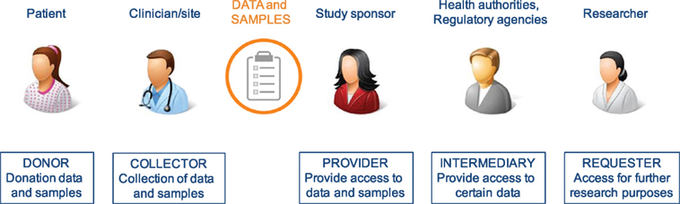

# A SAMPLE WITHOUT DATA IS NOTHING

                       
@Canva

# Lessons learnt: how to be prepared for the next pandemic
<!-- 3-2 -->       

<!-- YT https://youtu.be/xnvVYYQebyI -->    
<iframe width="840" height="472" src="https://www.youtube.com/embed/xnvVYYQebyI" title="YouTube video player" frameborder="0" allow="accelerometer; autoplay; clipboard-write; encrypted-media; gyroscope; picture-in-picture; web-share" allowfullscreen></iframe>

[Download the transcript here](assets/OC2_3-2_transcript.pdf)

Here, Sharon Glaysher, Sam Robson and Angie Beckett, from the University of Portsmouth, review their experiences tackling the pandemic so far and present us with the main challenges of sampling during the pandemic and what they would do differently next time.

# Data sharing in “peace” and “war” time
<!-- 3-3 -->    

<!-- YT https://youtu.be/b0seHMkm2i4 -->     
<iframe width="840" height="472" src="https://www.youtube.com/embed/b0seHMkm2i4" title="YouTube video player" frameborder="0" allow="accelerometer; autoplay; clipboard-write; encrypted-media; gyroscope; picture-in-picture; web-share" allowfullscreen></iframe>

[Download the transcript here](assets/OC2_3-3_transcript.pdf)

In this talk, Prof Senjuti Saha from the Child Health Research Foundation in Bangladesh discusses her views on ethics and data sharing during pandemics, or “wartime” and “peacetime” or periods between public health emergencies.

# Stakeholders for data sharing and the importance to share 
<!-- 3-4 -->   

**Who is a stakeholder**

Sharing research data within the international scientific community is of increasing importance for research propagation and value. However, the ethical and social challenges this presents, particularly in the context of structural inequities and varied capacity in international research is of concern. 

The involvement of the public and other stakeholders is essential to building locally responsive research policies, including data sharing. Stakeholders are individuals, groups, or organizations that are affected by or can affect a particular action undertaken by others. Biobanks, data repositories and other such central storage facilities or organisations encompass a number of different stakeholders such as donors, researchers, research institutions, regulatory bodies, funders, and others. These stakeholders can potentially have a strong influence on the organization and operation of any sample or data collection. A sound strategy for stakeholder engagement is therefore essential.

As such, for more and less research-experienced stakeholders, ethical research data sharing is likely to rest on the development and implementation of appropriate trust-building processes, linked to local perceptions of benefits and challenges.

Stakeholders involved in clinical research have different roles/responsibilities in the process of data and sample sharing toward the common goal of research and improving patient benefits. In general, the sharing process (Figure 1) can be defined in a number of iterative steps; donors providing data or samples to the collector; the collector providing the samples and/or data to the sponsor, who stores them in a database and/or biobank; data providers (sponsors of clinical study or database or biobank); data provider making data or samples upfront available, or requesters finding the data or material, requesting access via an intermediary or directly to the provider, negotiating, and-upon agreement-receiving the requested data or material by the requester.

[Click here to enlarge the image](images/OC2_3-4_Fig1.jpeg)

[Download Figure 1 alt-text here](images/OC2_3-4_Fig1_alt-text.pdf)

_Source: [Frontiers](https://doi.org/10.3389/fmed.2018.00006)_

**Why share research data**

Research data are a valuable resource, usually requiring much time and money to be produced. Many data have a significant value beyond usage for the original research. Data sharing benefits the researcher, research sponsors, data repositories, the scientific community, and the public. It encourages more connection and collaboration between scientists, and better science leads to better decision-making. Data sharing is typically encouraged within the scientific community, but it requires a great deal of effort, resources, and collaboration. Preparing data to be shared takes time and careful documentation of the research process and the data results. Sharing research data:

* Encourages scientific enquiry and debate         
* Promotes innovation and potential new data uses        
* Leads to new collaborations between data users and data creators           
* Maximises transparency and accountability           
* Enables scrutiny of research findings        
* Encourages the improvement and validation of research methods        
* Reduces the cost of duplicating data collection         
* Increases the impact and visibility of research        
* Promotes the research that created the data and its outcomes         
* Can provide direct credit to the researcher as a research output in its own right     
* Provides important resources for education and training

The ease with which digital data can be stored, disseminated and made easily accessible online to users means that many institutions are keen to share research data to increase the impact and visibility of their research.

# Opportunities for global collaboration in pathogen genomics
<!-- 3-5 -->    

<!-- YT https://youtu.be/JrAwSESZQo0 -->     
<iframe width="840" height="472" src="https://www.youtube.com/embed/JrAwSESZQo0" title="YouTube video player" frameborder="0" allow="accelerometer; autoplay; clipboard-write; encrypted-media; gyroscope; picture-in-picture; web-share" allowfullscreen></iframe>

[Download the transcript here](assets/OC2_3-5_transcript.pdf)

In this video, Dr Ewan Harrison, from COG-UK, talks about the potential opportunities of pathogen genomics for global scientific and health benefits.

# Challenges and limitations of data sharing 
<!-- 3-6 -->    

<!-- YT https://youtu.be/5ImhT7NJPHs -->    
<iframe width="840" height="472" src="https://www.youtube.com/embed/5ImhT7NJPHs" title="YouTube video player" frameborder="0" allow="accelerometer; autoplay; clipboard-write; encrypted-media; gyroscope; picture-in-picture; web-share" allowfullscreen></iframe>

[Download the transcript here](assets/Oc2_3-6_transcript.pdf)

In this video, Dr Ewan Harrison tells his experiences in COG-UK dealing with legal considerations when sharing data among partners from different countries. 
 
**Obstacles to the release of data**

We are living in an unprecedented era of information, leading to progress for open access to science and global research data. Funders around the world are increasingly mandating good data practices, such as data management plans and data sharing, and recognizing the importance of global collaboration on infrastructure and best practices. Across the research community, policy, strategy, and working groups are building momentum toward a future in which research data is widely Findable, Accessible, Interoperable, and Reusable (FAIR). In this section, we discuss a variety of challenges associated with data sharing, such as obstacles to the release of data, privacy and confidentiality issues, and informed-consent issues.

There are a variety of challenges associated with data release. Some are related to the concerns of the scientists who generated the data, some are related to the concerns of businesses or other organizations that paid for the data collection, and some are practical issues related to data administration.
 
**Concerns About Adversarial Science**

Regrettably, research can be highly contentious and confrontational at times. For example, industries that profit from the production or use of specific chemicals or goods may oppose research and/or data indicating that their specific chemicals or goods pose health risks.
 
**Business Considerations Related to Data Sharing**

When deciding whether to share data, businesses always consider a variety of factors. Two of the most significant are concerns about exposing themselves to liability and other costs, as well as concerns about losing the value of confidential business information.
 
**The Business Value of Data**

There is also the question of who pays for access to data that a company has paid for. Regulatory agencies are generally required to safeguard the commercial value of data collected by businesses. The most important fact is that the data generated by industry researchers have commercial value. Companies that collected data deserve and expect to be compensated for supplying that data to others; however, where should that compensation come from? If another company wants to use the data, the answer is obvious; however, if academic researchers want to use the data, the answer is less clear.
 
**Administrative Issues**

Data sharing is also complicated by a number of administrative issues, one of which is who owns the data. This is especially problematic when data has been collected by groups of companies or institutions. Other administrative challenges include the fact that organizational policies and procedures, as well as logistical issues, may differ from one organization to the next. For example, different universities' institutional review boards may have different rules governing data sharing procedures.
 
**The cost of Data Sharing**

The cost of extensive data sharing is a major impediment. The issue is that most budgets do not cover the costs of data sharing. If data are to be made publicly available, the funds to do so must come from somewhere, perhaps from direct research support.
 
**Privacy and confidentiality issues** 

One of the barriers to data release is ensuring the privacy of the persons whose data has been obtained as much as possible, as some of these data, such as medical history data or employment data, can be highly sensitive. Organizations are putting plans to share data on hold due to concerns over re-identification. A key question is how likely the re-identification of subjects in existing data sets is that have had the obvious personal identifying information removed.
 
**Informed-consent issues** 

Before an individual can take part in a scientific or medical research study, it is generally necessary for that person to provide “informed consent.” The problem is that when you ask someone for consent, especially broad consent, neither the requestor nor the person being sought has any idea what that means in terms of how it will be utilized because we don't even know what it will be used for down the road. The second point is that when people asked for consent a long time ago, we knew that consent meant you weren't going to provide anything to someone else, but as long as we removed your name from it, it was fine.
 
**Insufficient tools and technology** 

The technological challenges highlighted include transferring large datasets, particularly to the African region.  Furthermore, technology is viewed as simplifying data-related operations rather than adding complexity. However, many alternative cloud data providers are now accessible, each with their own set of data access rules. As data teams continue to rapidly embrace numerous cloud data platforms, this heterogeneous patchwork of capabilities frequently fails to scale effectively across different cloud data platforms. As a consequence, either too tight data rules that prevent data exchange entirely, or overly wide policies that allow sensitive data to slip through the gaps, resulting in a data breach or leak.

**Further reading**

[Ethical and practical issues to consider in the governance of genomic and human research data and data sharing in South Africa: a meeting report](https://doi.org/10.12688/aasopenres.12968.1)

# Data sharing best practices
<!-- 3-9 -->     

<audio controls>
  <source src="assets/OC2_3-9_audio.mp3" type="audio/ogg">
 </audio>

[Donwload the transcript here](assets/OC2_3-9_transcript.pdf)

In this audio clip, you will listen to Newton Lwanga and Maria Magdalene Namaganda from Makerere University, Uganda talking about the current data-sharing repositories and the best practices to share research data.

# The FAIR principles 
<!-- 3-10 -->      

It is widely acknowledged that sharing research data in a timely and open manner is crucial to furthering progress in science and healthcare. However, due to the diverse nature of different research approaches, systems, national guidance and the field-specific practice, merely making data available does not always maximise the utility to the global community.

With these issues in mind, a group of researchers hosted a stakeholder workshop with experts from academia and the private sector in 2014 to discuss how to address the challenges. The workshop generated a draft set of principles guiding the sharing of data. They agreed that all research output should be Findable, Accessible, Interoperable and Reusable (FAIR). These [**FAIR** guiding principles](https://www.nature.com/articles/sdata201618#Sec6) were subsequently expanded upon as below.    

To be **Findable**:  
F1. (meta)data are assigned a globally unique and persistent identifier. 

F2. data are described with rich metadata (defined by R1 below)  

F3. metadata clearly and explicitly include the identifier of the data it describes. 

F4. (meta)data are registered or indexed in a searchable resource. 

To be **Accessible**:  

A1. (meta)data are retrievable by their identifier using a standardized communications protocol. 

A1.1 the protocol is open, free, and universally implementable. 

A1.2 the protocol allows for an authentication and authorization procedure, where necessary. 

A2. metadata are accessible, even when the data are no longer available. 

To be **Interoperable**:  

I1. (meta)data use a formal, accessible, shared and broadly applicable language for knowledge representation.  

I2. (meta)data use vocabularies that follow FAIR principles. 

I3. (meta)data include qualified references to other (meta)data. 

To be **Reusable**:  

R1. meta(data) are richly described with a plurality of accurate and relevant attributes. 

R1.1. (meta)data are released with a clear and accessible data usage license. 

R1.2. (meta)data are associated with detailed provenance. 

R1.3. (meta)data meet domain-relevant community standards

These principles were published in 2016 and have been implemented widely across many fields since then. During the current pandemic, a number of groups have sought to consider how to implement these principles with the additional fast-paced pressure of an ongoing outbreak. 

The [Virus Outbreak Data Network (**VODAN**)](https://www.nature.com/articles/s41431-020-0635-7) established a project to develop an international data network infrastructure supporting evidence-based responses to the pandemic. One of the projects associated with VODAN has shown that this approach can be [implemented in a hospital setting](https://www.medrxiv.org/content/10.1101/2021.08.13.21262023v1) to allow rapid linking and sharing of relevant patient information in a machine-readable format. A further project highlighted the limited genomic data emerging from Africa underpinned by concerns around data ownership and availability of health data at the point of care. A system was developed to provide this data at the point of care as well as aggregated for global analysis and has been [deployed in a number of African countries](https://onlinelibrary.wiley.com/doi/full/10.1002/ggn2.10050). 

As well as the FAIR principles for data sharing, The Research Data Alliance International Indigenous Data Sovereignty Interest Group created a set of principles concerning indigenous data governance. These principles intend to maximise the benefits of data and research on individual communities, whilst promoting the outward sharing of data for global good in a manner which respects previous barriers to sharing and misuse of data. These principles state that there should be Collective benefit, Authority to control, Responsibility and Ethics [(CARE)](https://www.nature.com/articles/s41597-021-00892-0#Fig2). There have been subsequent efforts to guide the use of both FAIR and CARE guidance in data usage (Table 1).

_Table 1 - Implementation of the CARE Principles across the data lifecycle_

| Practice CARE in data collection | Engage CARE in data stewardship | Implement CARE in data community | Use FAIR and CARE in data applications |
| ------ | ------ | ------ | ------ | 
| Define cultural data; record provenance in metadata | Use appropriate governance models; make data FAIR | Indigenous ethics inform access; use tools for transparency, integrity and provenance | Fairness, accountability, transparency; access equity |

_Source: [Scientific Data](https://doi.org/10.1038/s41597-021-00892-0)_

# How do FAIR principles apply in a public health emergency
<!-- 3-11 -->    

<!-- YT https://youtu.be/tbjo1cLNgQI --> 
<iframe width="840" height="472" src="https://www.youtube.com/embed/tbjo1cLNgQI" title="YouTube video player" frameborder="0" allow="accelerometer; autoplay; clipboard-write; encrypted-media; gyroscope; picture-in-picture; web-share" allowfullscreen></iframe>

[Download the transcript here](assets/Oc2_3-11_transcript.pdf)

In this video, Dr Ewan Harrison from COG-UK guides us through the differences between data sharing routinely and during a public health emergency.

# No database is perfect: beware of errors in sequence databases
<!-- 3-12 -->    
Public and private initiatives to implement and extend the sequencing capability on a global basis, particularly in developing countries are helping to find blind spots of SARS-COV-2 genetic information in Latin America and the Caribbean and Africa. For instance, Brazil has increased its sequencing capacity from both public and private initiatives and today is among the 20 countries that most contribute with SARS-COV-2 sequences in [GISAID (global data science initiative) database](https://www.gisaid.org/about-us/public-private-partnerships/).

However, an effective genomic surveillance system requires not only wide sampling but also an effective effort to share the data generated truthfully and accurately in public databases to allow researchers to track in real-time the variants and their mutations and to perform epidemiological and biological studies.

As the COVID-19 pandemic evolves, the public databases have been inundated with a massive amount of data, and SARS-COV-2 genomic information is mostly available at three main databases: [NCBI GenBank](https://www.ncbi.nlm.nih.gov/genbank/); [GISAID’s EpiCoV Database](https://db.cngb.org/gisaid/) and [EMBL-EBI COVID-19 Data Portal](https://www.covid19dataportal.org/). The raw reads of the sequencing can be also deposited in proper databases such as [The International Nucleotide Sequence Database Collaboration (INSDC)](https://www.insdc.org/). Automated pipelines for quick deposition and processing of new genomic information have become available and help researchers to submit really large files quicker and easier than before.

Before releasing a new sequence, all submitted data are reviewed and curated by a team of curators. Also, some basic information about the sequences is mandatory in all databases, such as the name of the virus, the sampling local, and the name and contact of the submitter. While we can submit the raw data in some databases, at the GISAID platform, the most accessed database for COVID-19 genomic information, only the final assembly (not the raw reads) can be deposited. It turns out that the automated assembly of reads always involves an interpretation of inevitable errors generated during the sequencing process. The sequencing and assembly processes can also be biased due to technique artefacts.  

In most cases, the errors are relatively minor such as a couple of nucleotide substitutions (“sequencing artefacts”) or non-covered regions that are replaced by a sequence of “NNN”. In other cases, however, the errors are more significant, and the use of such data can lead to erroneous interpretations and even inconsistent conclusions. As an example, while frameshift mutations are easily detected in an assembled genome (frameshift: where one or more nucleotides are inserted or deleted in a way that changes the triplet reading code), missense substitutions or in-frame indels (that involves at least 3 or multiple of 3 nucleotides and do not change the reading frame) are almost impossible to be recognized.  Last, but not least, there are also “annotation” errors. There is no easy way to detect misclassifications as an incorrect geographic location of sampling, sampling dating, or even clinical information associated with the sequences. 

We are in the era of automation, the era of next-generation sequencing and bioinformatics advances, but it is still our responsibility to assure the quality of the data we generate. Robust Quality control processes are required prior to uploading to data repositories and caution should be taken when using data obtained from such sources. Any surprising or impactful findings should always consider the possibility of inaccurate sequence or meta-data before publication. 

# How to establish fruitful and fair collaboration: an example
<!-- 3-13 -->     

<!-- YT https://youtu.be/DpJCq8dR32Q -->     
<iframe width="840" height="472" src="https://www.youtube.com/embed/DpJCq8dR32Q" title="YouTube video player" frameborder="0" allow="accelerometer; autoplay; clipboard-write; encrypted-media; gyroscope; picture-in-picture; web-share" allowfullscreen></iframe>

[Download the transcript here](assets/OC2_3-13_transcript.pdf)

In this video, Prof Mark Webber and Dr Muhammad Yasir, from the Quadram Institute, talk about their collaboration to tackle COVID-19 in Pakistan. They also share some tips and ideas for those who are looking for new collaborations. 

# How to promote data sharing
<!-- 3-14 -->     

How to ask for cooperation for global data sharing? Here Dr Ewan Harrison talks about the COG-UK approach.

Ewan talked about a couple of different advantages the UK had but the underlying concepts are generalisable when trying to promote data sharing:

**Be trustworthy**

Whether you are looking to engage new research collaborators, seek data from different communities or aggregate data from many different sources you have to demonstrate that you are a safe and trustworthy custodian of that data. Secure storage and transmission of data, robust data management plans, ethical approvals and transparency will all help to achieve this aim.

**Listen**

Many of the reasons why individuals, communities or organisations are reluctant to share data are grounded in previous issues. Listen to what your colleagues are concerned about. Do they fear a lack of credit for their contributions, are they concerned their own community won't benefit from the research or do they worry about the perception of sharing data with external institutions? Understanding their concerns is likely to be a constructive step towards beginning to address them and eventually agreeing to share.

**Work collaboratively**

Agree on roles and responsibilities together. Who will hold the data? Who is going to write the outputs? How will contributions be recognised? Early agreement on a number of key steps will prevent miscommunication and future disagreements. 

**Further reading**

 [CLIMB-COVID: continuous integration supporting decentralised sequencing for SARS-CoV-2 genomic surveillance](https://genomebiology.biomedcentral.com/articles/10.1186/s13059-021-02395-y)

# Importance of implementing local capacity
<!-- 3-15 --> 

<!-- YT https://youtu.be/gEQEy_AXjBQ -->    
<iframe width="840" height="472" src="https://www.youtube.com/embed/gEQEy_AXjBQ" title="YouTube video player" frameborder="0" allow="accelerometer; autoplay; clipboard-write; encrypted-media; gyroscope; picture-in-picture; web-share" allowfullscreen></iframe>

[Download the transcript here](assets/OC2_3-15_transcript.pdf)

In this video, Sharon Glaysher, Sam Robson, and Angie Beckett from Portsmouth University share their experiences over the emergence of the Alpha variant. They highlight the importance of having laboratory capacity and contingency plans in place. 

# Resources
<!-- 3-18 --> 

Coronavirus biology: [ViralZone](https://viralzone.expasy.org/9056)  
Coronavirus taxonomy: [International Committee on Taxonomy of Viruses (ICTV)](https://talk.ictvonline.org/taxonomy/)  
Real-time tracking of pathogen evolution: [NextStrain](https://nextstrain.org/ncov/gisaid/global)  
Lineages nomenclature: [Pango](https://cov-lineages.org/index.html)  
Genomic data sharing: [GISAID](https://www.gisaid.org/)  
Cloud Infrastructure for Big Data Microbial Bioinformatics: [CLIMB](https://www.climb.ac.uk/)  
NCBI COVID-19 scientific literature: [LitCovid](https://www.ncbi.nlm.nih.gov/research/coronavirus/)

